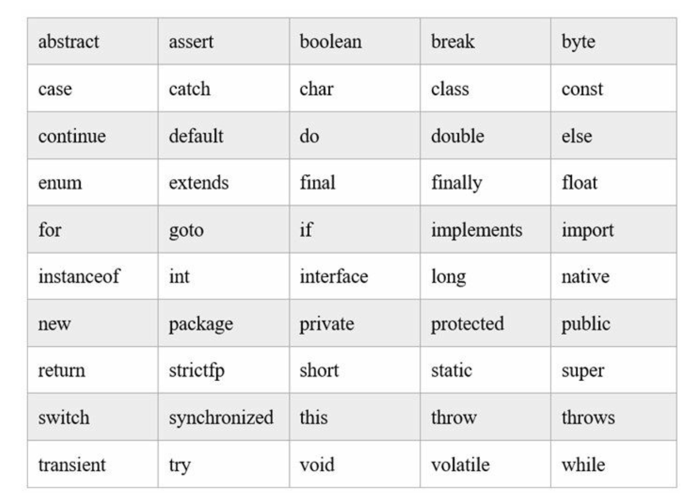
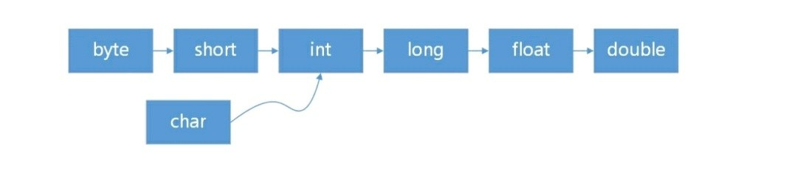
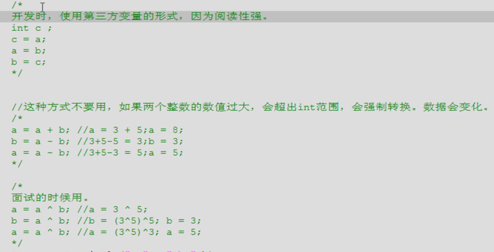

### 一、开发环境搭建

#### 1、环境搭建

- JDK

  只是一个开发工具包

- IDE

  IDE（Integrated Development Environments，集成开发环境），IDE的开发工具将程序的编辑、编译、调试、执行等功能集成在一个开发环境中。Java开发IDE工具有很多，其中主要有：Eclipse、IntelliJ IDEA和NetBeans等。 

- JVM

  java虚拟机，java字节码文件运行的平台，实现了Java跨平台的特性。

- 环境搭建

  ①下载并安装JDk  

  ②配置环境变量：我的电脑-右键 ---> 属性 ---> 高级系统设置 ---> 高级-环境变量 ---> Path，设置JAVA_HOME变量为JDK安装路径，在Path添加%JAVA_HOME%\bin。

  ③测试：终端中使用javac -version命令查看JDK版本号

#### 2、Hello World

- 编译执行过程

  

  .java       java源程序

  .class      java类文件（字节码文件、java可执行程序）

- jdk命令

  javac       编译命令，后跟*.java（要后缀，因为该命令还可以-version查看JDK版本号等）

  java         运行java程序，后跟class文件名（不要后缀，因为该命令只能运行.class文件）

- 规范

  每个java程序至少有一个类；

  类名首字母大写；

  公共类名必须与java文件名相同；

  一个. java文件中定义多个类：

  (1) public权限类只能有一个（也可以一个都没有，但最多只有一个）；

  (2)这个. java文件名只能是 public权限的类的类名；

  (3)倘若这个文件中没有 public类，则它的. java文件的名字是随便的一个类名；

  (4)当用 javac命令生成编译这个. java文件的时候，则会针对每一个类生成一个. class文件。

- 注释

  //               行注释

  /*         */   块注释

  /**      */   文档注释（说明注释）

  

#### 3、语言类型

- **编译型和解释型**

  **编译型（如汇编语言）：**编译器对我们的源代码进行转换，生成相对应的可执行代码，这个过程称为编译（Compile）。如果程序代码都包含在一个源文件中，那么通常编译之后就会直接生成一个可执行文件，就可以直接运行了。但对于一个比较复杂的项目，通常代码分散在各个源文件中，作为不同的模块来组织。这时编译各个文件时就会生成目标文件（Object file）而不是前面说的可执行文件。一般一个源文件的编译都会对应一个目标文件。这些目标文件里的内容基本上已经是可执行代码了，但由于只是整个项目的一部分，所以我们还不能直接运行。编译完，由链接程序（Linker）把目标文件“打包”成一个可执行文件了，称为链接（Link），除了链接目标文件外，可能还有各种资源，图标文件、声音文件，还要负责去除目标文件之间的冗余重复代码，等等。链接完成之后，一般就可以得到可执行文件了。 

  **解释型：**在程序运行的前一刻，还只有源程序而没有可执行程序；而程序每执行到源程序的某一条指令，则会有一个称之为解释程序的外壳程序将源代码转换成二进制代码以供执行，总言之，就是不断地解释、执行、解释、执行……所以，解释型程序是离不开解释程序的。

- **动态语言和静态语言**

  **动态类型语言：**动态类型语言是指在运行期间才去做数据类型检查的语言，也就是说，在用动态类型的语言编程时，永远也不用给任何变量指定数据类型，该语言会在你第一次赋值给变量时，在内部将数据类型记录下来。Python和Ruby就是一种典型的动态类型语言。

  **静态类型语言：**静态类型语言与动态类型语言刚好相反，它的数据类型是在编译其间检查的，也就是说在写程序时要声明所有变量的数据类型

- **强类型定义语言和弱类型定义语言**

  **强类型定义语言：**强制数据类型定义的语言。也就是说，一旦一个变量被指定了某个数据类型，如果不经过强制转换，那么它就永远是这个数据类型了。java是一种强类型语言。

  **弱类型定义语言：**数据类型可以被忽略的语言。它与强类型定义语言相反, 一个变量可以赋不同数据类型的值。

#### 4、基本数据类型和引用数据类型

从概念方面来说：
基本数据类型:变量名指向具体的数值
引用数据类型:变量名指向存数据对象的内存地址,即变量名指向hash值  

从内存构建方面来说：
基本数据类型:变量在声明之后，Java就会立刻分配给他内存空间
引用数据类型:它以特殊的方式(类似C指针)指向对象实体（具体的值），这类变量声明时不会分配内存，只是存储了一个内存地址。  

从使用方面来说：
基本数据类型:使用时需要赋具体值,判断时使用“==”号 
引用数据类型:使用时可以赋null,判断时使用equals方法  


A a; 即是声明，创建了一个A类型的变量a 
new A(); 即是实例化，实实在在地在内存里为A()划分了一块内存空间 
a=new A();即是使a指向new A()。
以后只要你不更改a的引用，对a的任何操作都会影响到你分配出来的这块内存空间。  


理解了这个再回到问题 public class A{}   这个是对类的一个定义，此时，A只是一个“概念”，在电脑里并没有实体存在，但是java的虚拟机（jvm）已经得知了该类的所有定义，就是说，该类被加载进jvm的类加载器（class loader）了，其他的类有可能访问到该A类。 此时A本身就是jvm中的一个类，它自己当然是和自己同包，对不对？ 所以A必然可以访问到A 那么public class A{ A a=new A();} 这句话，编译期是正确的，不存在错误，所以可以声明也（被jvm认为）可以实例化。 但是到了运行期，真正的跑起来的时候，它是错误的 因为这是个迭代的死循环。 在new A()的时候，又会执行一遍A a= new A(); 然后该new A()又执行一遍A a= new A(); 如此往复，直到堆栈溢出。 当然 以下写法是正确的 public class A{ A a=null; } 嗯，事实上，有些专门的写法，如单例，工厂类，就是需要在某个类里面实例化它本身。

基本类型参数传递：传值调用 
把实参的值复制给形参，实际操作的是形参，对原值不影响

引用类型参数传递：引用调用 
传地址，影响原对象的值 
把实参的地址复制给形参，则两者指向同一个对象，无论怎么操作，都不会改变实参对该对象的引用，但会改变实参对象的内容。

### 二、基础语法

#### 1、关键字与标识符

- 标识符

  变量、常量、方法、枚举、类、接口等由程序员指定的名字。

  规则：

  ①区分大小写；

  ②首字符不能是数字，可以是 _  、& 或字母；

  ③不能是关键字。

- 关键字

  

- 保留字

  Java语言中的保留字只有两个，goto 和 const。

#### 2、数据类型

- 数据类型分类

<div>
    <table>
        <tr>
            <td colspan="2">数据类型</td>
            <td>默认初始值</td>
        </tr>
        <tr>
            <td rowspan="4">基本数据类型(8种)</td>
            <td>整型：byte(8位，即1字节，范围-128~127)、short(16位)、int(32位，范围-2^31~2^31-1，约正负21亿多)、long(64位)</td>
            <td>long：0L，其余：0</td>
        </tr>
        <tr>
            <td>浮点型：float(32位)、double(64位)</td>
            <td>float：0.0f，double：0.0d</td>
        </tr>
        <tr>
            <td>字符型：char</td>
            <td>'\u0000'</td>
        </tr>
        <tr>
            <td>布尔型：boolean</td>
            <td>false</td>
        </tr>
        <tr>
            <td rowspan="3">引用数据类型</td>
            <td>类：class</td>
            <td rowspan="3">null</td>
        <tr>
            <td>接口：interface</td>
        </tr>
        <tr>
            <td>数组：[]</td>
        </tr>
        <tr>
            <td>注意</td>
            <td colspan="2">对于常量数值，整数默认：int，小数默认：double。因此，将小数赋值给float变量时，必须要在小数后面加f(F)指定为float类型小数。</td>
        </tr>
    </table>
</div>


- 类型转换

  ①自动类型提升

  

  ②强制类型转换

  不能自动类型提示转换类型时，在变量或者常量前加（要强转的数据类型）。

  要慎用，容易丢失精度，且一般不具有继承关系的两种对象类型不能强转，会报类型转换异常，为防止这种情况，可以使用 instanceof 关键字事先判断。

  **instanceof** 

  双目运算符，用来测试一个对象是否为一个类的实例。

  语法格式：obj instanceof Class

  返回 boolean 值

  注意：编译器会检查左边的 obj 能否转换成右边的 class 类型，当可以确定类型时，不能转换会直接报错。规定 obj 为 null 时返回 false。

  ```java
  //易错
  double a = 1 / 2;                //0.0，运算结果为0后自动提升为0.0d
  double b = 1.0 / 2;              //0.5，int和double运算前会先提升为double
  double d = (double) 1 / 2;       //0.5，是先将1转为double，再参与运算的。
  
  //整数常量默认为int，但编译时会检测该常量值是否在byte(short类型也一样)类型取值范围内，若是，则会默认强转并赋值，否则报错。
  byte b1 = 4;      //正确
  byte b2 = 128;    //报错  
  
  //byte以及short类型变量进行运算时会先提升为int，无法直接赋值给原byte或short类型，会报错提示可能精度缺失。但使用+=、-=等带等号的运算符时，会默认强转不会报错。
  byte b1 = 3;
  byte b2 = 4;
  byte b3 = b1 + b2;  //报错
  b1 = b1 + 4;        //报错
  b2 += 4;            //正确，相当于b2 = (byte) b2 + 4;
  ```

- 进制和指数表示

  ①进制：

  二进制数：以 0b 或0B为前缀，注意0是阿拉伯数字。
  八进制数：以0为前缀，注意0是阿拉伯数字。 
  十六进制数：以 0x 或0X为前缀，注意0是阿拉伯数字。

  ②指数：

  如果采用十进制表示指数，需要使用大写或小写的e表示

  幂。例如：3.36e2表示3.36×10^2，1.56e-2表示1.56×10^-2。

#### 3、常量与变量

- 常量

  final 数据类型 常量名(一般使用大写字母) = 值；

  一般声明于类根部且用 static 修饰 。

- 变量

  1、成员(域)变量：声明在类的根部，会默认根据变量类型初始化值，作用域是整个类。静态成员变量存储在堆中的类中，随类的加载而加载，而非静态成员变量存储在堆中的对象中，在对象创建时产生对象释放时消失。 
  2、局部变量：声明在方法或局部代码块中，不会默认初始化，使用前必须显式初始化，作用范围是该代码块。不能被 static 修饰，存储在栈中方法中，方法或局部代码块执行时产生，执行结束消失。  

- static 关键字

  用来修饰变量、方法、常量。主要作用在于创建独立于具体对象的域变量或者方法，因此不能修饰局部变量和常量。

#### 4、运算符

- 四则运算符

  

- 位运算符

  

  ```java
  //&  位与运算，可以取低多少位
  如：01111000001001 & 1111 得 低四位1001。
  
  //二进制转16进制：
  每次位与1111取低4位，然后转化，然后>>>4 无符号右移4位再继续。
  ```

- 逻辑运算符

  

  一个数异或同一个数两次还得原来这个数。

  

- 三目(元)运算符

  ```java
  excepress ? y : z
  ```

#### 6、输入与输出

- 输入

  ```java
  Scanner in = new Scanner(Sysout.in);
  in.nextInt();
  ```

- 输出( System.out )

  println：一般的标准输出，并换行。

  print：   一般的标准输出，但是不换行。

  printf：  格式化输出。

  "%"表示进行格式化输出，"%"之后的内容为格式的定义。

  %d ：int，%f ：浮点数，double 或float，
  %s 字符串，%c：一个字符，"%.2f"：输出两位小数点；
  %9.2f"：长度为9，向右靠齐，两位小数；

  ```java
  int i = 1;
  float j = 2;
  System.out.printf("输出i的值为%d，j的值为%f",i,j);
  ```


### 三、控制语句

#### 1、分支语句

- if

  if结构、if - else结构、if - else if - else结构

- switch

  ```java
  /**
   *switch后括号内为表达式
   *表达式的值会与case后的值匹配，一旦匹配上则它下方的所有语句都会执行，
   *直到遇到break;语句时结束switch内代码执行，否则执行完毕。
   *若都没有匹配则默认执行default语句，也可以没有，defalut后一般省略break；
   */
  int testScore = 75;
  char grade;
  switch (testScore / 10) {
      case 9:
          grade = '优';
          break;
      case 8:
          grade = '良';
          break;
      case 7:
      case 6:
          grade = '中';
          break;
      default:
          grade = '差';
  }
  ```

#### 2、循环语句

- while

  ```java
  while (循环条件) {
      语句组
  }
  ```

- do-while

  ```java
  do {
      语句组
  } while (循环条件)；
  ```

- for

  ```java
  for (初始化; 循环条件; 迭代) {
       语句组
  }
  ```

- for-each

  ```java
  //增强for循环适合取数据
  for(变量类型 变量：用于遍历的数组或集合）{
      语句组
  }
  ```

#### 3、跳转语句

- break

  break; 跳出最近内循环。

  break label; 带标签，label是标签名，跳出标签指示的循环。

  ```java
  label1:
  for (int x = 0; x < 5; x++) {
      for (int y = 5; y > 0; y--) {
          if (y == x) {//满足条件时跳出label1标出的循环体
              break label1;
          }
          System.out.printf("(x,y) = (%d,%d)", x, y);
          System.out.println();
      }
  }
  System.out.println("Game Over!");
  ```

- continue

  continue; 跳过本次最近内循环中尚未执行的语句。

  continue label; 跳过本次标签指定循环中尚未执行的语句。

- return

  退出该函数的执行，返回到函数的调用处。对于main()函数，则结束整个程序的运行。

- throw


### 四、方法

#### 1、方法

- 定义

  ```java
  修饰符 返回值类型 方法名（参数类型 参数名）{
       语句;
       return 返回值;//当返回值类型为void不需要return语句
  }
  ```

  注意： 
  ①方法中只能调用方法而不能定义方法； 
  ②程序执行时，采用栈的结构将方法加载到内存中，只有调用方法时才加载进去，return后就立马释放。  

- 可变参数

  参数前加上 ... ，相当于数组 
  注意：不能这样写成 int ...numbs , int x  样式，单个确定名称参数应该放在前面。

  ```java
  public int sum(int... numbs) {
      //...numbs 可以看成数组
      int sum = 0;
      for (int numb : numbs) {
          sum += numb;
      }
      return sum;
  }
  ```

- 修饰符

  | 修饰符    | 同类 | 同包 | 子类 | 其他包 |
  | --------- | ---- | ---- | ---- | ------ |
  | private   | √    |      |      |        |
  | protected | √    | √    |      |        |
  | default   | √    | √    | √    |        |
  | public    | √    | √    | √    | √      |

- static

  静态，用来修饰成员变量和方法  

  ①被修饰的变量和方法随类的加载而加载，静态变量存在方法区的（静态区中）;
  ②优先于对象存在，被所有对象共享 ;
  ③直接用类名调用 。

  注意：

  静态方法只能访问同类中的静态成员变量或静态方法； 
  静态方法中没有this和super关键字 
  主函数是静态的。  

- 传值调用和引用调用

  Java中实际只有传值调用。

  

#### 2、重载和重写

- 重载（overload）

  同类中同名方法的参数个数、类型或顺序不同，与其他无关。即：方法签名两元素中方法名相同，参数不同，与
  其他无关。

- 重写（override） 
  类或接口间继承或实现时，方法重写。
  不会重写的方法：  

  final方法、静态方法、private等子类中不可见方法。

  重写的要求：

  ①方法签名（方法名和形参列表）必须相同；
  ②返回值类型范围必须小于等于被重写方法返回值类型的范围； 
  ③访问权限范围不能比被重写方法小；
  ④不能抛出新的或者更加宽泛的异常。  

### 五、数组

#### 1、一维数组

- 声明

  ```java
  //数据类型[] 数组名; 
  int[] a;
  
  //数据类型 数组名[];
  String b[];
  ```

  注意：只声明而不实例化（new），没有指定长度，此时并未给数组分配内存空间。  

- 初始化 

  ```java
  int[] a;
  
  //静态初始化  
  a = {21,32,43,45}; 
  
  //动态初始化  
  a = new int[4]; //new后分配内存空间，必须指定长度，数组元素值为默认值
  a[0] = 21;
  ```


#### 2、二维数组

- 声明

  ```java
  //数据类型[][] 数组名;
   int[][] a;
  //数据类型 数组名[][];
  String b[][];
  ```

- 初始化

  ```java
  //静态初始化
  int[][] a = {{1,2,3}};
  
  //动态初始化
  int[][] a = new int[2][3];//必须指定行数、列数
  a[0][0] = 1; 
  ```

### 六、字符串

Java SE提供了三个字符串类：String、StringBuffer和StringBuilder。String是不可变字符串，StringBuffer和StringBuilder是可变字符串。

- String

  ""表示空字符串，双引号中没有任何内容，空字符串不是null，空字符串分配了内存空间，而null是没有分配内存空间。

- StringBuffer

  线程安全的，它的方法是支持线程同步的，线程同步会操作串行顺序执行，在单线程环境下会影响效率。

- StringBuilder
  StringBuilder是StringBuffer单线程版本，Java 5之后发布的，它不是线程安全的，但它的执行效率很高。

- 字符串池
  创建字符串有两种方式：两种内存区域（pool,heap）

  String str="abc"，会先去“字符数据池”搜索是否有“abc”这个字符串，如果有则将该字符串的首地址赋值给str，如果没有则生成一个新的字符串“abc”并且将首地址赋值给str；

  String str=new String("abc")，这种方式不会考虑时候已经存在了“abc”这个字符串，而
  是直接生成一个新的字符串“abc”并将首地址赋值给str，注意“abc”并不放在“字符数据池”中；

  注意：
  String str1=”java”;    //指向字符串池
  String str2=”blog”;   //指向字符串池

  String s=str1+str2;   //s是指向堆中值为"javablog"的对象，从字符串池中复制这两个值，然后在堆中创建两个对象，然后再建立对象s,然后将"javablog"的堆地址赋给s.  System.out.println(s==”javablog”);   //结果是false。
  String s="java" + "blog"; //直接将"javablog"放入字符串池中，System.out.println(s==”javablog”); 的结果为true
  String s=str1+ "blog"; //不放入字符串池，而是在堆中分配,System.out.println(s==”javablog”); 的结果为False

  StringBuffer和StringBuilder
  在对字符串进行增删改插等操作不会产生新的对象

  不同点：
  StringBuffer         线程安全，支持多线程同步，单线程下会影响效率。
  StringBuilder       线程不安全，是前者的单线程版，执行效率高。

  相同点：
  完全相同的API，即相同的4个构造方法
  StringBuilder()：创建空字符串，capacity默认为16。
  StringBuilder(int capacity) : 指定capacity值；
  StringBuilder(String str):由字符串创建，capacity为16+str.length();
  StringBuilder(CharSequence seq):可以是String、StringBuffer、StringBuilder等。


长度和容量

length：长度，str.length()返回字符串当前实际长度。
capacity:容量，str.capacity()返回字符串容量。

对于可变字符串
创建时如不指定容量大小，则capacity默认的值是16.
如StringBuilder sBuilder = new SrtingBuilder();
length=0；

指定了值，就把这个值赋给capacity.
如StringBuilder sBuilder = new SrtingBuilder(10);
则capacity为10，length=0；

传字符串，capacity的值就是字符串的长度+16.
如StringBuilder sBuilder = new SrtingBuilder(“1234”);
则capacity为20，length=4；

如果当前length值加上要增加的字符串长度大于默认capacity值16而无法容纳，
如果将capacity扩大为现有容量的2倍+2能容纳则扩容为2倍+2；
不能容纳则扩容为刚好能容纳的容量。


### 七、泛型

1、概述

- jdk5之前，对象保存到集合中去后就会失去其特性，取出后需要手工类型强制转换，就会可能引发程序安全性问题。

- 作用

  泛型（Generic）允许集合在定义时就限定处理类型，从而不再需要强转，把之前程序运行时可能发生的问题转化为编译问题，提高了程序稳定性和可读性。

- 注意

  1、使用泛型时，类型必须为引用类型不能是基本数据类型。

  2、声明泛型变量时，可以只在右边使用泛型（因为要兼容jdk5之前的代码），也可以只在左边使用泛型（健壮性），最好的规范是两边都使用泛型且两边类型一定要一样（或者右边省略类型保留<>）。

  3、泛型是提供给编译器使用的，用于限定集合的输入类型，让编译器在源码级别上，即挡住向集合中插入非法数据。但编译器编译完带有泛型的Java程序后，生成的class文件中不再带有泛型信息，以此使程序运行效率不受影响，这个过程称之为“擦除”。

- 泛型术语（ArrayList为例）

  ```java
  <>念typeof
  
  ArrayList<E>整个称为泛型类型
  
  ArrayList<E>中的 E 称为类型参数变量
  
  ArrayList<Integer>整个称为参数化的类型(Java中有个ParameterType类来表示)
  
  ArrayList<Integer>中的 Integer 称为实际类型参数
  ```

2、实现

- 泛型方法

  ```java
  /**
   *自定义泛型方法：
   *先使用<>声明泛型参数,多个用逗号隔开，再用泛型参数表示参数和返回值类型
   *如果类中多处用到了同一泛型，则可以在类名后声明，但静态方法不能使用类定义的泛型，需单独声明
   */
  //自定义泛型方法：先声明泛型参数，再用泛型参数表示参数和返回值类型
  public <T> void swap(T[] t,int a,int b) {
      T temp = t[a];
      t[a] = t[b];
      t[b] = temp;
      return t;
  }
  ```

- 泛型类

  

- 反射泛型


### 八、枚举

#### 1、概述

枚举使用关键字enum定义，是一种特殊形式的Java类，相当于具有特定几个实例的类。

- 特点

  枚举可以定义字段、构造函数、方法。

  枚举的构造函数必须为私有的，默认不写也可以（枚举中的构造方法默认不是default，而是private）；

  枚举在jdk5后引入，switch也能接收（之前只能接收int、byte、char、short）。

#### 2、实现

- 枚举实现

  ```java
  enum Grade {
      //定义枚举包含的对像
      A, B, C, D, E;
  }
  ```

- 枚举 --- 字段、构造器、方法

  ```java
  enum Grade {
      //定义枚举包含的对像，并进行初始化（相当于new对象）
      A("100-90"), B("89-80"), C("79-70"), D("69-60"), E("59-0");
  
      //字段
      private String value;
      
      //构造器
      private Grade(String value) {
          this.value = value;
      }
  
      //方法
      public String getValue() {
          return this.value;
      }
  }
  ```

- 枚举 --- 抽象方法

  ```java
  enum Grade {
      //枚举对象
      A("100-90"){//初始化对象时，实现抽象方法
          @Override
          public String getLocalValue() {
              return "优";
          }
      }, B("89-80") {
          @Override
          public String getLocalValue() {
              return "良";
          }
      }, C("79-70") {
          @Override
          public String getLocalValue() {
              return "一般";
          }
      }, D("69-60") {
          @Override
          public String getLocalValue() {
              return "差";
          }
      }, E("59-0") {
          @Override
          public String getLocalValue() {
              return "不及格";
          }
      };
  
      private String value;
  
      private Grade(String value) {
          this.value = value;
      }
  
      public String getValue() {
          return this.value;
      }
  
      //声明抽象方法
      public abstract String getLocalValue();
  }
  ```

- 使用

  ```java
  //通过枚举名.对象获取枚举对象
  Grade grade = Grade.A;
  
  //使用枚举对象调用枚举包含的方法
  String value = grade.getValue();
  ```

#### 3、枚举的方法

Java中声明的枚举类，均继承自java.lang.Enum类。包含其所有方法。

```java
//枚举对象中通过继承的常用方法
String name();                            //返回枚举对象名称
int ordinal();                            //返回枚举对像的在枚举中的序数


//枚举类的方法
valueOf([Class enumClass,] String name);  //将指定字符串转成指定枚举类对象并返回，枚举类中如果不包含该名称的对象则会抛出异常
values();                                 //返回枚举类中对象的数组 
```

#### 4、枚举实现单例设计模式

如果枚举中只有一个对象，可以用来实现饿汉式单例设计模式。  

```java
enum Singleton {
    INSTANCE;
}
```

### 九、异常

#### 1、异常


#### 2、断言

#### 3、日志


### 十、注解（Annotation）

> Java 5之后可以在源代码中嵌入一些补充信息，这种补充信息称为注解（Annotation），例如在方法覆 盖中使用过的@Override注解，注解都是@符号开头的。注解并不能改变程序运行的结果，不会影响程序运行的性能。有些注解可以在编译时给用户提示或警 告，有的注解可以在运行时读写字节码文件信息。
>
> 无论是哪一种注解，本质上都一种数据类型，是一种接口类型。到Java 8为止Java SE提供11种内置注 解。其中有5是基本注解，它们来自于java.lang包。有6个是元注解 （Meta?Annotation），它们来自于 java.lang.annotation包，自定义注解会用到元注解。

#### 1、基本注解

- @Override

  只能用于方法，子类覆盖父类方法（或者实现接口的方法）时可以@Override注解。编译器会检查被@Override注解的方法，确保该方法父类中存在的方法，否则会有编译错误。 

- @Deprecated

  用来指示API已经过时了，可以用来注解类、接口、成员方法和成员变量。被@Deprecated注解的API都会画上删除线，调用这些API代码也会有删除线，而且还有编译警告。 

- @SuppressWarnings

  用来抑制编译器警告。如果确认程序中的警告没有问题，可以不用理会。但是就是不想看到这些警告，可以使用@SuppressWarnings注解消除这些警告。如@SuppressWarnings({ "deprecation" })来消除API过时的编译警告。

- @SafeVarargs

  可用使用@SafeVarargs注解抑制编译器警告，如@SuppressWarnings("unchecked")抑制未检查不安全代码的警告，也可以使用@SuppressWarnings("unchecked")注 解，但@SafeVarargs注解更适合。 

- @FunctionalInterface

  Java 8增加的，用于接口的注解，声明接口是函数式接口。


#### 2、元注解

元注解就是负责注解其他的注解。

- @Documented
- @Target
- @Retention
- @Inherited 
- @Repeatable
- @Native

##### 自定义注解


