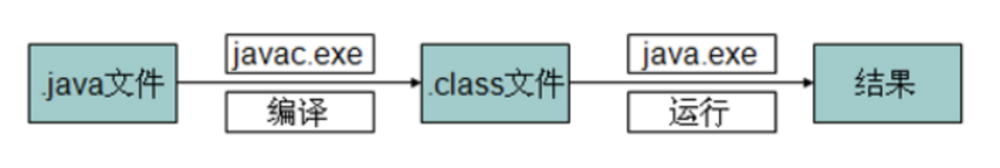
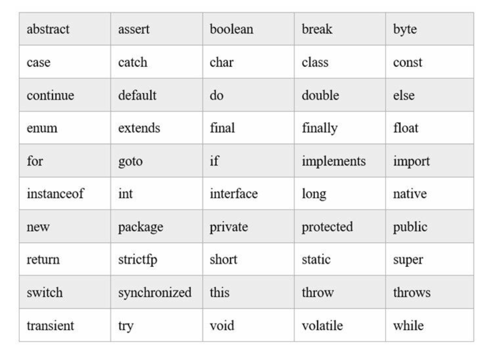
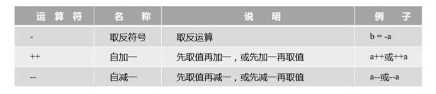
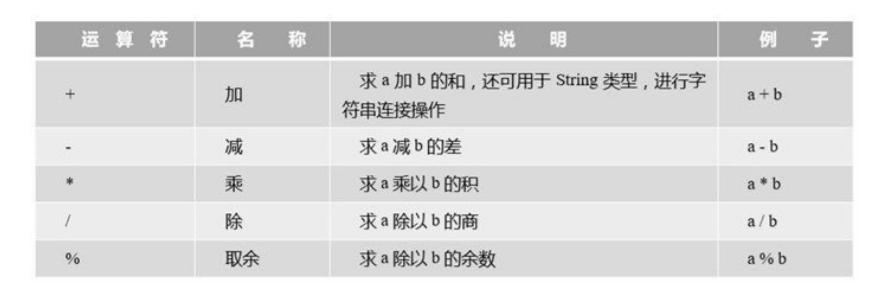
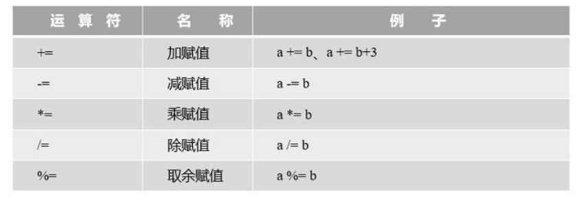
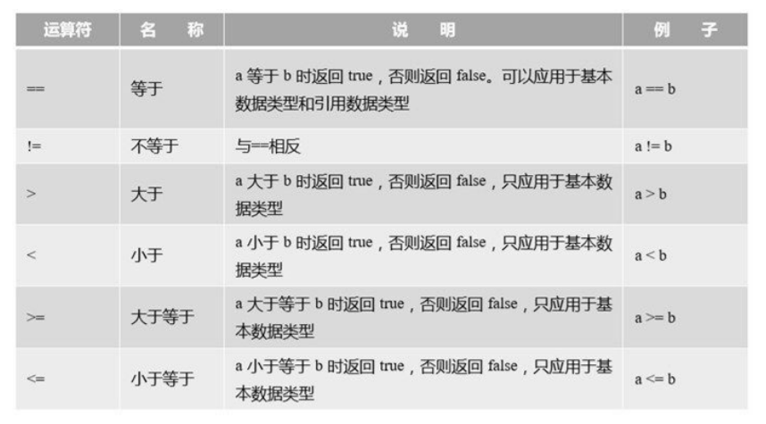
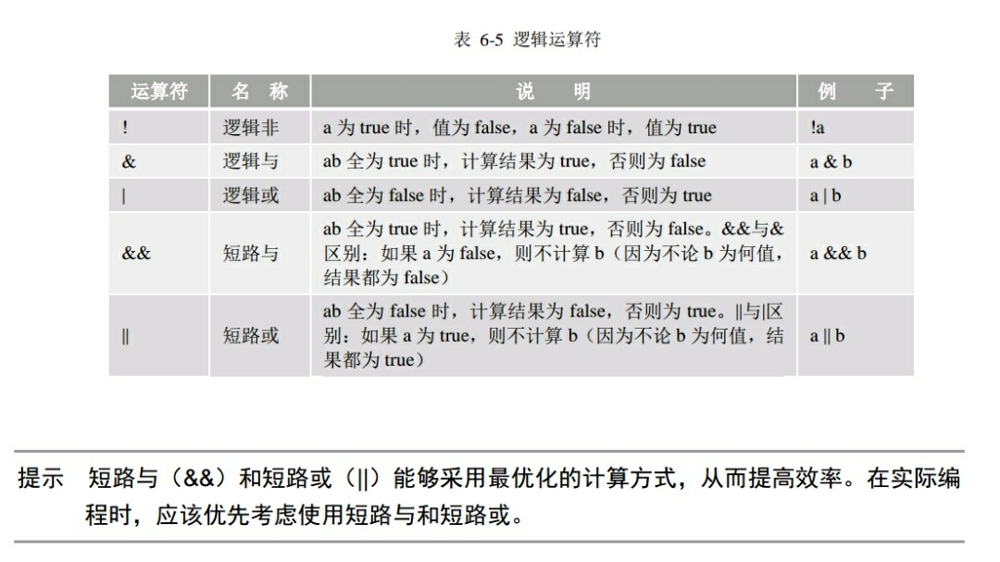
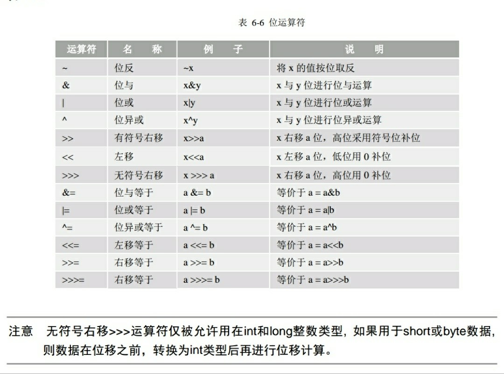
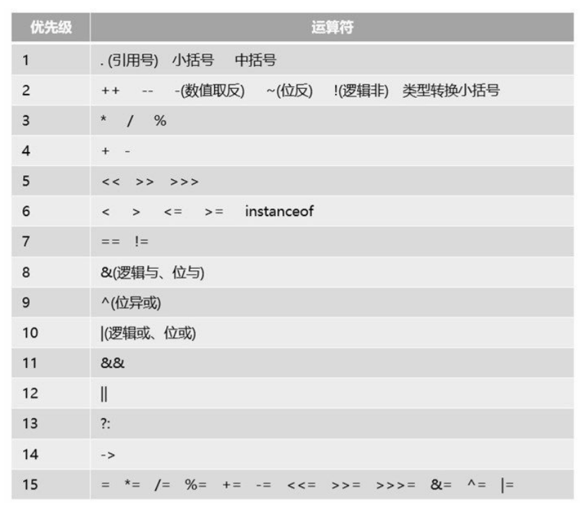

### 一、语言环境

#### 1、搭建开发环境

①下载并安装JDk 
②配置环境变量：我的电脑-右键 ---> 属性 ---> 高级系统设置 ---> 高级-环境变量 ---> Path，设置JAVA_HOME变量为JDK安装路径，在Path添加%JAVA_HOME%\bin。
③测试：终端中使用javac -version命令查看JDK版本号

#### 2、JDK、JRE、JVM和IDE

- JDK

  JRE以及开发工具包

  下载方法：

  官网 http://www.oracle.com/technetwork/java/javase/downloads/index.html 下载，点击最下方的Java Archive 历史仓库，可以下载所有 JDK 历史版本。

- JRE

  Java虚拟机(JVM Java Virtual Machine)和Java程序所需的核心类库等。

- JVM

  java虚拟机，java字节码文件运行的平台，实现了Java跨平台的特性。

- IDE

  IDE（Integrated Development Environments，集成开发环境），IDE的开发工具将程序的编辑、编译、调试、执行等功能集成在一个开发环境中。Java开发IDE工具有很多，其中主要有：Eclipse、IntelliJ IDEA和NetBeans等。 

#### 3、JDK命令

- javac       

  编译命令，后跟*.java（要后缀，因为该命令还可以-version查看JDK版本号等）

- java

  运行java程序，后跟class文件名（不要后缀，因为该命令只能运行.class文件）
  
- javadoc

  根据代码注释生成API帮助文档

  ```bash
  # 指定目录如果不存在，则会新建该目录再生成
  javadoc -d 要生成文档的目录 xxx.java
  ```
  
- javap

  反编译字节码文件

#### 4、Java程序编译执行过程



.java       java源程序
.class      java类文件（字节码文件、java可执行程序）

#### 5、语言类型

- 编译型和解释型

  **编译型（如汇编语言）：**编译器对我们的源代码进行转换，生成相对应的可执行代码，这个过程称为编译（Compile）。如果程序代码都包含在一个源文件中，那么通常编译之后就会直接生成一个可执行文件，就可以直接运行了。但对于一个比较复杂的项目，通常代码分散在各个源文件中，作为不同的模块来组织。这时编译各个文件时就会生成目标文件（Object file）而不是前面说的可执行文件。一般一个源文件的编译都会对应一个目标文件。这些目标文件里的内容基本上已经是可执行代码了，但由于只是整个项目的一部分，所以我们还不能直接运行。编译完，由链接程序（Linker）把目标文件“打包”成一个可执行文件了，称为链接（Link），除了链接目标文件外，可能还有各种资源，图标文件、声音文件，还要负责去除目标文件之间的冗余重复代码，等等。链接完成之后，一般就可以得到可执行文件了。 

  **解释型：**在程序运行的前一刻，还只有源程序而没有可执行程序；而程序每执行到源程序的某一条指令，则会有一个称之为解释程序的外壳程序将源代码转换成二进制代码以供执行，总言之，就是不断地解释、执行、解释、执行……所以，解释型程序是离不开解释程序的。

- 动态语言和静态语言

  **动态类型语言：**动态类型语言是指在运行期间才去做数据类型检查的语言，也就是说，在用动态类型的语言编程时，永远也不用给任何变量指定数据类型，该语言会在你第一次赋值给变量时，在内部将数据类型记录下来。Python和Ruby就是一种典型的动态类型语言。

  **静态类型语言：**静态类型语言与动态类型语言刚好相反，它的数据类型是在编译其间检查的，也就是说在写程序时要声明所有变量的数据类型

- 强类型定义语言和弱类型定义语言

  **强类型定义语言：**强制数据类型定义的语言。也就是说，一旦一个变量被指定了某个数据类型，如果不经过强制转换，那么它就永远是这个数据类型了。java是一种强类型语言。

  **弱类型定义语言：**数据类型可以被忽略的语言。它与强类型定义语言相反, 一个变量可以赋不同数据类型的值。

### 二、基础语法

#### 1、标识符、关键字和保留字

- 标识符

  变量、常量、方法、枚举、类、接口等由程序员指定的名字。
  ① 区分大小写；
  ② 首字符不能是数字，可以是 _  、& 或字母；
  ③ 不能是关键字。

- 关键字

  

- 保留字

  Java语言中的保留字只有两个，goto 和 const。
  
- 常用关键字使用

  ①public、default、protected、private修饰符用于修饰成员变量和成员方法就；
  ②static修饰符用于声明静态变量或静态方法；
  ③final修饰符用于声明变量，该变量只能被赋值一次，声明时可以不赋值，只能在赋值后才能使用且不能再修改，或者修饰方法，使方法不能被子类重写（覆盖），还可以修饰类，使类不能被继承；
  ④abstract用于声明抽象类和抽象方法；final和abstract不能同时修饰方法；因为final修饰的方法不能在子类中被覆盖，而abstract用来修饰抽象方法，必须在子类中被实现；
  ⑤native修饰的方法，称为“本地方法”，本地方法调用平台本地代码(如:C或C++编写的代 码)，不能实现跨平台；
  ⑥synchronized用于修饰方法或代码块，修饰的方法是同步的，当多线程方式同步方法时，只能串行地执行，保证是线程安全的。

#### 2、注释

- 文档注释

  行注释：// 注释内容

  块注释：/* 注释内容 */ 
  文档注释：/**  文档注释内容（说明注释） */ 

- 地标注释

  不是Java官方提供的，而是IDE中提供的一些特殊注释，用于在代码中加一些标识，便于IDE快速定位代码。
  ①TODO：说明此处有待处理的任务，或者代码没有编写完成。
  ②FIXME：说明此处代码是错误的，需要修正。
  ③XXX：说明此处代码虽然实现了功能，但是实现的方法有待商榷，希望将来能改进。

#### 3、数据类型

- 数据类型分类

  <div>
      <table>
          <tr>
              <td colspan="2">数据类型</td>
              <td>默认初始值</td>
          </tr>
          <tr>
              <td rowspan="4">基本数据类型(8种)</td>
              <td>整型：byte(8位，即1字节，范围-128~127)、short(16位)、int(32位，范围-2^31~2^31-1，约正负21亿多)、long(64位)</td>
              <td>long：0L，其余：0</td>
          </tr>
          <tr>
              <td>浮点型：float(32位)、double(64位)</td>
              <td>float：0.0f，double：0.0d</td>
          </tr>
          <tr>
              <td>字符型：char</td>
              <td>'\u0000'</td>
          </tr>
          <tr>
              <td>布尔型：boolean</td>
              <td>false</td>
          </tr>
          <tr>
              <td rowspan="3">引用数据类型</td>
              <td>类：class</td>
              <td rowspan="3">null</td>
          <tr>
              <td>接口：interface</td>
          </tr>
          <tr>
              <td>数组：[]</td>
          </tr>
          <tr>
              <td>注意</td>
              <td colspan="2">①对于常量数值，整数默认：int，小数默认：double。因此，将小数赋值给float变量时，必须要在小数后面加f(F)指定为float类型小数。②Java中boolean类型只有两个值：true和false</td>
          </tr>
      </table>
  </div>

- 类型转换

  ①自动类型提升

  

  ②强制类型转换

  不能自动类型提示转换类型时，在变量或者常量前加（要强转的数据类型）。

  要慎用，容易丢失精度，且一般不具有继承关系的两种对象类型不能强转，会报类型转换异常，为防止这种情况，可以使用 **instanceof** 关键字事先判断。

- **instanceof** 

  双目运算符，用来测试一个对象是否为一个类的实例。

  语法格式：obj instanceof Class

  返回 boolean 值

  注意：编译器会检查左边的 obj 能否转换成右边的 class 类型，当可以确定类型时，不能转换会直接报错。规定 obj 为 null 时返回 false。

  ```java
  //易错
  double a = 1 / 2;                //0.0，运算结果为0后自动提升为0.0d
  double b = 1.0 / 2;              //0.5，int和double运算前会先提升为double
  double d = (double) 1 / 2;       //0.5，是先将1转为double，再参与运算的。
  
  //整数常量默认为int，但编译时会检测该常量值是否在byte(short类型也一样)类型取值范围内，若是，则会默认强转并赋值，否则报错。
  byte b1 = 4;      //正确
  byte b2 = 128;    //报错  
  
  //byte以及short类型变量进行运算时会先提升为int，无法直接赋值给原byte或short类型，会报错提示可能精度缺失。但使用+=、-=等带等号的运算符时，会默认强转不会报错。
  byte b1 = 3;
  byte b2 = 4;
  byte b3 = b1 + b2;  //报错
  b1 = b1 + 4;        //报错
  b2 += 4;            //正确，相当于b2 = (byte) b2 + 4;
  ```

- #### 基本数据类型和引用数据类型

  从概念方面来说：
  基本数据类型:变量名指向具体的数值
  引用数据类型:变量名指向存数据对象的内存地址,即变量名指向hash值  

  从内存构建方面来说：
  基本数据类型:变量在声明之后，Java就会立刻分配给他内存空间
  引用数据类型:它以特殊的方式(类似C指针)指向对象实体（具体的值），这类变量声明时不会分配内存，只是存储了一个内存地址。  

  从使用方面来说：
  基本数据类型:使用时需要赋具体值,判断时使用“==”号 
  引用数据类型:使用时可以赋null,判断时使用equals方法  

  

  A a; 即是声明，创建了一个A类型的变量a 
  new A(); 即是实例化，实实在在地在内存里为A()划分了一块内存空间 
  a=new A();即是使a指向new A()。
  以后只要你不更改a的引用，对a的任何操作都会影响到你分配出来的这块内存空间。  

  理解了这个再回到问题 public class A{}   这个是对类的一个定义，此时，A只是一个“概念”，在电脑里并没有实体存在，但是java的虚拟机（jvm）已经得知了该类的所有定义，就是说，该类被加载进jvm的类加载器（class loader）了，其他的类有可能访问到该A类。 此时A本身就是jvm中的一个类，它自己当然是和自己同包，对不对？ 所以A必然可以访问到A 那么public class A{ A a=new A();} 这句话，编译期是正确的，不存在错误，所以可以声明也（被jvm认为）可以实例化。 但是到了运行期，真正的跑起来的时候，它是错误的 因为这是个迭代的死循环。 在new A()的时候，又会执行一遍A a= new A(); 然后该new A()又执行一遍A a= new A(); 如此往复，直到堆栈溢出。 当然 以下写法是正确的 public class A{ A a=null; } 嗯，事实上，有些专门的写法，如单例，工厂类，就是需要在某个类里面实例化它本身。

  

#### 4、常量与变量

- 常量

  final 数据类型 常量名(一般使用大写字母) = 值；

  一般声明于类根部且用 static 修饰 。

- 变量

  ①成员(域)变量：声明在类的根部，会默认根据变量类型初始化值，作用域是整个类。静态成员变量存储在堆中的类中，随类的加载而加载，而非静态成员变量存储在堆中的对象中，在对象创建时产生对象释放时消失。 
  ②局部变量：声明在方法或局部代码块中，不会默认初始化，使用前必须显式初始化，作用范围是该代码块。不能被 static 修饰，存储在栈中方法中，方法或局部代码块执行时产生，执行结束消失。

- static

  static 关键字

  用来修饰变量、方法、常量。主要作用在于创建独立于具体对象的域变量或者方法，因此不能修饰局部变量和常量。

#### 5、运算符

- 一元运算符

  

- 二元运算符

  

- 算数赋值运算符

  

- 关系运算符

  

- 逻辑运算符

  

- 位运算符

  

  **数值取低位**

  ```java
  // & 位与运算，可以取低多少位
  如：01111000001001 & 1111 得 低四位1001。
  ```

  **二进制转十六进制**

  ```java
  //每次位与1111取低4位，然后转化，然后>>>4 无符号右移4位再继续。
  ```

  **交换两个数的值**

  ```java
  int a = 3;
  int b = 4;
  
  //方法一：使用临时变量，开发时使用，阅读性更强
  int temp = a;
  a = b;
  b = temp;
  
  //方法二：加减交换，不要使用，如果被交换的两个数值过大，可能会超出数据类型的范围，强制转换，数值会发生变化。
  a = a + b;//a = 3 + 4;
  b = a - b;//b = 3 + 4 - 4;
  a = a - b;//a = 3 + 4 - 3;
  
  //方法三：异或（面试时），一个数异或同一个数两次会得到原来的那个数。
  a = a ^ b;//a = 3 ^ 4;
  b = a ^ b;//b = 3 ^ 4 ^ 4 = 3;
  a = a ^ b;//a = 3 ^ 4 ^ 3 = 4;
  ```

- 其他运算符

  ①三目(元)运算符（? :）：例如x?y:z，其中x、y和z都为表达式。
  ②小括号：起到改变表达式运算顺序的作用，它的优先级最高。 
  ③中括号：数组下标。 
  ④引用号（.）：对象调用实例变量或实例方法的操作符，也是类调用静态变量或静态方法的操作符。 
  ⑤赋值号（=）：赋值是用等号运算符（=）进行的。
  ⑥instanceof：判断某个对象是否为属于某个类。 
  ⑦new：对象内存分配运算符。
  ⑧箭头（->）：Java 8新增加的，用来声明Lambda表达式。 
  ⑨双冒号（::）：Java 8新增加的，用于Lambda表达式中方法的引用。
  
- 运算符优先级

  

  运算符优先级大体顺序，从高到低是：**算术运算符→位运算符→关系运算符→逻辑运算符 →赋值运算符**。

#### 6、进制与位运算

- 进制和指数表示

  ①进制：

  二进制数：以 0b 或0B为前缀，注意0是阿拉伯数字。 八进制数：以0为前缀，注意0是阿拉伯数字。  十六进制数：以 0x 或0X为前缀，注意0是阿拉伯数字。

  ②指数：

  如果采用十进制表示指数，需要使用大写或小写的e表示幂。例如：3.36e2表示3.36×102，1.56e-2表示1.56×10-2。

- 补码表示法

  原码

  反码

  补码

- 小数计算出错

  

#### 7、字符 & 编码

- 字符类型

  ① 字符型表示单个字符，Java中字符常量必须使用单引号' '括起来；
  ② Java字符采用双字节的Unicode编码，占两个字节（16位），因而可以使用十六进制（无符号的）编码形式（'\un'）表示，如'A'可以用Unicode编码表示为：'\u0041'；
  ③ 字符类型可以与int等数值类型进行计算或转换，因为字符类型是使用Unicode编码保存的，存储范围为\u0000 ~ \uFFFF，所以char类型的取值范围为：0~2^16-1;
  ④ 为了表示一些特殊字符，需要使用反斜杠，即向右下的斜杠。常见的字符转义：\t  水平制表符tab 、\n 换行、\r 回车。

- 字符编码与乱码

  常见编码

  编码转换

  乱码原因

  乱码恢复

#### 8、数组

##### 1、一维数组

- 声明

  ```java
  //数据类型[] 数组名;  此方式更推荐
  int[] a;
  //数据类型 数组名[];
  String b[];
  ```

  注意：只声明而不实例化（new），没有指定长度，此时并未给数组分配内存空间。  

- 初始化（3 种方法）

  ```java
  //方式一：静态初始化
  int[] a = {1, 2, 3}; 
  
  //方式二：静态初始化 注意不能在给定初始值的同时给定长度
  int[] b = new int[]{1,2,3,4};
  
  //方式三：动态初始化	new后分配内存空间，必须指定长度，数组元素值为默认值
  int c = new int[3]; 
  c[0] = 10;
  c[1] = 20;
  c[3] = 30;
  ```

- 为什么数组有 `length` 属性，字符串没有？而字符串有`length()`方法，数组没有？

  首先，数组是一个容器对象，其中包含固定数量的同一类型的值。一旦数组被创建，他的长度就是固定的了。数组的长度可以作为final实例变量的长度。因此，长度可以被视为一个数组的属性。

  String 底层的数据结构是一个char数组，所以没有必要来定义一个不必要的属性（因为该属性在char数值中已经提供了），只需要提供一个 `length()`方法来获取长度即可。

##### 2、二维数组

- 声明

  ```java
  //数据类型[][] 数组名;
   int[][] a;
  //数据类型 数组名[][];
  String b[][];
  ```

- 初始化

  ```java
  //方式一：静态初始化
  int[][] a = {{1,2,3}};
  
  //方式二：动态初始化 
  int[][] a = new int[2][3];//同时指定行数、列数
  a[0][0] = 1; 
  
  int[][] arr = new int[3][];//先只指定行数，再给数组的一维也赋值为数组
  arr[0] = new int[]{1,2,3};
  arr[1] = new int[]{4,5,6};
  ```

#### 9、输入与输出

- 输入

  ```java
  Scanner in = new Scanner(Sysout.in);
  in.nextInt();
  ```

- 输出( System.out )

  println：一般的标准输出，并换行。
  print：   一般的标准输出，但是不换行。
  printf：  格式化输出。
  "%"表示进行格式化输出，"%"之后的内容为格式的定义。
  %d ：int，%f ：浮点数，double 或float，
  %s 字符串，%c：一个字符，"%.2f"：输出两位小数点；
  %9.2f"：长度为9，向右靠齐，两位小数；

  ```java
  int i = 1;
  float j = 2;
  System.out.printf("输出i的值为%d，j的值为%f",i,j);
  ```


### 三、控制语句

#### 1、分支语句

- if

  if结构、if - else结构、if - else if - else结构

- switch

  ```java
  /**
   *switch后括号内为表达式
   *表达式的值会与case后的值匹配，一旦匹配上则它下方的所有语句都会执行，
   *直到遇到break;语句时结束switch内代码执行，否则执行完毕。
   *若都没有匹配则默认执行default语句，也可以没有，defalut后一般省略break；
   */
  int testScore = 75;
  char grade;
  switch (testScore / 10) {
      case 9:
          grade = '优';
          break;
      case 8:
          grade = '良';
          break;
      case 7:
      case 6:
          grade = '中';
          break;
      default:
          grade = '差';
  }
  ```

#### 2、循环语句

- while

  ```java
  while (循环条件) {
      语句组
  }
  ```

- do-while

  ```java
  do {
      语句组
  } while (循环条件)；
  ```

- for

  ```java
  for (初始化; 循环条件; 迭代) {
       语句组
  }
  ```

- for-each

  ```java
  //增强for循环适合取数据
  for(变量类型 变量：用于遍历的数组或集合）{
      语句组
  }
  ```

#### 3、跳转语句

- break

  break; 跳出最近内循环。

  break label; 带标签，label是标签名，跳出标签指示的循环。

  ```java
  label1:
  for (int x = 0; x < 5; x++) {
      for (int y = 5; y > 0; y--) {
          if (y == x) {//满足条件时跳出label1标出的循环体
              break label1;
          }
          System.out.printf("(x,y) = (%d,%d)", x, y);
          System.out.println();
      }
  }
  System.out.println("Game Over!");
  ```

- continue

  continue; 跳过本次最近内循环中尚未执行的语句。

  continue label; 跳过本次标签指定循环中尚未执行的语句。

- return

  退出该函数的执行，返回到函数的调用处。对于main()函数，则结束整个程序的运行。

- throw

### 四、方法

#### 1、方法

- 定义

  ```java
  修饰符 返回值类型 方法名（参数类型 参数名）{
       语句;
       return 返回值;//当返回值类型为void不需要return语句
  }
  ```

  注意： 
  ①方法中只能调用方法而不能定义方法； 
  ②程序执行时，采用栈的结构将方法加载到内存中，只有调用方法时才加载进去，return后就立马释放。  

- 可变参数

  参数前加上 ... ，相当于数组 
  注意：不能这样写成 int ...numbs , int x  样式，单个确定名称参数应该放在前面。

  ```java
  public int sum(int... numbs) {
      //...numbs 可以看成数组
      int sum = 0;
      for (int numb : numbs) {
          sum += numb;
      }
      return sum;
  }
  ```

- 修饰符

  | 修饰符    | 同类 | 同包 | 不同包子类 | 不同包非子类 |
  | --------- | ---- | ---- | ---------- | ------------ |
  | private   | √    |      |            |              |
  | default   | √    | √    |            |              |
  | protected | √    | √    | √          |              |
  | public    | √    | √    | √          | √            |

- static

  静态，用来修饰成员变量和方法  

  ①被修饰的变量和方法随类的加载而加载，静态变量存在方法区的（静态区中）;
  ②优先于对象存在，被所有对象共享 ;
  ③直接用类名调用 。

  注意：

  静态方法只能访问同类中的静态成员变量或静态方法； 
  静态方法中没有this和super关键字 
  主函数是静态的。  

- 传值调用和引用调用

  Java中实际只有传值调用。

  基本类型参数传递：传值调用
  
  把实参的值拷贝给形参，实际操作的是形参，对原值不影响。
  
  引用类型参数传递：也是传值调用
  把实参的值（实际上是所引用对象的地址）拷贝给形参，无论怎么操作，都不会改变实参对该对象的引用，但因为两者指向同一个对象，所以可以修改实参引用的对象的内容。
  
  

#### 2、重载和重写

- 重载（overload）

  同类中同名方法的参数个数、类型或顺序不同，与其他无关。即：方法签名两元素中方法名相同，参数不同，与
  其他无关。

- 重写（override） 
  类或接口间继承或实现时，方法重写。
  不会重写的方法：  

  final方法、静态方法、private等子类中不可见方法。

  重写的要求：

  ①方法签名（方法名和形参列表）必须相同；
  ②返回值类型范围必须小于等于被重写方法返回值类型的范围； 
  ③访问权限范围不能比被重写方法小；
  ④不能抛出新的或者更加宽泛的异常。  


  

