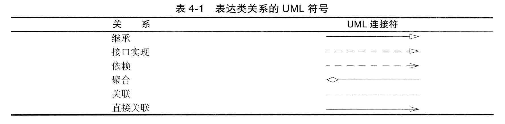
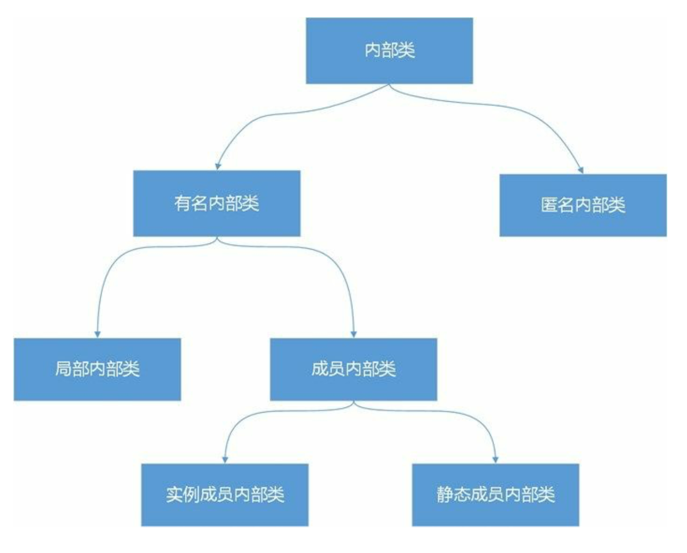

### 一、概述

#### 1、面向对象

- 面向过程

  面向过程强调的是过程（动作）。

  eg:把大象关进冰箱
  ①打开冰箱；
  ②存储大象；
  ③关上冰箱。

- 面向对像（OOP：Object Oriented Programming）

  面向对象强调的是对象（实体），只关注其属性和行为，对象对其属性和行为进行封。
特点：更符合人们的思考习惯，能将复杂的问题简单化。**易维护、易复用、易扩展。**
  
  eg：把大象关进冰箱
    对象：冰箱
  属性：大象
    行为：打开、存储、关闭

#### 2、三大特性

#### （1）封装

- 概念

  将一个对象的属性等私有化，隐藏对象的属性和实现细节，仅对外提供公共访问方法。

- 优点

  提高重用性、安全性，隔离变化等。

#### （2）继承

- 概念

  使用已存在的类或接口的定义作为基础建立新类或接口。

- 优点

  通过使用继承，我们能够非常方便地复用以前的代码。在使用父类或接口的功能的同时扩展新的数据或新的功能。

- 注意

  ①子类拥有父类的全部属性和方法（包括私有属性和私有方法），但是父类中的私有属性和方法子类是无法访问，**只是拥有**。

  ②子类可以用自己的方式实现父类的方法，即重写（override），也叫做覆盖。

#### （3）多态

- 概念

  一个对象变量可以指示多种实际类型的现象称为多态。运行时能够自动的选择调用哪个方法的现象称为动态绑定。

  程序中定义的引用变量所指向的具体类型和通过该引用变量发出的方法调用在编程时并不确定，而是在程序运行期间才确定。即一个引用变量到底会指向哪个类的实例对象，该引用变量发出的方法调用，到底是哪个类中实现的方法，必须在由程序运行期间才能决定。

- 多态发生的前提

  ①继承（多个子类对同一方法的重写）和接口（实现接口并覆盖接口中同一方法）
②声明的变量类型是父类类型，但实例则指向子类实例。多态发生时，Java 虚拟机运行时根据引用变量指向的实例调用它的方法，而不是根据引用变量的类型调用。

### 二、类与对象

#### 1、规范

①每个java程序至少有一个类；
②类名首字母大写；
③公共类名必须与java文件名相同；
④一个. java文件中可以定义多个类：
(1) public权限类只能有一个（也可以一个都没有，但最多只有一个）；
(2)这个. java文件名只能是 public权限的类的类名；
(3)倘若这个文件中没有 public类，则它的. java文件的名字是随便的一个类名；
(4)当用 javac命令生成编译这个. java文件的时候，则会针对每一个类生成一个. class文件。

#### 2、构造器

用来初始化对象的成员属性。注意：不是初始化对象，初始化对像是通过new关键字实现的。

①构造器方法名必须与类名相同，可以声明为所有的四种访问级别；
②每个类可以有多个重载的构造器；
③构造器可以有0个、1个或多个参数；
④构造器没有任何返回值，包括void；
⑤构造器总是在new操作时被调用且只调用一次，构造方法只能与new操作符一起使用；
⑥没有自定义构造方法时，默认空参构造方法。 
⑦在构造器中可以调用同类中的其他构造器，使用this( )或this( 实参列表 ) ，但只能在第一行。
⑧构造器的开始默认调用了父类的无参构造器（若父类没有无参构造方法，则必须显示调用其有参构造方法，否则编译报错），即super( )，只是用来初始化父类成员属性，因此并不会创建父类对象。也可以在构造器第一行显式调用父类构造器，使用super( )或super( 实参列表 ) 。

#### 3、类之间的关系(UML图)

①依赖（uses-a）：一个类中的方法需要操作到另一个类的对象。
②聚合（has-a）：类A的对象中包含着类B的对象。
③继承（is-a)：子类继承父类，拥有父类全部属性和方法，并扩展新的属性和方法。



#### 4、内部类



- 作用

  封装：将不想公开的实现细节封装到一个内部类中，内部类可以声明为私有的，只能在所在外 部类中访问。

  提供命名空间：静态内部类和外部类能够提供有别于包的命名空间。

  便于访问外部类成员：内部类能够很方便访问所在外部类的成员，包括私有成员也能访问。

#### （1）实例(成员)内部类

- 定义

  在外边类的内部，方法体和代码块之外定义的内部类，称为实例成员内部类，或实例内部类，也可以直接称之为成员内部类（因为静态成员内部类一般简称为静态内部类）。

- 特点

  ①实例内部类与实例变量类似，可以声明为公有级别、私有级别、默认级别或保护级别，即4种访问级别都可以，而外部类只能声明为公有或默认级别。
  ②实例内部类中不能直接定义静态成员属性，只能定义为final static（静态常量），不能定义静态成员方法；
  ③实例内部类可以访问外部类所有成员属性和成员方法（包括private成员和静态成员）；
  ④当内部类拥有和外部类同名的成员变量或者方法时，会发生隐藏现象，即默认访问的是成员内部类的成员，需要以**外部类.this.成员变量**或**外部类.this.成员方法**的形式进行访问；如果内部类和外部类的成员命名没有冲突，访问外部类的成员属性和方法时可以不用加“外部类名.this”，直接使用属性或方法名；在内部类中**this**是引用当前内部类对象。
  ⑤外部类中要访问成员内部类的成员，必须先创建一个成员内部类的对象，再通过指向这个对象的引用来访问。
  ⑥通常情况下，使用实例成员内部类不是给外部类之外调用使用的，而就是给外部类自己使用的。但是一定要在**外部类的之外访问内部类**，Java语言也是支持的，**内部类的类型表示为“外部类.内部类”，实例化过程是先实例化外部类，再通过“外部类实例.new 内部类( )”的方式实例化内部类**。 **内部类编译成功后生成的字节码文件是“外部类$内部类.class”**。
  
  ```java
  public static void main(String[] args) {
      // 通过外部类的成员方法访问内部类，test方法中实例化了内部内inner,并调用了inner的方法
      Outer outer = new Outer();
      outer.test();
  
      // 在外部类之外直接访问实例内部类，必须先实例化外部类，从而再实例化内部类
      Outer.Inner inner = outer.new Inner();
      inner.display();
  }
  ```

#### （2）静态(成员)内部类

- 定义

  静态内部类与静态变量类似，在外边类的内部，方法体和代码块之外定义，在声明的时候使用关键字static修饰。

- 特点

  ①**静态内部类只能访问外部类静态成员**，所以静态内部类使用的场景不多。但可以提供有别于包的命名空间。
  ②静态内部类中可以定义静态成员属性和方法；
  ③在外部类之外访问静态内部类，**内部类的类型表示为“外部类.内部类”**，可以通过**“new 外部类.内部类（）”**的方式**直接实例化静态内部类**。
  
  ```java
  public static void main(String[] args) {
      // 直接访问内部类
      View.Button button = new View.Button();
      button.onClick();
  }
  ```

#### （3）局部内部类

- 定义

  在方法体或代码块中定义的内部类。

- 特点

  ①局部内部类的作用域仅限于方法体或代码块中；
  ②局部内部类访问级别只能是默认的，不能是公有的、私有的和保护的访问级别，即不能使用public、 private和protected修饰；
  ③局部内部类也不能是静态，即不能使用static修饰；
  ④局部内部类可以用final或abstract修饰（匿名内部类不能被abstract修饰，因为它需要new 出对象马上使用）；
  ⑤局部内部类可以访问外部类所有成员。

#### （4）匿名内部类

- 定义
  匿名内部类是没有名字的内部类，本质上是**没有名字的局部内部类**，具有局部内部类所有特征。通常用来实现接口或抽象类的，很少覆盖具体类。

- 特点

  ①**具有局部内部类所有特征**；
  ②无法定义构造方法，但是，匿名内部类拥有与父类相同的所有构造方法。
  ③可以定义代码块，用于实例的初始化，但是不能定义静态代码块；
  ④可以定义新的方法和属性(不能使用static修饰)，但是无法显式的通过“实例名.方法名(参数)”的形式调用，因为使用new创建的是“上转型对象”（即父类声明指向子类对象）；
  ⑤如果匿名内部类在方法中定义，不能访问外部类方法中的局部变量和方法的参数，除非该局部变量或方法参数被声明为**final**类型（局部内部类亦如此）。
  原因是编译器实现上的困难：**内部类对象的生命周期很有可能会超过局部变量的生命周期**。
  局部变量的生命周期：当该方法被调用时，该方法中的局部变量在栈中被创建，当方法调用结束时，退栈，这些局部变量全部死亡。
  内部类对象生命周期：与其它类对象一样，自创建一个匿名内部类对象，系统为该对象分配内存，直到没有引用变量指向分配给该对象的内存，它才有可能会死亡（被JVM垃圾回收）。
  所以完全可能出现的一种情况是：成员方法已调用结束，局部变量已死亡，但匿名内部类的对象仍然活着。如果匿名内部类的对象访问了同一个方法中的局部变量，就要求只要匿名内部类对象还活着，那么栈中的那些它要所访问的局部变量就不能“死亡”。
  解决方法：**匿名内部类对象可以访问同一个方法中被定义为final类型的局部变量**。定义为final后，编译器会把匿名内部类对象要访问的所有final类型局部变量，都拷贝一份作为该对象的成员变量。这样，即使栈中局部变量已经死亡，匿名内部类对象照样可以拿到该局部变量的值，因为它自己拷贝了一份，且与原局部变量的值始终保持一致（final类型不可变）。

  最后，**Java 8更加智能：如果局部变量被匿名内部类访问，那么该局部变量相当于自动使用了final修饰**，但方法参数还是要声明成final。
  ⑥编译成功后生成的字节码文件为**类$数字.class**。

- 示例

  ```java
  interface OnclickListener {
      void onClick();
  }
  
  class View {
      //该方法的形参为一个接口，需要传入接口的实现类对象
      public void handler(OnclickListener listener) {
          listener.onClick();
      }
  }
  
  public class MyTest {
      public static void main(String[] args) {
          View v = new View();
          //使用接口的实现类的对象做为实参,就是一个匿名内部类
          //实参表达式中OnClickListener是要实现的接口或要继承的类
          //new是为匿名内部类创建对象，()是调用构造方法，{... }是类体部分。
          v.handler(new OnclickListener() {
              @Override
              public void onClick() {
                  System.out.println("实现接口的匿名内部类！");
              }
          });
      }
  }
  ```

#### 5、对象

- 类、对象

  类：Java语言中对事物的描述，某一类事物的抽象。构造对象的模板或蓝图，包括**成员变量（属性）**和**方法（行为）**两方面。
  对象：类的一个实例，通过new这个关键字来创建实例。

- **匿名对象**

  没有名字的对象；例如：new Car（）.run();当对象对其中的方法或成员变量仅进行一次调用时可以这样使用，使用后就释放对象了。

- 实例化

  由类构造对象的过程，用new实现。

#### 6、包

- 静态导入

  用于简化程序对类静态属性和方法的调用 

  ```java
  //import static 包名.类名.静态属性|静态方法|*
  import static java.lang.System.out;
  
  out.print("hahaha");  
  ```

- Java常用包

  Java.lang：包含一些Java语言的核心类库，如Object、Class、String、包装类、Math、System和Thread。该包下面的类不需要导入，其他的全部需要导入。

  Java.util：包含一些实用工具类，如定义系统特性、日期时间、日历、集合类等。

  Java.io：包含能提供多种输入输出流类和文件管理相关的类和接口。

  Java.net：包含执行网络相关操作的类。

  Java.sql：Java操作数据库的一些API。

  Java.text：包含了一些用来处理文本、消息，日期格式化和数字格式化的类和接口。

  Java.awt：用来构建和管理Java程序图形用户的界面的类。

  Javax.swing：在awt基础上构建的一套新的图形界面类。

### 二、继承

#### 1、继承（extends）

- 概念

  使用已存在的类或接口的定义作为基础建立新类或接口。通过使用继承，我们能够非常方便地复用以前的代码。在使用父类或接口的功能的同时扩展新的数据或新的功能。

- 注意

  ①子类拥有父类的全部属性和方法（包括私有属性和私有方法），但是父类中的私有属性和方法子类是无法访问，**只是拥有**；
②子类中可以直接访问父类中的非私有属性和方法，但当子类中有同名属性或方法覆盖时，必须使用**"super.属性名"**；
  ③子类可以用自己的方式实现父类的方法，即重写（override），也叫做覆盖；
④Java只支持单继承，即一个类只能有一个父类，但可以实现多个接口；
  ⑤子类实例化时，不仅需要初始化子类成员变量，还需要先初始化父类成员变量，即在子类构造方法首行默认会调用父类无参构造方法，如果父类没有无参构造方法，则会出现编译错误，需要使用**super**关键字手动调用父类有参构造方法初始化父类成员变量。

#### 2、重写（override）

- 哪些方法不会被重写
  final方法、静态方法、private等子类中不可见方法

- 重写的规范

  ①方法签名与要重写的父类方法相同，即方法名和形参列表必须相同；
  ②返回值范围必须小于等于父类被重写方法返回值范围；
  ③修饰符的访问权限范围不得小于父类被重写方法；
  ④不能比父类被重写方法抛出的更多或范围更大的异常。

- 对象的多态性
  通过子类调用的方法如果被子类重写，则调用的是子类重写的代码。
  非静态方法默认的调用对象是this
  在构造器（或<init>）中，this表示的是正在创建的对象

### 三、抽象类和接口

#### 1、抽象类（abstract)

- 抽象类

  定义类时，在class关键字前加上abstract关键字修饰。抽象类不能被实例化。

- 抽象方法

  在方法的前加上abstract关键字修饰，并且没有方法体，即方法实现，注意空花括号也不行，因为它表示，方法里面没有任何语句。访问类型只能是public或protected，缺省情况下为public。

- 特点

  ①抽象类可以有普通的成员变量，一般只包含抽象方法，但也可以包含具体方法、静态方法；
②含抽象方法的类必须声明为抽象类，类即使不含抽象方法，也可以声明为抽象类；
  ③抽象类可以有构造方法，用来初始化成员变量；
④可以定义抽象类变量，但是只能引用非抽象子类的对象。
  ⑤抽象类不能使用final修饰，因为其必须有子类才能使用；
⑥外部抽象类不能使用static声明，内部抽象类可以。
  ⑦构造方法和静态方法不能被声明为抽象方法。

#### 2、接口（interface）

- 概念

  对类的一组需求的描述，比抽象类更抽象（所有方法都是抽象的，但Java8之后可以有默认方法）。
  接口可以理解为一种特殊的类，里面全部是由**全局常量**和**公共的抽象方法**所组成。接口是解决**Java无法使用多继承**的一种手段，但是接口在实际中更多的作用是**制定标准**的。或者我们可以直接把接口理解为**100%的抽象类**，既接口中的方法**必须全部**是抽象方法。（JDK1.8之前可以这样理解）

- 特点

  ①接口中的域默认为public static final，也可以自己写明但不推荐；
  ②接口中的方法都是public的，缺省默认也是public；
  ③接口中的方法都是抽象的，不用加abstract关键字修饰，默认就是抽象的；
  ④但Java8开始允许接口中增加静态方法，和抽象方法的默认实现，在方法前加default修饰即为默认实现方法，可以有默认实现的方法体；
  ⑤接口也可以继承接口，并支持多继承。

- 接口的实现

  ①使用关键字implements实现接口；
  ②可以实现多个接口，多个接口名之间用逗号","隔开；

#### 3、接口和抽象类的区别

①接口支持多继承，抽象类（包括具体类）只能继承一个父类；
②接口中没有实例成员变量，接口中声明的成员变量全部默认是public static final的，即全局静态常量；
③接口中不包含构造方法，因为没有实例成员变量不需要初始化；
④抽象类可以生命抽象方法和具体方法，Java8之前接口中只能有抽象方法，Java8之后还可以有默认实现的具体方法。


### 四、常用对象

#### 1、Object

#### 2、String 

#### 3、StringBuffer

#### 5、StringBuilder

#### 5、包装类

#### 1、System类

#### 2、Runtime类

#### 3、Math类

#### 4、Date类

#### 5、Calendar类