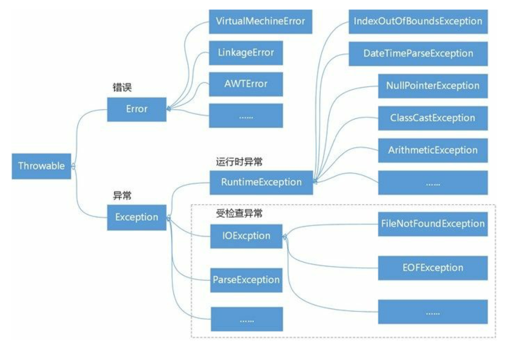

### 一、概述



#### 1、Throwalble类

所有的异常类都直接或间接地继承于java.lang.Throwable类

```java
//获得发生异常的详细消息
String getMessage()
//打印异常堆栈跟踪信息:堆栈跟踪信息从下往上，是方法调用的顺序
void printStackTrace()
//获得异常对象的描述
String toString()
```

#### 2、Error

Java程序运行时发生的无法恢复的严重错误。如:**JVM内部错误**、**内存溢出**和**资源耗尽**等严重情况，程序员无能为力，只能让程序终止。

#### 3、Exception

> 发生异常时，程序是可以恢复的，且是程序员所能掌控的。

- RuntimeException（运行时异常）

  如果出现RuntimeException，那么一定是你的问题。
  ①错误的类型转换；②数组访问越界（ArrayIndexOutOfBoundsException）；③访问null指针（NullPointerException）；④除零异常（ArithmeticException）等。

- 其他异常

  ①试图在文件尾部后面读取数据；②读取不存在的文件；③试图根据给定字符串查找Class对象，但其表示的类不存在等。

#### 4、受查异常与非受查异常

- 非受查（unchecked）异常：派生于Error和RuntimeException的所有异常；

- 受查异常（checked）：其他异常。

### 二、异常处理

①对于运行时异常通常不采用抛出或捕获处理方式，而是应该提前预判，防止这种发生异常，做到未雨绸缪。
②受检查异常：当前方法有能力解决，则捕获异常进行处理；没有能力解决，则抛出给上层调用方法处理。如果上层调用方法还无力解决，则继续抛给它的上层调用方法，异常就是这样向上传递直到有方法处理它，如果所有的方法都没有处理该异常，那么JVM会终止程序运行。

#### 1、捕获异常

```java
try{
	//可能会发生异常的语句
} catch(Throwable e){ 
  //处理异常e
} finally{
	//释放资源
}
```

- try-catch

  ①每个try代码块可以伴随一个或多个catch代码块，用于处理try代码块中所可能发生的多种异常；
  ②catch语句中的e是捕获异常对象，e必须是Throwable的子类，异常对象e的作用域在该catch代码块中；
  ③在多个catch代码情况下，当一个catch代码块捕获到一个异常时，其他的catch代码块就不再进行匹配；
  ④当捕获的多个异常类之间存在父子关系时，一般先捕获子类，后捕获父类，否则子类捕获不到；
  ⑤try-catch语句可以进行嵌套，可以任意嵌套在try、catch和finally代码块中，但会使程序流程变得复杂，尽量不要嵌套；

  ⑥多重捕获：Java7推出，如果捕获多种异常之后的处理是相同的，可以只用一个catch代码块，异常类型用"|"运算符连接起来，使用同一个异常变量名，且异常变量隐含为final变量，不能再赋不同值。

- finally代码块

  在try-catch语句中会占用一些非Java资源，如打开文件、网络连接、数据库连接等，需要使用finally代码块来释放。

- 自动资源管理

  Java7开始提供，将释放非Java资源的任务交给JVM完成，可以替代finally代码块，优化代码结构，提高程序可读性。在try后面加小括号（），将声明或初始化资源的语句放在小括号中，多条语句之间用分号";"分隔。

  自动管理的资源需要实现AutoCloseable接口。

  ```java
  public static Date readDate() {
      // 自动资源管理
      try (FileInputStream readfile = new FileInputStream("readme.txt");
           InputStreamReader ir = new InputStreamReader(readfile);
           BufferedReader in = new BufferedReader(ir)) {
          // 读取文件中的一行数据 
          String str = in.readLine();
          if (str == null) {
              return null;
          }
          DateFormat df = new SimpleDateFormat("yyyy-MM-dd");
          Date date = df.parse(str);
          return date;
      } catch (FileNotFoundException e) {
          System.out.println("处理FileNotFoundException...");
          e.printStackTrace();
      } catch (IOException e) {
          System.out.println("处理IOException...");
          e.printStackTrace();
      } catch (ParseException e) {
          System.out.println("处理ParseException...");
          e.printStackTrace();
      }
      return null;
  }
  ```

- 代码的执行

  ①try语句块中任何代码抛出了一个在catch子句中说明的异常类，那么程序将跳过try语句块的其余代码，执行catch子句中的处理器代码；
  ②try语句块中的代码没有抛出任何异常，则程序执行完try语句块中的代码，跳过catch子句；
  ③try语句块中抛出catch子句中未声明的异常类型，那么方法会立刻退出；
  ④在try-catch-finally结构中，无论是否抛出异常或捕获了异常，finally语句块都会执行。
  如果try语句中有return语句，则finally语句块会在try语句块的return语句真正执行（即返回结果给调用者）之前执行，若finally中也有return语句，则会执行完finally语句块中的return语句后，就不会再执行try语句中的返回操作了，相当于会导致覆盖try中间的返回结果。

#### 2、抛出异常

- throws：在方法上声明抛出异常，多个异常之间使用逗号","隔开。

  ①调用一个抛出受查异常的方法，必须抛出异常；
  ②使用throw语句抛出受查异常时，必须在方法上抛出异常。

- throw：捕获异常后再次选择抛出指定异常

#### 3、异常处理技巧

①异常处理不能代替简单的测试；
②不要过分地细化异常；
③利用异常层次结构：抛出合适地或自定义异常、考虑受查异常和非受查异常区别、适时转换异常；
④不要压制异常，可以对于几乎不会发生的异常，可以考虑关闭，如果很重要，可以捕获处理；
⑤早抛出，晚捕获：对于工具类等，异常应尽量抛出给上层调用者，以通知调用者捕获处理。

### 三、自定义异常类

```java
/**
 * 通过继承Exception类或其子类来自定义异常类
 * 需要提供两个构造方法：
 * 默认空参构造方法，异常信息为空
 * 字符串参数构造方法，传入异常信息
 **/

public class NHException extends Exception {
    public NHException(){
        
    }
    
    public NHException(String message){
        super(message);
    }
  
}
```

### 四、断言


### 五、日志