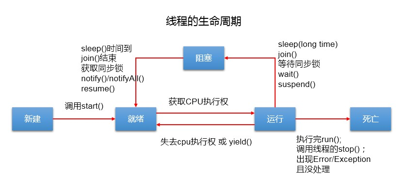
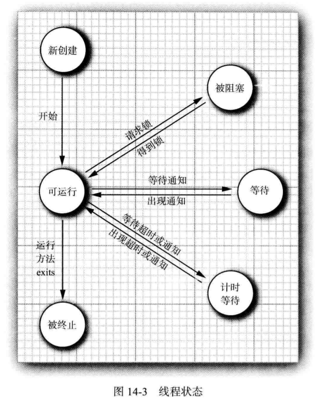

### 一、概述

#### 1、程序(programm)

为完成特定任务、用某种语言编写的一组指令的集合，即一段静态的代码。

#### 2、进程(process)与线程(thread)

- 进程

  进程是程序的一次执行，是一个程序及其数据在处理机上顺序执行时所发生的的活动。进程是具有独立功能的程序在一个数据集合上运行的过程，它是系统进行资源分配和调度的一个独立单位。每个进程都有它自己的内存空间和系统资源。

- 线程

  线程与进程相似，是一段完成某个特定功能的代码，是程序中单个顺序控制的流程，但与进程不同的 是，同类的多个线程是共享一块内存空间和一组系统资源。所以系统在各个线程之间切换时，开销要 比进程小的多，正因如此，线程被称为轻量级进程。一个进程中可以包含多个线程。

#### 3、**多进程与多线程的区别**

本质区别在于每个进程拥有自己的一整套变量，而线程则共享数据。共享变量使线程之间通信更有效、更容易。

#### 4、引入线程的原因  

注意：多线程的存在，不是提高程序的执行速度。其实**是为了提高应用程序的使用率**，程序的执行其实都是在**抢CPU的资源**，CPU的执行权。多个进程是在抢这个资源，**而其中的某一个进程如果执行路径比较多**，就会有**更高的几率**抢到CPU的执行权

#### 5、并行与并发

- 并行

  并行是多个处理器同一时刻内处理多个任务。

- 并发

  并发是一个处理器同一时间间隔内处理多个任务。

### 二、线程的创建

#### 1、方式一：继承Thread，重写run方法

```java
public class MyThread extends Thread {
    @Override
    public void run() {
        for (int i = 0; i < 200; i++) {
            System.out.println(i);
            try {
                Thread.sleep(1);
            } catch (InterruptedException e) {
                e.printStackTrace();
            }
        }
    }
}

public class TestThread {
    public static void main(String[] args) {
        MyThread t1 = new MyThread();
        MyThread t2 = new MyThread();
        
        t1.start();
        t2.start();
    }
}

//匿名子类

```

#### 2、方式二：实现Runnable接口，重写run方法（推荐使用） 

优点： 
1、将线程要执行的任务从Thread的子类中分离出来，进行了单独封装。按照面向对象的思想将任务封装成对象。 
2、避免了Java单继承的局限性。

```java
public class MyThread implements Runnable {
      @Override
      public void run() {
          for (int i = 0; i < 200; i++) {
              System.out.println(i);
              try {
                  Thread.sleep(1);
              } catch (InterruptedException e) {
                  e.printStackTrace();
              }
          }
      }
  }
  
  public class TestThread {
      public static void main(String[] args) {
  
          MyThread thread = new MyThread();
          Thread t1 = new Thread(thread);
          Thread t2 = new Thread(thread);
  
          t1.start();
          t2.start();
      }
  }
```

#### 3、方式三：实现Callable接口

实现Callable接口的方式创建多线程比实现Runnable接口创建多线程方式强大

* 1. call()可以返回值的。
* 2. call()可以抛出异常，被外面的操作捕获，获取异常的信息
* 3. Callable是支持泛型的

```java
/**
* 
 * JDK 5.0新增
 */

//1.创建一个实现Callable的实现类
class NumThread implements Callable{
    //2.实现call方法，将此线程需要执行的操作声明在call()中
    @Override
    public Object call() throws Exception {
        int sum = 0;
        for (int i = 1; i <= 100; i++) {
            if(i % 2 == 0){
                System.out.println(i);
                sum += i;
            }
        }
        return sum;
    }
}


public class ThreadNew {
    public static void main(String[] args) {
        //3.创建Callable接口实现类的对象
        NumThread numThread = new NumThread();
        //4.将此Callable接口实现类的对象作为传递到FutureTask构造器中，创建FutureTask的对象
        FutureTask futureTask = new FutureTask(numThread);
        //5.将FutureTask的对象作为参数传递到Thread类的构造器中，创建Thread对象，并调用start()
        new Thread(futureTask).start();

        try {
            //6.获取Callable中call方法的返回值
            //get()返回值即为FutureTask构造器参数Callable实现类重写的call()的返回值。
            Object sum = futureTask.get();
            System.out.println("总和为：" + sum);
        } catch (InterruptedException e) {
            e.printStackTrace();
        } catch (ExecutionException e) {
            e.printStackTrace();
        }
    }

}
```

#### 4、方式四：使用线程池

* 优点

  1.提高响应速度（减少了创建新线程的时间）

  2.降低资源消耗（重复利用线程池中线程，不需要每次都创建）

  3.便于线程管理

  * corePoolSize：核心池的大小
  * maximumPoolSize：最大线程数
  * keepAliveTime：线程没任务时最多保持多长时间后会终止

  ```java
  class NumberThread implements Runnable{
  
      @Override
      public void run() {
          for(int i = 0;i <= 100;i++){
              if(i % 2 == 0){
                  System.out.println(Thread.currentThread().getName() + ": " + i);
              }
          }
      }
  }
  
  class NumberThread1 implements Runnable{
  
      @Override
      public void run() {
          for(int i = 0;i <= 100;i++){
              if(i % 2 != 0){
                  System.out.println(Thread.currentThread().getName() + ": " + i);
              }
          }
      }
  }
  
  public class ThreadPool {
  
      public static void main(String[] args) {
          //1. 提供指定线程数量的线程池
          ExecutorService service = Executors.newFixedThreadPool(10);
          ThreadPoolExecutor service1 = (ThreadPoolExecutor) service;
          //设置线程池的属性
  //        System.out.println(service.getClass());
  //        service1.setCorePoolSize(15);
  //        service1.setKeepAliveTime();
  
  
          //2.执行指定的线程的操作。需要提供实现Runnable接口或Callable接口实现类的对象
          service.execute(new NumberThread());//适合适用于Runnable
          service.execute(new NumberThread1());//适合适用于Runnable
  
  //        service.submit(Callable callable);//适合使用于Callable
          //3.关闭连接池
          service.shutdown();
      }
  
  }
  ```

#### 5、run（）方法和start（）方法的区别

run（）用来封装被线程执行的代码，直接调用是普通方法。
strart（）启动线程，再由jvm去调用该线程的run（）方法。

【注意】JVM启动默认是多线程的，除了主线程（main），至少还有垃圾回收线程。

### 三、Thread

```java
/**
 * Thread类部分源码       
 */
private static int threadInitNumber;
private static synchronized int nextThreadNum() { 
    return threadInitNumber++;
}

//继承Thread类创建线程
public Thread() {//默认方式
     init(null, null, "Thread-" + nextThreadNum(), 0);
}
public Thread(String name) {//创建时设置线程名
     init(null, null, name, 0); 
}
//实现Runnable接口创建线程
public Thread(Runnable target) {//默认方式
        init(null, target, "Thread-" + nextThreadNum(), 0);
}
public Thread(Runnable target, String name) {//创建时设置线程名
        init(null, target, name, 0);
}

//修改线程名
public final synchronized void setName(String name) {
    checkAccess();
    if (name == null) {
        throw new NullPointerException("name cannot be null");
    }
    this.name = name;
    if (threadStatus != 0) {
        setNativeName(name);
    }
}
```

#### 1、线程名

- 查看线程名称

  ```java
  Thread.currentThread().getName()
  ```

- 设置线程名称

  默认主线程名称为main，其他线程名称为Thread-x，可以在创建线程时传入线程名，也可以使用setName方法修改线程名。

#### 2、守护线程

- 特点

  为其他线程服务的线程，例如垃圾回收线程。
  当别的用户线程执行完了，虚拟机就会退出，守护线程也就会被停止掉。即没有服务对象就没必要再继续运行。

- 设置守护线程的方法

  线程启动之前调用setDaemon ( boolean on ) 方法，传入true。

- 注意

  使用守护线程不要访问共享资源（数据库、文件等），因为它可能会在任何时候挂掉；守护线程中产生的新线程也是守护线程。

```java
//测试代码
public class TestThread {
    public static void main(String[] args) {
        MyThread thread = new MyThread();
        Thread t1 = new Thread(thread,"线程一");
        Thread t2 = new Thread(thread,"线程二");
        t2.setDaemon(true);
        //先运行用户线程再运行守护线程

        t2.start();
        t1.start();
        System.out.println(Thread.currentThread().getName());
    }
}
//输出结果
//main

//线程二

//线程一

//先运行用户线程再运行守护线程时
t1.start();
t2.start();
//输出结果
//main
//线程一
```

#### 3、优先级线程

线程优先级仅仅表示线程获取CPU时间片的几率高，但这不是一个确定因素。

线程的优先级高度依赖操作系统，windows和Linux就有所区别（Linux下优先级可能被忽略）

```java
//Thread源码分析

//优先级默认为5，最小为1，最大为10
public final static int MIN_PRIORITY = 1;

public final static int NORM_PRIORITY = 5;

public final static int MAX_PRIORITY = 10;

//设置优先级
public final void setPriority(int newPriority) {
    ThreadGroup g;
    checkAccess();
    //设置的优先级超出范围则抛出异常

    if (newPriority > MAX_PRIORITY || newPriority < MIN_PRIORITY) {
        throw new IllegalArgumentException();
    }
    if((g = getThreadGroup()) != null) {
        //如果存在线程组，则不能比组的优先级高

        if (newPriority > g.getMaxPriority()) {
            newPriority = g.getMaxPriority();
        }
        setPriority0(priority = newPriority);
    }
}
```

#### 4、线程的生命周期



- sleep方法：调用该方法会让线程进入计时等待状态，时间到了后进入就绪状态。

- yield方法：调用该方法会让先让别的线程执行，但是不会确保真正让出。若让出，则线程进入等待状态，等待结束同样进入就绪状态。

- join方法：调用该方法会等待该线程执行完毕后才执行别的线程

- interrupt方法：

  以前有stop方法，stop方法可以让一个线程A终止掉另一个线程B，被终止的线程B会立即释放锁，可能会让对象处于不一致的状态。由于Stop方法太过暴力，已经设置为过时，现在已经没有强制线程终止的方法了。

  interrupt方法用来请求终止线程，但不会真正停止一个线程，仅仅给线程发送请求终止的信号。具体到底是中断还是继续运行，由被通知的线程自己处理。

### 四、线程的状态



#### 1、New(新创建)

new创建的新线程，还没有开始运行

#### 2、Runnable(可运行)

调用start方法之后，可能正在运行也可能没有运行，该状态包含了经典线程模型（五种状态）的两种状态：就绪(`Ready`)、运行(`Running`)；

- 就绪状态：表示有资格运行，但没拿到时间片
  ①初始状态的线程，start()方法被调用后，就进入RUNNABLE状态，表示就绪(Ready)；并开始等待CPU时间片；
  ②等待或阻塞状态结束，如sleep()结束、或其他线程join()结束、拿到锁，也会进入就绪状态；
  ③线程时间片用完，线程的yield()方法会被调用，线程随即进入就绪状态；
- 运行状态
  当线程调度选中该线程、并分配了CPU时间片后，该线程尽管处于Runnable状态，但实际上是运行(Running)；

- 抢占式调度

  操作系统给每一个可运行线程一个时间片来执行任务。当时间片用完，操作系统剥夺该线程的运行权，根据优先级给另一个线程运行机会。

- 协作式调度

  手机等小型设备可能使用，一个线程只有在调用yield方法、或者被阻塞或等待时，线程才失去控制权。

#### 3、Blocked(被阻塞)

线程视图获取一个内部的对象锁，而该锁被其他线程持有，则该线程进入阻塞状态。

#### 4、Waiting(等待)

线程等待另一个线程通知调度器一个条件时，它自己进入等待状态。

#### 5、Timed waiting(计时等待)

线程调用带有超时参数的方法（Thread.sleep、Object.wait、Thread.join、Lock.tryLock以及Condition.awaitde的计时版），进入计时等待。

#### 6、Terminated(被终止)

run方法正常退出而自然死亡或因没有捕获的异常终止了run方法而意外死亡。

### 五、线程的属性

#### 1、线程优先级

#### 2、守护线程

#### 3、线程组

#### 4、处理未捕获异常的处理器

竞争条件

锁对象

条件对象

### 六、线程安全

#### 1、线程安全问题

产生原因： 
1、多个线程操作共享数据。 
2、操作共享数据的线程代码有多条。 
当一个线程在执行操作共享数据的多条代码过程中，其他线程参与了运算。  

解决思路： 
将多条操作共享数据的线程代码封装起来，当有线程在执行这些代码的时候，其他线程不可以参与运算。必须要当前线程把这些代码都执行完毕后，其他线程才可以参与运算。即锁机制。  

#### 2、synchronized锁

synchronized（同步）是Java的一个关键字，它可以将代码块（方法）锁起来。
synchronized是一种互斥锁。一次能允许一个线程进入被锁住的代码块
synchronized是一种内置锁/监视器锁。Java中每个对象都有一个内置锁（监视器，也可以理解成锁标记），而synchronized就是使用对象的内置锁（监视器）来将代码块（方法）锁定的。
同步的前提：必须有多个线程并使用同一个锁。   

- 作用：
  synchronized保证了线程的原子性。（被保护的代码是一次被执行的，没有任何线程会同时访问）；
  synchronized保证了可见性。（当执行完synchronized之后，修改后的变量对其他线程可见

```java
//修饰普通方法
public class ThreadDemo{
  //此时使用的锁是ThreadDemo对象（内置锁）
  public synchronized void test(){
         ......
    }
}

//修饰代码块
public class ThreadDemo{
    private Object object = new Object();
    
    public void test(){
    //使用ThreadDemo对象（内置锁）作为锁
    synchronized(this){
        ......
    }
    
    //使用别的对象（object）作为锁（任何对象都有对应的锁标记）,称为客户端锁，不建议使用
    synchronized(object){
        ......
    }        
}

//修饰静态方法
public class ThreadDemo{
    //静态方法属于类方法，此时获取到的锁是属于类的锁(类的字节码文件对象)
    public synchronized static void test(){
        ......
    }
}
```


- 重入锁

  当线程A进入子类的doSomething（）方法时，已经拿到了子类实例对象的锁，随后在方法内又调用了父类的doSomething（）方法，同样被加锁，由于它拥有子类实例对象的锁还没有释放，是可以直接开锁进入父类doSomething（）方法的。这就是内置锁的可重用性。

  ```java
  public class Widget{
      ......
      //父类加锁方法
      public synchronized void doSomething(){
          ......
      }
  }
  
  public class LoggingWidget extends Widget{
      ......
      //子类加锁方法
      public synchronized void doSomething(){
          ......
          //调用父类加锁方法
          super.doSomething();
      }
  }
  ```

- 释放锁的时机

  1、当方法（代码块）执行完毕后会自动释放锁；

  2、当一个线程执行的代码出现异常时，其所持有的锁会自动释放。

#### 3、Lock显式锁

- Lock方式来获取锁支持中断、超时不获取、是非阻塞的

- 提高了语义化，哪里加锁哪里解锁都得写出来

- 灵活性更好，但必须手动释放锁

- 支持Condition条件对象

- 允许多个读线程同时访问共享资源

#### 4、公平锁与非公平锁

- 公平锁

  线程按照它们发出请求的顺序来获取锁

- 非公平锁

  线程发出请求时可以插队获取锁

- 注意

  synchronized和Lock都是默认使用非公平锁的。如果不是必要情况下，不要使用公平锁，使用公平锁会带来一些性能的消耗。

### 七、线程通信

#### 1.线程通信涉及到的三个方法：

* wait()

  一旦执行此方法，当前线程就进入阻塞状态，并释放同步监视器。

* notify()

  一旦执行此方法，就会唤醒被wait的一个线程。如果有多个线程被wait，就唤醒优先级高的那个。

* notifyAll

  一旦执行此方法，就会唤醒所有被wait的线程。

* 注意

  ①wait()，notify()，notifyAll()三个方法必须使用在同步代码块或同步方法中。
  ②wait()，notify()，notifyAll()三个方法的调用者必须是同步代码块或同步方法中的同步监视器。否则，会出现IllegalMonitorStateException异常
  ③wait()，notify()，notifyAll()三个方法是定义在java.lang.Object类中。

* sleep() 和 wait()的异同？

  ①相同点：一旦执行方法，都可以使得当前的线程进入阻塞状态。
  ②不同点：1）两个方法声明的位置不同：Thread类中声明sleep() , Object类中声明wait()；2）调用的要求不同：sleep()可以在任何需要的场景下调用。 wait()必须使用在同步代码块或同步方法中；3）关于是否释放同步监视器：如果两个方法都使用在同步代码块或同步方法中，sleep()不会释放锁，wait()会释放锁。

### 八、Callable接口

