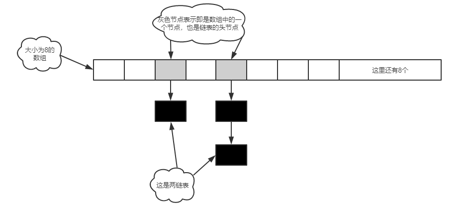

### JDK7 中 HashMap


在JDK 7 中，HashMap由数组 + 链表实现，原理图如下：



```java
HashMap map = new HashMap(); // 伪初始化
map.put("键"，"值"); // 真初始化
```

HashMap的构造方法在执行时会初始化一个数组table，大小为0。

HashMap的PUT方法在执行时首先会判断table的大小是否为0，如果为0则会进行真初始化，也叫做延迟初始化。

当进行真初始化时，数组的默认大小为16，当然也可以调用HASHMAP的有参构造方法由你来指定一个数组的初始化容量，但是注意，并不是你真正说了算，比如你现在想让数组的初始化容量为6，那么HASHMAP会生成一个大小为8的数组，如果你想数组的初始化容量为20，那么HASHMAP会生成一个大小为32的数组，也就是你想初始化一个大小为n的数组，但是HASHMAP会初始化一个大小**大于等于n的二次方数**的一个数组。至于为什么要这样，我们等会再说。


对于PUT方法，当无需对table进行初始化或已经初始化完了之后，它接下来的主要任务是将key和value存到数组或链表中。**那么怎么将一个keyvalue给存到数组中去呢？**

我们知道，如果我们想往数组中存入数据，我们首先得有一个数组下标，而我们在进行PUT的时候并不需要再传一个参数来作为数组的下标，那么HASHMAP中下标是怎么获取来的呢？答案为哈希算法，这也是为什么叫HASHMAP而不叫其他MAP。


对于哈希算法，了解过的人应该都知道它需要一个哈希函数，这个函数接收一个参数返回一个HashCode，哈希函数的特点是对于相同的参数那么返回的HashCode肯定是相同的，对于不相同的参数，函数会尽可能的去返回不相同的HashCode，所以换一个角度理解，对于哈希函数，给不相同的参数可能会返回相同的HashCode，这个就叫哈希冲突或哈希碰撞。


那么我们能直接把这个HashCode来作为数组下标吗，另外一个很重要的问题是**我们到底应该对****key****做哈希运算还是对****value****做哈希运算，还是对****keyvalue****同时做哈希运算？**


那么这个时候我们就要考虑到GET方法了，因为GET只需要传入一个key作为参数，而实际上GET方法的逻辑就是通过把key进行哈希运算快速的得到数组下标，从而快速的找到key所对应的value。**所以对于PUT方法虽然传入了两个参数，但是只能对key进行哈希运算得到数组下标，这样才能方便GET方法快速查找。**


**但是还有一个问题就是，HashCode它能直接作为数组下标吗？**

HashCode它通常是一个比较大的数字，比如：

```
System.out.println("键".hashCode()); // 38190
// 为什么是这个结果，大家自行去看String类中的hashCode方法
```

所以我们不可能把这么大的一个数字作为数组下标，那怎么办？

大家可能通常会想到取模运算，但是HashMap没有用取模，而是：

```
static int indexFor(int h, int length) {
    // assert Integer.bitCount(length) == 1 : "length must be a non-zero power of 2";
    return h & (length-1);
}
```

这个方法就是JDK1.7HashMap中PUT和GET方法中获取数组下标的方法（PUT和GET两个方法都要去获取下标？是的，如果你看到这里看不懂了，那么你再去想想上面的讲的提高GET方法效率的逻辑吧），这个方法中h代表hashcode，length代表数组长度。我们发现它是用的**逻辑与**操作，那么问题就来了，逻辑与操作能准确的算出来一个数组下标？我们来算算，假设hashcode是01010101(二进制表示)，length为00010000(16的二进制表示)，那么h & (length-1)则为：

```
h:  0101 0101
15: 0000 1111
  &
    0000 0101
```

对于上面这个运行结果的取值方法我们来讨论一下：因为15的高四位都是0，低四位都是1，而与操作的逻辑是两个运算位都为1结果才为1，所以对于上面这个运算结果的高四位肯定都是0，而低四位和h的低四位是一样的，所以结果的取值范围就是h的低四位的一个取值范围：0000-1111，也就是0至15，所以这个结果是符合数组下标的取值范围的。

那么假设length为17呢？那么h & (length-1)则为：

```
h:  0101 0101
16: 0001 0000
  &
    0001 0000
```

当length为17时，上面的运算的结果取值范围只有两个值，要么是0000 0000，要么是0001 000，这是不太好的。


所以我们发现，如果我们想把HashCode转换为覆盖数组下标取值范围的下标，跟我们的length是非常相关的，length如果是16，那么减一之后就是15(0000 1111)，正是这种高位都为0，低位都为1的二级制数才保证了可以对任意一个hashcode经过逻辑与操作后得到的结果是我们想要的数组下标。**这就是为什么在真初始化HashMap的时候，对于数组的长度一定要是二次方数，二次方数和算数组下标是息息相关的，而这种位运算是要比取模更快的。**

**
**

所以到此我们可以理一下：在调用PUT方法时，会对传入的key进行哈希运算得到一个hashcode，然后再通过逻辑与操作得到一个数组下标，最后将keyvalue存在这个数组下标处。


确定了keyvalue该存的位置之后，上文说过，对于不同的参数可能会得到相同的HashCode，也就是会发生哈希冲突，反应到HashMap中就是，当PUT两个不同的key时可能会得到相同的HashCode从而得到相同的数组下标，其实在HashMap中就算key所对应的HashCode不一样，那么也有可能在经过逻辑与操作之后得到相同的数组下标，那么这时HashMap是如何处理的呢？对，是链表，具体是怎么实现的呢？下篇文章继续吧。

