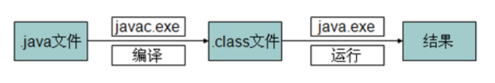

#### 1、开发环境搭建

- JDK
  
  只是一个开发工具包

- IDE
  
  IDE（Integrated Development Environments，集成开发环境），IDE的开发工具将程序的编辑、编译、调试、执行等功能集成在一个开发环境中。Java开发IDE工具有很多，其中主要有：Eclipse、IntelliJ IDEA和NetBeans等。 

- JVM
  
  java虚拟机，java字节码文件运行的平台，实现了Java跨平台的特性。

- 环境搭建
  
  ①下载并安装JDk  
  
  ②配置环境变量：我的电脑-右键 ---> 属性 ---> 高级系统设置 ---> 高级-环境变量 ---> Path，设置JAVA_HOME变量为JDK安装路径，在Path添加%JAVA_HOME%\bin。
  
  ③测试：终端中使用javac -version命令查看JDK版本号

#### 2、Hello World

- 编译执行过程
  
  
  
  .java       java源程序
  
  .class      java类文件（字节码文件、java可执行程序）
  
  javac       编译命令，后跟*.java（要后缀，因为该命令还可以-version查看JDK版本号等）
  
  java         运行java程序，后跟class文件名（不要后缀，因为该命令只能运行.class文件）
  
  规范：
  
  每个java程序至少有一个类；
  
  类名首字母大写；
  
  公共类名必须与java文件名相同；
  
  一个. java文件中定义多个类：
  
  (1) public权限类只能有一个（也可以一个都没有，但最多只有一个）；
  
  (2)这个. java文件名只能是 public权限的类的类名；
  
  (3)倘若这个文件中没有 public类，则它的. java文件的名字是随便的一个类名；
  
  (4)当用 javac命令生成编译这个. java文件的时候，则会针对每一个类生成一个. class文件。

- 注释
  
  //               行注释
  
  /*         */   块注释
  
  /**      */   文档注释（说明注释）
  
  
