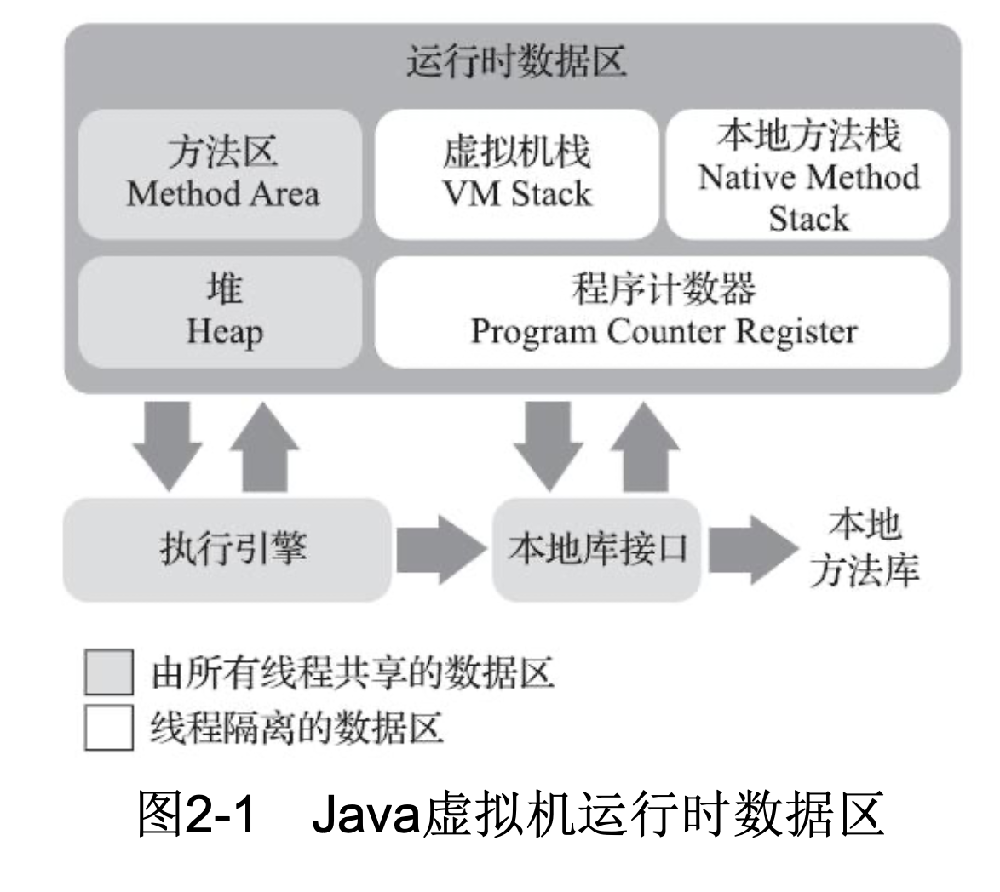
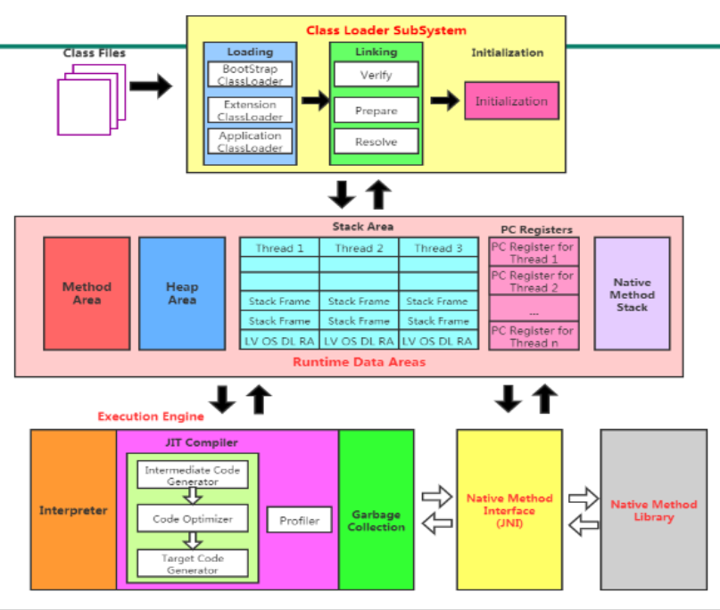

## 一、Java内存区域与内存溢出异常

相对于 C 、C++ 需要开发人员去进行内存管理，Java 语言中虚拟机自动内存管理的机制，不容易出现内存泄漏和内存溢出问题。但一旦出现，如果不了解虚拟机是怎样使用内存的，那排查错误、修正问题就会变得异常艰难。

运行时数据区域 

#### 程序计数器（Program Counter Register）

当前线程所执行的字节码的行号指示器。即指向下一条需要执行的字节码指令。

Java虚拟机的多线程是通过线程轮流切换、分配处理器执行时间来实现的。在任何一个确定的时刻，一个处理器（对于多核处理器来说是一个内核）都只会处理一条线程中的指令。为了线程切换后能恢复到正确的执行位置，每条线程都需要一个独立的程序计数器，各线程的程序计数器互不影响，独立存储。我们称这类内存区域为“线程私有”的内存。

如果线程执行的是一个 Java 方法，程序计数器记录的是正在执行的虚拟机字节码指令的地址；如果正在执行的是本地（Native）方法，程序计数器的值为空（Undefined）。此内存区域是唯一一个在《Java虚拟机规范》中没有规定任何OutOfMeMoryError情况的区域。

#### Java虚拟机栈（Java Virtual Machine Stack）

与程序计数器一样，Java 虚拟机栈也是线程私有的，它的生命周期与线程相同。

虚拟机栈描述的是 Java 方法执行的线程内存模型：每个方法被执行的时候，Java 虚拟机都会同步创建一个栈帧（Stack Frame）。用于存储局部变量表、操作数栈、动态连接、方法出口等信息。每个方法被调用直至执行完毕的过程，就对应着一个栈帧在虚拟机栈中从入栈到出栈的过程。

经常有人把 Java 内存区域笼统地划分为堆内存（Heap）和栈内存（Stack），但在 Java 语言里实际的内存区域划分要比这复杂得多。其中所说的栈内存通常就是指这里讲的虚拟机栈，或者更多的情况下只是指虚拟机栈中局部变量表部分。

**局部变量表**：存放了编译期可知的各种 Java 虚拟机基本数据类型（boolean、byte、char、shot、int、float、long、double）、对象引用（reference 类型，指向对象起始地址的引用指针或者代表对象的句柄等）和 returnAddress 类型（指向一条字节码指令的地址）。这些数据类型在局部变量表中的存储空间以**局部变量槽（Slot）**表示，其中 64 位长度的 long 和 double 类型的数据会占用两个变量槽，其余的数据类型占用一个。

异常情况：线程请求的栈深度大于虚拟机所允许的深度，将抛出 StackOverflowError 异常；如果 Java 虚拟机栈容量可以动态扩展，当栈扩展时无法申请到足够的内存会抛出 OutOfMemoryError 异常。HotSpot 虚拟机的栈容量是不可以动态扩展的，以前的 Classic 虚拟机可以。所有对于 HotSpot 虚拟机，只要申请栈空间成功了就不会有OOM，但是如果申请时就失败，仍然是会出现OOM异常的。

#### 本地方法栈（Native Method Stacks）

本地方法栈与虚拟机栈所发挥的作用是非常相似的，其区别只是虚拟机栈为虚拟机执行 Java 方法（字节码）服务，而本地方法栈则是为虚拟机使用到的本地方法服务。

对于 HotSpot 虚拟机，直接把本地方法栈和虚拟机栈合二为一了。

#### Java堆

Java 堆是虚拟机所管理的内存中最大的一块。它是被所有线程共享的一块内存区域，在虚拟机启动时创建。唯一目的就是存放对象实例，Java 中几乎所有对象实例都在这里分配内存。

Java 堆是垃圾收集器管理的内存区域，因此也被称作“GC堆”（Garbage Collected Heap）。

#### 方法区（Method Area）

方法区同样是线程共享的内存区域，它用于存储已被虚拟机加载的类型信息、常量、静态变量、即时编译器编译后的代码缓存等数据。

##### 运行时常量池（Runtime Constant Pool）

运行时常量池是方法区的一部分。

Class 文件中除了有类的版本、字段、方法、接口等描述信息外，还有一项信息是常量池表（Constant Pool Table），用于存放编译期生成的各种字面量于符号引用，这部分内容将在类加载后存放到方法区的运行时常量池中。

#### 直接内存（Direct Memory）

直接内存并不是虚拟机运行时数据区的一部分，也不是《Java 虚拟机规范》中定义的内存区域。但这部分内存也被频繁地使用，而且也可能导致 OutOfMemoryError 异常。

JDK 1.4 中新加入的 NIO （New Input/Output）类，引入了一种基于通道（Channel）与缓冲区（Buffer）的I/O方式，它可以使用 Native 函数库直接分配堆外内存，然后通过一个存储在 Java 堆里面的 DirectByteBuffer 对象作为这块内存的引用进行操作。这样能在一些场景中显著提高性能，因为避免了在 Java和 Native 堆中来回复制数据。

## 二、对象的创建

字节码文件是二进制的，可以用Binary Viewer软件来查看，开头都为CA FE BA BE。

当 Java 虚拟机遇到一条字节码 new 指令时，首先将去检查这个指令的参数是否能在常量池中定位到一个类的符号引用，并且检查这个符号引用代表的类是否已经被加载、解析和初始化过。如果没有，那必须先执行相应的类加载过程。

