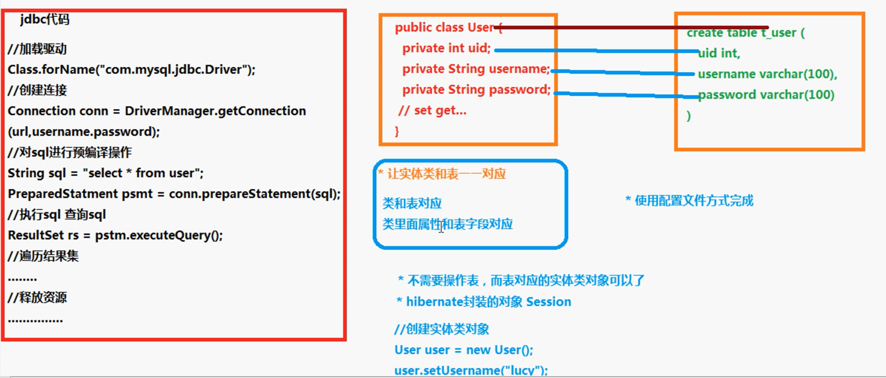

## 一、概述

- J2EE三层结构 
  1、web层（视图层）：struts2框架、spring MVC 
  2、service层（业务逻辑层）：spring框架 
  3、dao层：hibernate框架
  （1）对数据库进行CRUD操作

- MVC思想 
  M：模型 
  V：视图 
  C：控制器  

Hibernate是一个开源的对象关系映射（ORM）框架，应用在J2EE三层结构中的dao层。它对JDBC进行了轻量级的对象封装，将POJO与数据库表建立映射关系，是一个全自动的对象关系映射框架，可以自动生成SQL语句，自动执行。

- ORM（Object Relational Mapping）：对象关系映射 
  （1）让实体类（javabean）和数据库表进行一一对应关系 
  实体类和数据库表对应，实体类中属性和表中的字段对应。 
  （2）不需要直接操作数据库表，而直接操作表对应的实体类对象 
  

## 二、实现

1、导入jar包
（1）hibernate中required目录和jpa目录下jar包 
（2）jdbc驱动jar包 
（3）日志jar包  

## 对象关系映射

ORM（Object Relational Mapping）：对象关系映射
让实体类（javabean）和数据库表进行一一对应关系。
让实体类首先和数据库表对应
让实体类属性和表中的字段对应
不需要直接操作数据库表，而直接操作表对应的实体类对象。

