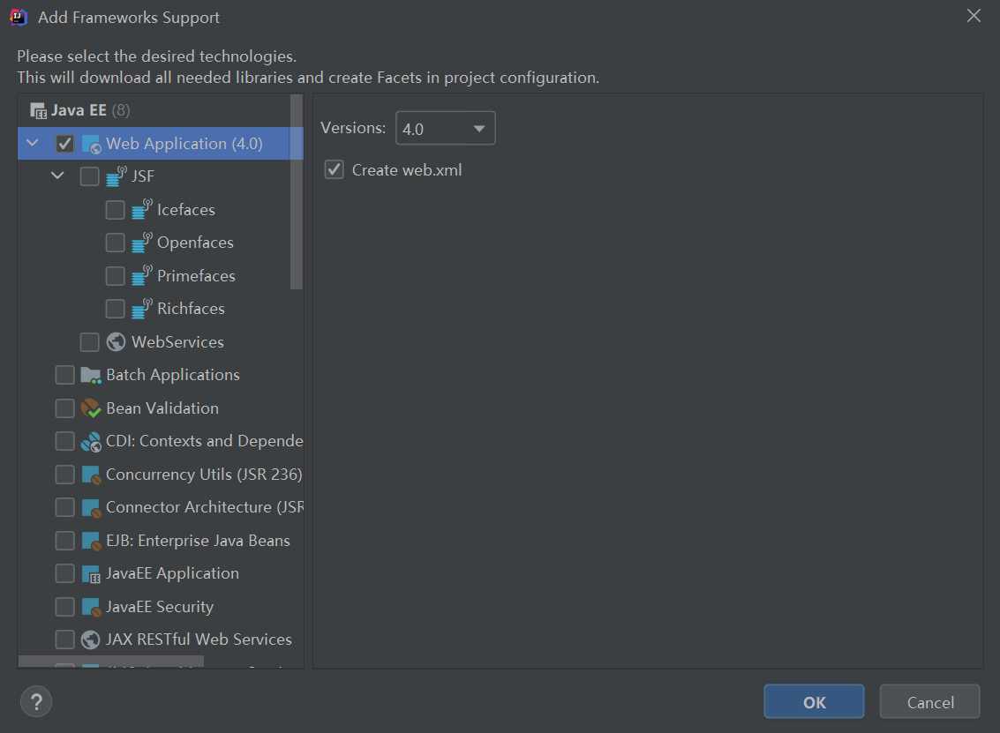
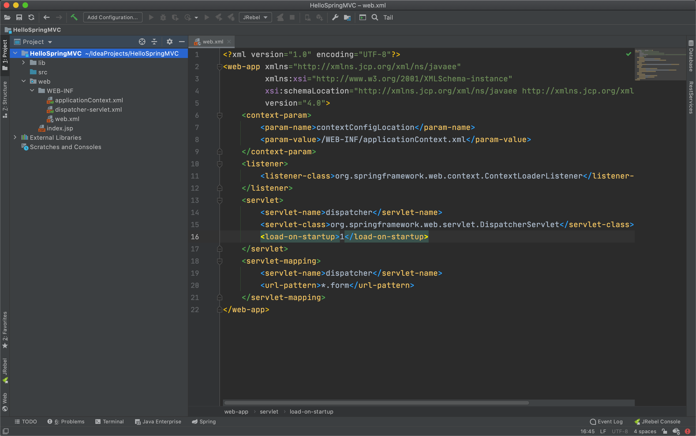

## 一、概述

#### Spring MVC


#### MVC


## 二、简单实现

#### IDEA 下 Hello Spring MVC

1. 在 IDEA 中新建项目并导入依赖

2. 

   新建普通 Java 项目，再选中项目右键选择 Add Framework Support...  添加 Spring MVC 支持则会自动下载相关依赖 Jar 包

   

   如果用**Maven**的，那导入**Maven**依赖即可 前**6**个是**Spring**的核心功能包【**IOC**】，第**7**个是关于**web**的包，第**8**个是**SpringMVC**包

   commons-logging-1.1.3.jar
   spring-aop-4.0.0.RELEASE.jar
   spring-beans-4.0.0.RELEASE.jar
   spring-context-4.0.0.RELEASE.jar
   spring-core-4.0.0.RELEASE.jar
   spring-expression-4.0.0.RELEASE.jar 
   spring-web-4.0.0.RELEASE.jar
   spring-webmvc-4.0.0.RELEASE.jar

3. 在 web.xml 中配置 DispatcherServlet

   ```xml
   <?xml version="1.0" encoding="UTF-8"?>
   <web-app xmlns="http://xmlns.jcp.org/xml/ns/javaee"
            xmlns:xsi="http://www.w3.org/2001/XMLSchema-instance"
            xsi:schemaLocation="http://xmlns.jcp.org/xml/ns/javaee http://xmlns.jcp.org/xml/ns/javaee/web-app_4_0.xsd"
            version="4.0">
   
       <!--  配置 DispatcherServlet  -->
       <servlet>
           <servlet-name>dispatcher</servlet-name>
           <servlet-class>org.springframework.web.servlet.DispatcherServlet</servlet-class>
           <!--   配置初始化参数：配置 SpringMVC 配置文件的位置和名称  -->
           <init-param>
               <param-name>contextConfigLocation</param-name>
               <param-value>classpath:springmvc.xml</param-value>
           </init-param>
           <!--  Servlet 在应用被加载时就创建，而不是等第一次请求时创建  -->
           <load-on-startup>1</load-on-startup>
       </servlet>
       <servlet-mapping>
           <servlet-name>dispatcher</servlet-name>
           <!--  设置可以处理的请求   -->
           <url-pattern>/</url-pattern>
       </servlet-mapping>
   
   </web-app>
   ```

4. 在 springmvc.xml 中配置控制器和视图解析器

   ```xml
   <?xml version="1.0" encoding="UTF-8"?>
   <beans xmlns="http://www.springframework.org/schema/beans"
          xmlns:xsi="http://www.w3.org/2001/XMLSchema-instance"
          xsi:schemaLocation="http://www.springframework.org/schema/beans http://www.springframework.org/schema/beans/spring-beans.xsd http://www.springframework.org/schema/context https://www.springframework.org/schema/context/spring-context.xsd http://www.springframework.org/schema/mvc https://www.springframework.org/schema/mvc/spring-mvc.xsd">
   
       <!--  配置自动扫描的包  -->
       <!--    <context:component-scan base-package="com.yunzike.controller"/>-->
   
       <!--  配置视图解析器：把 controller 中方法返回值解析为实际的物理视图  -->
       <!--    <bean class="org.springframework.web.servlet.view.InternalResourceViewResolver">-->
       <!--        <property name="prefix" value="/WEB-INF/views/"></property>-->
       <!--        <property name="suffix" value=".jsp"></property>-->
       <!--    </bean>-->
   
       <!--    <bean id="helloController" class="com.yunzke.controller.HelloController"></bean>-->
       <!--    <bean id="simpleUrlHandlerMapping" class="org.springframework.web.servlet.handler.SimpleUrlHandlerMapping">-->
       <!--        <property name="mappings">-->
       <!--            <props>-->
       <!--                &lt;!&ndash; /hello 路径的请求交给 id 为 helloController 的控制器处理&ndash;&gt;-->
       <!--                <prop key="/hello">helloController</prop>-->
       <!--            </props>-->
       <!--        </property>-->
       <!--    </bean>-->
   
   
       <!--
       注册控制器
       name属性的值表示的是请求的路径【也就是说，当用户请求到/helloAction时，就交由 HelloAction类进行处理】
       -->
       <bean class="com.yunzke.controller.HelloController" name="/hello"></bean>
   
   
   </beans>
   ```

5. 编写 controller 类

   ```java
   package com.yunzke.controller;
   
   import org.springframework.web.servlet.ModelAndView;
   import org.springframework.web.servlet.mvc.Controller;
   
   /**
    * @author xiongxq
    * @Description HelloSpring
    * @date 2020/10/19 2:55 上午
    * version: 1.0
    */
   public class HelloController implements Controller {
   
       @Override
       public ModelAndView handleRequest(javax.servlet.http.HttpServletRequest httpServletRequest, javax.servlet.http.HttpServletResponse httpServletResponse) throws Exception {
           System.out.println("aaaaa");
           ModelAndView mav = new ModelAndView("/index.jsp");
           mav.addObject("message", "Hello Spring MVC");
   
           return mav;
       }
   }
   ```

#### Spring MVC 原理


## 三、使用@RequestMapping映射请求


## 四、映射请求参数&请求头


## 五、处理模型数据


## 六、RESTful CRUD


## 七、视图和视图解析器


## 八、SpringMVC表单标签&处理静态资源


## 九、数据转换&数据格式化&数据校验


## 十、处理JSON：使用HttpMessageConverter


