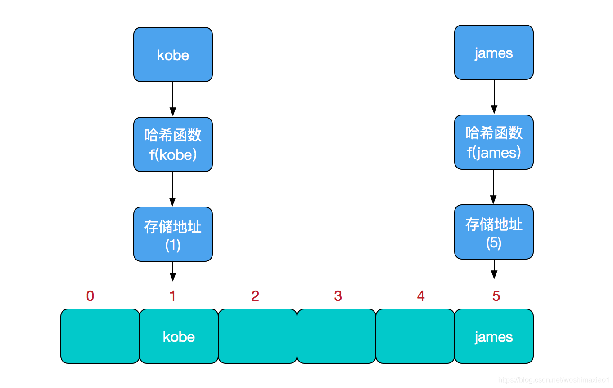
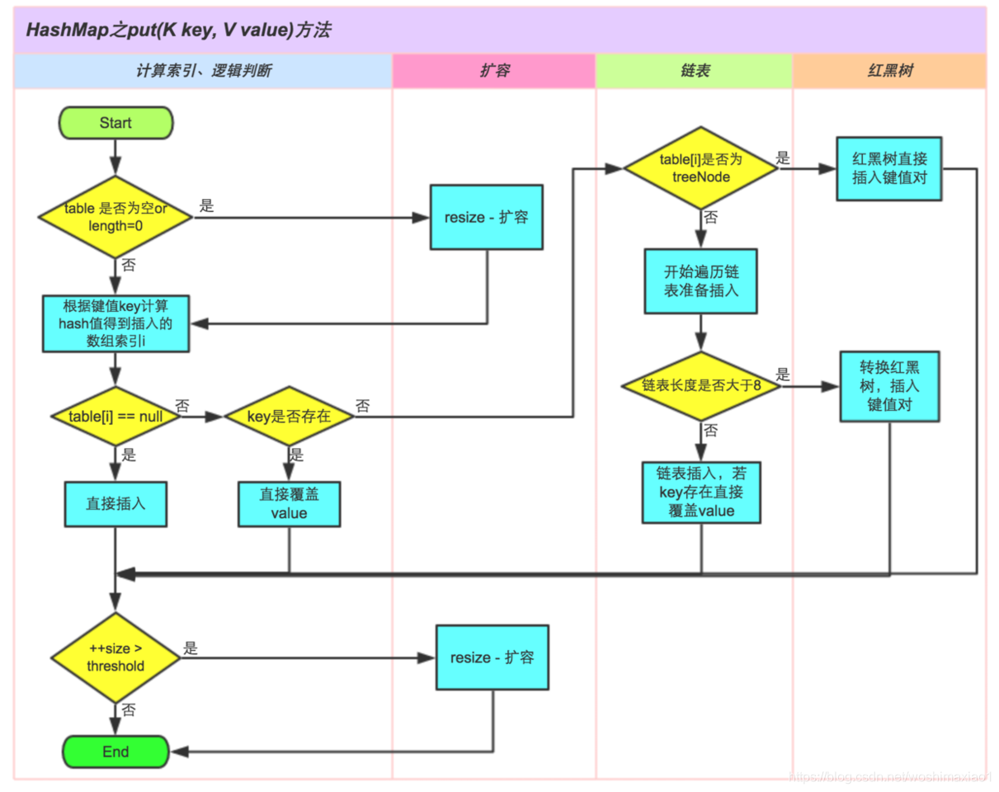

### 一、什么是哈希表

哈希表：即 hash table（注意不是HashTable，HashTable 和 HashMap 这两种 Java 容器底层都用到了 hash table），也叫散列表，是一种非常重要的数据结构。

先对比其他数据结构在新增、查找等基础操作执行的性能。

- 数组

  采用一段连续的存储单元来存储数据。对于指定下标元素的查找，时间复杂度为 O（1）；通过给定值进行查找，需要遍历数组，时间复杂度为 O（n），当然，对于有序数组，则可以采用二分查找、插值查找、斐波那契查找等方式，可将查找复杂度提高为 O（logn）；对于一般的插入、删除操作，涉及数组元素的移动，其平均复杂度也为 O（n）

- 线性链表

  对于链表的新增、删除等操作（在找到指定位置后），仅需处理节点间的引用即可，时间复杂度为 O（1），而查找同样需要遍历比对，时间复杂度为 O（n）

- 二叉树

  对于一颗相对平衡的有序二叉树，对其进行插入、查找、删除等操作，平均时间复杂度均为 O（logn）

- 哈希表

  相比于上述几种数据结构，在哈希表中进行添加、删除、查找等操作，性能十分之高，不考虑哈希冲突的情况下，仅需一次定位即可完成，时间复杂度为 O（1）

那哈希表是怎么实现的呢？**数据结构的物理存储结构其实只有两种：顺序存储结构和链式存储结构。**

**哈希表的主干就是数组。通过把元素的关键字，通过某个函数映射到数组中的某个位置，这个函数可以简单描述为：存储位置 = f（关键字），函数 f 一般称为哈希函数**，这个函数的设计好坏会直接影响到哈希表的优劣。
 

### 二、哈希冲突

如果**两个不同的元素，通过哈希函数计算得出的实际存储地址相同**怎么办？这就是所谓的**哈希冲突**，也叫**哈希碰撞**。

因此，哈希函数的设计至关重要，好的哈希函数会尽可能的保证计算简单和散列地址分布均匀，但是数组是一块连续的固定长度的内存空间，再好的哈希函数也不能保证得到的存储地址绝对不会发生冲突。

那么哈希冲突怎么解决呢？
解决方法有很多：开发定址法（发生冲突，继续寻找下一块未被占用的存储地址），再散列函数法、链地址法。而 HashMap 即是采用了**链地址法**，也就是**数组+链表**的方式。

### 三、HashMap 原理分析

#### 1、HashMap 的结构


#### 2、HashMap 的几个重要字段


#### 3、HashMap 的初始化


#### 4、put 方法的过程


#### 5、扩容


#### 6、remove 过程


#### 7、重写 equals 方法需要同时重写 hashCode 方法


#### 8、为何 HashMap 的数组长度一定是 2 的次幂？


#### JDK7 中 HashMap

在JDK 7 中，HashMap由数组 + 链表实现，原理图如下：


```java
HashMap map = new HashMap(); // 伪初始化
map.put("键"，"值"); // 真初始化
```

HashMap的构造方法在执行时会初始化一个数组table，大小为0。

HashMap的PUT方法在执行时首先会判断table的大小是否为0，如果为0则会进行真初始化，也叫做延迟初始化。

当进行真初始化时，数组的默认大小为16，当然也可以调用HASHMAP的有参构造方法由你来指定一个数组的初始化容量，但是注意，并不是你真正说了算，比如你现在想让数组的初始化容量为6，那么HASHMAP会生成一个大小为8的数组，如果你想数组的初始化容量为20，那么HASHMAP会生成一个大小为32的数组，也就是你想初始化一个大小为n的数组，但是HASHMAP会初始化一个大小**大于等于n的二次方数**的一个数组。至于为什么要这样，我们等会再说。

对于PUT方法，当无需对table进行初始化或已经初始化完了之后，它接下来的主要任务是将key和value存到数组或链表中。**那么怎么将一个keyvalue给存到数组中去呢？**

我们知道，如果我们想往数组中存入数据，我们首先得有一个数组下标，而我们在进行PUT的时候并不需要再传一个参数来作为数组的下标，那么HASHMAP中下标是怎么获取来的呢？答案为哈希算法，这也是为什么叫HASHMAP而不叫其他MAP。


对于哈希算法，了解过的人应该都知道它需要一个哈希函数，这个函数接收一个参数返回一个HashCode，哈希函数的特点是对于相同的参数那么返回的HashCode肯定是相同的，对于不相同的参数，函数会尽可能的去返回不相同的HashCode，所以换一个角度理解，对于哈希函数，给不相同的参数可能会返回相同的HashCode，这个就叫哈希冲突或哈希碰撞。


那么我们能直接把这个HashCode来作为数组下标吗，另外一个很重要的问题是**我们到底应该对****key****做哈希运算还是对****value****做哈希运算，还是对****keyvalue****同时做哈希运算？**


那么这个时候我们就要考虑到GET方法了，因为GET只需要传入一个key作为参数，而实际上GET方法的逻辑就是通过把key进行哈希运算快速的得到数组下标，从而快速的找到key所对应的value。**所以对于PUT方法虽然传入了两个参数，但是只能对key进行哈希运算得到数组下标，这样才能方便GET方法快速查找。**


**但是还有一个问题就是，HashCode它能直接作为数组下标吗？**

HashCode它通常是一个比较大的数字，比如：

```
System.out.println("键".hashCode()); // 38190
// 为什么是这个结果，大家自行去看String类中的hashCode方法
```

所以我们不可能把这么大的一个数字作为数组下标，那怎么办？

大家可能通常会想到取模运算，但是HashMap没有用取模，而是：

```
static int indexFor(int h, int length) {
    // assert Integer.bitCount(length) == 1 : "length must be a non-zero power of 2";
    return h & (length-1);
}
```

这个方法就是JDK1.7HashMap中PUT和GET方法中获取数组下标的方法（PUT和GET两个方法都要去获取下标？是的，如果你看到这里看不懂了，那么你再去想想上面的讲的提高GET方法效率的逻辑吧），这个方法中h代表hashcode，length代表数组长度。我们发现它是用的**逻辑与**操作，那么问题就来了，逻辑与操作能准确的算出来一个数组下标？我们来算算，假设hashcode是01010101(二进制表示)，length为00010000(16的二进制表示)，那么h & (length-1)则为：

```
h:  0101 0101
15: 0000 1111
  &
    0000 0101
```

对于上面这个运行结果的取值方法我们来讨论一下：因为15的高四位都是0，低四位都是1，而与操作的逻辑是两个运算位都为1结果才为1，所以对于上面这个运算结果的高四位肯定都是0，而低四位和h的低四位是一样的，所以结果的取值范围就是h的低四位的一个取值范围：0000-1111，也就是0至15，所以这个结果是符合数组下标的取值范围的。

那么假设length为17呢？那么h & (length-1)则为：

```
h:  0101 0101
16: 0001 0000
  &
    0001 0000
```

当length为17时，上面的运算的结果取值范围只有两个值，要么是0000 0000，要么是0001 000，这是不太好的。


所以我们发现，如果我们想把HashCode转换为覆盖数组下标取值范围的下标，跟我们的length是非常相关的，length如果是16，那么减一之后就是15(0000 1111)，正是这种高位都为0，低位都为1的二级制数才保证了可以对任意一个hashcode经过逻辑与操作后得到的结果是我们想要的数组下标。**这就是为什么在真初始化HashMap的时候，对于数组的长度一定要是二次方数，二次方数和算数组下标是息息相关的，而这种位运算是要比取模更快的。**

**
**

所以到此我们可以理一下：在调用PUT方法时，会对传入的key进行哈希运算得到一个hashcode，然后再通过逻辑与操作得到一个数组下标，最后将keyvalue存在这个数组下标处。


确定了keyvalue该存的位置之后，上文说过，对于不同的参数可能会得到相同的HashCode，也就是会发生哈希冲突，反应到HashMap中就是，当PUT两个不同的key时可能会得到相同的HashCode从而得到相同的数组下标，其实在HashMap中就算key所对应的HashCode不一样，那么也有可能在经过逻辑与操作之后得到相同的数组下标，那么这时HashMap是如何处理的呢？对，是链表，具体是怎么实现的呢？下篇文章继续吧。

#### JDK 1.8 原理

Map在Java里边是一个接口，常见的实现类有HashMap、LinkedHashMap、TreeMap和ConcurrentHashMap

在Java里边，哈希表的实现由数组+链表所组成
HashMap底层数据结构是数组+链表/红黑树
LinkedHashMap底层数据结构是数组+链表+双向链表

TreeMap底层数据结构是红黑树
而ConcurrentHashMap底层数据结构也是数组+链表/红黑树

#### 当你new-个HashMap的时候， 会发生什么吗?

HashMap有几个构造方法，但最主要的就是指定初始值以及负载因子的大小。

如果我们不指定，默认HashMap的大小为16，负载因子的大小为0.75

还有就是: HashMap的大小只能是2次幂的，假设你传一个10进去， 实际上最终HashMap的大小是16，你传一个 7进去，HashMap最终的大小是8，具体的实现在tableSizeFor可以看到。

我们把元素放进HashMap的时候，需要算出这个元素所在的位置(hash)

在HashMap里用的是位运算来代替取模，能够更加高效地算出该元素所在的位置

为什么HashMap的大小只能是2次幂，因为只有大小为2次幂时，才能合理用位运算替代取模。

而负载因子的大小决定着哈希表的扩容和哈希冲突。

比如现在我默认的HashMap大小为16,负载因子为0.75，这意味着数组最多只能放12个元素，一旦超过12个元素，则哈希表需要扩容

怎么算出是12呢?很简单，就是16*0.75。每次put元素进去的时候，都会检查HashMap的大小有没有超过这个阈值，如果有，则需要扩容。

鉴于上面的说法(HashMap的大小只能是2次幂)所以扩容的时候时候默认是，扩原来的2倍

还有就是扩容这个操作肯定是耗时的，那能不能把负载因子调高一点，比如我要调至为1，那我的HashMap就等到16个元素的时候才扩容呢。

当然是可以的，但是不推荐。负载因子调高了，这意味着哈希冲突的概率会增高，哈希冲突概率增高，同样会耗时(因为查找的速度变慢了)

算了。我还想继续问下，在put元素的时候，传递的Key是怎么算哈希值的?

实现就在hash方法上，可以发现的是，它是先算出正常的哈希值，然后与高16位做异或运算，产生最终的哈希值。这样做的好处可以增加了随机性，减少了碰撞冲突的可能性。



你简单再说下put和get方法的实现吧
在put的时候，首先对key做hash运算，计算出该key所在的index。
如果没碰撞，直接放到数组中，如果碰撞了，需要判断目前数据结构是链表还是红黑树，根据不同的情况来进行插入。
假设key是相同的，则替换到原来的值。最后判断哈希表是否满了(当前哈希表大小*负载因子)，如果满了，则扩容
在get的时候，还是对key做hash运算，计算出该key所在的index,然后判断是否有hash冲突
假设没有冲突直接返回，假设有冲突则判断当前数据结构是链表还是红黑树，分别从不同的数据结构中取出。

那在HashMap中是怎么判断- -个元素是否相同的呢?

首先会比较hash值，随后会用==运算符和equals()来判断该元素是否相同。说白了就是:如果只有hash值相同，那说明该元素哈希冲突了，如果hash值和equals() II ==都相同，那说明该元素是同
一个。

你说HashMap的数据结构是数组+链表/红黑树，那什么情况拿下才会用到红黑树呢?
当数组的大小大于64且链表的大小大于8的时候才会将链表改为红黑树，当红黑树大小为6时，会退化为链表。
这里转红黑树退化为链表的操作主要出于查询和插入时对性能的考量。
链表查询时间复杂度O(N),插入时间复杂度0(1)，红黑树查询和插入时间复杂度O(logN)

你在日常开始中LinkedHashMap用的多吗?
不多，在前面也提到了，LinkedHashMap底层结构是数组+链表+双向链表，实际上它继承了HashMap,在HashMap的基础上维护了一个双向链表。
有了这个双向链表，我们的插入可以是有序的，这里的有序不是指大小有序，而是插入有序
LinkedHashMap在遍历的时候实际用的是双向链表来遍历的，所以LinkedHashMap的大小不会影响到遍历的性能。

那TreeMap呢

TreeMap在现实开发中用得也不多，TreeMap的底层数据结构是红黑树P
TreeMap的key不能为null (如果为null,那还怎么排序呢)
TreeMap有序是通过Comparator来进行比较的，如果comparator为null,那么就使用自然顺序,

再来讲讲线程安全的Map吧? HashMap是线程安全的吗?
HashMap不是线程安全的，在多线程环境下，HashMap有可能会有数据丢失和获取不了最新数据的问题，比如说:线程A put进去了，线程B get不出来。
我们想要线程安全，一 般使用ConcurrentHashMap
ConcurrentHashMap是线程安全的Map实现类，它在juc包下的。
线程安全的Map实现类除了ConcurrentHashMap还有一个叫做Hashtable。
当然了，也可以使用Collections来 包装出一个线程 安全的Map。
但无论是Hashtable还是Collections包装出来的都比较低效(因为是直接在外层套synchronize)，
所以我们一般有线程安全问题考量的，都使用ConcurrentHashMap
ConcurrentHashMap的底层数据结构是数组+链表/红黑树，它能支持高并发的访问和更新，是线程安全的。
ConcurrentHashMap通过在部分加锁和利用CAS算法来实现同步，在get的时候没有加锁，Node都用了volatile给修饰。
在扩容时，会给每个线程分配对应的区间，并且为了防止putVal导致数据不一致，会给线程的所负责的区间加锁

你可以给我讲讲JDK 7和JDK8中HashMap和ConcurrentHashMap的区别吗？

我在学习的时候也看过JDK7的HashMap和ConcurrentHashMap,其实还是有很多不一样的地方
比如JDK 7的HashMap在扩容时是头插法，在JDK8就变成了尾插法，在JDK7的HashMap还没有引入红黑树.....
ConcurrentHashMap在JDK7还是使用分段锁的方式来实现，而JDK 8就又不一样了。但JDK 7细节我大多数都忘了。
我就没用过JDK 7的API,我想着现在最低应该也是用JDK8了吧?所以我就没去仔细看了。

### 四、HashMap 的特性

1. HashMap 的存取是没有顺序的。
2. KV 均允许为 NULL。
3. 多线程情况下该类不安全，可以考虑用 HashTable。
4. JDk8底层是数组 + 链表 + 红黑树，JDK7底层是数组 + 链表。
5. 初始容量和装载因子是决定整个类性能的关键点，轻易不要动。
6. HashMap是**懒汉式**创建的，只有在你put数据时候才会 build。
7. 单向链表转换为红黑树的时候会先变化为**双向链表**最终转换为**红黑树**，切记双向链表跟红黑树是`共存`的。
8. 对于传入的两个`key`，会强制性的判别出个高低，目的是为了决定向左还是向右放置数据。
9. 链表转红黑树后会努力将红黑树的`root`节点和链表的头节点 跟`table[i]`节点融合成一个。
10. 在删除的时候是先判断删除节点红黑树个数是否需要转链表，不转链表就跟`RBT`类似，找个合适的节点来填充已删除的节点。
11. 红黑树的`root`节点`不一定`跟`table[i]`也就是链表的头节点是同一个，三者同步是靠`MoveRootToFront`实现的。而`HashIterator.remove()`会在调用`removeNode`的时候`movable=false`。

### 五、常见HashMap考点

1. HashMap原理，内部数据结构。
2. HashMap中的put、get、remove大致过程。
3. HashMap中 hash函数实现。
4. HashMap如何扩容。
5. HashMap几个重要参数为什么这样设定。
6. HashMap为什么线程不安全，如何替换。
7. HashMap在JDK7跟JDK8中的区别。
8. HashMap中链表跟红黑树切换思路。
9. JDK7中 HashMap 环产生原理。

### 六、ConcurrentHashMap

ConcurrentHashMap 是多线程模式下常用的并发容器，它的实现在**JDK7**跟**JDK8**区别挺大的。


