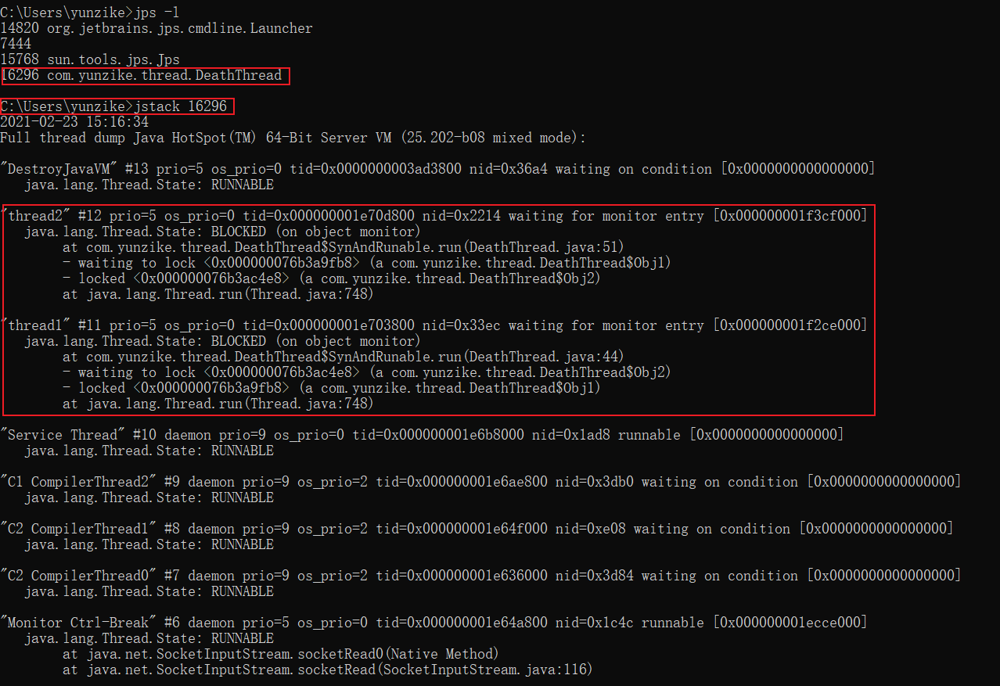

##  必须知道的几个概念

### 同步（Synchronous）和异步（Asyncronous）

同步和异步通常用来形容一次方法调用，同步方法调用一旦开始，调用者必须等到调用的方法返回后，才能继续后续的行为。而异步方法调用更像一个消息传递，一旦开始，方法调用就会立即返回，调用者就可以继续执行后续的操作。而异步方法通常会在另一个线程中“真实”地执行。整个过程，不会阻碍调用者的工作。如果异步调用需要返回结果，那么当这个异步调用真实完成时，则会通知调用者。

### 并发（Concurrency）和并行（Parallelism）

并发：同一时间段内同时执行多件任务

并行：同一时刻执行多个任务

### 临界区（同步区）

临界区表示一种公共资源或者共享数据，可以被多个线程使用，但每一次只能有一个线程使用它，一旦临界区资源被占用，其他线程想要使用这个资源就必须等待。比如办公室里的一台打印机。

### 阻塞（Blocking）和非阻塞（Non-Blocking）

阻塞和非阻塞通常用来形容多个线程之间的相互影响。比如一个线程占用了临界区资源，那么其他所有需要这个资源的线程就必须在这个临界区中等。等待会导致线程挂起，这种情况就是阻塞。如果占用资源的线程一直不愿意释放资源，那么其他阻塞在这个临界区上的线程都不能工作。

非阻塞的意思与之相反，它强调没有一个线程可以妨碍其他线程执行，所有线程都会尝试不断向前执行。

### 死锁（Deadlock）、饥饿（Starvation）和活锁（Livelock）

死锁：一群科学家围坐在圆桌上吃面，每人面前有一碗面，右边有一只筷子，但所有人都拿了右手边的筷子，想再拿左手边的筷子时已经被左边的人拿了，只能等待左边的人用完左边的筷子放下再拿，就会一直处于等待状态而没有一个人放下筷子，导致全部人都饿死。

```java
public class DeathThread {

    public static void main(String[] args) {
        Obj1 obj1 = new Obj1();
        Obj2 obj2 = new Obj2();

        Thread thread1 = new Thread(new SynAndRunable(obj1, obj2, 1, 2, true));
        thread1.setName("thread1");
        thread1.start();
        Thread thread2 = new Thread(new SynAndRunable(obj1, obj2, 2, 1, false));
        thread2.setName("thread2");
        thread2.start();
    }

    /**
     *	死锁
     **/
    public static class SynAndRunable implements Runnable {
        Obj1 obj1;
        Obj2 obj2;
        int a, b;
        boolean flag;

        public SynAndRunable(Obj1 obj1, Obj2 obj2, int a, int b, boolean flag) {
            this.obj1 = obj1;
            this.obj2 = obj2;
            this.a = a;
            this.b = b;
            this.flag = flag;
        }

        @Override
        public void run() {
            try {
                if (flag) {
                    synchronized (obj1) {
                        Thread.sleep(100);
                        synchronized (obj2) {
                            System.out.println(a + b);
                        }
                    }
                } else {
                    synchronized (obj2) {
                        Thread.sleep(100);
                        synchronized (obj1) {
                            System.out.println(a + b);
                        }
                    }
                }
            } catch (InterruptedException e) {
                e.printStackTrace();
            }
        }
    }

    public static class Obj1 {
    }

    public static class Obj2 {
    }
}
```

可以通过jstack查看到死锁信息:



活锁：和死锁相反，所有人都互相谦让，比如电梯开门时，有人想进来，里面有人想出来，互相礼让，一个往右手边一个往左手边，结果一直会撞上，导致进不来也出不去。

饥饿：指一个或者多个线程因为种种原因无法获得所要的资源，导致一直无法执行。比如它的优先级可能太低，，而高优先级的线程不断抢占它需要的资源，导致低优先级线程无法工作。与死锁相比，饥饿还是有可能在未来一段时间内解决的（比如高优先级的线程已经完成任务，不再疯狂执行）。

## 并发级别

由于临界区的存在，多线程之间的并发必须受到控制。根据并发策略，我们可以把并发的级别分为阻塞、无饥饿、无障碍、无锁、无等待几种。

### 阻塞

一个线程是阻塞的，那么在其他线程释放资源之前，当前线程无法继续执行。当我们使用 synchronized 关键字或者重入锁时，我们得到的就是阻塞的线程。

synchronized 关键字和重入锁都试图在执行后续代码强，得到临界区的锁，如果得不到，线程就会被挂起等待，直到占有了所需资源为止。

### 无饥饿（Starvation-Free）

如果线程之间是有优先级的，那么线程调度的时候总是会倾向于先满足高优先级的线程。也就是说，对于同一个资源的分配，是不公平的。

非公平锁：系统允许高优先级的线程插队。这样有可能导致低优先级线程产生饥饿。

公平锁：按照先来后到的规则，不会产生饥饿。

### 无障碍（Obstruction-Free）

共享资源不加锁，每个线程都可以自由读写，当监测到被其他线程修改过，则回滚操作，重试直到单独操作成功；当多个线程同时读写，容易造成死循环。

如果说阻塞的控制方式是悲观策略，也就是说，系统认为两个线程之间很有可能发生不幸的冲突，因此以保护共享数据为第一优先级，相对来说，非阻塞的调度就是一种乐观的策略。它认为多个线程之间很有可能不会发生冲突，或者说这种概率不大。因此大家都应该无障碍地执行，但是一旦检测到冲突，就应该进行回滚。

一种可行的无障碍实现可以依赖一个"一致性标记"来实现。线程在操作之前，先读取并保存这个标记，在操作完成后，再次读取，检查这个标记是否被更改过，如果两者是一致的，则说明资源访问没有冲突。如果不一致，则说明资源可能在操作过程中与其他线程冲突，需要重试操作。而任何对资源有修改操作的线程，在修改数据前，都需要更新这个一致性标记，表示数据不再安全。

数据库中乐观锁，应该比较熟悉，表中需要一个字段version(版本号)，每次更新数据version+1，更新的时候将版本号作为条件进行更新，根据更新影响的行数判断更新是否成功，伪代码如下：

```java
1.查询数据，此时版本号为 w_v
2.打开事务
3.做一些业务操作
4.update t set version = version + 1 where id = 记录id and version = w_v;//此行会返回影响的行数c
5.if(c>0){       
	//提交事务   
}else{       
	//回滚事务   
}
```

### 无锁

无锁是无障碍的加强版，无锁级别保证至少有一个线程在有限操作步骤内成功退出，不管是否修改成功，这样保证了多个线程回滚不至于导致死循环。

### 无等待

无等待是无锁的升级版，并发编程的最高境界，无锁只保证有线程能成功退出，但有可能存在低级别的线程一直处于饥饿状态，无等待则要求所有线程必须在有限步骤内完成退出，让低级别的线程有机会执行，从而保证所有线程都能运行，提高并发度。

## 有关并行的两个重要定律

### Amdahl（阿姆达尔）定律

**Amdahl强调**：当串行换比例一定时，加速比是有上限的，不管你堆叠多少个CPU参与计算，都不能突破这个上限。 

**Gustafson定律关系的是**：如果可被并行化的代码所占比例足够大，那么加速比就能随着CPU的数量线性增长。

总的来说，提升性能的方法：想办法提升系统并行的比例，同时增加CPU数量。

## JMM相关的一些概念


