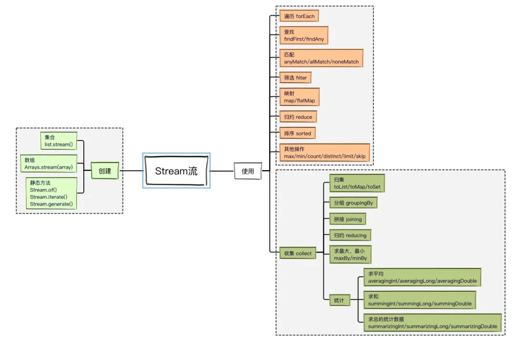
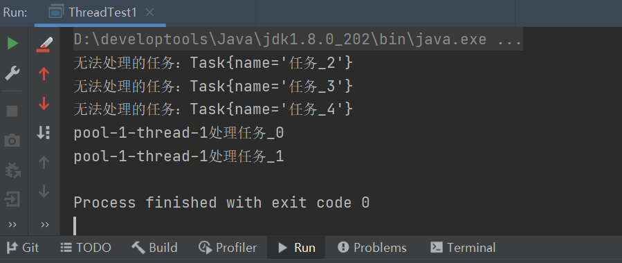

### 一、什么是线程池

- 数据库连接池

  使用 jdbc 操作数据库时，需要先和数据库建立连接，拿到连接才能操作数据库，用完之后销毁。而数据库连接的创建和销毁其实是比较耗时的，真正和业务相关的操作耗时是比较短的。为了提升系统性能，出现了数据库连接池，系统启动的时候，先创建很多连接放在池子里面，使用时直接从中取一个，用完放回，继续给其他需要者使用，这就省去了每次创建连接的时间，从而提升系统的整体性能。

- 线程池

  线程池和数据库连接池的原理类似，创建线程去处理业务，可能创建线程的时间比处理业务的时间还长一些，如果系统能够提前为我们创建好线程，需要的时候直接拿来使用，用完之后不是直接将其关闭，而是将其返回到线程池中，给其他需要者使用，这样直接节省二零创建和销毁的时间，提升了系统性能。

  简单的说，在使用线程池之后，创建线程变成了从线程池中取一个空闲的线程，然后使用，关闭线程变成了将线程归还到线程池。

### 二、线程池实现的原理

当向线程池提交一个任务之后，线程池的处理流程如下：

1. 判断是否达到核心线程数，若未达到，则直接创建新的线程处理当前传入的任务，否则进入下个流程
2. 线程池中的工作队列是否已满，若未满，则将任务丢入工作队列中先存着等待处理，否则进入下个流程
3. 是否达到最大线程数，若未达到，则创建新的线程处理当前传入的任务，否则交给线程池中的饱和策略进行处理。

流程如下图：



### 三、Java 中的线程池

#### 1、ThreadPoolExecutor

jdk 中提供了线程池的具体实现，实现类为：`java.util.concurrent.ThreadPoolExecutor` ，主要的构造方法为：

```java
public ThreadPoolExecutor(int corePoolSize,
                              int maximumPoolSize,
                              long keepAliveTime,
                              TimeUnit unit,
                              BlockingQueue<Runnable> workQueue,
                              ThreadFactory threadFactory,
                              RejectedExecutionHandler handler)
```

其中：

`corePoolSize`：核心线程数。当提交一个任务到线程池时，如果已经创建的线程小于核心线程数，线程池会直接创建一个线程来执行任务，否则会根据工作队列是否已满和创建线程数是否达到允许创建线程的最大数量来判断是否创建新线程。
`maximumPoolSize`：线程池允许创建线程的最大数量。如果工作队列满了且已创建的线程数小于允许创建线程的最大数量，则线程池会再创建新的线程执行任务。但如果我们使用了无界队列，那么所有的任务都会加入队列，这个参数就没有什么效果了。
`keepAliveTime`：线程池的工作线程空闲后，保持存活的时间。当空闲线程空闲的时间超过了这个值，会被回收掉。如果任务很多，且每个任务执行的时间比较短，避免线程重复的创建和回收，可以调大这个时间，提高线程的利用率。
`unit`：`keepAliveTime` 的时间单位，可以选择的单位有天、小时、分钟、毫秒、微秒、千分之一毫秒和纳秒。类型是一个枚举 `java.util.concurrent.TimeUnit` 。
`workQueue`：工作队列，用于缓存待处理任务的阻塞队列，常见的有 4 种。
`threadFactory`：线程池中创建线程的工厂，可以通过线程工厂给每个创建出来的线程设置更有意义的名字。
`handler`：饱和策略，当线程池无法处理新来的任务了，那么需要提供一种策略处理提交的新任务，默认有 4 种策略。

#### 2、线程池的使用步骤

① 调用构造方法创建线程池
② 调用线程池的方法处理任务
③ 关闭线程池

#### 3、任务处理过程

调用线程池的 `execute` 方法处理任务，其执行过程为：

1、判断线程池中运行的线程数是否小于 `corePoolSize` ，是：则创建新线程来处理任务，否：执行下一步；
2、试图将任务添加到 `workQueue` 指定的队列中，如果无法添加到队列，进入下一步；
3、判断线程中运行的线程数是否小于 `maximumPoolSize` ，是：则新增线程处理当前传入的任务，否：将任务传递给 `handler` 对象的 `rejectedExecution` 方法处理。

### 四、线程池使用

#### 1、基本使用

```java
package com.yunzike.thread;

import java.util.concurrent.ArrayBlockingQueue;
import java.util.concurrent.Executors;
import java.util.concurrent.ThreadPoolExecutor;
import java.util.concurrent.TimeUnit;

/**
 * @author xiongxq
 * @date 2021-02-25
 */
public class ThreadPoolTest {

    static ThreadPoolExecutor threadPool = new ThreadPoolExecutor(5,
            20,
            100,
            TimeUnit.MILLISECONDS,
            new ArrayBlockingQueue<Runnable>(10),
            Executors.defaultThreadFactory(),
            new ThreadPoolExecutor.AbortPolicy());

    public static void main(String[] args) {
        for (int i = 0; i < 10; i++) {
            int j = i;
            String taskName = "任务" + j;
            threadPool.execute(() -> {
                //模拟任务内部处理耗时
                try {
                    TimeUnit.SECONDS.sleep(j);
                } catch (InterruptedException e) {
                    e.printStackTrace();
                }
                System.out.println(Thread.currentThread().getName() + taskName + "处理完毕");
            });
        }
        //关闭线程池
        threadPool.shutdown();
    }

}
```

#### 2、常见的 4 种工作队列

任务太多的时候，工作队列用于暂时缓存待处理的任务，jdk 中常见的 5 种阻塞队列：

`ArrayBlockingQueue` ：是一个基于数组结构的有界阻塞队列，此队列按照先进先出原则对元素进行排序。

`LinkedBlockingQueue`：是一个基于链表结构的阻塞队列，此队列按照先进先出排序元素，吞吐量通常要高于 `ArrayBlockingQueue` 。静态工厂方法 `Executors.newFixedThreadPool` 使用了这个队列。

`SynchronousQueue`：一个不存储元素的阻塞队列，每个插入操作必须等到另一个线程调用移除操作，否则插入操作一直处于阻塞状态，吞吐量通常要高于`LinkedBlockingQueue` ，静态工厂方法 `Executors.newCachedThreadPool` 使用这个队列。

```java
package com.yunzike.thread;

import java.util.concurrent.ExecutorService;
import java.util.concurrent.Executors;
import java.util.concurrent.TimeUnit;

/**
 * @author xiongxq
 * @date 2021-03-02
 */
public class ThreadWorkQueue {

    public static void main(String[] args) {
        ExecutorService executor = Executors.newCachedThreadPool();
        for (int i = 0; i < 50; i++) {
            int j = i;
            String taskName = "任务" + j;
            executor.execute(() -> {
                System.out.println(Thread.currentThread().getName() + "处理" + taskName);
                //模拟任务内部处理耗时
                try {
                    TimeUnit.SECONDS.sleep(1);
                } catch (InterruptedException e) {
                    e.printStackTrace();
                }
            });
        }
        executor.shutdown();
    }
}

```

这种队列比较特殊，放入元素必须要有另外一个线程去获取这个元素，否则放入元素会失败或者一直阻塞在那里直到有线程取走，示例中任务处理休眠了指定的时间，导致已创建的工作线程都忙于处理任务，所以新来任务之后，将任务丢入同步队列会失败，丢入队列失败之后，会尝试新建线程处理任务。使用上面的方式创建线程池需要注意，如果需要处理的任务比较耗时，会导致新来的任务都会创建新的线程进行处理，可能会导致创建非常多的线程，最终耗尽系统资源，触发OOM。

`PriorityBlockingQueue`：优先级队列，进入队列的元素按照优先级会进行排序。

#### 3、自定义创建线程的工厂


#### 4、常见的 4 种饱和策略

当线程池种的队列已满，并且线程池已达到最大线程数，线程池会将任务传递给**饱和策略**进行处理。这些策略都实现了`RejectedExecutionHandler` 接口。接口中有个方法：

```java
/**
 * 参数说明：
 * r：需要执行的任务
 * executor：当前线程池
 **/
void rejectedExecution(Runnable r, ThreadPoolExecutor executor);
```

jdk 中提供了 4 种常见的饱和策略：

- `AbortPolicy`：直接抛出异常；
- `CallerRunsPolicy` ：在当前调用者的线程中运行任务，即谁丢来的任务，由他自己去处理；
- `DiscardOldestPolicy`：丢弃队列中最老的一个任务，即丢弃队列头部的一个任务，然后执行当前传入的任务；
- `DiscardPolicy`：不处理，直接丢弃掉，方法内部为空。

#### 5、自定义饱和策略

需要实现 `RejectedExecutionHandler` 接口。例如：任务无法处理的时候，我们想要记录一下日志，我们可以自定义一个饱和策略，示例代码：

```java
package com.yunzike.thread;

import java.util.concurrent.ArrayBlockingQueue;
import java.util.concurrent.Executors;
import java.util.concurrent.ThreadPoolExecutor;
import java.util.concurrent.TimeUnit;

/**
 * @author xiongxq
 * @date 2021-03-03
 */
public class ThreadTest1 {

    static class Task implements Runnable {

        String name;

        public Task(String name) {
            this.name = name;
        }

        @Override
        public void run() {
            System.out.println(Thread.currentThread().getName() + "处理" + this.name);
            try {
                TimeUnit.SECONDS.sleep(5);
            } catch (InterruptedException e) {
                e.printStackTrace();
            }
        }

        @Override
        public String toString() {
            return "Task{" +
                    "name='" + name + '\'' +
                    '}';
        }
    }

    public static void main(String[] args) {
        ThreadPoolExecutor poolExecutor = new ThreadPoolExecutor(1,
                1,
                60L,
                TimeUnit.SECONDS,
                new ArrayBlockingQueue<Runnable>(1),
                Executors.defaultThreadFactory(),
                (r, executor) -> {
                    //自定义饱和策略
                    //记录一下无法处理的任务
                    System.out.println("无法处理的任务：" + r.toString());
                });

        for (int i = 0; i < 5; i++) {
            poolExecutor.execute(new Task("任务_" + i));
        }
        poolExecutor.shutdown();
    }

}
```

输出：



输出结果中可以看到有3个任务进入了饱和策略中，记录了任务的日志，对于无法处理多任务，我们最好能够记录一下，让开发人员能够知道。任务进入了饱和策略，说明线程池的配置可能不是太合理，或者机器的性能有限，需要做一些优化调整。

#### 6、线程池的 2 个关闭方法

线程池提供了 2  个关闭方法：`shutdown` 和 `shutdownNow` ，当调用这两个方法之后，线程池会遍历内部的工作线程，然后调用每个工作线程的 `interrupt` 方法给线程发送中断信号，内部如果无法响应中断信号的可能永远无法终止，所以如果内部有无限循环的，最好在循环内部检测一下线程的中断信号，合理的退出。调用这两个方法的任意一个，线程池的 `isShutdown` 方法就会返回 `true` ，当所有任务线程都关闭之后，才表示线程池关闭成功，这是调用 `isTerminaed` 方法会返回 `true` 。

调用 `shutdown` 方法之后，线程池将不再接受新任务，内部会将所有已提交的任务处理完毕，处理完毕之后，工作线程自动退出。

而调用 `shutdownNow` 方法后，线程池会将还未处理的（在队里等待处理的任务）任务移除，将正在处理中的处理完毕之后，工作线程自动退出。

至于调用哪个方法来关闭线程，应该由提交到线程池的任务特性决定，多数情况下调用 `shutdown` 方法来关闭线程池，如果任务不一定要执行完，则可以调用 `shutdownNow` 方法。

#### 7、扩展线程池

虽然 jdk 提供了 `ThreadPoolExecutor` 这个高性能线程池，但如果我们自己想在这个线程池上面做一些扩展，比如，监控每个任务的开始时间、结束时间，或者一些其他自定义的功能，我们应该怎么办？

这个 jdk 已经帮我们想到了，`ThreadPoolExecutor` 内部提供了几个方法 `beforeExecute` 、`afterExecute` 、`terminated` ，可以由开发人员自己去调用这些方法。线程池内部的源码如下：

```java
try {
    beforeExecute(wt, task);//任务执行之前调用的方法
    Throwable thrown = null;
    try {
        task.run();
    } catch (RuntimeException x) {
        thrown = x; throw x;
    } catch (Error x) {
        thrown = x; throw x;
    } catch (Throwable x) {
        thrown = x; throw new Error(x);
    } finally {
        afterExecute(task, thrown);//任务执行完毕之后调用的方法
    }
} finally {
    task = null;
    w.completedTasks++;
    w.unlock();
}
```

`beforeExecute`：任务执行之前调用的方法，两个参数，第一个参数是执行任务的线程，第二个参数是任务

```java
protected void beforeExecute(Thread t, Runnable r){}
```

`afterExecute`：任务执行完成之后调用的方法，两个参数，第一个参数表示任务，第二个参数表示任务执行时的异常信息，如果无异常，第二个参数为`null`

```java
protected void afterExecute(Runnable r, Throwable t){}
```

`terminated`：线程池最终关闭之后调用的方法。所有工作线程都退出了，最终线程池会退出，退出时调用该方法。

### 五、合理配置线程池

#### 1、合理配置线程池

想要合理的配置线程池，需要先分析任务特性，从以下几个角度：

- 任务的性质：CPU 密集型任务、IO 密集型任务和混合型任务
- 任务的优先级：高、中、低
- 任务的执行时间：长、中、短
- 任务的依赖性：是否依赖其他系统资源，如数据库连接。

性质不同任务可以用不同规模的线程池分开处理。CPU 密集型任务应该尽可能少的线程，如配置 CPU 数量 + 1 个线程的线程池。由于 IO 密集型任务并不是一直在执行任务，不能让 CPU 闲着，则应配置尽可能多的线程，如：CPU 数量 * 2 。混合型的任务，如果可以拆分，将其拆分成一个 CPU 密集型任务和一个 IO 密集型任务，只要这两个任务执行的时间相差不是太大，那么分解后执行的吞吐量将高于串行执行的吞吐量。可以通过 `Runtime.getRuntime().avilableProcessors()` 方法获取 CPU 数量。

优先级不同任务可以对线程池采用优先级队列来处理，让优先级高的先执行。

使用队列的时候建议使用有界队列，有界队列增加了系统的稳定性，如果采用无界队列，任务太多的时候可能导致系统 OOM，直接让系统宕机。

#### 2、线程池中线程数量的配置

线程池中总线程数量大小对系统的性能由一定的影响，我们希望系统能发挥最好的性能，过多或者过少的线程数量都无法有效的使用机器的性能。在 `Java Concurrency in Practice` 书中给出了估算线程池大小的公式：

```java
Ncpu = cpu 数量
Ucpu = 目标cpu的使用吕，0 <= Ucpu <= 1
W/C = 等待时间与计算时间的比例
为保持处理器达到期望的使用率，最佳的线程池大小等于：
Nthreads = Ncpu X Ucpu X (1 + W/C)
```

#### 3、其他建议

在《阿里巴巴java开发手册》中指出了线程资源必须通过线程池提供，不允许在应用中自行显示的创建线程，这样一方面是线程的创建更加规范，可以合理控制开辟线程的数量；另一方面线程的细节管理交给线程池处理，优化了资源的开销。

而线程池不允许使用 Executors 去创建，而要通过ThreadPoolExecutor方式，这一方面是由于 jdk 中 Executor 框架虽然提供了如 newFixedThreadPool() 、 newSingleThreadExecutor() 、newCachedThreadPool()等创建线程池的方法，但都有其局限性，不够灵活；另外由于前面几种方法内部也是通过ThreadPoolExecutor方式实现，使用 ThreadPoolExecutor 有助于大家明确线程池的运行规则，创建符合自己的业务场景需要的线程池，避免资源耗尽的风险。


