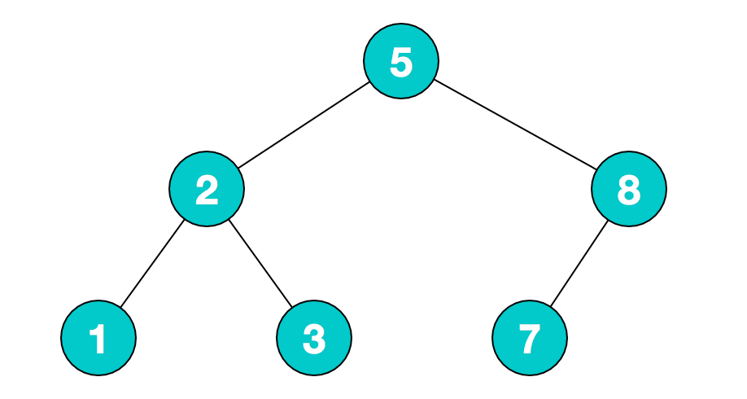
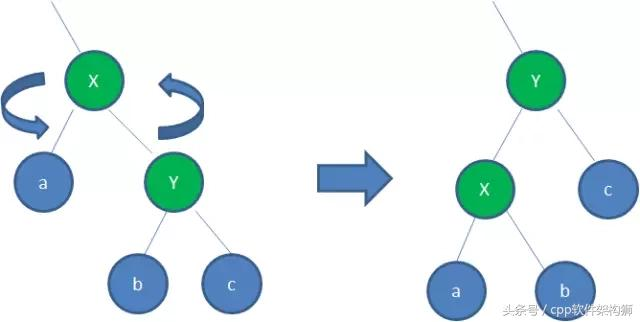
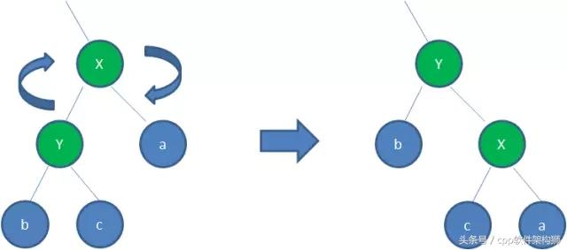

## 一、概述

树（tree）是一种**非线性**的数据结构，由一系列存在父子关系的由节（结）点连接而成。树相对于线性的数据结构(链表、数组)而言，**树的平均运行时间更短(往往与树相关的排序时间复杂度都不会高)** 。树的基本单位节点，根据其关系又分三类节点

- 根节点 : 没有父节点
- 内部节点 : 至少有一个子节点
- 外部节点(叶节点、叶子节点）: 没有子节点

**树的深度和高度**

深度定义是从上往下的，而高度定义是从下往上的。而且有不同的定义：
高度就是深度
看层数：
如果根结点是第0层，层数 = 深度 = 高度-1
如果根结点是第1层，层数 = 深度 = 高度

- 深度：假定p是树T中的一个节点，那么p的深度就是节点p的直系祖先的个数，不包括p本身。这**等价于p到根节点有多少条边**。这种定义表明，树的根节点的深度为0。

- 高度：

  如果节点p是一个叶子节点，那么它的高度为 0 ；

  树 T 中所有节点深度的最大值称作该树的高度（根节点的高度），单节点树高度为 0 ，空树高度为 -1 ；任意节点 P 对应子树的高度为节点 P 的高度。

**度**


## 二、二叉树

#### 1、概述

- 定义：每个节点至多拥有两颗子树（即子节点都不超过两个）的树。

- 二叉树的性质

  1.若二叉树的层次从 0 开始，则在二叉树的第 i 层至多有 `2^i` 个结点（i >= 0）

  2.高度为k的二叉树最多有 `2^(k+1) - 1`个结点（k >= -1）(空树的高度为-1)

  3.对任何一棵二叉树，如果其叶子结点(度为0)数为 m, 度为 2 的结点数为 n, 则 `m = n + 1`

- 分类

  1.完美二叉树：除了叶子节点之外的每一个节点都有两个孩子节点，且每一层（包括最后一层）都被完全填充。

  2.完全二叉树：除了最后一层之外的其他每一层都被完全填充，并且所有节点都保持向左对齐。

  3.完满二叉树：除了叶子节点之外的每一个节点都有两个孩子节点。

#### 2、表示方法

- 表示方法一：
```java
public class TreeNode {
    int val;
    TreeNode left;
    TreeNode right;

    TreeNode() {}

    TreeNode(int val) { this.val = val; }

    TreeNode(int val, TreeNode left, TreeNode right) {
        this.val = val;
        this.left = left;
        this.right = right;
    }
}
```

- 表示方法二：

#### 3、二叉树的遍历方式（其实就是按根节点的遍历位置命名）

- 先序遍历

  先访问根节点，然后访问左节点，最后访问右节点（根->左->右）

- 中序遍历

  先访问左节点，然后访问根节点，最后访问右节点（左->根->右）

- 后续遍历

  先访问左节点，然后访问右节点，最后访问根节点（左->右->根）

【注】通过先序和中序或者中序和后序我们可以还原出原始的二叉树，但是通过先序和后序是无法还原出原始的二叉树的。
```java
// 用递归的方法进行先序遍历
public void qinaxuDigui(TreeNode treeNode) {
    qianxuNumList.add(treeNode.val);
    if (treeNode.left != null) {
        qinaxuDigui(treeNode.left);
    }
    if (treeNode.right != null) {
        qinaxuDigui(treeNode.right);
    }
}

// 用递归的方法进行中序遍历
public void zhongxuDigui(TreeNode treeNode) {
    if (treeNode.left != null) {
        zhongxuDigui(treeNode.left);
    }
    zhongxuNumList.add(treeNode.val);
    if (treeNode.right != null) {
        zhongxuDigui(treeNode.right);
    }
}

// 用递归的方法进行后序遍历
public void houxuDigui(TreeNode treeNode) {
    if (treeNode.left != null) {
        houxuDigui(treeNode.left);
    }
    if (treeNode.right != null) {
        houxuDigui(treeNode.right);
    }
    houxuNumList.add(treeNode.val);
}


// 用非递归的方法进行先序遍历
public void qinaxuFeiDigui(TreeNode treeNode) {
    Stack<TreeNode> stack = new Stack<TreeNode>();
    while (treeNode != null || !stack.isEmpty()) {
        while (treeNode != null) {
            qianxuNumList.add(treeNode.val);
            stack.push(treeNode);
            treeNode = treeNode.left;
        }
        if(!stack.isEmpty()){
            treeNode = stack.pop();
            treeNode = treeNode.right;
        }
    }
}

// 用非递归的方法进行中序遍历
public void zhongxuFeiDigui(TreeNode treeNode) {
    Stack<TreeNode> stack = new Stack<TreeNode>();
    while (treeNode != null || !stack.isEmpty()) {
        while (treeNode != null) {
            stack.push(treeNode);
            treeNode = treeNode.left;
        }
        if (!stack.isEmpty()) {
            treeNode = stack.pop();
            zhongxuNumList.add(treeNode.val);
            treeNode = treeNode.right;
        }
    }
}

// 用非递归的方法进行后序遍历
public void houxuFeiDigui(TreeNode treeNode) {
    Stack<TreeNode> stack = new Stack<TreeNode>();
    while (treeNode != null || !stack.isEmpty()) {
        while (treeNode != null) {
            stack.push(treeNode);
            treeNode = treeNode.left;
        }
        boolean tag = true;
        TreeNode preNode = null;  // 前驱节点
        while (!stack.isEmpty() && tag == true) {
            treeNode = stack.peek();
            if (treeNode.right == preNode) { // 之前访问的为空节点或是栈顶节点的右子节点
                treeNode = stack.pop();
                houxuNumList.add(treeNode.val);
                if (stack.isEmpty()) {
                    return;
                } else {
                    preNode = treeNode;
                }
            } else {
                treeNode = treeNode.right;
                tag = false;
            }
        }
    }
}
```

## 三、其他类型的二叉树

#### 1、二叉搜索（查找）树（BST）



- 特点

  任意节点左子树不为空，则左子树的值均小于根节点的值

  任意节点右子树不为空，则右子树的值均大于于根节点的值

  没有键值相等的节点

- 实现

- 二叉搜索树和哈希表的对比

#### 2、完美平衡二叉树（AVL）

AVL树是带有平衡条件的二叉查找树，和红黑树相比,它是严格的平衡二叉树，平衡条件必须满足(所有节点的左右子树高度差不超过1)。不管我们是执行插入还是删除操作，只要不满足上面的条件，就要通过旋转来保持平衡，而旋转是非常耗时的。

- 特点

  **AVL树是一棵二叉搜索树**

  **AVL树的左右子节点也是AVL树**

  **AVL树拥有二叉搜索树的所有基本特点**

  **每个节点的左右子节点的高度之差的绝对值最多为1，即平衡因子为范围为`[-1,1]`**

- 使用场景

  AVL树适合用于插入删除次数比较少，但查找多的情况。在Windows进程地址空间管理中得到了使用

- 左平衡二叉树实现优先队列


#### 3、红黑树

- 特点

  1.节点是红色或者黑色
  2.根节点是黑色
  3.每个叶子的节点都是黑色的空节点(NULL)
  4.每个红色节点的两个子节点都是黑色的。
  5.从任意节点到其每个叶子的所有路径都包含相同的黑色节点。

- 正式因为这些规则，才能保证红黑树的自平衡。最长路径不超过最短路径的2倍。

  

  **黑高bh：**从某个结点 x 出发(不含该结点)到达一个叶结点的任意一条简单路径上的黑色结点个数，记作 bh(x)。

  **引理：**一颗有 n 个内部结点的红黑树的高度至多为 2lg(n+1)。

  **推论：**一颗高度为 h 的红黑树，黑高bh 至少为 (h/2)向上取整，最多为 h。至少有 2^bh - 1 个结点，最多有 4^bh - 1个结点。

- 变色

  

- 左旋转

  

  逆时针旋转两个节点，让右子节点取代自己的位置，自己成为右子节点的左子节点，然后为了保证仍然是一颗二叉（查找）树，将原来右子节点的左节点，变成原父节点的右节点。

- 右旋转

  

  顺时针旋转两个节点，让左子节点取代自己的位置，自己成为左子节点的右子节点，然后为了保证仍然是一颗二叉（查找）树，将原来左子节点的右节点，变成原父节点的左节点。

- 添加

  

- 删除

  

- 实现

#### 4、B-树

#### 5、B+树


