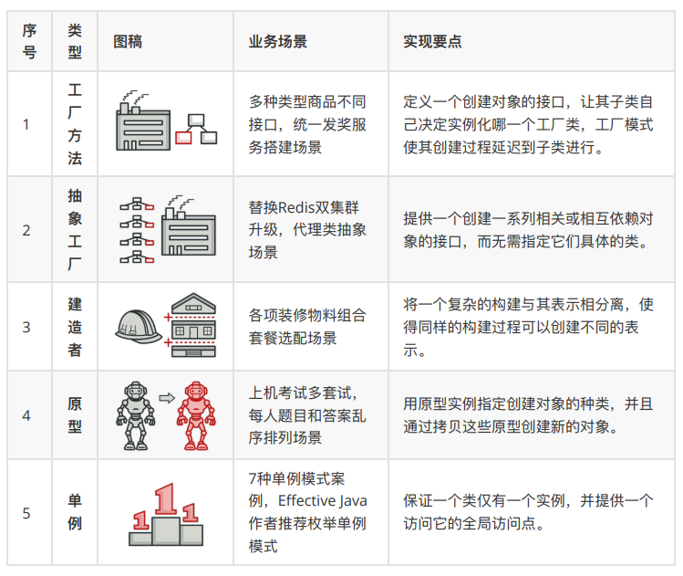
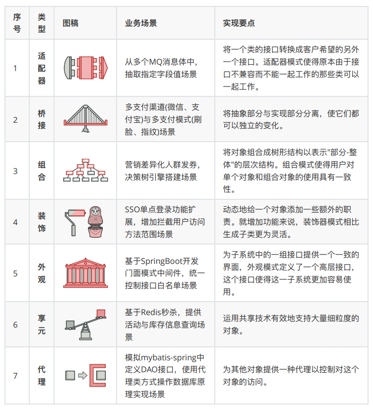
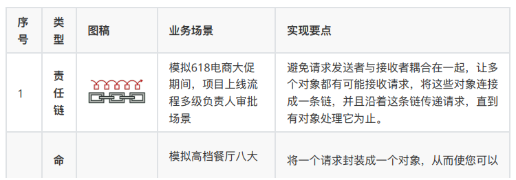
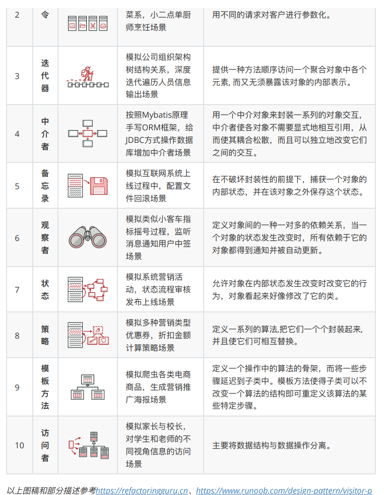

## 1、概述

### 1.1 设计模式原则

- 单一职责（一个类和方法只做一件事）
- 里氏替换（多态，子类可扩展父类）
- 依赖倒置（细节依赖抽象，下层依赖上层）
- 接口隔离（建立单一接口）
- 迪米特原则（最少知道，降低耦合）
- 开闭原则（抽象架构，扩展实现）

### 1.2 设计模式分类

- 创建型模式

  这类模式提供创建对象的机制， 能够提升已有代码的灵活性和可复⽤性。

  

- 结构型模式

  这类模式介绍如何将对象和类组装成较⼤的结构， 并同时保持结构的灵活和⾼效。

  

- 行为模式

  这类模式负责对象间的⾼效沟通和职责委派。

  

  

## 2、创建型模式

### 2.1 工厂模式

