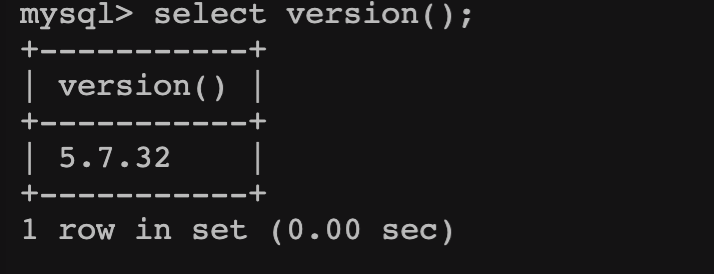
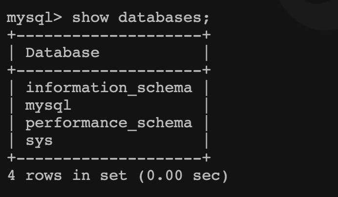

## 安装 MySQL

### Windows 中安装 MySQL

#### windows下使

官网下载windows zip版，解压到安装盘,（并配置环境变量）

#### 1.配置初始化的my.ini文件的文件

解压后的目录并没有的my.ini文件，没关系可以自行创建在安装根目录下添加的my.ini（新建文本文件，将文件类型改为的.ini），写入基本配置： 

```
[mysqld]
# 设置3306端口
port=3306
# 设置mysql的安装目录
basedir=C:\Program Files\MySQL
# 设置mysql数据库的数据的存放目录
datadir=C:\Program Files\MySQL\Data
# 允许最大连接数
max_connections=200
# 允许连接失败的次数。
max_connect_errors=10
# 服务端使用的字符集默认为utf8mb4
character-set-server=utf8mb4
# 创建新表时将使用的默认存储引擎
default-storage-engine=INNODB
# 默认使用“mysql_native_password”插件认证
#mysql_native_password
default_authentication_plugin=mysql_native_password
[mysql]
# 设置mysql客户端默认字符集
default-character-set=utf8mb4
[client]
# 设置mysql客户端连接服务端时默认使用的端口
port=3306
default-character-set=utf8mb4
```

一定要修改

```
# 设置mysql的安装目录
basedir=C:\Program Files\MySQL
# 设置mysql数据库的数据的存放目录
datadir=C:\Program Files\MySQL\Data
```

不然与安装目录不一致安装时会报错

#### 2.安装

运行管理员命令行进入bin目录下（可能需要进入C:\Windows\System32以管理员方式运行cmd.exe）  
执行命令：mysqld --initialize --console
会生成临时密码：

```
 $ mysqld --initialize --console
2019-05-24T17:58:45.850736Z 0 [System] [MY-013169] [Server] D:\devTools\mysql-8.0.16-winx64\bin\mysqld.exe (mysqld 8.0.16) initializing of server in progress as process 3324
2019-05-24T17:59:10.355707Z 5 [Note] [MY-010454] [Server] A temporary password is generated for root@localhost: .FrCae:%w5KY
2019-05-24T17:59:20.151858Z 0 [System] [MY-013170] [Server] D:\devTools\mysql-8.0.16-winx64\bin\mysqld.exe (mysqld 8.0.16) initializing of server has completed

```

执行命令(不以管理员方式运行cmd可能会报错，Install/Remove of the Service Denied!)：mysqld -install

如果提示the service already exists 
则表示之前安装过卸载后未删除服务 
新开cmd窗口，查询mysql服务 
sc query mysql 
若存在，则删除 
sc delete mysql 
再重新安装即可。  

启动：net start mysql

#### 3.修改密码

登录：mysql -u root -p  

修改密码：SET PASSWORD = PASSWORD('new password');

但是MySQL8.0.4开始，上面修改密码的方式默认不行。因为之前，MySQL的密码认证插件是“mysql_native_password”，而现在使用的是“caching_sha2_password”。
执行下面三个命令修改密码：（记得带上分号）

```
use mysql；
ALTER USER 'root'@'localhost' IDENTIFIED WITH mysql_native_password BY 'yunzk123';
FLUSH PRIVILEGES;
```

然后重新连接

关闭：net stop mysql
退出sql命令行：\q

### Linux下

1、下载解压

2、安装

3、配置

4、启动停止 
启动：service mysql start

停止：service mysql stop   

连接：

5、远程连接 
https://blog.csdn.net/h985161183/article/details/82218710

### Mac下使用中安装 MySQL

#### Mac下安装MySQL
- 方式一：dmg
注意记住密码，不要选择加强密码模式。
- 方式二：.tar.gz
解压后复制到usr/loacl目录，进一步操作，不同版本有所不同。
- 方式三：Homebrew
可能有问题。

#### Mac下启动MySQL
- 方式一：系统偏好设置直接启动
- 方式二：命令行启动
```
su - 用户名 #切换用户
mysql.server --help # 服务器命令
mysql.server start # 启动mysql服务
mysql.server stop
```
#### 账号管理
```
mysqladmin --help  # help
mysqladmin -u root password  # 设置密码
mysqladmin -u root password -p  # 重置密码
```
#### 数据库操作
```
cd /usr/local/mysql/bin/ #进入MySQL的bin目录
./mysql -u root -p  # 使用密码登录root账户的数据库
mysql> SHOW DATABASES;  # 查看数据库列表
mysql> CREATE DATABASE test;  # 创建test数据库
mysql> use test;  # 使用数据库test
mysql> select database();  # 查看当前所使用的数据库
mysql> SHOW TABLES;  # 查看test数据库里的表 
```

## MySQL 基本命令

### 启动&关闭 MySQL 

#### 方式一：命令行

```bash
# windows 中

# 启动命令：
net start mysql
# 停止命令
net stop mysql

# Linux 中


```

#### 方式二：从系统服务启动

- window 中

  在cmd中运行`services.msc`，然后通过服务窗口

- mac上

  

- docker

  

### 登录&退出 MySQL

```bash
# mysql -h ip -P 端口 -u 用户名 -p 回车后输入密码
# 大写 P 指定端口号，小写 p 为密码
# IP 为本机可省略ip 和 端口
mysql -h localhost -P 3306 -u root -p

# 退出 mysql 命令行,反斜杠 + q
\q
```

### 其他常用命令

- 查看数据库版本

  ```bash
  # 登录数据库之后
  select version();
  ```

  

  ```bash
  # 未登录数据时
  mysql --version
  ```

- 显示所有数据库

  ```sql
  show databases;
  ```

  

  MySQL 安装后默认自带数据库，5.7版本共 4 个，分别是 information_schema、mysql、performance_schema、sys

- 进入指定数据库

  ```sql
  use 库名;
  ```

- 显示数据库中的表

  ```sql
  -- 显示当前库中所有的表
  show tables;
  
  -- 显示其他库中所有的表，from 后指定库名
  show tables from sys;
  ```

- 查看表的建表语句

  ```mysql
    -- show create table 表名;
    show create table func;
  ```

- 查看表结构

  ```sql
  -- desc 表名
  desc func;
  ```

## MySQL 语法规范

1. 不区分大小写，但建议关键字大写，表名、列名小写；
2. 每条命令可以缩进换行，最好用英文分号结尾；
3. 对于字符串，使用单引号
4. 注释
   - 单行注释：#注释内容
   - 单行注释：--- 注释内容   ，注意-- 后面必须有空格
   - 多行注释：/* 注释内容 */

## SQL 语言分类

- **DQL（Data Query Language）**：数据查询语言
  select 相关语句
- **DML（Data Manipulate Language）**：数据操作语言
  insert 、update、delete 语句
- **DDL（Data Define Languge）**：数据定义语言
  create、drop、alter 语句
- **TCL（Transaction Control Language）**：事务控制语言
  set autocommit=0、start transaction、savepoint、commit、rollback


