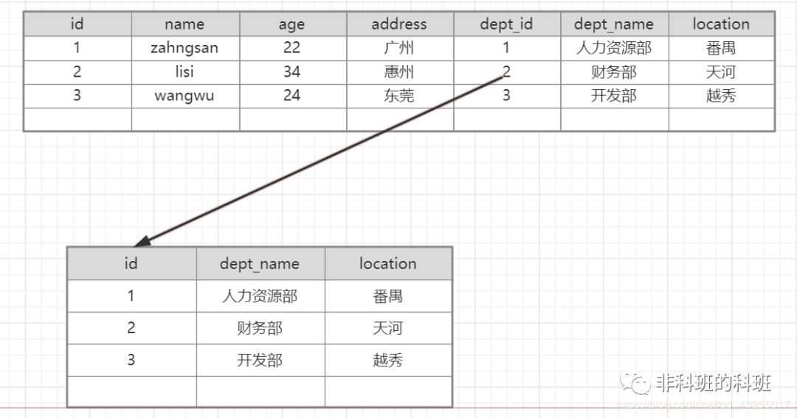
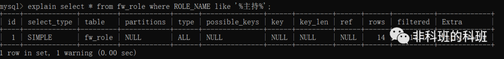

##### 概述 

对于mysql的优化是一个综合性的技术，sql的优化只是其中的一种，其中主要包括 

1. 表的设计合理化(符合3大范式)。
2. 添加索引(index) [普通索引、主键索引、唯一索引unique、全文索引]。
3. 分表技术(水平分割、垂直分割)。
4. 读写[写: update/delete/add]分离。

##### 合理设计表

在表的设计中一定条件下要满足三范式，表的范式，是首先符合第一范式, 才能满足第二范式 , 进一步满足第三范式。

第一范式: 即表的列的具有原子性,不可再分解，即列的信息，不能分解, 只有数据库是关系型数据库(mysql/oracle/db2/sql server)，就自动的满足第一范式。

第二范式: 表中的记录是唯一的, 就满足第二范式, 通常我们设计一个主键来实现。

第三范式: 即表中不要有冗余数据, 就是说，表的信息，如果能够被推导出来，就不应该单独的设计一个字段来存放. 比如下面的设计就是不满足第三范式：




表1存在冗余表2的数据，正常的设计都会设计成如下：


**注意：** 反第三范式: 但是没有冗余的数据库未必是最好的数据库，有时为了提高运行效率，就必须降低范式标准，适当保留冗余数据。具体做法是：在概念数据模型设计时遵守第三范式，降低范式标准的工作放到物理数据模型设计时考虑。降低范式就是增加字段，允许冗余。

在1对N的情况下，为了提高查询的效率，是允许部分字段冗余的。

##### Sql优化

Sql的优化中，主要是对字段添加索引，主要包含有这四种索引(主键索引/唯一索引/全文索引/普通索引)

**1.主键索引添加**

当一张表，把某个列设为主键的时候，则该列就是主键索引,下面的id 列就是主键索引

```
create table user
(id int unsigned primary key auto_increment ,
name varchar(32) not null defaul ‘’);
```

如果你创建表时，没有指定主键索引，也可以在创建表后，在添加, 指令:

```
alter table 表名 add primary key (列名);
//举例
alter table user add primary key (id);
```

**2.普通索引**

一般来说，普通索引的创建，是先创建表，然后在创建普通索引
比如:

```
create table user(
id int unsigned,
name varchar(32)
)

create index 索引名 on 表 (列1,列名2);
```

**3.创建全文索引**

全文索引，主要是针对对文件，文本的检索, 比如文章, 全文索引针对MyISAM有用。创建如下：

```
CREATE TABLE articles (
       id INT UNSIGNED AUTO_INCREMENT NOT NULL PRIMARY KEY,
       title VARCHAR(200),
       body TEXT,
       FULLTEXT (title,body)
     )engine=myisam charset utf8;
```

如何使用全文索引:

```
select * from articles where body like ‘%非科班%’;  //不会使用到全文索引

// 查看是否使用索引:
explain  select * from articles where body like ‘%非科班%’

// 正确的用法是:
select * from articles where match(title,body) against(‘非科班’); 
```

说明:

1. 在mysql中fulltext 索引只针对 myisam生效
2. mysql自己提供的fulltext针对英文生效->sphinx (coreseek) 技术处理中文
3. 使用方法是match(字段名..) against(‘关键字’)
4. 全文索引一个 叫 停止词,  因为在一个文本中，创建索引是一个无穷大的数，因此，对一些常用词和字符，就不会创建，这些词，称为停止词.

**4.唯一索引**
当表的某列被指定为unique约束时，这列就是一个唯一索引

```
// 创建
create table user(id int primary key auto_increment , name varchar(32) unique);
```

这时, name 列就是一个唯一索引，unique字段可以为NULL,并可以有多NULL, 但是如果是具体内容，则不能重复，主键字段，不能为NULL,也不能重复。

创建唯一索引

```
create table user(id int primary key auto_increment, name varchar(32));

create unique index 索引名  on 表名 (列表..);
```

查询索引

```
desc 表名  //不能够显示索引名
show index(es) from 表名
show keys from 表名
```

删除索引

```
alter table 表名 drop index 索引名; 

//如果删除主键索引。
alter table 表名 drop primary key
```

**索引使用的注意事项**

由于索引本身很大，占用磁盘空间，对dml操作有影响，变慢，满足以下条件的字段，才应该创建索引。

1. 肯定在where条经常使用
2. 该字段的内容不是唯一的几个值
3. 字段内容不是频繁变化

explain 可以帮助我们在不真正执行某个sql语句时，就执行mysql怎样执行，这样利用我们去分析sql指令。



1. id：查询的序列号。
2. select_type：查询类型。
3. table：查询表名。
4. type：扫描方式，all表示全表扫描。
5. possible_keys：可是使用到的索引。
6. key：实际使用到的索引。
7. rows：该sql扫面了多少行。
8. Extra：sql语句额外的信息，比如排序方式

**sql语句的小技巧**

1. 在使用group by 分组查询时，默认分组后，还会排序，可能会降低速度，在group by 后面增加 order by null 就可以防止排序。如下图所示


1. 有些情况下，可以使用连接来替代子查询。因为使用join，MySQL不需要在内存中创建临时表。

```
select * from dept, emp where dept.deptno=emp.deptno; 
// 替换成
select * from dept left join emp on dept.deptno=emp.deptno;  
```

##### 正确的选择mysql的存储引擎

Myisam : 如果表对事务要求不高，同时是以查询和添加为主的，我们考虑使用myisam存储引擎. ,比如 bbs 中的 发帖表，回复表。

INNODB : 对事务要求高，保存的数据都是重要数据，我们建议使用INNODB,比如订单表，账号表。


如果你的数据库的存储引擎是myisam,请一定记住要定时进行碎片整理

##### 分表技术

> **为什么要分表？**
> （1） 如果一个表的每条记录的内容很大，那么就需要更多的IO操作，如果字段值比较大，而使用频率相对比较低，可以将大字段移到另一张表中，当查询不查大字段的时候，这样就减少了I/O操作
> （2）如果表的数据量非常非常大，那么查询就变的比较慢；也就是表的数据量影响这查询的性能。
> （3）表中的数据本来就有独立性，例如分别记录各个地区的数据或者不同时期的数据，特别是有些数据常用，而另外一些数据不常用。
>  （4）  分表技术有(水平分割和垂直分割)

**垂直分割**

垂直分割是指数据表列的拆分，把一张列比较多的表拆分为多张表。垂直分割一般用于拆分大字段和访问频率低的字段，分离冷热数据。

垂直分割比较常见：例如博客系统中的文章表，比如文章tbl_articles
(id, titile, summary, content, user_id, create_time)，因为文章中的内容content会比较长，放在tbl_articles中会严重影响表的查询速度，所以将内容放到tbl_articles_detail(article_id, content)，像文章列表只需要查询tbl_articles中的字段即可。

垂直拆分的优点：可以使得行数据变小，在查询时减少读取的Block数，减少I/O次数。此外，垂直分区可以简化表的结构，易于维护。

垂直拆分的缺点：主键会出现冗余，需要管理冗余列，并会引起Join操作，可以通过在应用层进行Join来解决。此外，垂直分区会让事务变得更加复杂。

**水平分割**

水平拆分是指数据表行数据的拆分，表的行数超过500万行或者单表容量超过10GB时，查询就会变慢，这时可以把一张的表的数据拆成多张表来存放。水平分表尽可能使每张表的数据量相当，比较均匀。

水平拆分会给应用增加复杂度，它通常在查询是需要多个表名，查询所有数据需要union操作。在许多数据库应用中，这种复杂性会超过它带来的优点。

因为只要索引关键字不大，则在索引用于查询时，表中增加2-3倍数据量，查询时也就增加读一个索引层的磁盘次数，所以水平拆分要考虑数据量的增长速度，根据实际情况决定是否需要对表进行水平拆分。

水平分割最重要的是找到分割的标准，不同的表应根据业务找出不同的标准

1. 用户表可以根据用户的手机号段进行分割如user183、user150、user153、user189等，每个号段就是一张表
2. 用户表也可以根据用户的id进行分割，加入分3张表user0,user1,user2，如果用户的id%3=0就查询user0表，
   如果用户的id%3=1就查询user1表
3. 对于订单表可以按照订单的时间进行分表

##### 读写分离

实现MySQL读写分离的前提是我们已经将MySQL主从复制配置完毕，读写分离实现方式：
（1）配置多数据源。
（2）使用mysql的proxy中间件代理工具。

**主从复制的原理**
MySQL的主从复制和读写分离两者有着紧密的联系，首先要部署主从复制，只有主从复制完成了才能在此基础上进行数据的读写分离。


**读写分离的原理**
读写分离就是只在主服务器上写，只在从服务器上读。基本原理是让主数据库处理事务性查询，而从服务器处理select查询。数据库复制被用来把事务性查询导致的变更同步到从数据库中。