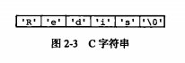
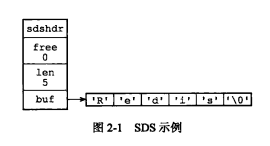
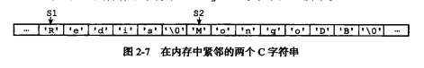

## 数据结构与对象

### 第 2 章 简单动态字符串

Redis 没有直接使用 C 语言传统字符串表示，而是自己构建了一种名为简单动态字符串（simple dynamic string，SDS）的抽象类型，用作 Redis 的默认字符串表示。

SDS 用来保存数据库中的字符串值，还被用作缓冲区（buffer）：AOF 模块中的 AOF 缓冲区，以及客户端状态中的输入缓冲区，都是由 SDS 实现。

但在不需要对字符串进行修改的地方，比如打印日志，仍然使用 C 字符串作为字符串字面量。

#### 2.1 SDS 定义

- c 语言字符串

  长度为`N + 1`的字符数组来表示长度为 `N` 的字符串，字符数组最后一个元素总是空字符`\0`

  

- 简单动态字符串（simple dynamic string，SDS）

  

  ```c
  /**
   * sds.h/sdshdr
   * SDS 定义
   */
  struct sdshdr {
      // 记录 buf 数组中已经使用字节（不含结尾的空字符 '\0'）的数量
      // 等于 SDS 所保存字符串的长度
      int len;
      
      // 记录 buf 数组中未使用字节的数量
      int free;
      char buf[];
  }
  ```

  SDS 遵循 C 字符串以空字符 `'\0'` 结尾的惯例，但保存空字符的 1 字节空间不计算在 len 属性中。这样的好处是 SDS 可以直接重用一部分 C 字符串函数库里面的函数。

#### 2.2 SDS 与 C 字符串的区别

- **常数复杂度获取字符串长度**

  C 字符串不记录自身长度，因此获取字符串长度必须遍历整个字符串，直到空字符为止，复杂度为 `O(N)`

  SDS 获取字符串长度，直接访问 len 属性，复杂度为 `O(1)`

- **杜绝缓冲区溢出**

  C 字符串不记录自身长度带来的另一个问题是容易造成缓冲区溢出（buffer overflow）。

  

  比如：C 语言中，字符串拼接函数`strcat(s1, "Cluster")`，默认会直接在内存中将`"Cluster"` 的内容拼接在`s1` 后面，就会把内存中原本`s2`的内容篡改。因此程序员在使用`strcat()`函数时，必须要记得先给字符串重新分配充裕的内存。

  而 SDS 完全杜绝了发生缓冲区溢出的可能性：修改字符串时，会先检查 SDS 的空间是否满足修改所需的要求，不满足就会自动将空间扩展至执行修改所需的大小，然后再执行实际的修改操作。所以不需要手动判断和修改空间大小，也不会出现缓冲区溢出问题。 

- **减少修改字符串时内存重分配次数**

  C 字符串每次增长或者缩短时，都需要对保存这个 C 字符串的数组进行一次内存重分配操作。而 SDS 连续增长 N 次字符串所需内存重分配次数最多 N 次。

  **空间预分配**

  如果对 SDS 修改并且需要对 SDS 进行空间扩展时，程序不仅会为 SDS 分配修改所必须要的空间，还会分配额外的未使用空间。

  额外分配的未使用空间数量计算方式为：如果修改后 SDS 的长度`len`小于 `1 MB` 时，会分配和 SDS 长度相同的未使用空间，即 `free`属性值和`len`相等；如果修改后 SDS 的长度`len`大于`1 MB` ，则会分配`1MB`的未使用空间。Redis 中 String 最多保存 `512 MB`。

  **惰性空间释放**

  当缩短 SDS 字符串长进度时，不会立即使用内存重分配来回收多出的字节。SDS 也提供了相应的 API ，让我们在有需要时真正地释放 SDS 的未使用空间，所以不用担心惰性空间释放策略会造成内存的浪费。

- **二进制安全**

  C 字符串中字符必须符合某种编码（如 ASCII），且除了字符串末尾不能出现空字符。因此，C 字符串只能保存文本数据，而不能保存像图片、音频、视频、压缩文件这样的二进制数据。

  而 SDS 是二进制安全的，可以用来保存图片等各种二进制数据，因为 SDS 使用 len 属性的值而不是空字符来判断字符串是否结束。

  

### 第 3 章 链表

Redis 构建了自己的链表实现。列表键的底层就是一个链表，发布与订阅、慢查询、监视器等功能也用到了链表，Redis 服务器本身还使用链表来保存多个客户端的状态信息，以及使用链表来构建客户端输出缓冲区。

- 双端

  链表节点带有 prev 和 next 指针

- 无环

  表头节点和表尾节点都指向 NULL

- 带链表长度计数器


### 第 4 章 字典

Redis 构建了自己的字典实现，Redis 数据库就是使用字典作为底层来实现的，hash 也是。

- hash 冲突

  Redis 使用链地址法解决。


### 第 5 章 跳跃表


### 第 6 章 整数集合


### 第 7 章 压缩列表


### 第 8 章 对象


## 单机数据库的实现


## 多机数据库的实现


## 独立功能的实现