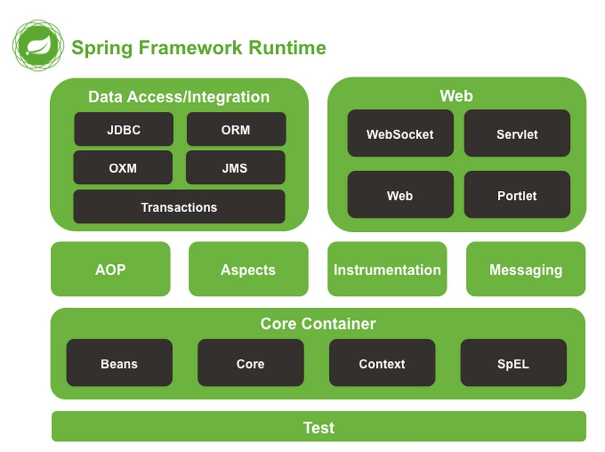
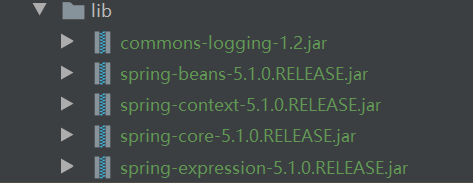
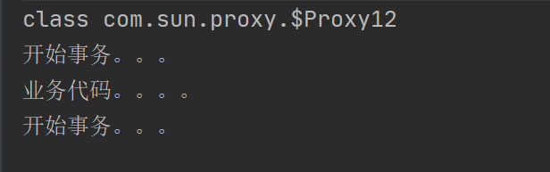

## 1、入门

### 1.1 概述

- Spring

  1、Spring是开源的轻量级框架。Spring 为简化企业级应用开发而生。使用 Spring 可以使简单的 JavaBean 实现，以前只有 EJB 才能实现的功能。Spring 是一个 IOC(DI) 和 AOP 容器框架

  2、spring是一个简化java企业级开发的一个框架，内部包含了很多技术，比如：控制反转&依赖注入、面向切面编程、spring事务管理、通过spring集成其他框架、springmvc、springboot、springcloud等等。

  3、Spring是一站式框架
  （1）Spring在JavaEE的三层结构中，每一层都提供不同的解决技术。

  - Web层：SpringMVC
  - service层：Spring 的 ioc
  - dao层：Spring 的 jdbctemplate  

- Spring 官网：

- Spring核心主要是两点：

  ① **IOC(Inversion of Control)**：控制反转，也称作**依赖注入（DI）**。其思想是**反转资源获取的方向**。传统的资源查找方式要求组件向容器发起请求查找资源，作为回应, 容器适时的返回资源。而应用了 IOC 之后，则是**容器主动地将资源推送给它所管理的组件**, **组件所要做的仅是选择一种合适的方式来接受资源**。 这种行为也被称为查找的被动形式。**IOC 容器**具有依赖注入功能的容器，它可以创建对象，IOC 容器负责实例化、定位、配置应用程序中的对象及建立这些对象间的依赖。通常new一个实例，控制权由程序员控制，而"控制反转"是指new实例工作不由程序员来做而是交给Spring容器来做。
  使用者之前使用B对象的时候都需要自己去创建和组装，而现在这些创建和组装都交给spring容器去给完成了，使用者只需要去spring容器中查找需要使用的对象就可以了；这个过程中B对象的创建和组装过程被反转了，之前是使用者自己主动去控制的，现在交给spring容器去创建和组装了，对象的构建过程被反转了，所以叫做控制反转；IOC是是面相对象编程中的一种设计原则，主要是为了降低系统代码的耦合度，让系统利于维护和扩展。
  **DI(Dependency Injection)** — IOC 的另一种表述方式：即**组件以一些预先定义好的方式(例如: setter方法)接受来自如容器的资源注入**。 相对于 IOC 而言，这种表述更直接 。
  
  
  
  ### IOC：控制反转
  
  使用者之前使用B对象的时候都需要自己去创建和组装，而现在这些创建和组装都交给spring容器去给完成了，使用者只需要去spring容器中查找需要使用的对象就可以了；这个过程中B对象的创建和组装过程被反转了，之前是使用者自己主动去控制的，现在交给spring容器去创建和组装了，对象的构建过程被反转了，所以叫做控制反转；IOC是是面相对象编程中的一种设计原则，主要是为了降低系统代码的耦合度，让系统利于维护和扩展。
  
  
  
  ### DI：依赖注入
  
  依赖注入是spring容器中创建对象时给其设置依赖对象的方式，比如给spring一个清单，清单中列出了需要创建B对象以及其他的一些对象（可能包含了B类型中需要依赖对象），此时spring在创建B对象的时候，会看B对象需要依赖于哪些对象，然后去查找一下清单中有没有包含这些被依赖的对象，如果有就去将其创建好，然后将其传递给B对象；可能B需要依赖于很多对象，B创建之前完全不需要知道其他对象是否存在或者其他对象在哪里以及被他们是如何创建，而spring容器会将B依赖对象主动创建好并将其注入到B中去，比如spring容器创建B的时候，发现B需要依赖于A，那么spring容器在清单中找到A的定义并将其创建好之后，注入到B对象中。
  
  ### 总结
  
  1. IOC控制反转，是一种设计理念，将对象创建和组装的主动控制权利交给了spring容器去做，控制的动作被反转了，降低了系统的耦合度，利于系统维护和扩展，**主要就是指需要使用的对象的组装控制权被反转了，之前是自己要做的，现在交给spring容器做了**。
  2. DI依赖注入，表示spring容器中创建对象时给其设置依赖对象的方式，通过某些注入方式可以让系统更灵活，比如自动注入等可以让系统变的很灵活，这个后面的文章会细说。
  3. spring容器：主要负责容器中对象的创建、组装、对象查找、对象生命周期的管理等等操作。
  
  
  
  
  
  ② **aop**：面向切面编程，扩展功能不通过修改源代码实现；
  
- **Spring框架结构**

  


### 1.2 简单实现

① 创建 Java SE 项目，导入 Spring 相关jar包（使用 Spring 最基本的功能时只需要导入四个核心Jar包）和 Spring 依赖的 commons-logging 日志 Jar 包。


② 编写 Bean 类

```java
package com.yunzike;

public class HelloWorld {

    private String message;

    public void getMessage() {
        System.out.println("Your Message:" + message);
    }

    public void setMessage(String message) {
        this.message = message;
    }
}

```

③ 创建 bean 的配置文件（beans.xml）

Spring 项目需要创建一个或多个 Bean 配置文件, 用于在 Spring IOC 容器里配置 Bean。Bean 的配置文件可以**放在** **classpath** **下**, 也可以放在其它目录下。

```xml
<?xml version="1.0" encoding="UTF-8"?>
<beans xmlns="http://www.springframework.org/schema/beans"
       xmlns:xsi="http://www.w3.org/2001/XMLSchema-instance"
       xsi:schemaLocation="http://www.springframework.org/schema/beans http://www.springframework.org/schema/beans/spring-beans.xsd">
    <bean id="HelloWorld" class="com.yunzike.HelloWorld">
        <property name="message" value="你好"></property>
    </bean>

</beans>
```

④ 在MainApp中使用Bean对象

```java
package com.yunzike;

import org.springframework.context.ApplicationContext;
import org.springframework.context.support.ClassPathXmlApplicationContext;

public class MainApp {
    public static void main(String[] args) {
        //1.创建ClassPathXmlApplicationContext容器，给容器指定需要加载的bean配置文件
        ApplicationContext context = new ClassPathXmlApplicationContext("Beans.xml");
        //2.从容器中获取需要的bean
        HelloWorld helloWorld = (HelloWorld) context.getBean("HelloWorld");
        //3.使用对象
        helloWorld.getMessage();
    }
}
```


## 2、IOC

###  2.1 容器

#### 1、IOC容器

IOC容器也就是spring容器。是具有依赖注入功能的容器，负责**对象的实例化、对象的初始化，对象和对象之间依赖关系配置、对象的销毁、对外提供对象的查找**等操作，对象的整个生命周期都是由容器来控制。我们需要使用的对象都由ioc容器进行管理，不需要我们再去手动通过new的方式去创建对象，由ioc容器直接帮我们组装好，当我们需要使用的时候直接从ioc容器中直接获取就可以了。

首先需要我们给ioc容器提供一个配置清单，这个配置**支持xml格式**和**java注解的方式**，在配置文件中列出需要让ioc容器管理的对象，以及可以指定让ioc容器如何构建这些对象，当spring容器启动的时候，就会去加载这个配置文件，然后将这些对象给组装好以供外部访问者使用。

#### 2、容器接口

- **BeanFactory**

  ```java
  /**
   * org.springframework.beans.factory.BeanFactory
   * BeanFactory是spring容器的顶层接口，提供了容器最基本的功能
   */
  
  //按bean的id或者别名查找容器中的bean
  Object getBean(String name) throws BeansException
  
  //这个是一个泛型方法，按照bean的id或者别名查找指定类型的bean，返回指定类型的bean对象
  <T> T getBean(String name, Class<T> requiredType) throws BeansException;
  
  //返回容器中指定类型的bean对象
  <T> T getBean(Class<T> requiredType) throws BeansException;
  
  //获取指定类型bean对象的获取器
  <T> ObjectProvider<T> getBeanProvider(Class<T> requiredType);
  ```

- **ApplicationContext** 

  org.springframework.context.ApplicationContext

  这个接口继承了BeanFactory接口，所以内部包含了BeanFactory所有的功能，并且在其上进行了扩展，增加了很多企业级功能，比如AOP、国际化、事件支持等等。

#### 3、实现类

- **ClassPathXmlApplicationContext**

  org.springframework.context.support.ClassPathXmlApplicationContext

  这个类实现了ApplicationContext接口，注意一下这个类名称包含了ClassPath Xml，说明这个容器类可以从classpath中加载bean xml配置文件，只需要给定bean的配置文件并正确配置 CLASSPATH 环境变量，容器就会从 CLASSPATH 中搜索 bean 配置文件，然后创建xml中配置的bean对象。

  ```java
  //通过bean名称获取bean
  getBean()
  //通过bean名称获取这个bean的所有别名
  getAliases()
  //返回spring容器中定义的所有bean的名称
  getBeanDefinitionNames()
  ```

- **FileSystemXmlApplicationContext**

  实现了ApplicationContext接口，需要提供XML 文件的完整路径。

- **WebXmlApplicationContext**

  会在一个 web 应用程序的范围内加载在 XML 文件中已被定义的 bean。

- **AnnotationConfigApplicationContext**

  org.springframework.context.annotation.AnnotationConfigApplicationContext

  这个类也实现了ApplicationContext接口，注意其类名包含了Annotation和config两个单词，使用注解的方式定义bean的时候，就需要用到这个容器来装载了，这个容器内部会解析注解来构建构建和管理需要的bean。

### 2.1 Bean 的定义

由spring容器管理的对象统称为Bean对象。Bean就是普通的java对象，和我们自己new的对象其实是一样的，只是这些对象是由spring去创建和管理的，我们需要在配置文件中告诉spring容器需要创建哪些bean对象，所以需要先在配置文件中定义好需要创建的bean对象，这些配置统称为bean定义配置元数据信息，spring容器通过读取这些bean配置元数据信息来构建和组装我们需要的对象。


### 2.4 Bean 的作用域（scope）

| **作用域**     | **描述**                                                     |
| -------------- | ------------------------------------------------------------ |
| singleton      | 在spring IoC容器仅存在一个Bean实例，Bean以单例方式存在，默认值 |
| prototype      | 每次从容器中调用Bean时，都返回一个新的实例，即每次调用getBean()时，相当于执行newXxxBean() |
| request        | 每次HTTP请求都会创建一个新的Bean，该作用域仅适用于WebApplicationContext环境 |
| session        | 同一个HTTP Session共享一个Bean，不同Session使用不同的Bean，仅适用于WebApplicationContext环境 |
| global-session | 一般用于Portlet应用环境，该运用域仅适用于WebApplicationContext环境 |

**自定义作用域**


#### 2.5 生命周期

  

#### 2.6 后置处理器

  

#### 2.7 定义继承


### 2.2 在XML中配置Bean

- 基本格式

  ```xml
  <?xml version="1.0" encoding="UTF-8"?>
  <beans xmlns="http://www.springframework.org/schema/beans"
         xmlns:xsi="http://www.w3.org/2001/XMLSchema-instance"
         xsi:schemaLocation="http://www.springframework.org/schema/beans http://www.springframework.org/schema/beans/spring-beans.xsd">
      <import resource="引入其他bean xml配置文件" />  
     
      <bean id="bean标识" class="全限定类名">
          <property name="name" value="hello,Spring!"/>
          <property name="age" value="4"/>
      </bean>
  
      <alias name="bean标识" alias="别名" />
  </beans>
  ```

  id：bean的标识，在IOC容器中必须唯一，且不能以数字、符号开头，不能有空格。
  class：用来指定这个bean的完整类名。
  name：bean名称
  factory-bean：工厂bean名称 
  factory-method：工厂方法

- **bean名称别名定义规则**

  名称和别名可以通过bean元素中的id和name来定义，具体定义规则如下：：

  1. 当id存在的时候，不管name有没有，取id为bean的名称
  2. 当id不存在，此时需要看name，name的值可以通过`,;或者空格`分割，最后会按照分隔符得到一个String数组，数组的第一个元素作为bean的名称，其他的作为bean的别名
  3. 当id和name都存在的时候，id为bean名称，name用来定义多个别名
  4. 当id和name都不指定的时候，bean名称由spring自动生成，bean名称为：**bean的class的完整类名#编号**，编号是从0开始的，同种类型的没有指定名称的依次递增，**只有第一个也就是编号为0的bean会有别名，别名为完整的类名**。

- **alias元素**

  ```xml
  <!-- 可以用来给某个bean定义别名 -->
  <alias name="需要定义别名的bean的名称" alias="别名" />
  ```

- **import元素**

  ```xml
  <!-- 当我们的系统比较大的时候，会分成很多模块，每个模块会对应一个bean xml文件，我们可以在一个总的bean xml中对其他bean xml进行汇总，相当于把多个bean xml的内容合并到一个里面了，可以通过import元素引入其他bean配置文件。 -->
  <import resource="其他配置文件的位置" />
  ```

  注解的方式相对于xml方式更方便一些，是比较推荐的方式。

### 2.4 bean 实例的创建方式

#### 方式一：通过反射调用构造方法创建 bean 对象

```xml
<!-- 通过无参构造方法创建bean实例,创建bean的类必须存在无参构造方法 -->
<bean id="createBeanByConstructor1" class="com.yunzike.bean.Person"/>

<!-- 
通过有参构造方法创建bean实例,创建bean的类必须存在参数个数和类型相对应的有参构造方法 
constructor-arg用于指定构造方法参数的值
index：构造方法中参数的位置，从0开始，依次递增
value：指定参数的值
ref：当插入的值为容器内其他bean的时候，这个值为容器中对应bean的名称 
-->
<bean id="createBeanByConstructor2" class="com.yunzike.bean.Person">
        <constructor-arg index="0" value="我是通过有参构造方法创建的对象！"/>
        <constructor-arg index="1" value="10"/>
</bean>
```

#### 方式二：通过静态工厂方法创建 bean 对象

创建静态工厂，内部提供一些静态方法来生成所需要的对象，spring容器会自动调用静态工厂的静态方法获取指定的对象，将其放在容器中以供使用。

①定义静态工厂

```java
/** 
 * 静态工厂类
 */
package com.yunzike.factory;

import com.yunzike.bean.Person;

public class PersonStaticFactory {
    /**
     * 使用无参构造方法创建Person
     *
     * @return Person
     */
    public static Person buildPerson1() {
        System.out.println(PersonStaticFactory.class + ".buildPerson1()");
        Person person = new Person();
        person.setName("我是静态工厂使用无参构造方法创建的！");
        return person;
    }

    /**
     * 使用有参构造方法创建Person
     *
     * @param name
     * @param age
     * @return Person
     */
    public static Person buildPerson2(String name, Integer age) {
        System.out.println(PersonStaticFactory.class + ".buildPerson2()");
        Person person = new Person(name, age);
        return person;
    }
}
```

②配置bean

```xml
<!-- 
bean的xml配置
class：指定静态工厂完整的类名
factory-method：静态工厂中的静态方法，返回需要的对象。
constructor-arg：指定静态方法参数的值
-->

<!-- 通过静态工厂使用无参构造方法创建bean实例,创建bean的类必须存在无参构造方法 -->
<bean id="createBeanByStaticFactoryMethod1" class="com.yunzike.factory.PersonStaticFactory" factory-method="buildPerson1"/>

<!-- 通过静态工厂使用有参构造方法创建bean实例 -->
<bean id="createBeanByStaticFactoryMethod2" class="com.yunzike.factory.PersonStaticFactory" factory-method="buildPerson2">
        <constructor-arg index="0" value="通过工厂静态有参方法创建UerModel实例对象"/>
        <constructor-arg index="1" value="30"/>
</bean>
```

#### 方式三：通过实例工厂方法创建 bean 对象

①创建实例工厂类

```java
/** 
 * 实例工厂类
 */
package com.yunzike.factory;

import com.yunzike.bean.Person;

public class PersonFactory {

    /**
     * 实例工厂使用无参构造函数创建bean
     *
     * @return Person
     */
    public Person buildPerson1() {
        System.out.println("----------------------1");
        Person person = new Person();
        person.setName("通过bean实例无参方法创建UserModel实例对象!");
        return person;
    }

    /**
     * 实例工厂使用有参构造函数创建bean
     *
     * @param name
     * @param age
     * @return Person
     */
    public Person buildPerson2(String name, Integer age) {
        System.out.println("----------------------2");
        Person person = new Person();
        person.setName(name);
        person.setAge(age);
        return person;
    }
}
```

②配置bean

```xml
<!-- 
bean的xml配置,首先定义一个工厂的bean实例,然后使用它的方法实例bean
factory-bean：指定实例工厂的免称
factory-method：实例工厂中的方法，返回需要的对象。
constructor-arg：指定实例工厂中方法参数的值
-->

<bean id="personFactory" class="com.yunzike.factory.PersonFactory"/>

<bean id="createBeanByFactoryMethod1" factory-bean="personFactory" factory-method="buildPerson1"/>

<bean id="createBeanByFactoryMethod2" factory-bean="personFactory" factory-method="buildPerson2">
        <constructor-arg index="0" value="通过bean实例有参方法创建UserModel实例对象"/>
        <constructor-arg index="1" value="30"/>
</bean>
```

#### 方式四：通过 FactoryBean 创建 bean 对象

FactoryBean接口中有3个方法，前面2个方法需要我们去实现，getObject方法内部由开发者自己去实现对象的创建，然后将创建好的对象返回给Spring容器，getObjectType需要指定我们创建的bean的类型；isSingleton表示通过这个接口创建的对象是否是单例的，如果返回false，那么每次从容器中获取对象的时候都会调用这个接口的getObject() 去生成bean对象，返回true则是单例的。

```java
/**
 * FactoryBean接口
 */
public interface FactoryBean<T> {
    /**
     * 返回创建好的对象
     */
    @Nullable
    T getObject() throws Exception;

    /**
     * 返回需要创建的对象的类型
     */
    @Nullable
    Class<?> getObjectType();

    /**
    * bean是否是单例的
    **/
    default boolean isSingleton() {
        return true;
    }
}
```

①创建一个FactoryBean实现类

```java
/**
 * FactoryBean的实现类
 */
package com.yunzike.factory;

import com.yunzike.bean.Person;
import org.springframework.beans.factory.FactoryBean;

public class PersonFactoryBean implements FactoryBean {

    int count = 0;

    @Override
    public Person getObject() throws Exception {
        Person person = new Person();
        person.setName("我是通过FactoryBean创建的第" + count++ + "对象");
        return person;
    }

    @Override
    public Class<?> getObjectType() {
        return Person.class;
    }
    
    
    @Override
    public boolean isSingleton() {
        return true;
    }
}
```

②配置bean

```xml
<bean id="createByFactoryBean" class="com.yunzike.factory.PersonFactoryBean"/>
```


### 2.3  基于注解的 IOC 配置

- 属性配置
- 构造器


### 2.5 依赖注入

- 构造器注入

  根据构造器参数索引注入

  根据构造器参数类型注入

  根据构造器参数名称注入

- setter注入

- 注入容器中的其他bean

  ref属性方式

  内置bean的方式

- 其他常见类型注入

### 2.6 自动注入

- 手动注入的不足
- 按名称自动注入
- 按类型自动注入
- 按构造器进行自动注入
- 按类型自动注入某种类型的所有bean给List和Map（重点）


## 3、Aop

### 3.1 概述

- 问题

  

- AOP（ aspect object programming）

  AOP面向切面编程，是对面向对象编程的有益补充。
Spring通常通过AOP来处理一些具有横切性质的系统性服务，如事务管理、安全检查、缓存、对象池管理等。

### 3.2 常用术语

- 连接点（Joinpoint）

  程序执行的某个特定位置，如类开始初始化前、类初始化后、类某个方法调用前、调用后、方法抛出异常后，这些代码中的特定点，称为“连接点”。Spring中仅支持方法的连接点。

- 切入点 / 切点（Pointcut）

  Spring中AOP的切入点就是一组连接点（简单的讲是指一些方法的集合）。

- 通知 / 增强（Advice）

  在特定的Joinpoint处运行的代码，AOP框架执行的动作，就是在指定切点上要干些什么。

- 方面（Aspect）

  是Pointcut和Advice的组合，切面由切点和增强组成，它既包括了横切逻辑的定义，也包括连接点的定义。

- 引入 / 引介（Introduction）

  添加方法或字段到被通知的方法。

- 目标对象（Target Object）

  代理的目标对象。

- AOP代理（AOP Proxy）

  AOP框架创建的对象，包含通知。在Spring中，AOP代理可以是JDK动态代理或CGLIB代理。

- 织入（Weaving）

  将增强添加到目标对象来创建新的代理对象的过程。spring 采用动态代理织入，而 AspectJ 采用编译期织入和类装载期织入。


### 3.3 实现

#### 1、方式一：基于AspectJ注解

- ①导入Spring基本的Jar包和AOP相关和所依赖的Jar包

  
  spring-aop-3.2.5.RELEASE.jar
  spring-aspects-5.1.0.jar

  aopalliance.jar 【spring2.5源码/lib/aopalliance】 
  aspectjweaver.jar 【spring2.5源码/lib/aspectj】或【aspectj-1.8.2\lib】：支持切入点表达式等等
  aspectjrt.jar：简单理解，支持aop相关注解等等，该Jar包不需要引入，因为aspectjweaver.jar中包含有。

- ②在Spring的XML配置文件中加入aop的命名空间，并添加开启AspectJ的配置

  ```xml
  <?xml version="1.0" encoding="UTF-8"?>
  <beans xmlns="http://www.springframework.org/schema/beans"
         xmlns:xsi="http://www.w3.org/2001/XMLSchema-instance"
         xmlns:aop="http://www.springframework.org/schema/aop"
         xmlns:context="http://www.springframework.org/schema/context"
         xsi:schemaLocation="http://www.springframework.org/schema/beans http://www.springframework.org/schema/beans/spring-beans.xsd http://www.springframework.org/schema/aop http://www.springframework.org/schema/aop/spring-aop.xsd http://www.springframework.org/schema/context http://www.springframework.org/schema/context/spring-context.xsd">
  
      <!-- 配置自动扫描的包 -->
      <context:component-scan base-package="com.yunzike.aop.impl" />
  
      <!-- 开启AOP注解 -->
      <aop:aspectj-autoproxy/>
  
  </beans>
  ```

- ③使用Aspect注解来定义切面，在切面中编写方法声明为通知，并指定切点

  ```java
  package com.yunzike.aop.impl;
  
  
  import org.aspectj.lang.annotation.After;
  import org.aspectj.lang.annotation.Aspect;
  import org.aspectj.lang.annotation.Before;
  import org.springframework.stereotype.Component;
  
  // 需要先使用@Component注解将切面交由Sping容器管理
  @Aspect
  @Component
  public class LoggingAspect {
  
      //使用execution指定切面
      @Before("execution(public void com.yunzike.aop.impl.UserDao.save())")
      public void before(){
          System.out.println("开始事务。。。");
      }
  
      @After("execution(public void com.yunzike.aop.impl.UserDao.save())")
      public void after(){
          System.out.println("开始事务。。。");
      }
  
  }
  ```

  目标对象类和所实现的接口

  ```java
  /**
   * 所实现的接口
   */
  package com.yunzike.aop.impl;
  
  public interface IUser {
      void save();
  }
  
  
  /**
   * 目标对象类
   * 
   */
  package com.yunzike.aop.impl;
  
  import org.springframework.stereotype.Component;
  
  @Component
  public class UserDao implements IUser{
  
      @Override
      public void save() {
          System.out.println("业务代码。。。。");
      }
  }
  ```

  测试类

  ```java
  package com.yunzike.aop.impl;
  
  import org.springframework.context.ApplicationContext;
  import org.springframework.context.support.ClassPathXmlApplicationContext;
  
  public class AopTest {
      public static void main(String[] args) {
          ApplicationContext context = new ClassPathXmlApplicationContext("applicationContext.xml");
          IUser userDao = (IUser) context.getBean("userDao");
  
          System.out.println(userDao.getClass());
  
          userDao.save();
      }
  }
  ```

  输出

  

#### 2、方式二：基于XML配置


### 3.4 通知类型

- 前置(Before)通知

  在目标方法开始之前执行

- 后置(After)通知

  在目标方法执行（无论是否发生异常）之后执行，无法访问目标方法执行的结果。

- 异常(Throws)通知

- 最终通知

- 环绕(Around)通知

### 3.5 通知配置

- AspectJ切点函数格式

  ①方法签名

  ```java
  /**
   * 任意返回值类型：*
   * 任意方法名：
   *
   */
  
  //所有目标类的public方法
  execution(public * *(..))
  
  //目标类的所有以DAO为后缀的方法
  execution(* *DAO(..))
      
  //类下的
  ```

  ②类
  ③包
  ④


## 4、JdbcTemplate


## 5、事务管理

### 5.1 JdbcTemplate

- 原生 JDBC 

  操作数据库比较繁琐，每次都需要：加载数据库驱动、获取连接、获取PreparedStatement、执行sql、关闭PreparedStatement、关闭连接等。

- JdbcTemplate

  JdbcTemplate 是 Spring 对 JDBC 的封装，目的是使 JDBC 更加易于使用。

- 使用步骤

  1. 创建数据源 DataSource
  2. 创建 JdbcTemplate
  3. 调用 JdbcTemplate 的方法操作数据库


### 5.2 Spring 中使用事务的 2 种方式

- 编程式事务

  通过硬编码的方式使用spring中提供的事务相关的类来控制事务。

  编程式事务主要有2种用法

  - 方式1：通过PlatformTransactionManager控制事务
  - 方式2：通过TransactionTemplate控制事务

  

- 声明式事务


## 6、Spring 5 新特性


  


