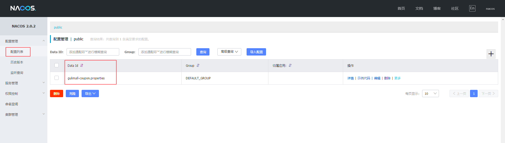
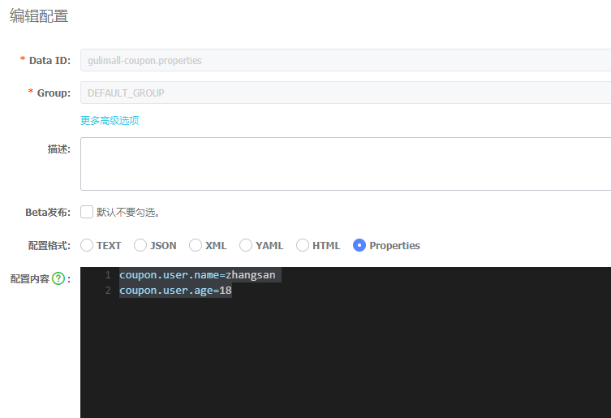

## 1、概述

### 1.1 微服务


### 1.2 Spring Cloud 是什么


### 1.3 Spring Boot 和 Spring Cloud 版本选择


### 1.4 Spring Cloud 升级

#### 注册中心

- Eureka：不推荐，已经停止维护
- Zookeeper：以前一般搭配 Dobbo使用
- Consul：go语言编写的
- Nacos：推荐，Spring Cloud Alibaba中的 Nacos

#### 配置中心

- Config：不推荐
- Consul
- Nocas：推荐
- Apollo：携程开源的项目，但未纳入 Cloud 社区

#### 服务调用

- Ribbon：进入了维护状态，但 Cloud 官方还在
- LoadBalancer：Cloud 官方打算推出的，用来取代 Ribbon，但还不成熟
- Feign：Netflix 开源的，已经进入了维护
- OpenFeign：Spring 社区新出的替代 Feign

#### 网关

- Zuul：Netflix 的，想推出 Zuul2 但胎死腹中
- Zuul2：还未推出
- **Gateway**：推荐，Spring 社区推出的

#### 服务降级、熔断

- **Hystrix**：停更了，官网不再推荐，但国内正在大规模使用
- resilience4j：官网推荐，国外用得多
- **Sentinel**：国内推荐，属于 Spring Cloud Alibaba

#### 服务总线

- Bus：cloud 官方推出的，不推荐
- **Nacos**：推荐    


## 2、微服务架构编码构建

> 约定>配置>编码

### 2.1 创建父工程

新建 Maven 项目，并删除 src 目录

### 2.2 父工程 pom 文件修改

```xml
<?xml version="1.0" encoding="UTF-8"?>
<project xmlns="http://maven.apache.org/POM/4.0.0"
         xmlns:xsi="http://www.w3.org/2001/XMLSchema-instance"
         xsi:schemaLocation="http://maven.apache.org/POM/4.0.0 http://maven.apache.org/xsd/maven-4.0.0.xsd">
    <modelVersion>4.0.0</modelVersion>

    <groupId>com.yunzike.springcloud</groupId>
    <artifactId>cloud2020</artifactId>
    <version>1.0-SNAPSHOT</version>
    <!-- 父工程的打包方式设为 pom -->
    <packaging>pom</packaging>

    <!-- 统一管理 jar 包版本 -->
    <properties>
        <maven.compiler.source>8</maven.compiler.source>
        <maven.compiler.target>8</maven.compiler.target>
        <project.build.sourceEncoding>UTF-8</project.build.sourceEncoding>
        <junit.version>4.12</junit.version>
        <log4j.version>1.2.17</log4j.version>
        <lombok.version>1.16.18</lombok.version>
        <mysql.version>5.1.49</mysql.version>
        <druid.version>1.2.6</druid.version>
        <mybatis.spring.boot.version>2.1.4</mybatis.spring.boot.version>
    </properties>

    <!-- 子模块继承之后，提供作用：锁定版本+子 model 不用写 groupId 和 version -->
    <dependencyManagement>
        <dependencies>
            <!-- spring boot 2.4.3 -->
            <dependency>
                <groupId>org.springframework.boot</groupId>
                <artifactId>spring-boot-dependencies</artifactId>
                <version>2.4.3</version>
                <type>pom</type>
                <scope>import</scope>
            </dependency>
            <!-- spring cloud 2020.0.2 -->
            <dependency>
                <groupId>org.springframework.cloud</groupId>
                <artifactId>spring-cloud-dependencies</artifactId>
                <version>2020.0.2</version>
                <type>pom</type>
                <scope>import</scope>
            </dependency>
            <!-- spring cloud alibaba 2021.1-->
            <dependency>
                <groupId>com.alibaba.cloud</groupId>
                <artifactId>spring-cloud-alibaba-dependencies</artifactId>
                <version>2021.1</version>
                <type>pom</type>
                <scope>import</scope>
            </dependency>

            <dependency>
                <groupId>mysql</groupId>
                <artifactId>mysql-connector-java</artifactId>
                <version>${mysql.version}</version>
            </dependency>
            <dependency>
                <groupId>com.alibaba</groupId>
                <artifactId>druid</artifactId>
                <version>${druid.version}</version>
            </dependency>
            <dependency>
                <groupId>org.mybatis.spring.boot</groupId>
                <artifactId>mybatis-spring-boot-starter</artifactId>
                <version>${mybatis.spring.boot.version}</version>
            </dependency>
        </dependencies>

    </dependencyManagement>

</project>
```

### 2.3 创建子模块


## 3、Eureka


## 4、Zookeeper


## 5、Consul

### 5.1 简介

- Consul 是一套开源的分布式服务发现和配置管理系统，由 HashiCorp 公司用 Go 语言开发。
- 提供了微服务系统中的服务治理、配置中心、控制总线等功能。这些功能中的每一个都可以根据需要单独使用，也可以一起使用以构建全方位的服务网格，总之 Consul 提供了一种完整的服务网格解决方案。
- 它具有很多优点。包括：基于raft 协议，比较简洁；支持健康检查；同时支持 HTTP 和 DNS 协议；支持跨数据中心的 WAN 集群；提供图形界面跨平台，支持Linux、Mac、Windows。

官网：https://www.consul.io

SpringCloud 社区 Consul 文档：https://spring.io/projects/spring-cloud-consul#learn

### 5.2 安装 & 运行

- 安装：不同系统下安装方式不同，参考官网说明

  ```bash
  # CentOS/RHEL 系统下安装
  sudo yum install -y yum-utils
  sudo yum-config-manager --add-repo https://rpm.releases.hashicorp.com/RHEL/hashicorp.repo
  sudo yum -y install consul
  ```

- 使用开发模式启动

  ```bash
  consul agent -dev
  
  # 部署在云服务器时
  consul agent -dev -ui -node=consul-dev -client=你的私网ip
  ```

- 访问端口

  8500

  

### 5.3 注册中心

- 添加 consul 服务发现相关依赖

  ```xml
  <dependency>
    <groupId>org.springframework.cloud</groupId>
    <artifactId>spring-cloud-starter-consul-discovery</artifactId>
  </dependency>
  ```

- 添加 consul 相关配置

  ```yml
  ```


### 5.4 配置中心

- 添加 consul 配置中心相关依赖

  ```xml
  <dependency>
    <groupId>org.springframework.cloud</groupId>
    <artifactId>spring-cloud-starter-consul-config</artifactId>
  </dependency>
  ```

- 添加相关配置

  

- 在 consul 中新增相关配置文件

  


## 6、Ribbon 负载均衡


## 7、OpenFeign

### 7.1 介绍

Feign是一个声明式的HTP客户端，它的目的就是让远程调用更加简单。 Feign提供了HTP请求的模板，**通过编写简单的接口和插入注解**，就可以定义好HTP请求的参数、格式、地址等信息。
Feign整合了 **Ribbon（负载均衡）和 Hystrix（服务熔断)**，可以让我们不再需要显式地使用这两个组件。
Spring Cloud Feign在 Netflix Feign的基础上扩展了对 SpringMvc注解的支持，在其实现下，我们只需创建一个接口并用注解的方式来配置它，即可完成对服务提供方的接囗绑定。简化了Spring Cloud Ribbon自行封装服务调用客户端的开发量。

#### Ribbon

*   Ribbon 是 Netflix 开源的`基于HTTP和TCP等协议负载均衡组件`。
*   Ribbon 可以用来做客户端负载均衡，调用注册中心的服务。
*   Ribbon 的使用需要代码里手动调用目标服务，请参考官方示例：[https://github.com/Netflix/ribbon](https://github.com/Netflix/ribbon)

#### Feign

*   Feign 是 Spring Cloud 组件中的一个轻量级`RESTful`的`HTTP`服务客户端。
*   Feign 内置了 Ribbon，用来做`客户端负载均衡`，去调用服务注册中心的服务。
*   Feign 的使用方式是：使用`Feign的注解`定义接口，调用这个接口，就可以调用服务注册中心的服务。
*   Feign 支持的注解和用法请参考官方文档：[https://github.com/OpenFeign/feign](https://github.com/OpenFeign/feign)
*   **Feign 本身不支持 Spring MVC 的注解，它有一套自己的注解。**

#### OpenFeign

*   OpenFeign 是 Spring Cloud 在 Feign 的基础上支持了 Spring MVC 的注解，如`@RequesMapping`等等。
*   OpenFeign 的`@FeignClient`可以解析 SpringMVC 的`@RequestMapping`注解下的接口，并通过动态代理的方式产生实现类，实现类中做负载均衡并调用其他服务。

### 7.2 使用

- 1）引入依赖

  ```xml
  <dependency>
      <groupId>org.springframework.cloud</groupId>
      <artifactId>spring-cloud-starter-openfeign</artifactId>
  </dependency>
  ```

- 2）开启 Feign 功能

  ```java
  // 在SpringBoot的主类开户Feign功能
  @EnableFeignClients（basePackages ="com.atguigu.gulimall.member.feign"）
  ```

- 3）声明远程接口

  编写一个接口，告诉 SpringCLoud 这个接口需要调用远程服务，声明接口的每一个方法都是调用哪个远程服务的那个请求

  ```java
  @FeignClient("gulimall-coupon")
  public interface CouponFeignService {
  
      @RequestMapping("/coupon/coupon/member/list")
      public R membercoupons();
  
  }
  ```
  

### 7.3 报错 

```bash
org.springframework.beans.factory.UnsatisfiedDependencyException: Error creating bean with name 'memberController': Unsatisfied dependency expressed through field 'couponFeignService'; nested exception is org.springframework.beans.factory.BeanCreationException: Error creating bean with name 'com.yunzike.gulimall.member.feign.CouponFeignService': Unexpected exception during bean creation; nested exception is java.lang.IllegalStateException: No Feign Client for loadBalancing defined. Did you forget to include spring-cloud-starter-loadbalancer?
	at org.springframework.beans.factory.annotation.AutowiredAnnotationBeanPostProcessor$AutowiredFieldElement.resolveFieldValue(AutowiredAnnotationBeanPostProcessor.java:660) ~[spring-beans-5.3.4.jar:5.3.4]
	at org.springframework.beans.factory.annotation.AutowiredAnnotationBeanPostProcessor$AutowiredFieldElement.inject(AutowiredAnnotationBeanPostProcessor.java:640) ~[spring-beans-5.3.4.jar:5.3.4]
	at org.springframework.beans.factory.annotation.InjectionMetadata.inject(InjectionMetadata.java:119) ~[spring-beans-5.3.4.jar:5.3.4]
	at org.springframework.beans.factory.annotation.AutowiredAnnotationBeanPostProcessor.postProcessProperties(AutowiredAnnotationBeanPostProcessor.java:399) ~[spring-beans-5.3.4.jar:5.3.4]
	at org.springframework.beans.factory.support.AbstractAutowireCapableBeanFactory.populateBean(AbstractAutowireCapableBeanFactory.java:1413) ~[spring-beans-5.3.4.jar:5.3.4]
	at org.springframework.beans.factory.support.AbstractAutowireCapableBeanFactory.doCreateBean(AbstractAutowireCapableBeanFactory.java:601) ~[spring-beans-5.3.4.jar:5.3.4]
	at org.springframework.beans.factory.support.AbstractAutowireCapableBeanFactory.createBean(AbstractAutowireCapableBeanFactory.java:524) ~[spring-beans-5.3.4.jar:5.3.4]
	at org.springframework.beans.factory.support.AbstractBeanFactory.lambda$doGetBean$0(AbstractBeanFactory.java:335) ~[spring-beans-5.3.4.jar:5.3.4]
	at org.springframework.beans.factory.support.DefaultSingletonBeanRegistry.getSingleton(DefaultSingletonBeanRegistry.java:234) ~[spring-beans-5.3.4.jar:5.3.4]
	at org.springframework.beans.factory.support.AbstractBeanFactory.doGetBean(AbstractBeanFactory.java:333) ~[spring-beans-5.3.4.jar:5.3.4]
	at org.springframework.beans.factory.support.AbstractBeanFactory.getBean(AbstractBeanFactory.java:208) ~[spring-beans-5.3.4.jar:5.3.4]
	at org.springframework.beans.factory.support.DefaultListableBeanFactory.preInstantiateSingletons(DefaultListableBeanFactory.java:944) ~[spring-beans-5.3.4.jar:5.3.4]
	at org.springframework.context.support.AbstractApplicationContext.finishBeanFactoryInitialization(AbstractApplicationContext.java:917) ~[spring-context-5.3.4.jar:5.3.4]
	at org.springframework.context.support.AbstractApplicationContext.refresh(AbstractApplicationContext.java:582) ~[spring-context-5.3.4.jar:5.3.4]
	at org.springframework.boot.web.servlet.context.ServletWebServerApplicationContext.refresh(ServletWebServerApplicationContext.java:144) ~[spring-boot-2.4.3.jar:2.4.3]
	at org.springframework.boot.SpringApplication.refresh(SpringApplication.java:767) [spring-boot-2.4.3.jar:2.4.3]
	at org.springframework.boot.SpringApplication.refresh(SpringApplication.java:759) [spring-boot-2.4.3.jar:2.4.3]
	at org.springframework.boot.SpringApplication.refreshContext(SpringApplication.java:426) [spring-boot-2.4.3.jar:2.4.3]
	at org.springframework.boot.SpringApplication.run(SpringApplication.java:326) [spring-boot-2.4.3.jar:2.4.3]
	at org.springframework.boot.SpringApplication.run(SpringApplication.java:1311) [spring-boot-2.4.3.jar:2.4.3]
	at org.springframework.boot.SpringApplication.run(SpringApplication.java:1300) [spring-boot-2.4.3.jar:2.4.3]
	at com.yunzike.gulimall.member.GulimallMemberApplication.main(GulimallMemberApplication.java:16) [classes/:na]
Caused by: org.springframework.beans.factory.BeanCreationException: Error creating bean with name 'com.yunzike.gulimall.member.feign.CouponFeignService': Unexpected exception during bean creation; nested exception is java.lang.IllegalStateException: No Feign Client for loadBalancing defined. Did you forget to include spring-cloud-starter-loadbalancer?
	at org.springframework.beans.factory.support.AbstractAutowireCapableBeanFactory.createBean(AbstractAutowireCapableBeanFactory.java:537) ~[spring-beans-5.3.4.jar:5.3.4]
	at org.springframework.beans.factory.support.AbstractBeanFactory.lambda$doGetBean$0(AbstractBeanFactory.java:335) ~[spring-beans-5.3.4.jar:5.3.4]
	at org.springframework.beans.factory.support.DefaultSingletonBeanRegistry.getSingleton(DefaultSingletonBeanRegistry.java:234) ~[spring-beans-5.3.4.jar:5.3.4]
	at org.springframework.beans.factory.support.AbstractBeanFactory.doGetBean(AbstractBeanFactory.java:333) ~[spring-beans-5.3.4.jar:5.3.4]
	at org.springframework.beans.factory.support.AbstractBeanFactory.getBean(AbstractBeanFactory.java:208) ~[spring-beans-5.3.4.jar:5.3.4]
	at org.springframework.beans.factory.config.DependencyDescriptor.resolveCandidate(DependencyDescriptor.java:276) ~[spring-beans-5.3.4.jar:5.3.4]
	at org.springframework.beans.factory.support.DefaultListableBeanFactory.doResolveDependency(DefaultListableBeanFactory.java:1380) ~[spring-beans-5.3.4.jar:5.3.4]
	at org.springframework.beans.factory.support.DefaultListableBeanFactory.resolveDependency(DefaultListableBeanFactory.java:1300) ~[spring-beans-5.3.4.jar:5.3.4]
	at org.springframework.beans.factory.annotation.AutowiredAnnotationBeanPostProcessor$AutowiredFieldElement.resolveFieldValue(AutowiredAnnotationBeanPostProcessor.java:657) ~[spring-beans-5.3.4.jar:5.3.4]
	... 21 common frames omitted
Caused by: java.lang.IllegalStateException: No Feign Client for loadBalancing defined. Did you forget to include spring-cloud-starter-loadbalancer?
	at org.springframework.cloud.openfeign.FeignClientFactoryBean.loadBalance(FeignClientFactoryBean.java:351) ~[spring-cloud-openfeign-core-3.0.3.jar:3.0.3]
	at org.springframework.cloud.openfeign.FeignClientFactoryBean.getTarget(FeignClientFactoryBean.java:398) ~[spring-cloud-openfeign-core-3.0.3.jar:3.0.3]
	at org.springframework.cloud.openfeign.FeignClientFactoryBean.getObject(FeignClientFactoryBean.java:371) ~[spring-cloud-openfeign-core-3.0.3.jar:3.0.3]
	at org.springframework.cloud.openfeign.FeignClientsRegistrar.lambda$registerFeignClient$0(FeignClientsRegistrar.java:235) ~[spring-cloud-openfeign-core-3.0.3.jar:3.0.3]
	at org.springframework.beans.factory.support.AbstractAutowireCapableBeanFactory.obtainFromSupplier(AbstractAutowireCapableBeanFactory.java:1231) ~[spring-beans-5.3.4.jar:5.3.4]
	at org.springframework.beans.factory.support.AbstractAutowireCapableBeanFactory.createBeanInstance(AbstractAutowireCapableBeanFactory.java:1173) ~[spring-beans-5.3.4.jar:5.3.4]
	at org.springframework.beans.factory.support.AbstractAutowireCapableBeanFactory.doCreateBean(AbstractAutowireCapableBeanFactory.java:564) ~[spring-beans-5.3.4.jar:5.3.4]
	at org.springframework.beans.factory.support.AbstractAutowireCapableBeanFactory.createBean(AbstractAutowireCapableBeanFactory.java:524) ~[spring-beans-5.3.4.jar:5.3.4]
	... 29 common frames omitted
```

关键在于` No Feign Client for loadBalancing defined. Did you forget to include spring-cloud-starter-loadbalancer?`，SpringCloud OpenFeign 在 Hoxton.M2 RELEASED 版本之后不再使用 Ribbon 而是使用 spring-cloud-loadbalancer，所以不引入 spring-cloud-loadbalancer 会报错

```xml
<dependency>
    <groupId>org.springframework.cloud</groupId>
    <artifactId>spring-cloud-loadbalancer</artifactId>
</dependency>
```


### 7.2 原理


## 8、Hystrix


## 9、Zuul


## 10、Gateway

官方文档：https://docs.spring.io/spring-cloud-gateway/docs/current/reference/html/#configuring-route-predicate-factories-and-gateway-filter-factories

- **Route** 路由
- **Predicate** 断言
- **Filter** 过滤器


2）使用网关

```java
// 1 开启网关服务的服务注册与发现
@EnableDiscoveryClient

// 2、使用配置中心

// 3、因为pom.xml 引入了common从而引入了MyBatis Plus，需要排除数据源的自动配置
@EnableDiscoveryClient
@SpringBootApplication(exclude = {DataSourceAutoConfiguration.class})
public class GulimallGatewayApplication {

    public static void main(String[] args) {
        SpringApplication.run(GulimallGatewayApplication.class, args);
    }

}

// 4、设置端口为88


//5、参考官方文档配置gateway路由，application.yml
spring:
  cloud:
    gateway:
      routes:
        - id: test_route
          uri:  http://www.baidu.com
          predicates:
            - Query=url,baidu
        - id: qq_route
          uri: http://www.qq.com
          predicates:
            - Query=url,qq
```

## 


## 11、Config


## 12、Bus


## 13、SpringCloud Stream 消息驱动


## 14、SpringCloud Sleuth 分布式请求链路跟踪


## 15、SpringCloud Alibaba


## 16、Nacos

- 简介

  Nacos 是阿里巴巴开源的一个更易于构建云原生应用的动态服务发现、配置管理和服务管理平台。使用java编写，需要依赖 java 环境。

- 相关文档

  Nacos 官方文档地址：

  https://nacos.io/zh-cn/docs/what-is-nacos.html

  Spring Cloud Alibaba Nacos 文档 ：

  https://spring-cloud-alibaba-group.github.io/github-pages/hoxton/en-us/index.html#_spring_cloud_alibaba_nacos_discovery

  github 地址：

  https://github.com/alibaba/nacos

### 16.1 注册中心

- 下载 nacos-server 

  https://github.com/alibaba/nacos/releases

- 启动 nacos-server

  双击 bin 中的 startup.cmd 文件
  访问 `http:/localhost：8848/nacos/` 
  使用默认的 nacos/nacos 进行登录

  **启动报错**：

  ```bash
  org.springframework.context.ApplicationContextException: Unable to start web server; nested exception is org.springframework.boot.web.server.WebServerException: Unable to start embedded Tomcat
          at org.springframework.boot.web.servlet.context.ServletWebServerApplicationContext.onRefresh(ServletWebServerApplicationContext.java:156)
  ```

  nacos 是默认的集群模式 

  ```bash
  set MODE="cluster"
  ```

  需要在 startup.cmd 里面改成单机模式

  ```bash
  set MODE="standalone"
  ```

- 将微服务注册到 nacos 中

  引入 Nacos Discovery Starter

  ```xml
  <dependency>
       <groupId>com.alibaba.cloud</groupId>
       <artifactId>spring-cloud-starter-alibaba-nacos-discovery</artifactId>
  </dependency>
  ```

  在应用的 `/src/main/resources/application.yml` 配置文件中配置 `Nacos Server` 地址

  ```yml
  spring:
    cloud:
      nacos:
        discovery:
          server-addr: 127.0.0.1:8848
  ```

  使用 `@EnableDiscoveryClient` 注解开启服务注册与发现功能

  ```java
  @EnableDiscoveryClient
  @SpringBootApplication
  public class GulimallMemberApplication {
  
      public static void main(String[] args) {
          SpringApplication.run(GulimallMemberApplication.class, args);
      }
  
  }
  ```

  每一个服务都需要配置服务的名字

  ```yml
  spring:
    application:
      name: gulimall-member
  ```


### 16.2 配置中心

#### 使用步骤

1）引入依赖

```xml
<!-- nacos配置中心 -->
<dependency>
    <groupId>com.alibaba.cloud</groupId>
    <artifactId>spring-cloud-starter-alibaba-nacos-config</artifactId>
</dependency>
```

```xml
<!-- 新版本 nacos 配置中心配置文件不生效，可能需要手动引入以下依赖 -->
<dependency>
    <groupId>org.springframework.cloud</groupId>
    <artifactId>spring-cloud-starter-bootstrap</artifactId>
</dependency>
```

2）创建一个 bootstrap.properties 或 bootstrap.yml

```bash
# 指定服务名
spring.application.name=gulimall-coupon

# 指定配置中心地址
spring.cloud.nacos.config.server-addr=127.0.0.1:8848
```

3）配置中心添加配置文件

默认文件名（ Data Id）：服务名.properties





4）@Value（"$配置项的名}"）获取到配置

5）动态获取并刷新配置

在使用配置项的类上添加注解 `@RefreshScope`


如果配置中心和当前应用的配置文件中都配置了相同的项，优先使用配置中心的配置。

#### 细节

- **命名空间（配置隔离）**

  默认：public（保留空间）；默认新增的所有配置都在 public空间。

  1、开发，测试，生产：利用命名空间来做环境隔离。
  注意：在 bootstrap, properties；

  配置上，需要使用哪个命名空间下的配置，只能写命名空间的ID

  ```bash
  spring.cloud.nacos.config.namespace=9de62e44-cd2a-4a82-bf5c-95878bd5e871
  ```

  2、每一个微服务之间互相隔离配置，每一个微服务都创建自己的命名空间，只加载自己命名空间下的所有配置

- **配置集**

  即 Nacos 配置中心中的一个配置文件，**配置集ID（Data ID）**：配置文件名

- **配置分组（Group）**

  默认所有的配置集都属于：DEFAULT GROUP；

  指定分组

  ```bash
  spring.cloud.nacos.config.group=1111
  ```

- **项目中推荐使用方式**

  每个微服务创建自己的命名空间

  使用配置分组区分环境：dev、test、prod

- **同时加载多个配置集**

  除了加载指定命名空间下的多个指定的配置文件，仍然会加载该命名空间下默认的配置文件（如果有）

  ```yml
  spring:
    application:
      name: gulimall-coupon
    cloud:
      nacos:
        config:
          server-addr: 127.0.0.1:8848
          namespace: 57aeb5e2-c7b0-49cd-b416-a29d6d7872ba
          # ext-config: 已经过时，使用  extensionConfigs
          extensionConfigs:
            - dataId: datasource.yml
              group: dev
              refresh: true
            - dataId: mybatis.yml
              group: dev
              refresh: true
            - dataId: other.yml
              group: dev
              refresh: true
  ```

  

  1）、微服务任何配置信息，任何配置文件都可以放在配置中心中
  2）、只需要在 bootstrap.properties说明加载配置中心中哪些配置文件即可
  3）、 @VaLue, @ConfigurationProperties。
  以前 SpringBoot任何方法从配置文件中获取值，都能使用。
  配置中心有的优先使用配置中心中的

## 17、Sentinel


## 18、Seata


## 