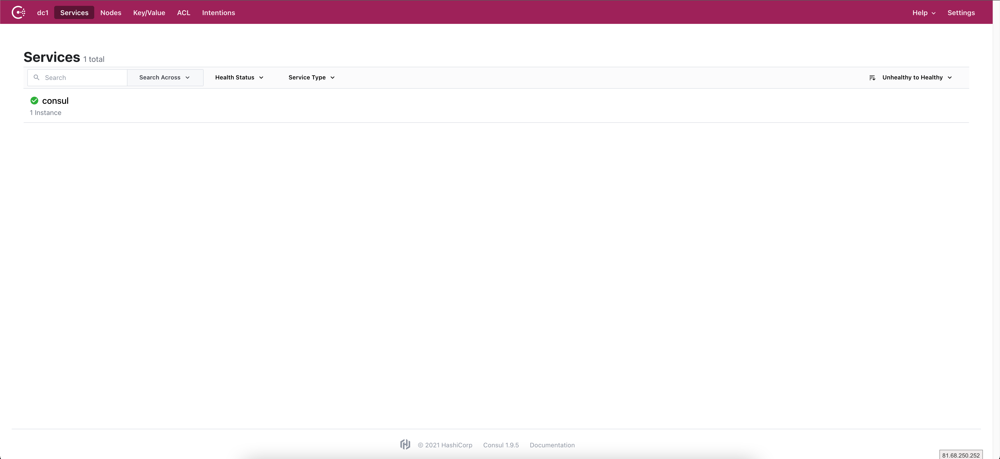

## 1、概述

### 1.1 微服务


### 1.2 Spring Cloud 是什么


### 1.3 Spring Boot 和 Spring Cloud 版本选择


### 1.4 Spring Cloud 升级

#### 注册中心

- Eureka：不推荐，已经停止维护
- Zookeeper：以前一般搭配 Dobbo使用
- Consul：go语言编写的
- Nacos：推荐，Spring Cloud Alibaba中的 Nacos

#### 配置中心

- Config：不推荐
- Consul
- Nocas：推荐
- Apollo：携程开源的项目，但未纳入 Cloud 社区

#### 服务调用

- Ribbon：进入了维护状态，但 Cloud 官方还在
- LoadBalancer：Cloud 官方打算推出的，用来取代 Ribbon，但还不成熟
- Feign：Netflix 开源的，已经进入了维护
- OpenFeign：Spring 社区新出的替代 Feign

#### 网关

- Zuul：Netflix 的，想推出 Zuul2 但胎死腹中
- Zuul2：还未推出
- **Gateway**：推荐，Spring 社区推出的

#### 服务降级、熔断

- **Hystrix**：停更了，官网不再推荐，但国内正在大规模使用
- resilience4j：官网推荐，国外用得多
- **Sentinel**：国内推荐，属于 Spring Cloud Alibaba

#### 服务总线

- Bus：cloud 官方推出的，不推荐
- **Nacos**：推荐    


## 2、微服务架构编码构建

> 约定>配置>编码

### 2.1 创建父工程

新建 Maven 项目，并删除 src 目录

### 2.2 父工程 pom 文件修改

```xml
<?xml version="1.0" encoding="UTF-8"?>
<project xmlns="http://maven.apache.org/POM/4.0.0"
         xmlns:xsi="http://www.w3.org/2001/XMLSchema-instance"
         xsi:schemaLocation="http://maven.apache.org/POM/4.0.0 http://maven.apache.org/xsd/maven-4.0.0.xsd">
    <modelVersion>4.0.0</modelVersion>

    <groupId>com.yunzike.springcloud</groupId>
    <artifactId>cloud2020</artifactId>
    <version>1.0-SNAPSHOT</version>
    <!-- 父工程的打包方式设为 pom -->
    <packaging>pom</packaging>

    <!-- 统一管理 jar 包版本 -->
    <properties>
        <maven.compiler.source>8</maven.compiler.source>
        <maven.compiler.target>8</maven.compiler.target>
        <project.build.sourceEncoding>UTF-8</project.build.sourceEncoding>
        <junit.version>4.12</junit.version>
        <log4j.version>1.2.17</log4j.version>
        <lombok.version>1.16.18</lombok.version>
        <mysql.version>5.1.49</mysql.version>
        <druid.version>1.2.6</druid.version>
        <mybatis.spring.boot.version>2.1.4</mybatis.spring.boot.version>
    </properties>

    <!-- 子模块继承之后，提供作用：锁定版本+子 model 不用写 groupId 和 version -->
    <dependencyManagement>
        <dependencies>
            <!-- spring boot 2.4.3 -->
            <dependency>
                <groupId>org.springframework.boot</groupId>
                <artifactId>spring-boot-dependencies</artifactId>
                <version>2.4.3</version>
                <type>pom</type>
                <scope>import</scope>
            </dependency>
            <!-- spring cloud 2020.0.2 -->
            <dependency>
                <groupId>org.springframework.cloud</groupId>
                <artifactId>spring-cloud-dependencies</artifactId>
                <version>2020.0.2</version>
                <type>pom</type>
                <scope>import</scope>
            </dependency>
            <!-- spring cloud alibaba 2021.1-->
            <dependency>
                <groupId>com.alibaba.cloud</groupId>
                <artifactId>spring-cloud-alibaba-dependencies</artifactId>
                <version>2021.1</version>
                <type>pom</type>
                <scope>import</scope>
            </dependency>

            <dependency>
                <groupId>mysql</groupId>
                <artifactId>mysql-connector-java</artifactId>
                <version>${mysql.version}</version>
            </dependency>
            <dependency>
                <groupId>com.alibaba</groupId>
                <artifactId>druid</artifactId>
                <version>${druid.version}</version>
            </dependency>
            <dependency>
                <groupId>org.mybatis.spring.boot</groupId>
                <artifactId>mybatis-spring-boot-starter</artifactId>
                <version>${mybatis.spring.boot.version}</version>
            </dependency>
        </dependencies>

    </dependencyManagement>

</project>
```

### 2.3 创建子模块


## 3、Eureka


## 4、Zookeeper


## 5、Consul

### 5.1 简介

- Consul 是一套开源的分布式服务发现和配置管理系统，由 HashiCorp 公司用 Go 语言开发。
- 提供了微服务系统中的服务治理、配置中心、控制总线等功能。这些功能中的每一个都可以根据需要单独使用，也可以一起使用以构建全方位的服务网格，总之 Consul 提供了一种完整的服务网格解决方案。
- 它具有很多优点。包括：基于raft 协议，比较简洁；支持健康检查；同时支持 HTTP 和 DNS 协议；支持跨数据中心的 WAN 集群；提供图形界面跨平台，支持Linux、Mac、Windows。

官网：https://www.consul.io

SpringCloud 社区 Consul 文档：https://spring.io/projects/spring-cloud-consul#learn

### 5.2 安装 & 运行

- 安装：不同系统下安装方式不同，参考官网说明

  ```bash
  # CentOS/RHEL 系统下安装
  sudo yum install -y yum-utils
  sudo yum-config-manager --add-repo https://rpm.releases.hashicorp.com/RHEL/hashicorp.repo
  sudo yum -y install consul
  ```

- 使用开发模式启动

  ```bash
  consul agent -dev
  
  # 部署在云服务器时
  consul agent -dev -ui -node=consul-dev -client=你的私网ip
  ```

- 访问端口

  8500

  

### 5.3 注册中心

- 添加 consul 服务发现相关依赖

  ```xml
  <dependency>
    <groupId>org.springframework.cloud</groupId>
    <artifactId>spring-cloud-starter-consul-discovery</artifactId>
  </dependency>
  ```

- 添加 consul 相关配置

  ```yml
  ```


### 5.4 配置中心

- 添加 consul 配置中心相关依赖

  ```xml
  <dependency>
    <groupId>org.springframework.cloud</groupId>
    <artifactId>spring-cloud-starter-consul-config</artifactId>
  </dependency>
  ```

- 添加相关配置

  

- 在 consul 中新增相关配置文件

  


## 6、Ribbon 负载均衡


## 7、OpenFeign

### 7.1 介绍

#### Ribbon

*   Ribbon 是 Netflix 开源的`基于HTTP和TCP等协议负载均衡组件`。
*   Ribbon 可以用来做客户端负载均衡，调用注册中心的服务。
*   Ribbon 的使用需要代码里手动调用目标服务，请参考官方示例：[https://github.com/Netflix/ribbon](https://github.com/Netflix/ribbon)

#### Feign

*   Feign 是 Spring Cloud 组件中的一个轻量级`RESTful`的`HTTP`服务客户端。
*   Feign 内置了 Ribbon，用来做`客户端负载均衡`，去调用服务注册中心的服务。
*   Feign 的使用方式是：使用`Feign的注解`定义接口，调用这个接口，就可以调用服务注册中心的服务。
*   Feign 支持的注解和用法请参考官方文档：[https://github.com/OpenFeign/feign](https://github.com/OpenFeign/feign)
*   **Feign 本身不支持 Spring MVC 的注解，它有一套自己的注解。**

#### OpenFeign

*   OpenFeign 是 Spring Cloud 在 Feign 的基础上支持了 Spring MVC 的注解，如`@RequesMapping`等等。
*   OpenFeign 的`@FeignClient`可以解析 SpringMVC 的`@RequestMapping`注解下的接口，并通过动态代理的方式产生实现类，实现类中做负载均衡并调用其他服务。

### 7.2 使用


### 7.3 原理


## 8、Hystrix


## 9、Zuul


## 10、Gateway


## 11、Config


## 12、Bus


## 13、SpringCloud Stream 消息驱动


## 14、SpringCloud Sleuth 分布式请求链路跟踪


## 15、SpringCloud Alibaba


## 16、Nacos


## 17、Sentinel


## 18、Seata


## 