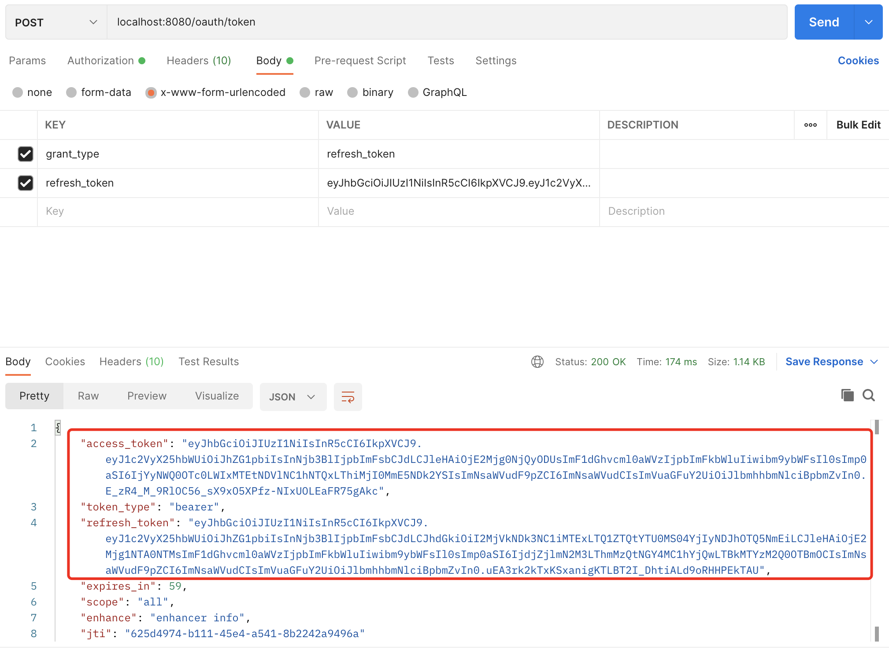

## 1、介绍

### 1.1 安全框架概述

什么是安全框架? 解决系统安全问题的框架。如果没有安全框架，我们需要手动处理每个资源的访问控制，非常 麻烦。使用安全框架，我们可以通过配置的方式实现对资源的访问限制。

### 1.2 常用安全框架

Spring Security:Spring家族一员。是一个能够为基于Spring的企业应用系统提供声明式的安全访问控制解决 方案的安全框架。它提供了一组可以在Spring应用上下文中配置的Bean，充分利用了Spring IoC，DI(控制 反转Inversion of Control,DI:Dependency Injection 依赖注入)和AOP(面向切面编程)功能，为应用系 统提供声明式的安全访问控制功能，减少了为企业系统安全控制编写大量重复代码的工作。

Apache Shiro:一个功能强大且易于使用的Java安全框架,提供了认证,授权,加密,和会话管理。

### 1.3 Spring Security简介

#### 概述

Spring Security是一个高度自定义的安全框架。利用 Spring IoC/DI和AOP功能，为系统提供了声明式安全访问控 制功能，减少了为系统安全而编写大量重复代码的工作。使用 Spring Secruity 的原因有很多，但大部分都是发现了 javaEE的 Servlet 规范或 EJB 规范中的安全功能缺乏典型企业应用场景。同时认识到他们在 WAR 或 EAR 级别无法移 植。因此如果你更换服务器环境，还有大量工作去重新配置你的应用程序。使用 Spring Security解决了这些问题， 也为你提供许多其他有用的、可定制的安全功能。正如你可能知道的两个应用程序的两个主要区域是“认证”和“授 权”(或者访问控制)。这两点也是 Spring Security 重要核心功能。“认证”，是建立一个他声明的主体的过程(一 个“主体”一般是指用户，设备或一些可以在你的应用程序中执行动作的其他系统)，通俗点说就是系统认为用户是否 能登录。“授权”指确定一个主体是否允许在你的应用程序执行一个动作的过程。通俗点讲就是系统判断用户是否有权 限去做某些事情。

#### 历史

Spring Security 以“The Acegi Secutity System for Spring”的名字始于2003年年底。其前身为 acegi 项目。起因是 Spring 开发者邮件列表中一个问题，有人提问是否考虑提供一个基于 Spring 的安全实现。限制于时间问题，开发出 了一个简单的安全实现，但是并没有深入研究。几周后，Spring 社区中其他成员同样询问了安全问题，代码提供给 了这些人。2004 年 1 月份已经有 20 人左右使用这个项目。随着更多人的加入，在 2004 年 3 月左右在 sourceforge 中建立了一个项目。在最开始并没有认证模块，所有的认证功能都是依赖容器完成的，而 acegi 则注重授权。但是随 着更多人的使用，基于容器的认证就显现出了不足。acegi 中也加入了认证功能。大约 1 年后 acegi 成为 Spring子项 目。在 2006 年 5 月发布了 acegi 1.0.0 版本。2007 年底 acegi 更名为Spring Security。


## 2、入门案例

### 2.1 创建项目并引入依赖


```xml
<dependency>
    <groupId>org.springframework.boot</groupId>
    <artifactId>spring-boot-starter-web</artifactId>
</dependency>
<dependency>
    <groupId>org.springframework.boot</groupId>
    <artifactId>spring-boot-starter-security</artifactId>
</dependency>
```

### 2.2 创建 Controller

```java
package com.yunzike.controller;

import org.springframework.web.bind.annotation.GetMapping;
import org.springframework.web.bind.annotation.RestController;

@RestController
public class HelloController {

    @GetMapping("/hello")
    public String hello(){
        return "hello, security";
    }

}
```

### 2.3 测试

启动服务，浏览器访问 `http://localhost:8080/hello` ，请求该 controller 会默认跳转到一个登录页面，因为项目引入了 `Spring Security` 的依赖， `Security` 会默认开启认证。其中，默认用户名为：user，而密码则自动生成在控制台且每次重启密码都会不同。输入账号密码后，浏览器会显示 `hello, security` 。

```bash
Using generated security password: a27c7717-eaff-4194-b2ae-ca4ee7d66e28
```


## 3、认证

### 3.1 常用接口与实现

#### **UserDetailsService**

```java
public interface UserDetailsService {
	UserDetails loadUserByUsername(String username) throws UsernameNotFoundException;
}
```

当什么也没有配置的时候，账号和密码是由 `Spring Security` 定义生成的。而在实际项目中账号和密码都是从数据库中查询出来的。所以我们要通过自定义逻辑控制认证逻辑。如果需要自定义逻辑时，只需要实现 `UserDetailsService` 接口即可。**返回值 `UserDetails`** 也是一个接口：

```java
public interface UserDetails extends Serializable {
    // 获取所有权限
   	Collection<? extends GrantedAuthority> getAuthorities();
    // 获取密码
   	String getPassword();
    // 获取用户名
   	String getUsername();
    // 是否账号过期
   	boolean isAccountNonExpired();
    // 是否账号被锁定
   	boolean isAccountNonLocked();
    // 凭证（密码）是否过期
   	boolean isCredentialsNonExpired();
    // 是否可用
   	boolean isEnabled();
}
```

要返回 **UserDetails** 实例只能返回接口的实现类。Spring Security 提供了如下实现类，我们一般使用 **User** 即可。


其中构造方法有两个，调用其中任何一个都可以实例化 **UserDetails** 实现类 **User** 类的实例。而三个参数的构造方法实际上也是调用 7 个参数的构造方法。

```java
/**
 * @param username 客户端传递过来的用户名
 * @param password 数据库中查出的密码
 * @param authorities 用户具有的权限，不允许为 null
 */
public User(String username, String password, Collection<? extends GrantedAuthority> authorities) {
   	this(username, password, true, true, true, true, authorities);
}
```

#### **PasswordEncoder**

**Spring Security** 要求容器中必须有 **PasswordEncoder** 实例。所以当自定义登录逻辑时要求必须给容器注入 **PaswordEncoder** 的 bean 对象。

- 接口介绍

  encode() :把参数按照特定的解析规则进行解析。

  matches() :验证从存储中获取的编码密码与编码后提交的原始密码是否匹配。如果密码匹配，则返回 true; 如果不匹配，则返回 false。第一个参数表示需要被解析的密码。第二个参数表示存储的密码。

  upgradeEncoding() :如果解析的密码能够再次进行解析且达到更安全的结果则返回 true，否则返回 false。 默认返回 false。

##### 内置解析器介绍

在 Spring Security 中内置了很多解析器

##### BcryptPasswordEncoder

BCryptPasswordEncoder 是 Spring Security 官方推荐的密码解析器，平时多使用这个解析器。BCryptPasswordEncoder 是对 bcrypt 强散列方法的具体实现。是基于Hash算法实现的单向加密。可以通过 strength控制加密强度，默认 10.


### 3.2 自定义登录逻辑

- 添加配置文件并注入密码解析器

  当进行自定义登录逻辑时，Spring Security 要求密码必须要经过加密，所以容器内必须有 PasswordEncoder 实例，而不能直接 new 对象。

  ```java
  /**
   * Spring Security 配置文件
   */
  @Configuration
  public class SecurityConfig {
      /**
       * 指定密码解析器
       */
      @Bean
      public PasswordEncoder getPw(){
          return new BCryptPasswordEncoder();
      }
  }
  ```

- 实现 UserDetailsService 接口，自定义认证逻辑

  ```java
  /**
   * 自定义登录逻辑
   */
  @Service
  public class UserDetailsServiceIml implements UserDetailsService {
  
      @Autowired
      private PasswordEncoder pw;
  
      @Override
      public UserDetails loadUserByUsername(String userName) throws UsernameNotFoundException {
  
          // 1.查询数据库判断用户名是否存在，不存在就抛出异常
          if (!"admin".equals(userName)) {
              throw new UsernameNotFoundException("账号不存在！");
          }
          // 2.从数据中查询出密码（查出来的密码应该是注册时加密过的）
          //   Spring Security 会使用 SecurityConfig 配置文件中注入的 PasswordEncoder
          //   将客户端输入的密码进行加密后和查询出来的密码比较认证
          String password = pw.encode("123456");
  
          // 3.权限一般使用 AuthorityUtils.commaSeparatedStringToAuthorityList() 创建
          // 多个权限中间用逗号隔开
          List<GrantedAuthority> authorities = AuthorityUtils.commaSeparatedStringToAuthorityList("admin,normal");
  
          return new User(userName, password, authorities);
      }
  
  }
  ```

  

### 3.3 自定义登录页面

#### 非前后端分离

- 编写登录页 login.html

  ```html
  <!DOCTYPE html>
  <html lang="en">
  <head>
    <meta charset="UTF-8">
    <title>登录页</title>
  </head>
  
  <body>
  <form action="/login" method="post">
      用户名：<input type="text" name="username" /><br/>
      密码：<input type="password" name="password" /><br/>
      <input type="submit" value="登录" />
  </form>
  </body>
  </html>
  
  ```

- 修改配置文件

  ```java
  @Configuration
  public class SecurityConfig extends WebSecurityConfigurerAdapter {
    @Override
    protected void configure(HttpSecurity http) throws Exception { //表单提交
    http.formLogin() //自定义登录页面
    .loginPage("/login.html") //当发现/login时认为是登录，必须和表单提交的地址一样。去执行UserServiceImpl .loginProcessingUrl("/login")
    //登录成功后跳转页面，POST请求
    .successForwardUrl("/toMain");
    http.authorizeRequests() //login.html不需要被认证
    .antMatchers("/login.html").permitAll() //所有请求都必须被认证，必须登录后被访问 .anyRequest().authenticated();
    //关闭csrf防护
            http.csrf().disable();
         }
    @Bean
         public PasswordEncoder getPw(){
            return new BCryptPasswordEncoder();
    } }
  ```

- 编写控制器

  ```java
  
  ```

- 设置请求账户和密码的参数名

  

- 失败跳转


#### 前后端分离

在前后端分离的情况下（比如前台使用VUE或JQ等）我们需要的是在前台接收到"用户未登录"的提示信息，所以我们接下来要做的就是屏蔽重定向的登录页面，并返回统一的json格式的返回体。而实现这一功能的核心就是实现AuthenticationEntryPoint 并在 WebSecurityConfig 中注入，然后在configure(HttpSecurity http)方法中。AuthenticationEntryPoint主要是用来处理匿名用户访问无权限资源时的异常（即未登录，或者登录状态过期失效）


### 3.4 自定义登录成功处理器


### 3.5 自定义登录失败处理器


### 3.6 退出登录


## 4、授权

### 4.1 权限配置详解

- anyRequest

  

- antMatchers

  

- regexMathcers

  

- mvcMathcers

  

- 内置控制访问方法


### 4.2 基于表达式的访问控制

#### 基于权限


#### 基于角色


#### 基于 IP


#### 自定义 403 处理方案


### 4.4 基于注解的访问控制

需要先开启注解


#### @Secured


#### @PreAuthorize


#### @PostAuthorize


### 4.5 Remember 功能实现


### 4.6 CSRF


## 5、Security 原理

### 5.1 常用过滤器链


## 6、Oauth2 认证

### 6.1 Oauth2 简介

#### 简介

第三方认证技术方案最主要是解决认证协议的通用标准问题，因为要实现跨系统认证，各系统之间要遵循一定的接口协议。

OAUTH 协议为用户资源的授权提供了一个安全的、开放而又简易的标准。同时，任何第三方都可以使用OAUTH认 证服务，任何服务提供商都可以实现自身的OAUTH认证服务，因而OAUTH是开放的。业界提供了OAUTH的多种实 现如PHP、JavaScript，Java，Ruby等各种语言开发包，大大节约了程序员的时间，因而OAUTH是简易的。互联网很 多服务如Open API，很多大公司如Google，Yahoo，Microsoft等都提供了OAUTH认证服务，这些都足以说明 OAUTH标准逐渐成为开放资源授权的标准。

Oauth协议目前发展到2.0版本，1.0版本过于复杂，2.0版本已得到广泛应用。

### 6.2 授权模式

#### 授权码模式


#### 简化授权模式


## 7、Spring Security Oauth2 

[为什么你使用的 Spring Security OAuth 过期了？松哥来和大家捋一捋！ - 云+社区 - 腾讯云 (tencent.com)](https://cloud.tencent.com/developer/article/1692275)

### 7.1 环境搭建

#### 引入依赖

```xml
<dependency>
    <groupId>org.springframework.boot</groupId>
    <artifactId>spring-boot-starter-web</artifactId>
</dependency>
<dependency>
    <groupId>org.springframework.boot</groupId>
    <artifactId>spring-boot-starter-test</artifactId>
    <scope>test</scope>
</dependency>

<dependency>
    <groupId>org.springframework.cloud</groupId>
    <artifactId>spring-cloud-starter-security</artifactId>
</dependency>
<dependency>
    <groupId>org.springframework.cloud</groupId>
    <artifactId>spring-cloud-starter-oauth2</artifactId>
</dependency>
```

#### 自定义 User 类和登录逻辑

- user

  ```java
  package com.yunzike.securityoauth2.security;
  
  import org.springframework.security.core.GrantedAuthority;
  import org.springframework.security.core.userdetails.UserDetails;
  
  import java.util.Collection;
  import java.util.List;
  
  /**
   * 自定义 User 类实现 UserDetails
   */
  public class User implements UserDetails {
  
      private String username;
      private String password;
      private List<GrantedAuthority> authorities;
  
      public User(String username,String password,List<GrantedAuthority> authorities){
          this.username = username;
          this.password = password;
          this.authorities = authorities;
      }
  
      @Override
      public Collection<? extends GrantedAuthority> getAuthorities() {
          return authorities;
      }
  
      @Override
      public String getPassword() {
          return password;
      }
  
      @Override
      public String getUsername() {
          return username;
      }
  
      @Override
      public boolean isAccountNonExpired() {
          return true;
      }
  
      @Override
      public boolean isAccountNonLocked() {
          return true;
      }
  
      @Override
      public boolean isCredentialsNonExpired() {
          return true;
      }
  
      @Override
      public boolean isEnabled() {
          return true;
      }
  }
  ```

- 登录

  ```java
  package com.yunzike.securityoauth2.security;
  
  import org.springframework.beans.factory.annotation.Autowired;
  import org.springframework.security.core.GrantedAuthority;
  import org.springframework.security.core.authority.AuthorityUtils;
  import org.springframework.security.core.userdetails.UserDetails;
  import org.springframework.security.core.userdetails.UserDetailsService;
  import org.springframework.security.core.userdetails.UsernameNotFoundException;
  import org.springframework.security.crypto.password.PasswordEncoder;
  import org.springframework.stereotype.Component;
  
  import java.util.List;
  
  /**
   * 自定义登录逻辑
   */
  @Component
  public class UserDetailsServiceImpl implements UserDetailsService {
  
      @Autowired
      private PasswordEncoder pw;
  
      @Override
      public UserDetails loadUserByUsername(String userName) throws UsernameNotFoundException {
  
          System.out.println("===============执行登陆操作====================");
  
          // 1.查询数据库判断用户名是否存在，不存在就抛出异常
          if (!"admin".equals(userName)) {
              throw new UsernameNotFoundException("账号不存在！");
          }
          // 2.从数据中查询出密码（查出来的密码应该是注册时加密过的）
          //   Spring Security 会使用 SecurityConfig 配置文件中注入的 PasswordEncoder
          //   将客户端输入的密码进行加密后和查询出来的密码比较认证
          String password = pw.encode("123456");
  
          // 3.权限一般使用 AuthorityUtils.commaSeparatedStringToAuthorityList() 创建，
          // 多个权限中间用逗号隔开
          List<GrantedAuthority> authorities = AuthorityUtils.commaSeparatedStringToAuthorityList("admin,normal");
  
          return new User(userName, password, authorities);
      }
  }
  ```

#### 添加配置

- Security 配置

  ```java
  /**
   * Security 配置
   */
  @EnableWebSecurity
  @Configuration
  public class SecurityConfig extends WebSecurityConfigurerAdapter {
  
      /**
       * 放行三种路径 + 表单请求，关闭csrf
       */
      @Override
      protected void configure(HttpSecurity http) throws Exception {
          http.authorizeRequests()
                  .antMatchers("/oauth/**","/login/**","/logout/**").permitAll()
                  .anyRequest().authenticated()
                  .and()
                  .formLogin()
                  .permitAll()
                  .and()
                  .csrf().disable();
  
      }
  
      /**
       * 指定密码解析器
       */
      @Bean
      public PasswordEncoder getPw(){
          return new BCryptPasswordEncoder();
      }
  
  }
  ```

- 授权服务器配置

  ```java
  package com.yunzike.securityoauth2.config;
  
  import org.springframework.beans.factory.annotation.Autowired;
  import org.springframework.context.annotation.Configuration;
  import org.springframework.security.crypto.password.PasswordEncoder;
  import org.springframework.security.oauth2.config.annotation.configurers.ClientDetailsServiceConfigurer;
  import org.springframework.security.oauth2.config.annotation.web.configuration.AuthorizationServerConfigurerAdapter;
  import org.springframework.security.oauth2.config.annotation.web.configuration.EnableAuthorizationServer;
  
  /**
   * 授权服务器配置
   */
  @Configuration
  @EnableAuthorizationServer
  public class AuthorizationServerConfig extends AuthorizationServerConfigurerAdapter {
  
      @Autowired
      private PasswordEncoder pw;
  
      @Override
      public void configure(ClientDetailsServiceConfigurer clients) throws Exception {
          clients.inMemory()// 为了 demo 实现方便先直接放内存
                  //客户端ID
                  .withClient("client")
                  //秘钥
                  .secret(pw.encode("123456"))
                  //重定向地址
                  .redirectUris("http://www.baidu.com")
                  //授权范围
                  .scopes("all")
                  /**
                   * 授权类型
                   * authorization_code：授权码模式
                   */
                  .authorizedGrantTypes("authorization_code");
      }
  }
  ```

- 资源服务器配置

  ```java
  package com.yunzike.securityoauth2.config;
  
  import org.springframework.context.annotation.Configuration;
  import org.springframework.security.config.annotation.web.builders.HttpSecurity;
  import org.springframework.security.oauth2.config.annotation.web.configuration.EnableResourceServer;
  import org.springframework.security.oauth2.config.annotation.web.configuration.ResourceServerConfigurerAdapter;
  
  /**
   * 资源服务器配置
   */
  @Configuration
  @EnableResourceServer
  public class ResourceServerConfig extends ResourceServerConfigurerAdapter {
  
      /**
       * 需要先拦截所有使得跳转授权服务器认证，并配置授权后可访问的资源
       *
       * @param http
       * @throws Exception
       */
      @Override
      public void configure(HttpSecurity http) throws Exception {
          http.csrf().disable().authorizeRequests()
                  .anyRequest().authenticated()
                  .and()
                  .requestMatchers()
            			.antMatchers("/user/**");
      }
  }
  
  ```

- 准备资源

  ```java
  package com.yunzike.securityoauth2.controller;
  
  import org.springframework.security.core.Authentication;
  import org.springframework.web.bind.annotation.GetMapping;
  import org.springframework.web.bind.annotation.RequestMapping;
  import org.springframework.web.bind.annotation.RestController;
  
  @RestController
  @RequestMapping("/user")
  public class UserController {
  
      @GetMapping("/getCurrentUser")
      public Object getCurrentUser(Authentication authentication){
          return authentication.getPrincipal();
      }
  
  }
  ```

### 7.2 获取授权码

#### 请求地址

http://localhost:8080/oauth/authorize?response_type=code&client_id=client&redirect_uri=http://www.baidu.com&scope=all

说明：

- 请求方式：get
- oauth/authorize：授权码获取地址，固定的，由Spring Security Oauth2提供
- response_code：参数值为 code 表示获取授权码
- client_id：请求的客户端，必须为在授权服务器中配置了的客户端ID
- redirect_uri：获取授权码成功后重定向的地址
- scope：all 授权范围

#### 操作流程

首先会跳转到Spring Security 登录页面，输入账号密码正确后，

跳转 Oauth2 的授权服务器的授权页面，

选择 Approve 同意就会跳转到重定向的地址，并携带授权码 code 。


### 7.3 使用授权码获取令牌

#### 请求地址

http://lcalhost:8080/oauth/token


说明：

- 请求方式：post
- username：客户端ID
- password：客户端秘钥
- grant_type：authorization_code 模式为授权码模式
- client_id：客户端ID
- redirect_uri：重定向地址
- scope：all 授权范围
- code：授权码 

返回令牌：access_token


### 7.4 使用令牌访问资源


### 7.5 密码模式

#### 环境配置

- 在 `Spring Security` 配置文件中添加 `AuthenticationManager`

  ```java
  @Bean
  public AuthenticationManager authenticationManager() throws Exception {
    return super.authenticationManager();
  }
  ```

- 在授权服务器配置中添加配置

  ```java
  @Autowired
  private AuthenticationManager authenticationManager;
  
  @Autowired
  private UserDetailsService userDetailsService;
  
  /**
   * 密码模式配置
   */
  @Override
  public void configure(AuthorizationServerEndpointsConfigurer endpoints) throws Exception {
      endpoints.authenticationManager(authenticationManager)
              .userDetailsService(userDetailsService);
  }
  ```

- 在原授权服务器配置中关于客户端的授权类型中添加密码模式

  ```java
  /**
   * 授权类型：可同时开放多种模式
   * authorization_code：授权码模式
   * password：密码模式
   */
  .authorizedGrantTypes("authorization_code","password");
  ```

#### 操作流程

- 获取令牌

  

  

  说明：

  grant_type：password 密码模式

  scope：all 授权范围

  username：admin 用户登录账号

  password：123456 用户账号的密码

  

  access_token：返回的令牌

- 使用令牌访问资源

  

  

### 7.6 使用 Redis 存储 token

令牌默认存储在内存中，可以引入 Redis 来存储

#### 引入 Redis 相关依赖

```xml
<!-- redis 依赖 -->
<dependency>
    <groupId>org.springframework.boot</groupId>
    <artifactId>spring-boot-starter-data-redis</artifactId>
</dependency>
<dependency>
    <groupId>org.apache.commons</groupId>
    <artifactId>commons-pool2</artifactId>
</dependency>
```

#### 添加 Redis 配置

```properties
# Redis 配置
spring.redis.host=81.68.250.252
spring.redis.port=6379
```

#### 添加`RedisTokenStore` 的 Bean

```java
/**
 * Redis 配置
 */
@Configuration
public class RedisConfig {
    @Autowired
    private RedisConnectionFactory redisConnectionFactory;

    @Bean
    public TokenStore redisTokenStore(){
        return new RedisTokenStore(redisConnectionFactory);
    }
}
```

在授权服务器配置中使用 `RedisTokenStore` 存储 token

```java
@Autowired
private TokenStore tokenStore;

/**
* 密码模式配置
*/
@Override
public void configure(AuthorizationServerEndpointsConfigurer endpoints) throws Exception {
endpoints.authenticationManager(authenticationManager)
        .userDetailsService(userDetailsService)
  			 // 使用 `RedisTokenStore` 存储 token
        .tokenStore(tokenStore);
}
```


### 7.7 整合 JWT

默认令牌为 Spring Security Oauth2 自带的令牌，很短。可以整合 JWT 令牌。

#### JWT

- 官网：[JSON Web Tokens - jwt.io](https://jwt.io/)


#### 整合

因为 JWT 令牌是无状态的，可以不用 Redis 存储。

- 添加`JWTTokenStore`  和 `jwtAccessTokenConverter` 的 Bean

  ```java
  package com.yunzike.securityoauth2.config;
  
  import org.springframework.context.annotation.Bean;
  import org.springframework.context.annotation.Configuration;
  import org.springframework.security.oauth2.provider.token.TokenStore;
  import org.springframework.security.oauth2.provider.token.store.JwtAccessTokenConverter;
  import org.springframework.security.oauth2.provider.token.store.JwtTokenStore;
  
  @Configuration
  public class JwtTokenStoreConfig {
      @Bean
      public TokenStore jwtTokenStore(){
          return new JwtTokenStore(jwtAccessTokenConverter());
      }
  
      @Bean
      public JwtAccessTokenConverter jwtAccessTokenConverter(){
          JwtAccessTokenConverter jwtAccessTokenConverter = new JwtAccessTokenConverter();
          // 设置jwt秘钥
          jwtAccessTokenConverter.setSigningKey("test_key");
          return jwtAccessTokenConverter;
      }
  }
  ```

- 授权服务器配置中使用 jwt 令牌

  ```java
  @Autowired
  private TokenStore tokenStore;
  
  @Autowired
  private JwtAccessTokenConverter jwtAccessTokenConverter;
  
  /**
   * 密码模式配置
   */
  @Override
  public void configure(AuthorizationServerEndpointsConfigurer endpoints) throws Exception {
      endpoints.authenticationManager(authenticationManager)
              .userDetailsService(userDetailsService)
              // 使用 jwt 令牌,将默认 accessToken 转成 JWTToken
              .tokenStore(tokenStore)
              .accessTokenConverter(jwtAccessTokenConverter);
  }
  ```

- 获取令牌

  

  

- 令牌内容

  默认包含：

  user_name：登录的用户名

  authorities：用户权限

  scope：授权范围

  

#### 扩展 jwt 内容

- 新增 JwtTokenEnhancer 并实现 TokenEnhancer

  ```java
  package com.yunzike.securityoauth2.config;
  
  import org.springframework.security.oauth2.common.DefaultOAuth2AccessToken;
  import org.springframework.security.oauth2.common.OAuth2AccessToken;
  import org.springframework.security.oauth2.provider.OAuth2Authentication;
  import org.springframework.security.oauth2.provider.token.TokenEnhancer;
  
  import java.util.HashMap;
  import java.util.Map;
  
  
  public class JwtTokenEnhancer implements TokenEnhancer {
  
      @Override
      public OAuth2AccessToken enhance(OAuth2AccessToken accessToken, OAuth2Authentication oAuth2Authentication) {
          // map 中为 JWTToken 扩展的内容
          Map<String, Object> map = new HashMap<>();
          map.put("enhance","enhancer info");
          ((DefaultOAuth2AccessToken)accessToken).setAdditionalInformation(map);
          return accessToken;
      }
  }
  ```

- 在 JwtTokenStoreCofing 中注入 JwtTokenEnhancer

  ```java
  @Bean
  public JwtTokenEnhancer jwtTokenEnhancer(){
    	return new JwtTokenEnhancer();
  }
  ```

- 在授权服务器配置中使用 JWT扩展工具

  ```java
  @Autowired
  private JwtTokenEnhancer jwtTokenEnhancer;
  
  /**
   * 密码模式配置
   */
  @Override
  public void configure(AuthorizationServerEndpointsConfigurer endpoints) throws Exception {
      // 配置 Jwt 增强内容
      TokenEnhancerChain chain = new TokenEnhancerChain();
      List<TokenEnhancer> delegates = new ArrayList<>();
      delegates.add(jwtTokenEnhancer);
      delegates.add(jwtAccessTokenConverter);
      chain.setTokenEnhancers(delegates);
  
      endpoints.authenticationManager(authenticationManager)
              .userDetailsService(userDetailsService)
              // accessToken 转成 JWTToken
              .tokenStore(tokenStore)
              .accessTokenConverter(jwtAccessTokenConverter)
              .tokenEnhancer(chain);
  }
  ```

- 测试

  

#### 解析JWT

- 引入依赖

  ```xml
  <dependency>
      <groupId>io.jsonwebtoken</groupId>
      <artifactId>jjwt</artifactId>
      <version>0.9.1</version>
  </dependency>
  ```

- 解析Jwt

  ```java
  @GetMapping("/getTokenInfo")
  public Object getTokenInfo(Authentication authentication, HttpServletRequest request) {
      String header = request.getHeader("Authorization");
      String token = header.substring(header.lastIndexOf("bearer") + 7);
      return Jwts.parser()
              //如果秘钥为中文，指定utf_8可以防止乱码
              .setSigningKey("test_key".getBytes(StandardCharsets.UTF_8))
              .parseClaimsJws(token)
              .getBody();
  }
  ```

- 测试

  

### 7.8 令牌过期 & 刷新

- 设置令牌过期时间和 `refreshToken`

  ```java
  @Override
  public void configure(ClientDetailsServiceConfigurer clients) throws Exception {
      clients.inMemory()
              .withClient("client")
              .secret(pw.encode("123456"))
              //accessToken 失效时间
              .accessTokenValiditySeconds(60)
        			// refreshToken 过期时间
              .refreshTokenValiditySeconds(86400)
              .redirectUris("http://www.baidu.com")
              .scopes("all")
              /**
               * 授权类型
               * authorization_code：授权码模式
               * password：密码模式
               * refresh_token：刷新令牌
               */
              .authorizedGrantTypes("authorization_code", "password","refresh_token");
  }
  ```

  

- 使用 refreshToken 获取新令牌

  

  

  

## 10、Spring Security Oauth2 整合单点登录（SSO）

### 10.1 认证服务器配置

```java
@Override
public void configure(ClientDetailsServiceConfigurer clients) throws Exception {
    clients.inMemory()
            .withClient("client")
            .secret(pw.encode("123456"))
            .accessTokenValiditySeconds(60)
            .refreshTokenValiditySeconds(86400)
            //自动授权
            .autoApprove(true)
            //重定向地址为客户端地址登录地址
            .redirectUris("http://localhost:8081/login")
            .scopes("all")
            .authorizedGrantTypes("authorization_code", "password","refresh_token");
}

// 获取秘钥必须先身份认证，单点登录必须配置
@Override
public void configure(AuthorizationServerSecurityConfigurer security) throws Exception {
    security.tokenKeyAccess("isAuthenticated()");
}
```

### 10.2 创建客户端项目

#### 引入依赖

```xml
<dependency>
    <groupId>org.springframework.cloud</groupId>
    <artifactId>spring-cloud-starter-security</artifactId>
    <version>2.2.4.RELEASE</version>
</dependency>
<dependency>
    <groupId>org.springframework.cloud</groupId>
    <artifactId>spring-cloud-starter-oauth2</artifactId>
    <version>2.2.4.RELEASE</version>
</dependency>

<dependency>
    <groupId>io.jsonwebtoken</groupId>
    <artifactId>jjwt</artifactId>
    <version>0.9.1</version>
</dependency>
```

#### 添加配置

```properties
server.port=8081
#防止Cookie冲突，冲突会导致登录验证不通过
server.servlet.session.cookie.name=OAUTH2-CLIENT-SESSION-ID01
#授权服务器地址
oauth2-server-url: http://localhost:8080
#与授权服务器对应的配置
#客户端ID
security.oauth2.client.client-id=client
#客户端秘钥
security.oauth2.client.client-secret=123456
#获取授权码的地址
security.oauth2.client.user-authorization-uri=${oauth2-server-url}/oauth/authorize
#获取accessToken的地址
security.oauth2.client.access-token-uri=${oauth2-server-url}/oauth/token
#获取JWTToken的地址
security.oauth2.resource.jwt.key-uri=${oauth2-server-url}/oauth/token_key
```

#### 开启单点登录

```java
//开启单点登录
@EnableOAuth2Sso
@SpringBootApplication
public class Oauth2Client01Application {

    public static void main(String[] args) {
        SpringApplication.run(Oauth2Client01Application.class, args);
    }

}
```

#### 新增 Contoller

```java
package com.yunzike.oauth2client01.controller;

import org.springframework.security.core.Authentication;
import org.springframework.web.bind.annotation.GetMapping;
import org.springframework.web.bind.annotation.RequestMapping;
import org.springframework.web.bind.annotation.RestController;

@RestController
@RequestMapping("/user")
public class HelloController {

    @GetMapping("/getCurrentUser")
    public Object getCurrentUser(Authentication authentication){
        return authentication.getPrincipal();
    }

}

```

### 10.3 测试

访问：http://localhost:8081/user/getCurrentUser

会先跳转到：http://localhost:8080/login

输入账号密码后，会跳转回 http://localhost:8081/user/getCurrentUser


### 10.4 多客户端配置

#### 基于内存

```java
@Override
public void configure(ClientDetailsServiceConfigurer clients) throws Exception {
    clients.inMemory()
            .withClient("client1")
            .secret(pw.encode("111111"))
            .accessTokenValiditySeconds(60)
            .refreshTokenValiditySeconds(86400)
            .autoApprove(true)
            .redirectUris("http://localhost:8081/login")
            .scopes("all")
            .authorizedGrantTypes("authorization_code","password","refresh_token")
        
            .and()
            .withClient("client2")
            .secret(pw.encode("222222"))
            .accessTokenValiditySeconds(60)
            .refreshTokenValiditySeconds(86400)
            .autoApprove(true)
            .redirectUris("http://localhost:8082/login")
            .scopes("all")
            .authorizedGrantTypes("authorization_code","password","refresh_token");;
}
```

#### 基于 JDBC

第三方客户端的配置内容基本有 11 个字段：

| 配置                             | 作用                                                         |
| -------------------------------- | ------------------------------------------------------------ |
| withClient 方法                  | 用来配置 client_id ，是必须配置的，用于唯一标识每一个客户端(client)；注册时必须填写(也可以服务端自动生成)，这个字段是必须的，实际应用也有叫app_key |
| resourceIds 方法                 | 用来配置resource_ids ，表示客户端能访问的资源id集合，注册客户端时，根据实际需要可选择资源id，也可以根据不同的注册流程，赋予对应的额资源id。我们可以为每一个Resource Server（资源服务）设置一个resourceid。再给client授权的时候，可以设置这个client可以访问哪一些资源实例，如果没设置，就是对所有的resource都有访问权限。 |
| secret 方法                      | 用来配置 client_secret ，注册填写或者服务端自动生成，实际应用也有叫 app_secret |
| scopes 方法                      | 用来配置 scope ，指定client的权限范围，比如读写权限，比如移动端还是web端权限，all表示全部权限 |
| authorizedGrantTypes 方法        | 用来配置 authorized_grant_types ，可选值， 授权码模式:authorization_code,密码模式:password,刷新token: refresh_token, 隐式模式: implicit: 客户端模式: client_credentials。支持多个用逗号分隔 |
| redirectUris 方法                | 用来配置 web_server_redirect_uri ，客户端重定向uri，authorization_code和implicit需要该值进行校验，注册时填写 |
| authorities 方法                 | 用来配置 authorities ，指定用户的权限范围，如果授权的过程需要用户登陆，该字段不生效，implicit和client_credentials需要 |
| accessTokenValiditySeconds 方法  | 用来配置 access_token_validity ，设置access_token的有效时间(秒),默认(12小时) |
| refreshTokenValiditySeconds 方法 | 用来配置 refresh_token_validity ，设置refresh_token有效期(秒)，默认(30天) |
| additionalInformation 方法       | 用来配置 additional_information ，表示补充信息，可空，值必须是json格式 |
| autoApprove 方法                 | 用来配置autoapprove ，默认false,适用于authorization_code模式,设置用户是否自动approval操作,设置true跳过用户确认授权操作页面，直接跳到redirect_uri |

- 建表存储客户端信息

  在数据库中新建一个表 `oauth_client_details` 存储客户端信息：

  ```sql
  CREATE TABLE `oauth_client_details` (
    `client_id` varchar(128) COLLATE utf8mb4_bin NOT NULL COMMENT '客户端ID',
    `client_secret` varchar(255) COLLATE utf8mb4_bin NOT NULL COMMENT '密钥',
    `authorized_grant_types` varchar(255) COLLATE utf8mb4_bin NOT NULL COMMENT '授权模式',
    `scope` varchar(255) COLLATE utf8mb4_bin NOT NULL COMMENT '授权范围',
    `autoapprove` varchar(255) COLLATE utf8mb4_bin DEFAULT NULL COMMENT '授权方式',
    `web_server_redirect_uri` varchar(255) COLLATE utf8mb4_bin DEFAULT NULL COMMENT '重定向URL',
    `access_token_validity` int(11) DEFAULT NULL COMMENT 'token 有效期',
    `refresh_token_validity` int(11) DEFAULT NULL COMMENT '刷新 token 有效期',
    `resource_ids` varchar(255) COLLATE utf8mb4_bin DEFAULT NULL COMMENT '可访问资源实例ID',
    `authorities` varchar(255) COLLATE utf8mb4_bin DEFAULT NULL,
    `additional_information` varchar(4096) COLLATE utf8mb4_bin DEFAULT NULL COMMENT '补充信息',
    PRIMARY KEY (`client_id`,`scope`) USING BTREE
  ) ENGINE=InnoDB DEFAULT CHARSET=utf8mb4 COLLATE=utf8mb4_bin COMMENT='单点登录客户端';
  ```

- 引入依赖并配置数据源

  依赖

  ```xml
  <dependency>
      <groupId>org.springframework.boot</groupId>
      <artifactId>spring-boot-starter-jdbc</artifactId>
  </dependency>
  <dependency>
      <groupId>mysql</groupId>
      <artifactId>mysql-connector-java</artifactId>
  </dependency>
  ```

  数据源配置

  ```yml
  spring:
    application:
      name: ih-auth
    datasource:
      driver-class-name: com.mysql.jdbc.Driver
      url: jdbc:mysql://testdbhw.gooeto.com:13306/juse_auth?useUnicode=true&characterEncoding=UTF-8&useTimezone=true&serverTimezone=Asia/Shanghai&useSSL=false
      username: root
      password: jusekj
      type: com.alibaba.druid.pool.DruidDataSource
  ```

- 修改授权服务器配置类中客户端的配置

  ```java
  @Autowired
  private DataSource dataSource;
  
  @Override
  public void configure(ClientDetailsServiceConfigurer clients) throws Exception {
      clients.jdbc(dataSource);
  }
  ```


#### 基于 MyBatis

- 引入依赖

  ```xml
  <dependency>
      <groupId>com.baomidou</groupId>
      <artifactId>mybatis-plus-boot-starter</artifactId>
  </dependency>
  <dependency>
      <groupId>mysql</groupId>
      <artifactId>mysql-connector-java</artifactId>
  </dependency>
  ```

- 通过实现`ClientDetails ` 接口自定义一个 `Clients` 的实体

  ```java
  package com.yunzike.securityoauth2.model;
  
  import com.alibaba.fastjson.JSON;
  import org.springframework.security.core.GrantedAuthority;
  import org.springframework.security.oauth2.provider.ClientDetails;
  
  import java.util.*;
  
  public class Clients implements ClientDetails {
  
      private String clientId;
      private String clientSecret;
      private Integer accessTokenValiditySeconds;
      private String resourceIds;
      private String scope;
      private String authorizedGrantTypes;
      private String registeredRedirectUris;
      private String authorities;
      private Integer refreshTokenValiditySeconds;
      private String additionalInformation;
      private String autoApproveScopes;
  
      @Override
      public String getClientId() {
          return clientId;
      }
      public void setClientId(String clientId) {
          this.clientId = clientId;
      }
      @Override
      public String getClientSecret() {
          return clientSecret;
      }
      public void setClientSecret(String clientSecret) {
          this.clientSecret = clientSecret;
      }
      @Override
      public Set<String> getResourceIds() {
          if (resourceIds == null || resourceIds.trim().length() <= 0) {
              return Collections.emptySet();
          }
          Set<String> resourceSet = new LinkedHashSet<>();
          String[] resources = resourceIds.split(",");
          for (String resource : resources) {
              resourceSet.add(resource);
          }
          return resourceSet;
      }
      public void setResourceIds(String resourceIds) {
          this.resourceIds = resourceIds;
      }
      @Override
      public Set<String> getScope() {
          if (scope == null || scope.trim().length() <= 0) {
              return Collections.emptySet();
          }
          Set<String> scopeSet = new LinkedHashSet<>();
          String[] scopes = scope.split(",");
          for (String scope : scopes) {
              scopeSet.add(scope);
          }
          return scopeSet;
      }
  
      public void setScope(String scope) {
          this.scope = scope;
      }
  
      @Override
      public boolean isSecretRequired() {
          return clientSecret != null;
      }
  
      @Override
      public boolean isScoped() {
          return scope != null && scope.trim().length() > 0;
      }
  
  
      @Override
      public Set<String> getAuthorizedGrantTypes() {
          if (authorizedGrantTypes == null || authorizedGrantTypes.trim().length() <= 0) {
              return Collections.emptySet();
          }
          Set<String> authorizedGrantTypeSet = new LinkedHashSet<>();
          String[] types = authorizedGrantTypes.split(",");
          for (String type : types) {
              authorizedGrantTypeSet.add(type);
          }
          return authorizedGrantTypeSet;
      }
  
      public void setAuthorizedGrantTypes(String authorizedGrantTypes) {
          this.authorizedGrantTypes = authorizedGrantTypes;
      }
  
  
      @Override
      public Set<String> getRegisteredRedirectUri() {
          if (registeredRedirectUris == null || registeredRedirectUris.trim().length() <= 0) {
              return Collections.emptySet();
          }
          Set<String> redirectUriSet = new LinkedHashSet<>();
          String[] uris = registeredRedirectUris.split(",");
          for (String uri : uris) {
              redirectUriSet.add(uri);
          }
          return redirectUriSet;
      }
  
      public void setRegisteredRedirectUri(String registeredRedirectUri) {
          this.registeredRedirectUris = registeredRedirectUris;
      }
  
  
      @Override
      public Collection<GrantedAuthority> getAuthorities() {
          if (authorities == null || authorities.trim().length() <= 0) {
              return Collections.emptyList();
          }
          List<GrantedAuthority> authorityList = new ArrayList<>();
          String[] authoritiesArray = authorities.split(",");
          for (String authorities : authoritiesArray) {
              authorityList.add((GrantedAuthority) () -> authorities);
          }
          return authorityList;
      }
  
      public void setAuthorities(String authorities) {
          this.authorities = authorities;
      }
  
  
      @Override
      public Integer getAccessTokenValiditySeconds() {
          return accessTokenValiditySeconds;
      }
  
      public void setAccessTokenValiditySeconds(Integer accessTokenValiditySeconds) {
          this.accessTokenValiditySeconds = accessTokenValiditySeconds;
      }
  
  
      @Override
      public Integer getRefreshTokenValiditySeconds() {
          return refreshTokenValiditySeconds;
      }
  
      public void setRefreshTokenValiditySeconds(Integer refreshTokenValiditySeconds) {
          this.refreshTokenValiditySeconds = refreshTokenValiditySeconds;
      }
  
  
      @Override
      public Map<String, Object> getAdditionalInformation() {
          if (additionalInformation == null || additionalInformation.trim().length() <= 0) {
              return Collections.emptyMap();
          }
          return JSON.parseObject(additionalInformation);
      }
  
      public void setAdditionalInformation(String additionalInformation) {
          this.additionalInformation = additionalInformation;
      }
  
  
      public Set<String> getAutoApproveScopes() {
          if (autoApproveScopes == null || autoApproveScopes.trim().length() <= 0) {
              return Collections.emptySet();
          }
          Set<String> approveSet = new HashSet<>();
          String[] approves = autoApproveScopes.split(",");
          for (String approve : approves) {
              approveSet.add(approve);
          }
          return approveSet;
      }
  
      public void setAutoApproveScopes(String autoApproveScopes) {
          this.autoApproveScopes = autoApproveScopes;
      }
  
  
      @Override
      public boolean isAutoApprove(String scope) {
          if (getAutoApproveScopes() == null || getAutoApproveScopes().isEmpty()) {
              return false;
          } else {
              Iterator var2 = getAutoApproveScopes().iterator();
              String auto;
              do {
                  if (!var2.hasNext()) {
                      return false;
                  }
                  auto = (String) var2.next();
              } while (!auto.equals("true") && !scope.matches(auto));
              return true;
          }
      }
  
  
  }
  ```

- 添加 Clients 对象查询的 Mapper 接口

  ```java
  /**
   * ClientsMapper
   */
  public interface ClientsMapper {
  
      Clients selectById(String clientId);
  
  }
  ```

  ```xml
  <select id="selectById" parameterType="java.lang.String" resultType="security21.model.Clients">
      select
          client_id as "clientId",
          client_secret as "clientSecret",
          resource_ids as "resourceIds",
          scope,
          authorized_grant_types as "authorizedGrantTypes",
          web_server_redirect_uri as "registeredRedirectUris",
          authorities as "authorities",
          access_token_validity as "accessTokenValiditySeconds",
          refresh_token_validity as "refreshTokenValiditySeconds",
          additional_information as "additionalInformation",
          autoapprove as "autoApproveScopes"
      from oauth_client_details
      where client_id=#{clientId}
  </select>
  ```

  

- 实现 `ClientDetailsService` 接口，配置客户端查询方式

  ```java
  package com.yunzike.securityoauth2.config;
  
  import com.yunzike.securityoauth2.mapper.ClientsMapper;
  import com.yunzike.securityoauth2.model.Clients;
  import org.springframework.beans.factory.annotation.Autowired;
  import org.springframework.security.oauth2.provider.ClientDetails;
  import org.springframework.security.oauth2.provider.ClientDetailsService;
  import org.springframework.security.oauth2.provider.ClientRegistrationException;
  import org.springframework.stereotype.Service;
  
  /**
   * mybatis 获取客户端信息
   */
  @Service
  public class MyBatisClientDetailsService implements ClientDetailsService {
  
      @Autowired
      private ClientsMapper clientsMapper;
  
      @Override
      public ClientDetails loadClientByClientId(String clientId) throws ClientRegistrationException {
          if (clientId == null || clientId.trim().length() <= 0) {
              throw new ClientRegistrationException(" clientId 为空");
          }
  
          Clients clients = clientsMapper.selectById(clientId);
          if (clients == null) {
              throw new ClientRegistrationException("client 客户端 不存在!");
          }
          return clients;
      }
  
  }
  ```

- 修改授权服务器配置类客户端配置

  ```java
  @Autowired
  private MyBatisClientDetailsService myBatisClientDetailsService;
  
  @Override
  public void configure(ClientDetailsServiceConfigurer clients) throws Exception {
      clients.withClientDetails(myBatisClientDetailsService);
  }
  ```

  

## 9、单点登录原理

1. 访问客户端 client1 接口资源，因为引入了 Security ，没有登录就没权限，会自动重定向到 client1 的 /login 接口，即登录页
2. 但由于配置了 @EnableOauthSso 注解，没有登录会拦截到该请求，重定向到 Oauth 授权服务器的授权码获取接口
3. 又由于在 Oauth 授权服务器中没登录，会跳转到 Oauth2 的 /login 接口，即登录页
4. 输入账号密码，登录成功后，会跳转到授权页，可以配置自动授权
5. 然后重定向回原来最初访问的路径，同时携带一个 code
6. 获取到授权码之后，这个时候会重定向到我们 client1 的 login 页面，但是实际上我们的 client1 其实是没有登录页面的，所以这个操作依然会被拦截，此时拦截到的地址包含有授权码，拿着授权码，在 OAuth2ClientAuthenticationProcessingFilter 类中向 auth-server 发起请求，就能拿到 access_token 了
7. 拿到 access_token 之后，接下来在向我们配置的 user-info-uri 地址发送请求，获取登录用户信息，拿到用户信息之后，在 client1 上自己再走一遍 Spring Security 登录流程，这就 OK 了。


- 请求客户端接口，没登录跳转自己的登录

  

- 请求客户端登录，注解拦截去请求 Oauth 授权码

  

- 请求 Oauth 授权码，没登录跳转 Oauth 登录

  

- 返回 Oauth 登录页

  

- 输入账号密码登录，调 Oauth 登录接口

  登录成功后，Oauth 会重新执行跳登录页之前的 【请求授权码】的操作，并返回授权码，然后重定向到客户端的 login 登录页

- 但是实际上我们的客户端其实是没有登录页面的，所以这个操作依然会被拦截，此时拦截到的地址包含有授权码，拿着授权码，在 OAuth2ClientAuthenticationProcessingFilter 类中向 auth-server 发起请求，就能拿到 access_token 了

  

  

  

  

  

  

  

  

  

   

  

  

  


