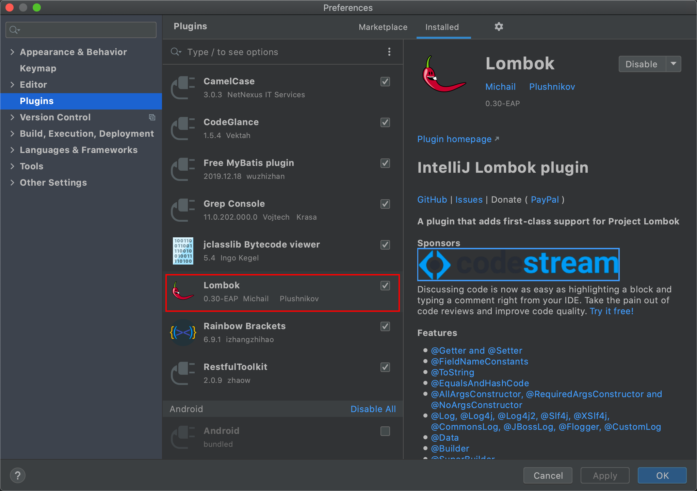
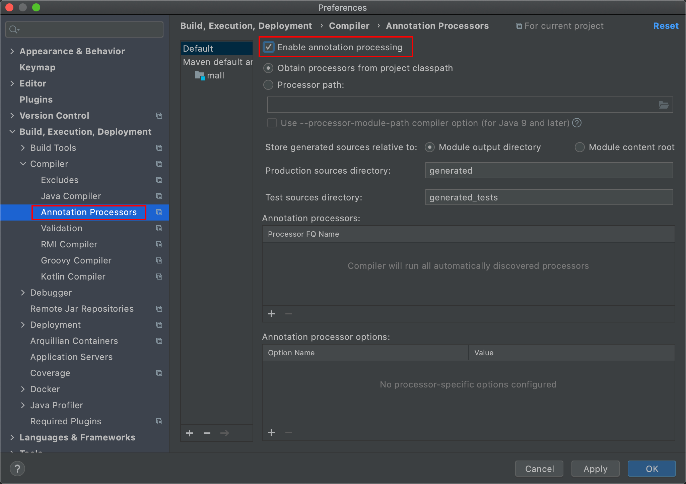

### 1、概述

以前的Java项目中，充斥着太多不友好的代码：
**POJO的getter/setter/toString**、**异常处理**、**I/O流的关闭操作**等等，
这些样板代码既没有技术含量，又影响着代码的美观，Lombok应运而生。

### 2、使用方式

#### 2.1 引入依赖

```xml
<!-- https://mvnrepository.com/artifact/org.projectlombok/lombok -->
<dependency>
    <groupId>org.projectlombok</groupId>
    <artifactId>lombok</artifactId>
    <version>1.18.12</version>
    <scope>provided</scope>
</dependency>
```

Lombok的scope为provided，说明它只在编译阶段生效，不需要打入包中。事实正是如此，Lombok在编译期将带Lombok注解的Java文件正确编译为完整的Class文件。

#### 2.2 添加IDE工具对Lombok的支持

**安装Lombok插件**



**开启编译时注解支持**



#### 2.3 Lombok实现原理


### 3、Lombok常用注解

- @Getter/@Setter

  作用在类上，生成所有成员变量的getter/setter方法；
  作用于成员变量上，生成该成员变量的getter/setter方法。
  可以设定访问权限及是否懒加载等

- @ToString

  作用于类，覆盖默认的toString()方法，可以通过of属性限定显示某些字段，通过exclude属性排除某些字段。

- @EqualsAndHashCode

  作用于类，覆盖默认的equals和hashCode

- @NonNull

  主要作用于成员变量和参数中，标识不能为空，否则抛出空指针异常。

- @NoArgsConstructor

  作用于类上，生成无参构造器

- @RequiredArgsConstructor

  作用于类上，生成包含**final**和**@NonNull注解**的成员变量的构造器；

- @AllArgsConstructor

  作用于类，生成全参构造器；

- @Data

  注解在类上，相当于同时使用了@Getter、@Setter、@ToString、@EqualsAndHashCode、@RequiredArgsConstrutor

##### （7）**@Value**

用在类上，是@Data的不可变形式，相当于为属性添加final声明，只提供getter方法，而不提供setter方法。

##### （8）**@Log**

lombok可以快速生成多种常用日志实例，包括Commonslog、log、log4j、slf4j等等，具体的使用可以依照需求灵活选择。

### 4、属性设置默认值

```java
@Data
public class MySon {
    @Builder.Default
    private Integer id = 100;
    @Builder.Default
    private String name = "default";
}
```

### 5、@Builder 创建对象


#### 2.7 @SuperBuilder

