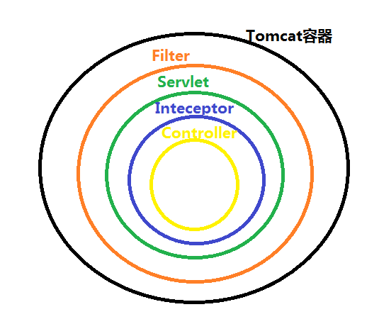

## 1、关于类

- pojo（普通 Java 类）

- dao（数据访问对象）

- bean

- do（领域对象）

  

- dto（数据传输对象）

- po

- vo

## 2、三层架构   

- A 表现层  web层  MVC是表现层的一个设计模型 
- B 业务层 service 层
- C 持久层 dao 层

### 开发模式

MVC是表现层的一个设计模型 

## 3、ClassPath

https://blog.csdn.net/C_ZhangSir/article/details/99879864

https://www.cnblogs.com/fjhh/p/5370634.html
https://blog.csdn.net/m0_37556444/article/details/83019746

## 4、cookie & Session

## 5、过滤器 & 监听器 & 拦截器

Servlet是运行在Web服务器端的小程序，通过创建一个框架
来扩展服务器的能力，以提供在Web上进行请求和响应服务。

[JAVA过滤器和拦截器的区别 - 一叶一落秋 - 博客园 (cnblogs.com)](https://www.cnblogs.com/lynn16/p/10691224.html#:~:text=1 拦截器是基于java的反射机制的，而过滤器是基本函数回调。 2 拦截器不依赖于servlet容器，过滤器依赖于servlet ... 3 拦截器只能对action请求起作用，过滤器可以对几乎所有的请,... 4 拦截器可以访问action上下文、值栈里的对象，而过滤器不能 ... 5 在action的生命周期中，拦截器可以被多次调用，而过滤器只 )

[过滤器，拦截器，监听器的区别 - Rooker - 博客园 (cnblogs.com)](https://www.cnblogs.com/lukelook/p/11079113.html)

[springBoot(6)---过滤器，监听器，拦截器_蜗牛的博客-CSDN博客](https://blog.csdn.net/yudiandemingzi/article/details/80399971?utm_medium=distribute.pc_relevant.none-task-blog-baidujs_title-0&spm=1001.2101.3001.4242)

