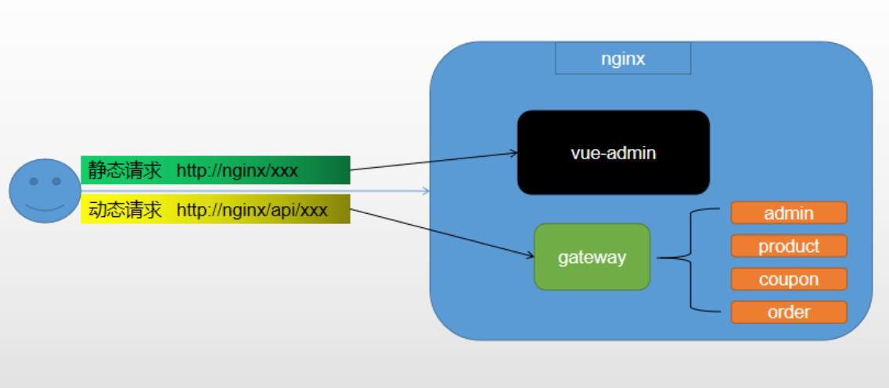
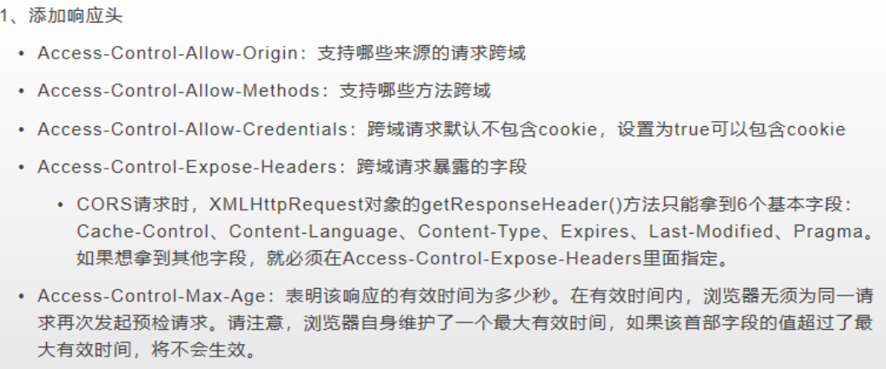

## 1、概述

#### 跨域（CORS）

- **跨域**：

  指的是浏览器不能执行其他网站的脚本。它是由浏览器的同源策略造成的，是**浏览器对 javascript施加的安全限制**。

- **同源策略**：

  是指协议，域名，端口都要相同，其中有一个不同都会产生跨域。

  | URL                                                         | 说明                           | 是否允许通信                           |
  | ----------------------------------------------------------- | ------------------------------ | -------------------------------------- |
  | http://www.a.com/a.js<br />http://www.a.com/b.js            | 同一域名下                     | 允许                                   |
  | http://www.a.com/lab/a.js<br />http://www.a.com/script/b.js | 同一域名下不同文件夹           | 允许                                   |
  | http://www.a.com:8000/a.js<br />http://www.a.com/b.js       | 同一域名，不同端口             | 不允许                                 |
  | http://www.a.com/a.js<br />https://www.a.com/b.js           | 同一域名，不同协议             | 不允许                                 |
  | http://www.a.com/a.js<br />http://70.32.92.74/b.js          | 域名和域名对应的IP             | 不允许                                 |
  | http://www.a.com/a.js<br />http://script.a.com/b.js         | 主域相同，子域不同             | 不允许                                 |
  | http://www.a.com/a.js<br />http://a.com/b.js                | 同一域名，不同二级域名（同上） | 不允许（cookie这种情况下也不允许访问） |
  | http://www.cnblogs.com/a.js<br />http://www.a.com/b.js      | 不同域名                       | 不允许                                 |

- 跨域流程

  https://developer.mozilla.org/zh-CN/docs/Web/HTTP/Access_control_CORS


- 解决跨域

  方案一：使用nginx部署为同一域

  

  方案二：配置当次请求允许跨域

  **即给预检请求响应允许跨域**

  

  **在网关里配置跨域**

  ```java
  // 在网关中统一配置跨域，并取消其他服务原本的跨域配置
  
  package com.atguigu.gulimall.gateway.config;
  
  import org.springframework.context.annotation.Bean;
  import org.springframework.context.annotation.Configuration;
  import org.springframework.web.cors.CorsConfiguration;
  import org.springframework.web.cors.reactive.CorsWebFilter;
  import org.springframework.web.cors.reactive.UrlBasedCorsConfigurationSource;
  
  //标注这是一个配置类
  @Configuration
  public class GulimallCorsConfiguration {
  
      @Bean
      public CorsWebFilter corsWebFilter(){
          UrlBasedCorsConfigurationSource source = new UrlBasedCorsConfigurationSource();
  
          CorsConfiguration corsConfiguration = new CorsConfiguration();
          //1、配置跨域
          corsConfiguration.addAllowedHeader("*");
          corsConfiguration.addAllowedMethod("*");
          corsConfiguration.addAllowedOrigin("*");
          corsConfiguration.setAllowCredentials(true);
  
          source.registerCorsConfiguration("/**",corsConfiguration);
  
          return new CorsWebFilter(source);
      }
  }
  ```


## 2、解决方案

### 方式一：

后端接口

```java
response.setHeader("Access-Control-Allow-Origin", "http://localhost:3000");
```

### 方式二：

```java
@Configuration
public class WebConfig implements WebMvcConfigurer {

    @Override
    public void addCorsMappings(CorsRegistry registry) {
        registry.addMapping("/**")
                .allowedOriginPatterns("*")
                .allowedMethods("GET", "POST", "DELETE", "PUT", "OPTIONS")
                .allowCredentials(true)
                .maxAge(3600);
    }
}
```

SpringBoot跨域问题：When allowCredentials is true, allowedOrigins cannot contain the special value "*"since that cannot be set on the "Access-Control-Allow-Origin"。

当allowCredentials为true时，allowingOrigins不能包含特殊值“ *”，因为无法在“ Access-Control-Allow-Origin”响应标头上设置。要允许凭据具有一组来源，请明确列出它们或考虑改用“ allowedOriginPatterns”。

解决：将`allowingOrigins`换成`allowedOriginPatterns`即可。


### 跨域配置失效

[[心得\]SpringBoot使用addCorsMappings配置跨域的坑 - SegmentFault 思否](https://segmentfault.com/a/1190000018018849)

