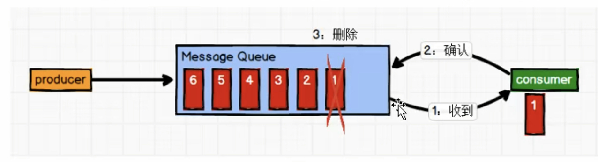
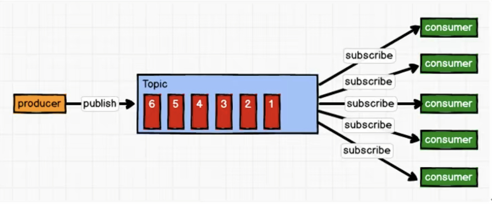
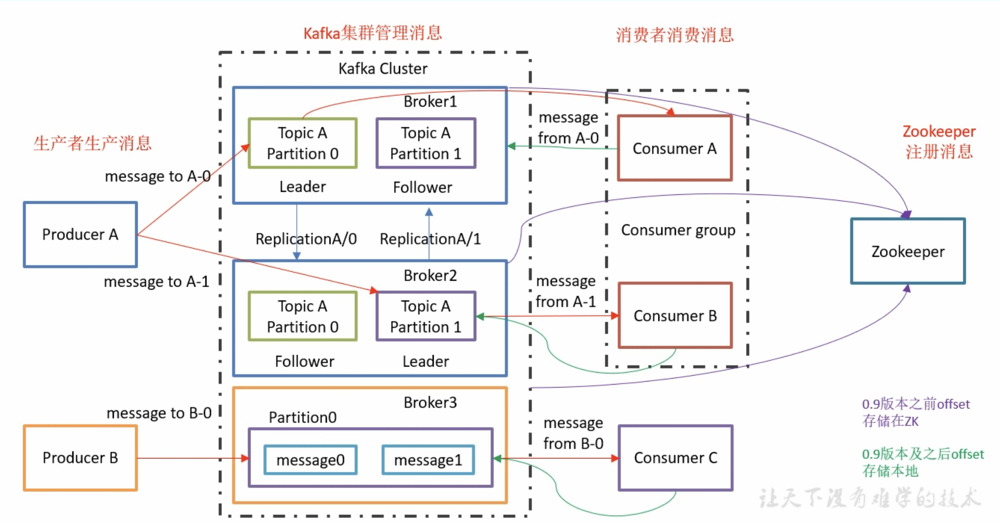
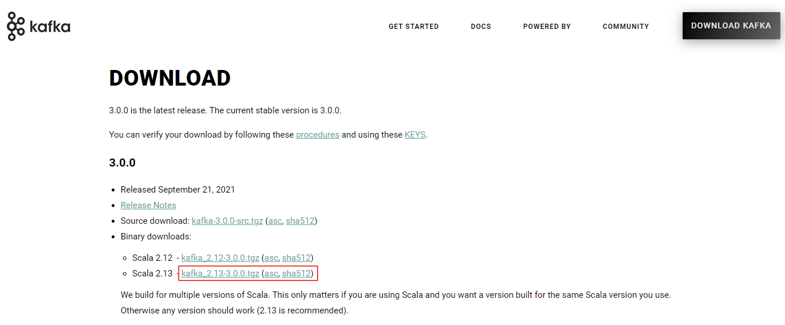
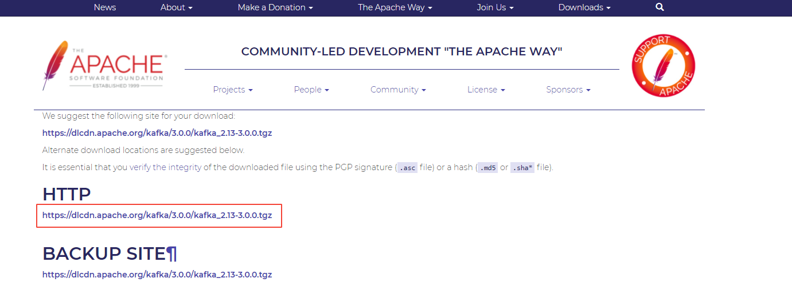

### 1、概述

#### 1.1 定义

Kafka 是一个**分布式**的基于**发布/订阅模式**的**消息队列**（Message Queue），主要应用于大数据实时处理领域。

#### 1.2 消息队列

- 应用场景

  异步处理

- 作用

  解耦：拆分后，允许独立扩展或修改两边的处理过程，只要确保它们遵守同样的接口约束；

  可恢复性：系统一部分组件失效，不会影响整个系统；

  缓冲：有助于控制和优化数据流经过系统的速度，解决生产消息和消费消息的处理速度不一致的情况；

  灵活性 & 削峰：

  异步：

- 消息队列的两种模式

  **点对点**

  一对一，消费者主动拉取数据，消息收到后消息清除，消费者不可能消费到已经被消费的消息。

  Queue 支持存在多个消费者，但是对一个消息而言，只会有一个消费者可以消费。

  

  **发布/订阅模式**

  一对多，消费者消费数据后不会清除消息。

  消息生产者发布消息到 topic 中，同时有多个消息消费者订阅该消息。

  

  

#### 1.3 Kafka 基础架构



- 消息（Message）

- 生产者（Producer）

  消息生产者，向 kafka broker 发消息的客户端。

- 消费者（Consumer）

  消息消费者，从 kafka broker 取消息的客户端。

  消费者组（Consumer Group，CG）：消费者组，由多个 Consumer 组成。

  

- 主题（Topic）

  可以理解为一个队列，生产者和消费者面向的都是一个 topic。

- 分区（Partition）

  一个非常大的 Topic 可以分为多个 partition，每个 partition 是一个有序队列。

- 副本（Replica）

  为了保证集群中的某个节点发生故障时，该节点上的 partition 数据不丢失，且 Kafka 仍然能够继续工作，Kafka 提供了副本机制，一个 topic 的每个分区都有若干个副本，一个 Leader，多个 Follower。

- Broker

  可以理解为 Kafka 节点，

- 集群

  

  同一个消息只能被每个消费者组中的一个消费者消费；

  

### 2、入门

#### 2.1 安装部署

- 官网：[Apache Kafka](https://kafka.apache.org/)

- 安装包下载：点击官网右上角 `DOWNLOAD KAFKA`

  

  

- 集群部署

  1. 解压安装包

     ```bash
     [root@i-vmti97o3 software]# tar -zxvf kafka_2.11-0.11.0.0.tgz
     ```

  2. 修改解压后的文件名称

     ```bash
     [root@i-vmti97o3 software]# mv kafka_2.11-0.11.0.0 /opt/kafka
     ```

  3. 在 kafka 目录下创建 logs 文件夹

     ```bash
     [root@i-vmti97o3 kafka]# mkdir logs
     ```
  
  4. 修改配置文件
  
     ```bash
     [root@i-vmti97o3 kafka]# cd config/
     [root@i-vmti97o3 config]# vim server.properties
     ```
     
     ```properties
     # broker 的全局唯一编号，不能重复
     broker.id=0
     # 默认不能删除 topic ，设置为 true
     delete.topic.enable=true
     # 处理网络请求的线程数量
     num.network.threads=3
     # 处理磁盘IO的线程数量
     num.io.threads=8
     # 发送套接字的缓冲区大小
     socket.send.buffer.bytes=102400
     # 接收套接字的缓冲区大小
     socket.receive.buffer.bytes=102400
     # 请求套接字的缓冲区大小
     socket.request.max.bytes=104857600
     # kafka 运行日志存放的路径
     log.dirs=/opt/kafka/logs
     # topic 在当前broker 上的分区个数
     num.partitions=1
     # 用来恢复和清理data下数据的线程数
     num.recovery.threads.per.data.dir=1
     # segment 文件保留的最长时间，超时将被删除
     log.retention.hours=168
     
     # 配置连接 zookeeper 集群地址
     zookeeper.connect=localhost:2181
     ```
     
  4. 运行
  
     ```bash
     $ bin/kafka-server-start.sh config/server.properties
     ```
     
  6. kafka启动警告，OpenJDK 64-Bit Server VM warning
  
     > OpenJDK 64-Bit Server VM warning: If the number of processors is expected to increase from one, then you should configure the number of parallel GC threads appropriately using -XX:ParallelGCThreads=N
  
     报错原因，虚拟机核心数与默认配置的并行收集器的线程数不一致。
  
     修改启动脚本：
  
     ```bash
     [root@i-vmti97o3 kafka]# vim bin/kafka-server-start.sh
     ```
  
     ```bash
     if [ "x$KAFKA_HEAP_OPTS" = "x" ]; then
     # 修改这一行，引号中加上参数：--XX:ParallelGCThreads=1 , 有几个核心写几个
         export KAFKA_HEAP_OPTS="-Xmx1G -Xms1G --XX:ParallelGCThreads=1"
     fi
     ```
  
  7. 创建 topic
  
     ```bash
     [root@i-vmti97o3 kafka]# bin/kafka-topics.sh --create --zookeeper localhost:2181 --replication-factor 1 --partitions 1 --topic test
     ```
  
     


#### 2.2 Kafka 命令行操作

- 查看当前服务器中的所有 topic
- 创建 topic
- 删除 topic
- 发送消息
- 消费消息
- 

### 3、原理