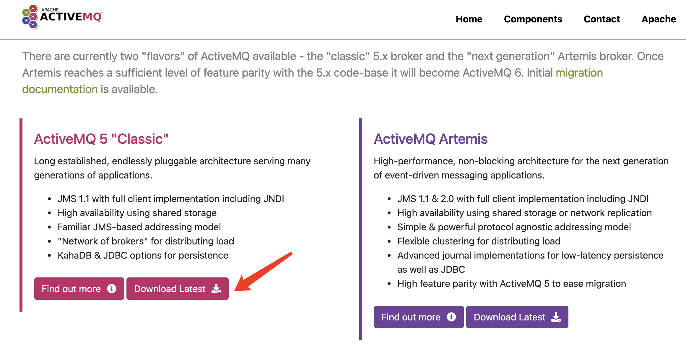
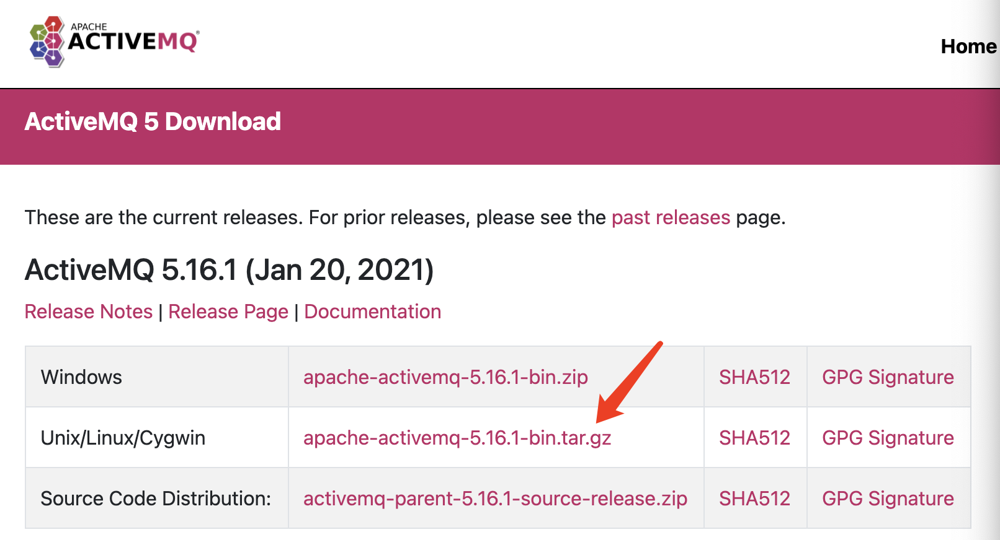
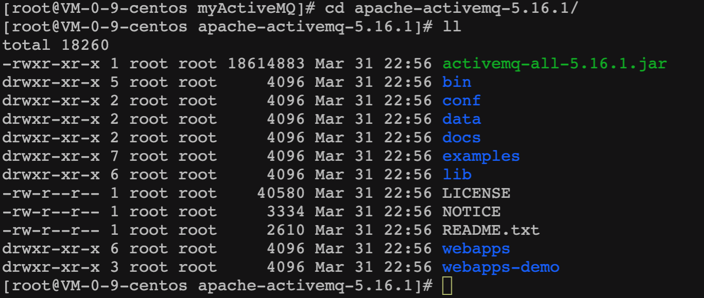
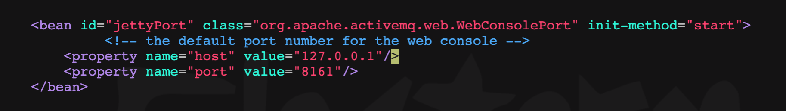

## 一、入门概述

#### 1、是什么


#### 2、能干嘛


#### 3、怎么玩

- 最主要的功能

  实现高可用、高性能、可伸缩、易用和安全的企业级面向消息的服务系统

- 异步消息的消费和处理

- 控制消息的消费顺序

- 可以和 Spring/SpringBoot 整合简化编码

- 配置集群容错的 MQ 集群

#### 5、各种消息队列对比


## 二、ActiveMQ安装和控制台

#### 1、解压安装

① ActiveMQ 官网【https://activemq.apache.org/】下载：





② 上传到 /opt 目录下面
③ 解压缩
tar -zxvf apache-activemq-5.16.1-bin.tar.gz
④ 在根目录下建文件夹 /myActiveMQ
mkdir myActiveMQ
⑥ 拷贝解压后的安装包到 /myActiveMQ 下 
cp -r apache-activemq-5.16.1 /myActiveMQ/

#### 2、目录结构



bin ：activemq 相关命令
conf ：配置文件
lib ：需要用到的 jar 包

#### 3、启动方式与判断

- 普通启动

  ```bash
  ./activemq start
  ```

- 重启

  ```bash
  ./activemq restart
  ```

- 关闭

  ```bash
  ./activemq stop
  ```

- 带日志启动

  ```bash
  # 带日志启动时，不会再输出启动提示信息，而是全写入日志文件中
  ./activemq start > /myActiveMQ/run_activemq.log
  ```

- 默认进程端口

  61616

- 查看服务是否启动

  ```bash
  # 查看正在运行的 activemq 进程 
  ps -ef|grep activemq
  或再去除 grep 命令所用的进程
  ps -ef|grep activemq|grep -v grep
  
  # 查询正在占用端口号为 61616 的服务
  netstat -anp|grep 61616
  
  # 使用 lsof 命令
  lsof -i:61616
  ```

#### 4、控制台

控制台端口：8161
默认密码：admin/admin


【问题解决】无法访问控制台

在排除是否正常启动，云服务主机网络以及端口是否连通、防火墙是否关闭等可能原因后。
首先`netstat -lnpt 8161`查看端口，发现8161对应的ip地址是127.0.0.1
这个地址一般都是localhost的地址，所以需要把这个地址改成0.0.0.0，即广播地址，这样通过本机ip地址就可以访问到了，所以需要修改 bin/conf/jetty.xml 



## 三、Java编码实现ActiveMQ通讯

#### 1、IDEA 新建 maven 工程

#### 2、pom.xml

```xml
<?xml version="1.0" encoding="UTF-8"?>
<project xmlns="http://maven.apache.org/POM/4.0.0"
         xmlns:xsi="http://www.w3.org/2001/XMLSchema-instance"
         xsi:schemaLocation="http://maven.apache.org/POM/4.0.0 http://maven.apache.org/xsd/maven-4.0.0.xsd">
    <modelVersion>4.0.0</modelVersion>

    <groupId>com.yunzike.activemq</groupId>
    <artifactId>activemq_demo</artifactId>
    <version>1.0-SNAPSHOT</version>

    <properties>
        <maven.compiler.source>8</maven.compiler.source>
        <maven.compiler.target>8</maven.compiler.target>
    </properties>

    <dependencies>
        <!-- activemq所需要的jar包配置 -->
        <dependency>
            <groupId>org.apache.activemq</groupId>
            <artifactId>activemq-all</artifactId>
            <version>5.16.1</version>
        </dependency>
        <dependency>
            <groupId>org.apache.xbean</groupId>
            <artifactId>xbean-spring</artifactId>
            <version>4.18</version>
        </dependency>

        <!-- 下面是junit/log4j等基础通用配置 -->
        <dependency>
            <groupId>org.slf4j</groupId>
            <artifactId>slf4j-api</artifactId>
            <version>1.7.30</version>
        </dependency>
        <dependency>
            <groupId>ch.qos.logback</groupId>
            <artifactId>logback-classic</artifactId>
            <version>1.2.3</version>
        </dependency>
        <dependency>
            <groupId>org.projectlombok</groupId>
            <artifactId>lombok</artifactId>
            <version>1.18.18</version>
            <scope>provided</scope>
        </dependency>
        <dependency>
            <groupId>junit</groupId>
            <artifactId>junit</artifactId>
            <version>4.13.2</version>
            <scope>test</scope>
        </dependency>

    </dependencies>

</project>
```


## 四、JMS规范和落地产品


## 五、ActiveMQ 的 Broker


## 六、Spring 整合 ActiveMQ


## 七、SpringBoot 整合 ActiveMQ


## 八、ActiveMQ 的传输协议


## 九、ActiveMQ 的消息存储和持久化


## 十、ActiveMQ 多节点集群


## 十一、高级特性和大厂常考重点