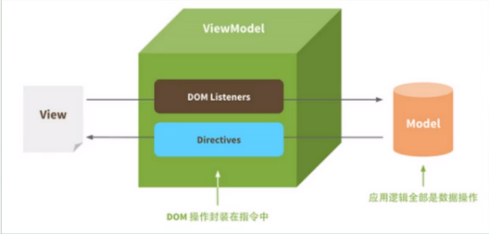
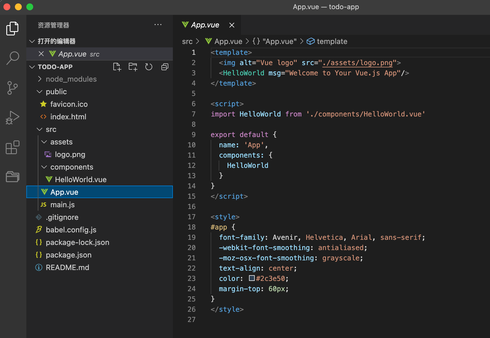

## 1、介绍

### 1.1 Vue

- MVVM思想

  M：即Model，模型，包括数据和一些基本操作
  V：即view，视图，页面渲染结果
  VM：即 View-Model，模型与视图间的双向操作（无需开发人员干涉）

  

  在MVVM之前，开发人员从后端获取需要的数据模型，然后要通过DoM操作Model渲染到view中。而后当用户操作视图，我们还需要通过DOM获取view中的数据，然后同步到Model中。

  而MVVM中的VM要做的事情就是把DOM操作完全封装起来，开发人员不用再关心 Model和view之间是如何互相影响的：
  只要我们Model发生了改变，View上自然就会表现出来。
  当用户修改了view, Model中的数据也会跟着改变。
  把开发人员从繁琐的DOM操作中解放出来，把关注点放在如何操作Model上。



- Vue简介

  Vue（读音/vju:/，类似于vew）是一套用于构建用户界面的渐进式框架。与其它大型框架不同的是，Vue被设计为可以自底向上逐层应用。vue的核心库只关注视图层，不仅易于上手，还便于与第三方库或既有项目整合。另一方面，当与现代化的工具链以及各种支持类库结合使用时，vue也完全能够为复杂的单页应用提供驱动。

  官网：https://cn.vuejs.or
  参考：https://cn.vuejs.org/v2/guide/ 
  Git 地址：htts:github.com/ues
  尤雨溪，Vue.js创作者， Vue Technology创始人，致力于Vue的研究开发。

### 1.2 Vue 3.0

- Vue 3.0 One Piece

  2020 年 9 月 18 日发布正式版。

- 官网地址

  

- 新特性

  性能提升 1.3 ~ 2x

  与 Vue 2.x 相比，mount 50% 提升，内存占用小 120%

  核心代码 + Composition API : 13.5 kb , 最小 11.75 kb

  所有 Runtime：22.5 kb（Vue 2 是 32 kb）

  

## 2、构建 Vue 项目

### 2.1 环境搭建

- 安装 node.js 并配置淘宝镜像源

- 安装 vue-cli 脚手架

  ```bash
  $ npm install -g @vue/cli
  
  # 查看 vue/cli 版本
  vue --version
  
  # vue-cli 图形管理工具
  $ vue ui
  ```

### 2.2  创建 Vue 项目

- 方式一：使用 vue/cli 创建项目

  ```bash
  $ vue create todo-app
  
  # 运行
  $ cd todo-app
  $ npm run serve
  
  # 浏览器上安装 Vue Devtools 插件方便调试
  ```

- 方式二：使用 Vite 构建项目

  Vue 3 + TypeScript + Vite

  ```bash
  $ npm init @vitejs/app
  ```

### 2.3 Vue 项目结构



- node_modules：项目的依赖包
- public：index.html（整个项目根组件的挂载点）
- src/assets：静态文件
- src/components：自定义组件
- src/App.vue：整个 Vue 项目的入口，根组件 App
- src/main.js：引入根组件 App，并将其挂载到 public/index.html 上
- package.json：依赖引入管理

### 2.4 Vue 文件结构

- 模板

  ```html
  <template>
    
    <HelloWorld msg="Welcome to Your Vue.js App"/>
  </template>
  ```

- 脚本

  ```html
  <script>
  import HelloWorld from './components/HelloWorld.vue'
  
  export default {
    name: 'App',
    components: {
      HelloWorld
    }
  }
  </script>
  ```

- 样式

  ```html
  <style>
  #app {
    font-family: Avenir, Helvetica, Arial, sans-serif;
    -webkit-font-smoothing: antialiased;
    -moz-osx-font-smoothing: grayscale;
    text-align: center;
    color: #2c3e50;
    margin-top: 60px;
  }
  </style>
  ```


## 3、Vue 基本语法

### 3.1、模板语法

```html
<body>
    <div id="app">
        {{message}}
        <button v-on:click="test">点击</button>
    </div>
    <script>
        var vm = new Vue({
            el:"#app",
            data:{
                message:"hello Vue!"
            },
            methods:{
                test:function() {
                    alert("你好");
                }
            }
        })
    </script>
</body>
```

- Vue实例

  el：挂载点，指定Vue实例的作用对象，不能用在html和body上，一般使用id选择器。

  data：Vue数据

  methods：方法

- 数据绑定

  {{ Vue数据名或js表达式 }}

### 3.2、Vue指令

#### 1、插值表达式

- 格式：
  {{ 表达式 }}

- 说明：

  只能用于标签体中，而不能用在属性里面。
  该表达式支持js语法，可以调用is内置函数（必须有返回值）
  表达式必须有返回结果。例如1+1，没有结果的表达式不允许使用，如：leta=1+1；
  可以直接获取Vue实例中定义的数据或函数。

- 插值闪烁

  使用{{}}方式在网速较慢时会出现问题。在数据未加载完成时，页面会显示出原始的{{}}，加载完毕后才显示正确数据，我们称为插值闪烁。

#### 2、v-text和v-html


#### 3、v-bind

```html
<!-- 接收参数，用于绑定属性，可以简写为：-->
<a v-bind:href="url">url为Vue中的数据</a>
<a :href="url">url为Vue中的数据</a>

```


#### 4、v-model：双向绑定数据

```html
<!-- 表单项值的改变会同步改变被绑定的Vue的数据 -->
<input id="username" type="text" v-model="username"/>
<script>
	var vm = new Vue({
        el:"#username",
        data:{
         username:"默认值"   
        }
    })
</script>
```

#### 2、v-on（@）

接收方法，用于绑定事件，可以简写为@

```html
<div id="app">
	<a v-on:click="doIt">点击</a>
	<a @click="doIt">点击</a>
</div>

<script>
    var vm = new Vue({
        el:"app",
        data:{
            
        },
        methods:{
            doIt: function (){
                alert("绑定点击事件");
            }
        }
    })
</script>
```

#### 3、v-once：数据绑定仅生效一次

```html
<span v-once>这个将不会改变: {{ msg }}</span>
```

#### 4、将数据渲染成原始html

```html
<span v-html="rawHtml"></span>
```

#### 5、v-show & v-if

v-show：根据表达式的真假来显示元素，底层修改的是display属性

```html
<p v-show="seen">seen的值为true时显示</p>
```

v-if：根据表达式值的真假来插入/移除指定元素，因为操作了DOM，性能消耗比较大，因此一般使用v-show。

```html
<p v-if="seen">seen的值为true时显示</p>
```

#### 6、v-for

遍历数组、对象

```html
<ul id="example-1">
  <!-- 需要使用数组下标时：(item,index) in items -->
  <li v-for="item in items">
    {{ item.message }}
  </li>
</ul>

<script>
    var example1 = new Vue({
      el: '#example-1', 
      data: {
        items: [
          { message: 'Foo' },
          { message: 'Bar' }
        ]
      }
    })
</script>
```


## 4、生命周期

```javascript
//监听属性 类似于data概念
computed: {},
//监控data中的数据变化
watch: {},
    

//生命周期 - 创建完成（可以访问当前this实例）
created() {},
//生命周期 - 挂载完成（可以访问DOM元素）
mounted() {},
beforeCreate() {}, //生命周期 - 创建之前
beforeMount() {}, //生命周期 - 挂载之前
beforeUpdate() {}, //生命周期 - 更新之前
updated() {}, //生命周期 - 更新之后
beforeDestroy() {}, //生命周期 - 销毁之前
destroyed() {}, //生命周期 - 销毁完成
activated() {}, //如果页面有keep-alive缓存功能，这个函数会触发
```


## 5、组件


## 6、父子组件传值

[Vue父子组件之间的传值及父子组件之间相互调用属性或方法 - 云+社区 - 腾讯云 (tencent.com)](https://cloud.tencent.com/developer/article/1589230#:~:text=Vue父子组建之间的传值：. 一、父子组建之间的传值. 1.1 父组件向子组件传值. 父组件向子组件传值是通过属性的方式,传值，传的值可以是任意类型，甚至可以是父组件的方法或者父组件对象本身。. 为方便理解可以简单将父组件向子组件传值按以下步骤实现。. 1. 在父组件中引入子组件；. 2. 并在components中注册子组件；.)


## axious

请求


## 8、Vue-router

路由


## 9、Mobx

数据管理


## 、Element-UI

第三方组件库


## 11、Echarts

图表


