## [React Native 介绍](https://baike.baidu.com/item/react%20native/20307162?fr=aladdin)


## 环境搭建

## 概述

`react-native` 的环境搭建相比较于普通的web项目(vue、react）来说要繁琐不少，但是通过以下的方式基本都可以得到解决。

- 老师的文档
- [RN的官网文档](https://reactnative.cn/docs/getting-started.html)
- 百度+谷歌

## 安装环境介绍

- 操作系统：win10专业版
- 手机：`安卓手机真机`一部或夜神模拟器
- 必须安装的依赖有:Node、JDK、Yarn、Android SDK、Python2


## Node的安装

- 先到 [官网 ](http://nodejs.cn/)去下载node版本(使用 [nvm](https://github.com/coreybutler/nvm-windows) 工具来安装也可以)
- 老师当前是用的 **12.16.3** 版本
- 以 **管理员** 身份安装 然后一直点击下一步即可


## [Yarn](https://yarn.bootcss.com)的安装

Yarn是Facebook提供的替代npm的工具，可以加速node模块的下载

```js
npm install yarn -g  // 使用npm全局安装yarn 
```

检查是否安装成功

```js
yarn -v
```

**效果如下:**

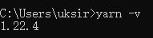


## JDK的安装与配置

> Java SE Development Kit

安卓系统的APP离不开JAVA环境，因此需要下载安装JDK(1.8版本)。到[该网站](https://www.oracle.com/technetwork/java/javase/downloads/jdk8-downloads-2133151.html)下载JDK

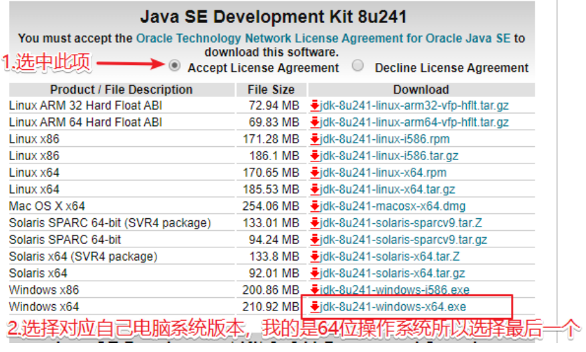

需要注意的是单击下载之后，会跳转到一个Oracler的登陆页面，得登陆之后才可以下载，如果没有账号可以注册一
个，也是比较简单，下载完成之后，以管理身份进行l默认安装。

### JDK的环境变量配置

1.右键我的电脑，点属性

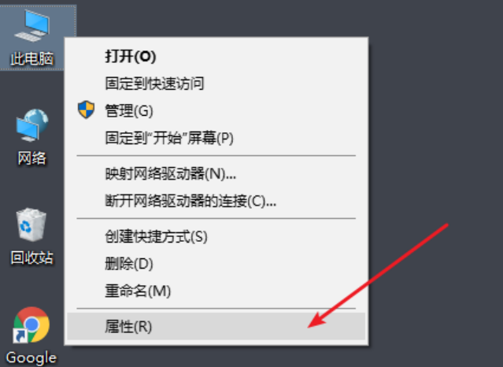

2.然后单击高级系统设置，在弹出来的对话框中单击高级，再单击环境变量

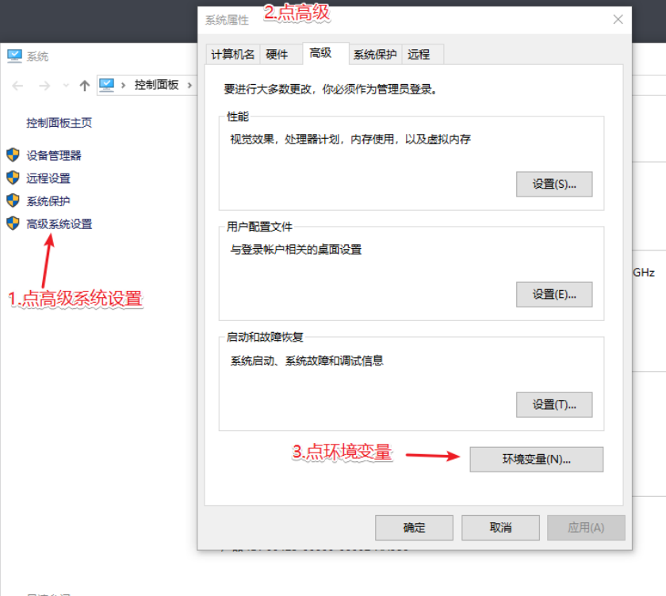

3.在弹出来的对话框中设置如下

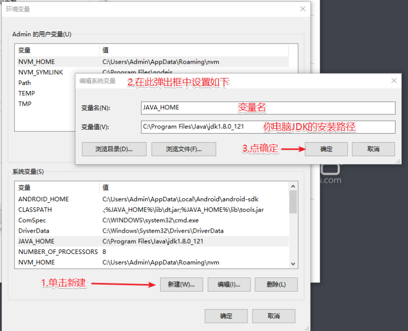

4.然后在 **系统变量** 中找到path项单击，然后再单击下面的编辑，在弹出框中设置如下

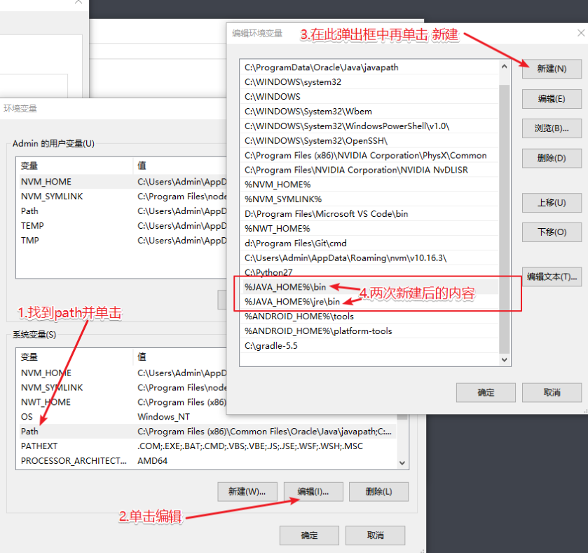

5.到此JDK的环境变量设置完毕，可以再次打开命令行终端，使用命令 `java` 与 `javac` 检测一下是否设置
成功。

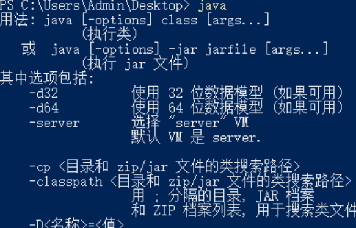

---

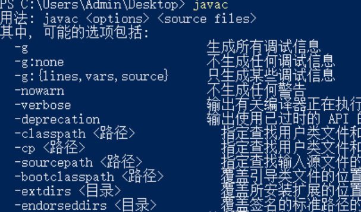

## Android SDK的下载与安装

我们可以直接下载Android SDK并进行必要配置 
1.首先打开 [网站](https://www.androiddevtools.cn/)，然后一直向下拉，找到 SDK Tools 进行下载

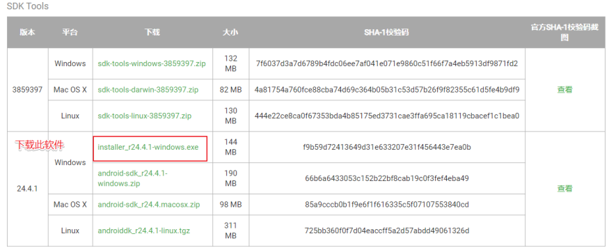

2.以管理员身份安装此软件，设置 允许使用此计算机的所有人 选项，其它一路默认到底，直到安装完成.
切记，切记，切记，重要的事情说三遍，一定记着Android SDK的安装路径，后面会打开这个管理器下载东
西

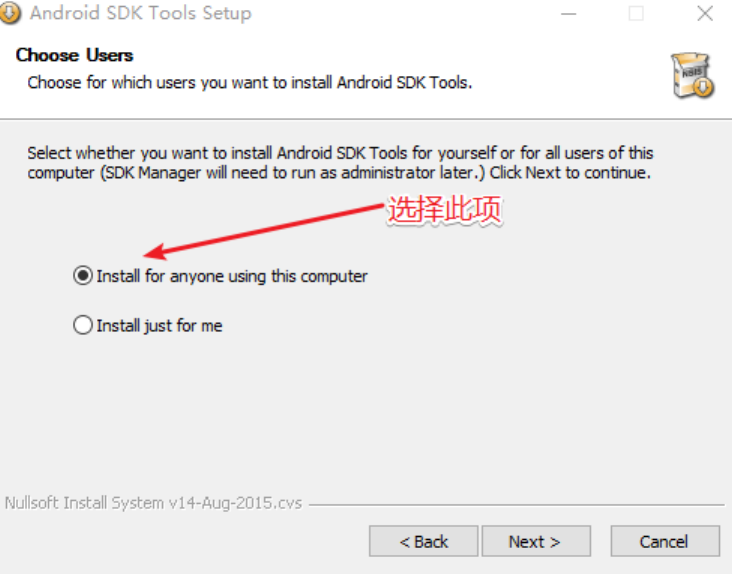

## Android SDK的下载项

1.根据RN中文网的描述，编译React Native应用需要的是Android 9版本的SDK，还需要各种组件，为
了当前以及后期的稳定，总结起来，总共需要下载:

- Android SDK Tools 25.2.5
- Android SDK Platform-tools 29.0.5
- Android SDK Build-tools 29
- Android SDK Build-tools 28.0.3
- Android SDK Build-tools 28.0.2
- Android SDK Build-tools 28.0.1
- Android SDK Build-tools 28
- Android SDK Build-tools 27
- SDK Platform 29
- Intel x86 Atom System Image 29
- SDK Platform 28
- Intel x86 Atom System Image 28
- SDK Platform 27

2.接下来，打开`SDK Manager.exe`，照此截图依次下载以上SDK及组件

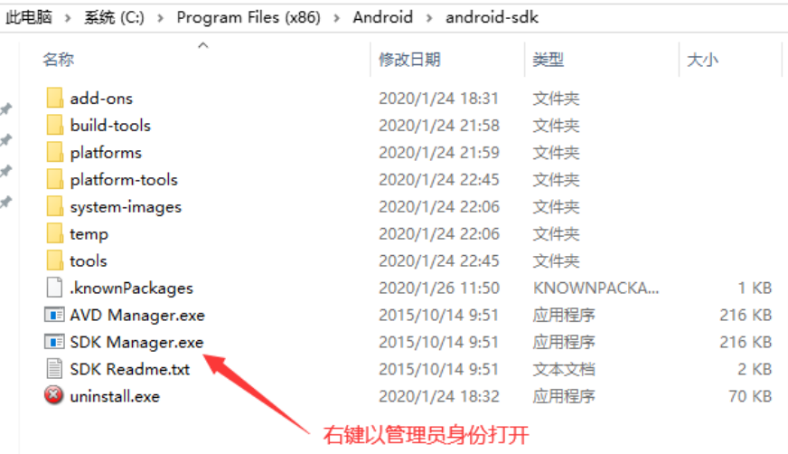

---


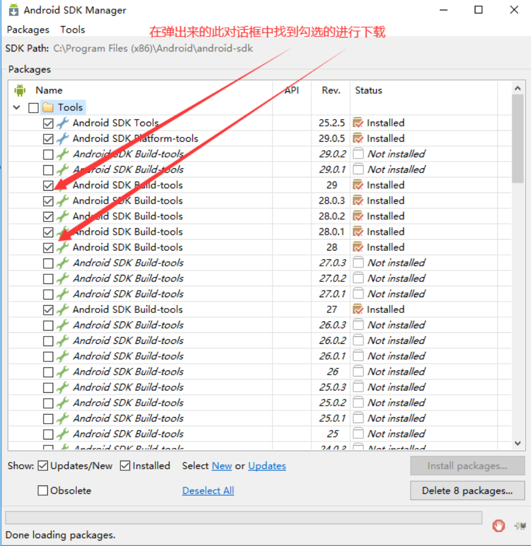

---

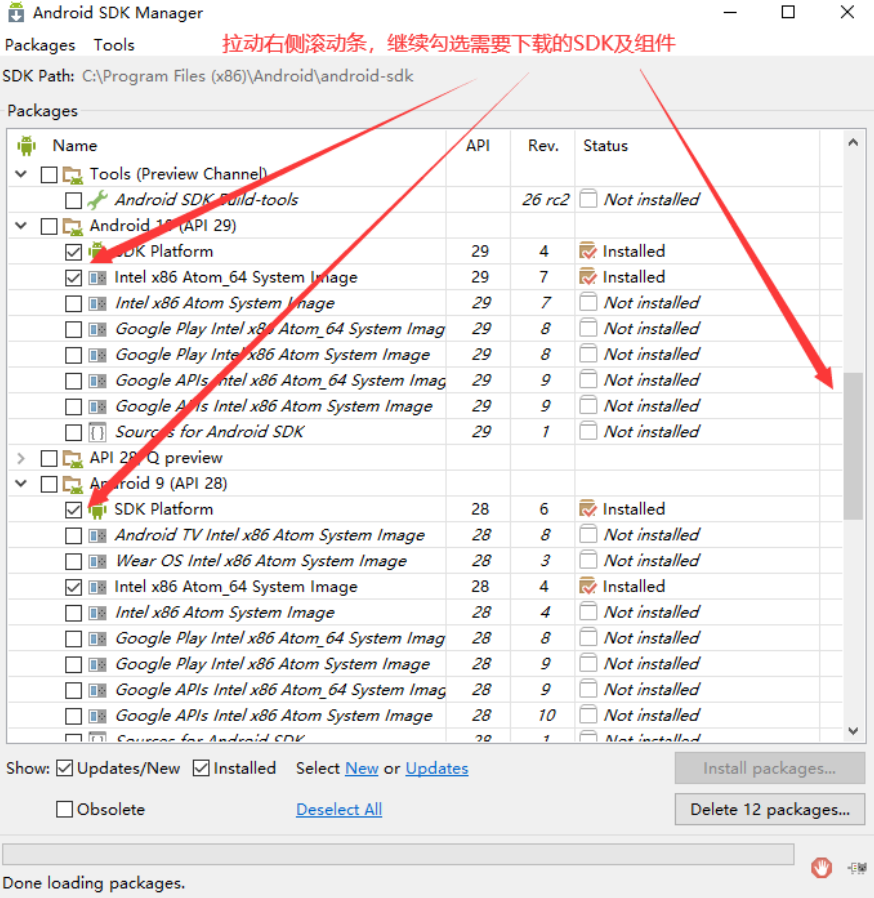

---

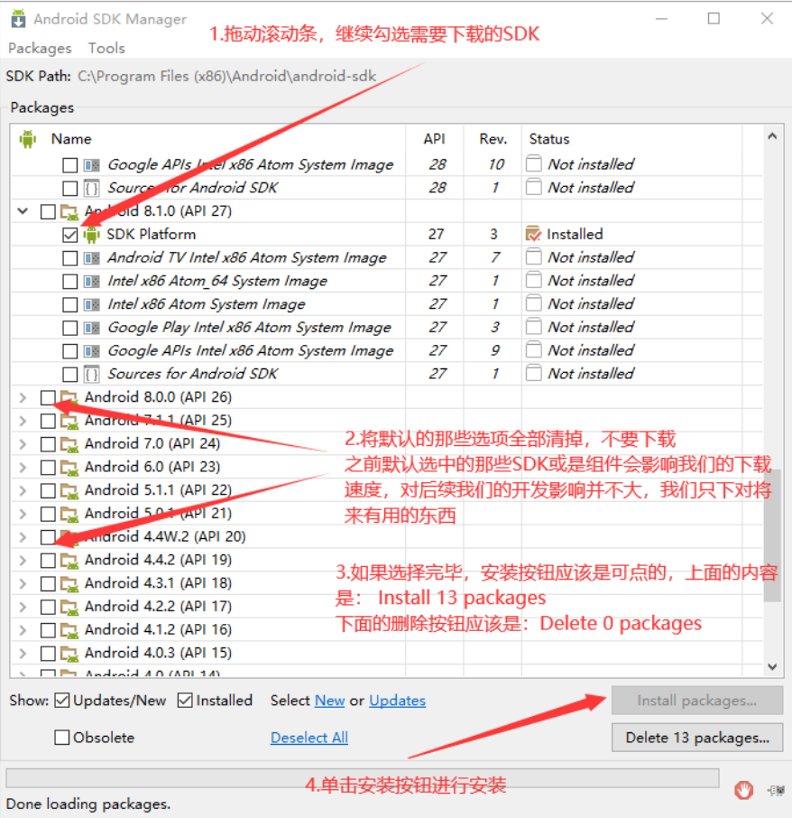

3.此下载的过程取决于自家的网速了，不过一般都会成功的，耐心等待安装完成即可。

## Android环境变量设置

1.右键选中 此电脑 点属性，再点高级，再点环境变量，设置如下

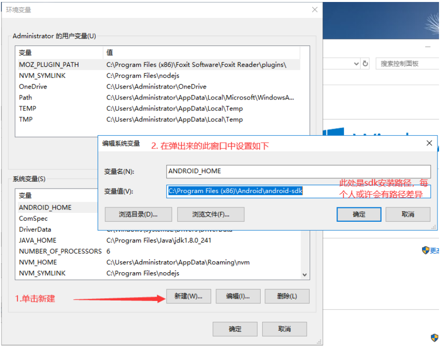

---

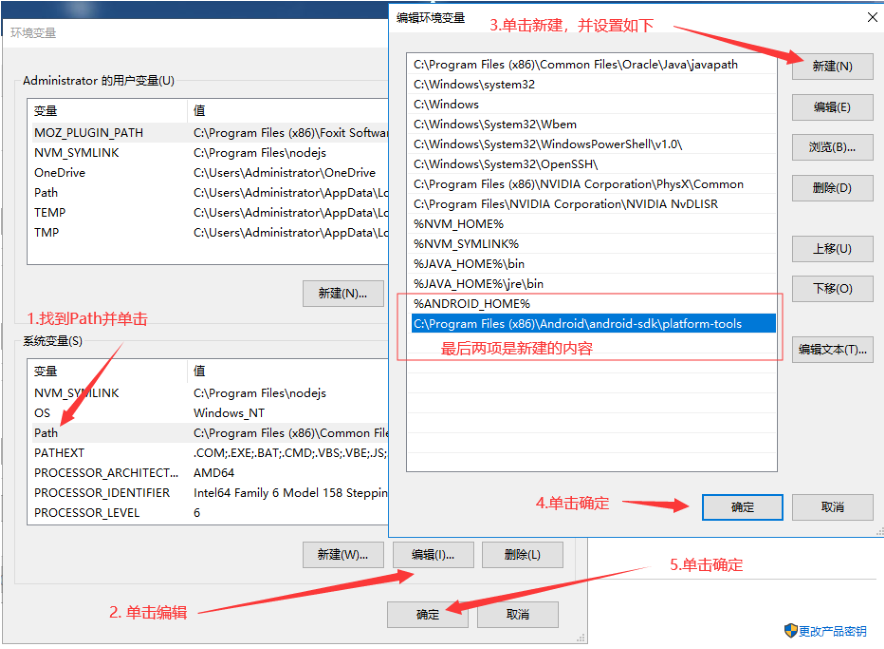

2.到此，安卓的环境变量配置完成

## 初始化项目和打包APP到手机

1. 准备一台  Android 手机, 通过数据线 连接 到电脑，设置启用 USB调试

2. 如果没有安卓手机，可以使用安卓模拟器也可以，推荐使用 夜神模拟器 ，自行百度下载安装

3. 一般的手机在 设置 中可以直接找到 开发者选项 进行开启, 如果 找不到 , 就自行百度查一下

   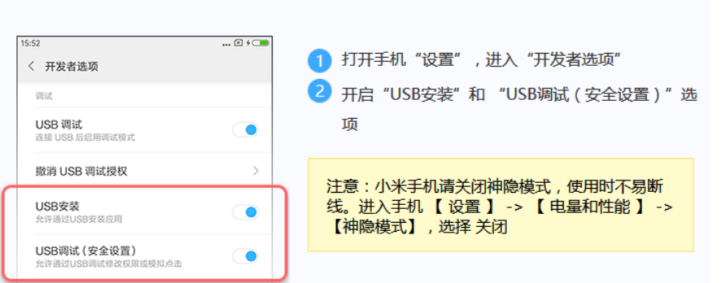

4. 手机连接电脑成功后运行检测命令  `adb devices` , 如果有输出设备列表与  ID 相关的字符串就证明
   手机和电脑是连接成功了，如果没有显示设备号，则说明连接有问题，一定要保证手机和电脑是正常连接状态

   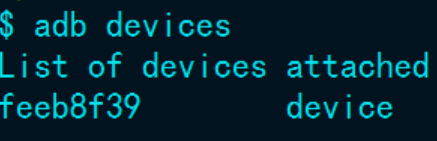

5. 运行  `npx react-native init 项目名称` 命令初始化一个  React-Native 项目, 创建时需要联网 下载 依赖
   包, 可能比较慢，取决于各自的网速，一定要耐心等待，如果出错了，则重新运行命令再次初始化即可，例
   如：

   ```js
   npx react-native init myApp 
   ```

6. 使用 `cd myApp` 命令进行此项目文件夹，确保手机和电脑连接正常的情况下，然后再输入命令 ``adb
   devices `来检测一下手机是否正常连接，然后再使用命令 `yarn android`   将APP打包到手
   机上

7. 手机上出现如下画面，说明打包成功

   

## 手机屏幕投影工具

为了在电脑上看到真实的手机屏幕,可以安装手机屏幕投影工具

网上有很多工具,百度即可看到。老师使用的是  [scrcpy](https://github.com/Genymobile/scrcpy)

### 使用教程

1. 下载好 工具 

2. 手机通过usb连接到电脑

3. 双击打开工具即可

   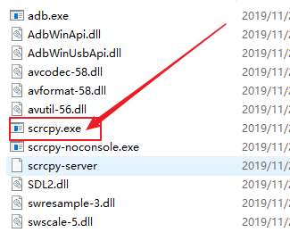

   


## 文件目录结构

```js
│  App.js           ---   项目的根组件
│  index.js         ---   项目的入口文件     
│  package.json     ---   项目的描述文件         
│  .eslintrc.js     ---   eslint的配置文件            
│  .prettierrc.js   ---   格式化配置文件             
│  android          ---   编译安卓相关       
│  ios              ---   编译ios相关
```

### 老师的vs code的插件

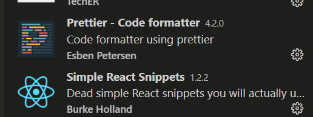


## JSX

> React中写组件的代码格式 全称是 `JavaScript xml`

```jsx
import React from 'react';
import { View, Text } from 'react-native';

const Index = () => <View>
  <Text>JSX</Text>
</View>

export default Index;
```

## RN样式

> 主要讲解和web开发的不同之处

- flex布局
- 样式继承
- 单位
- 屏幕宽度和高度
- 变换

### flex布局

- 所有容器默认都是`flexbox`
- 并且是纵向排列 也就是 `flex-direction:column`

### 样式继承

背景颜色、字体颜色、字体大小等没有继承

### 单位

- 不能加 `px` 单位 
- 不能加 `vw vh` 等单位
- 可以加百分比单位

### [屏幕宽度和高度](https://reactnative.cn/docs/dimensions#__docusaurus)

```jsx
import {Dimensions } from "react-native";
const screenWidth = Math.round(Dimensions.get('window').width);
const screenHeight = Math.round(Dimensions.get('window').height);
```

### 变换

```jsx
<Text style={{transform:[{translateY:300},{scale:2}]}}>变换</Text>
```


## [标签](https://reactnative.cn/docs/activityindicator)

1. View

2. Text

3. TouchableOpacity 

4. Image

5. ImageBackground

6. TextInput

7. 其他

   1. button
   2. FlatList
   3. ScrollView
   4. StatusBar
   5. TextInput


### View

- 相当于以前`web`中的div
- 不支持设置字体大小,字体颜色等
- 不能直接放文本内容
- 不支持直接绑定点击事件 (一般使用 `TouchableOpacity`  来代替)

### Text

> 文本标签

- 文本标签 可以设置字体颜色、大小等
- 支持绑定点击事件


### TouchableOpacity 

> 可以绑定点击事件的块级标签

- 相当于块级的容器
- 支持绑定点击事件 `onPress`
- 可以设置点击时的透明度  

```jsx
<TouchableOpacity  activeOpacity={0.5}  onPress={this.handleOnPress} ></TouchableOpacity>
```


### Image

> 图片标签

- 渲染本地图片时

  ```jsx
  <Image source={require("../girl.png")}  />
  ```

- 渲染网络图片时,必须加入宽度和高度

  ```jsx
  <Image source={{uri:"https://timgsa.baidu.com/timg?image&quality=80&size=b9999_10000&sec=1590514654506&di=38fa919d4c78fb776536b922bb94eec3&imgtype=0&src=http%3A%2F%2Fimages.ali213.net%2Fpicfile%2Fpic%2F2013%2F03%2F28%2F927_xgzwl%2520%25281%2529.jpg"}} style={{width:200,height:300}}  />
  ```

- 在 Android 上支持 GIF 和 WebP 格式图片

  默认情况下 Android 是不支持 GIF 和 WebP 格式的。你需要在`android/app/build.gradle`文件中根据需要手动添加以下模块：

  ```jsx
  dependencies {
    // 如果你需要支持Android4.0(API level 14)之前的版本
    implementation 'com.facebook.fresco:animated-base-support:1.3.0'
  
    // 如果你需要支持GIF动图
    implementation 'com.facebook.fresco:animated-gif:2.0.0'
  
    // 如果你需要支持WebP格式，包括WebP动图
    implementation 'com.facebook.fresco:animated-webp:2.1.0'
    implementation 'com.facebook.fresco:webpsupport:2.0.0'
  
    // 如果只需要支持WebP格式而不需要动图
    implementation 'com.facebook.fresco:webpsupport:2.0.0'
  }
  ```

### ImageBackground

> 一个可以使用图片当作背景的容器,相当于以前的 `div+背景图片`

```jsx
  <ImageBackground source={...} style={{width: '100%', height: '100%'}}>
    <Text>Inside</Text>
  </ImageBackground>
```


### TextInput

> 输入框组件

- 可以通过 `onChangeText`事件来获取输入框的值

## 语法

1. 插值表达式

2. 组件

3. 状态 state

4. 属性 props

5. 调试

6. 事件

7. 生命周期

   


### 插值表达式

```jsx
import React from 'react';
import { View, Text } from 'react-native';

const Index = () => <View>
  <Text>{"开心"}</Text>
  <Text>{123}</Text>
</View>

export default Index;
```

### 组件

- 函数组件
  - 没有state (通过hooks可以有)
  - 没有生命周期(通过hooks可以有)
  - 适合简单的场景
- 类组件
  - 适合复杂的场景
  - 有state
  - 有生命周期

#### 函数组件

```jsx
class Index extends Component {
  render() {
    return (
      <View>
        <Btn></Btn>
      </View>
    );
  }
}
// 函数组件
const Btn = () => <Button title="点我" />
```

#### 类组件

```jsx
import React, { Component } from 'react';
import { View, Text } from 'react-native';
class Index extends Component {
  render() {
    return (
      <View>
        <Text>类组件</Text>
      </View>
    );
  }
}
export default Index;
```

### 状态 state

```jsx
import React, { Component } from 'react';
import { View, Text } from 'react-native';
class Index extends Component {
  // 1 声明state
  state = {
    num: 100
  }
  render() {
    return (
      <View>
        {/* 2 使用state */}
        <Text onPress={this.handlePress} >{this.state.num}</Text>
      </View>
    );
  }
  // 3 修改state
  handlePress = () => {
    this.setState({ num: 1010 });
  }
}
export default Index;
```

### 属性 props

> 父子传递数据的关键

```jsx
import React, { Component } from 'react';
import { View, Text } from 'react-native';
class Index extends Component {
  render() {
    return (
      <View>
        <BigText fontColor="red" >大博妞</BigText>
      </View>
    );
  }
}

class BigText extends Component {
  render() {
    // 通过props来接收父组件传递的数据
    return <Text style={{ color: this.props.fontColor }} >
      {/*  children 其实就是插槽 类似vue中的slot  */}
      {this.props.children}
    </Text>
  }
}


export default Index;
```


### 调试

分为两种方式

2. 使用谷歌浏览器来调试
   1. 使用谷歌浏览器即可
   2. 不能查看标签结构
   3. 不能查看网络请求
   
2. 使用rn推荐的工具 [react-native-debugger](https://github.com/jhen0409/react-native-debugger)来调试 (**老师推荐使用这种方式**)

   1. 可以查看标签结构
   2. 不能查看网络请求

3. 想要查看网络请求

   1. 找到项目的入口文件 `index.js`

   2. 加入以下代码即可

      ```js
      GLOBAL.XMLHttpRequest = GLOBAL.originalXMLHttpRequest || GLOBAL.XMLHttpRequest
      ```

      

### 事件

绑定时间需要特别注意 this的指向问题,可以总结为如下的方式

- 使用箭头函数
- 通过bind重新绑定this
- 匿名函数

```jsx
import React, { Component } from 'react';
import { View, Text } from 'react-native';
class Index extends Component {
  state = { num: 100 }
  // 丢失 state
  handlePress1() {
    console.log(this.state);
  }
  // 正常
  handlePress2 = () => {
    console.log(this.state);
  }
  // 正常
  handlePress3() {
    console.log(this.state);
  }
  // 正常
  handlePress4() {
    console.log(this.state);
  }
  // 正常
  render() {
    return (
      <View>
        {/* 导致事件函数中获取不到state */}
        <Text onPress={this.handlePress1} >事件1</Text>
        {/* 正常 */}
        <Text onPress={this.handlePress2} >事件1</Text>
        {/* 正常 */}
        <Text onPress={this.handlePress3.bind(this)} >事件3</Text>
        {/* 正常 */}
        <Text onPress={() => this.handlePress4()} >事件4</Text>
      </View>
    );
  }
}
export default Index;
```

---


### [生命周期](https://zh-hans.reactjs.org/docs/react-component.html#mounting)

> 生命周期指的`react组件`的从创建到销毁的整个过程中会自动触发的函数

[在线图示](https://projects.wojtekmaj.pl/react-lifecycle-methods-diagram/)

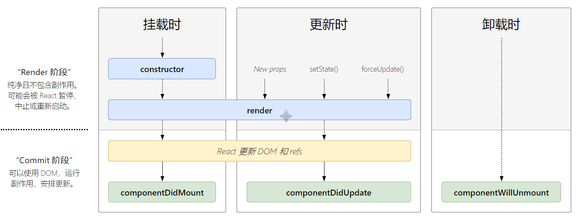


#### 主要的生命周期

- *constructor*
  - 组件被实例化的时候出发 一般用做对组件做初始工作,如设置`state`等

- render
  - 组件开始渲染时触发
  - 组件被更新时触发 -  state和props发生改变时触发
- componentDidMount
  - 组件挂载完毕,可以发送异步请求获取数据
- componentWillUnmount
  - 组件被卸载时触发
  - 一般用在清除定时器或者取消订阅等

---


## [mobx ](https://mobx.js.org/README.html)

> react中 全局数据管理库  可以简单的实现数据的跨组件共享 类似 vue中的vuex


### 使用步骤

1. 安装依赖

   - `mobx` 核心库
   -  `mobx-react` 方便在react中使用mobx技术的库
   - `@babel/plugin-proposal-decorators` 让 `rn` 项目支持 `es7` 的装饰器语法的库

   ```js
   yarn add mobx mobx-react @babel/plugin-proposal-decorators
   ```

2. 在 `babel.config.js`添加以下配置

   ```js
     plugins: [
       ['@babel/plugin-proposal-decorators', { 'legacy': true }]
     ]
   ```

3. 新建文件 `mobx\index.js` 用来存放 全局数据 

   ```js
   import { observable, action } from "mobx";
   
   class RootStore {
     // observable 表示数据可监控 表示是全局数据
     @observable name = "hello";
     // action行为 表示 changeName是个可以修改全局共享数据的方法
     @action changeName(name) {
       this.name = name;
     }
   }
   
   export default new RootStore();
   ```

4. 在根组件中挂载

   > 通过 `Provider` 来挂载和传递

   ```jsx
   import React, { Component } from 'react';
   import { View} from 'react-native';
   import rootStore from "./mobx";
   import { Provider} from "mobx-react";
   class Index extends Component {
     // 正常
     render() {
       return (
         <View  >
           <Provider rootStore={rootStore} >
             <Sub1></Sub1>
           </Provider>
         </View>
       );
     }
   }
   ```

5. 其他组件中使用

   ```jsx
   import React, { Component } from 'react';
   import { View, Text } from 'react-native';
   import {inject,observer } from "mobx-react";
   
   @inject("rootStore") // 注入 用来获取 全局数据的
   @observer //  当全局发生改变了  组件的重新渲染 从而显示最新的数据
   class Sub1 extends Component {
     changeName = () => {
      // 修改全局数据   
       this.props.rootStore.changeName(Date.now());
     }
     render() {
       console.log(this);
       return (
         <View><Text onPress={this.changeName}>{this.props.rootStore.name}</Text></View>
       );
     }
   }
   
   export default Index;
   ```

   

