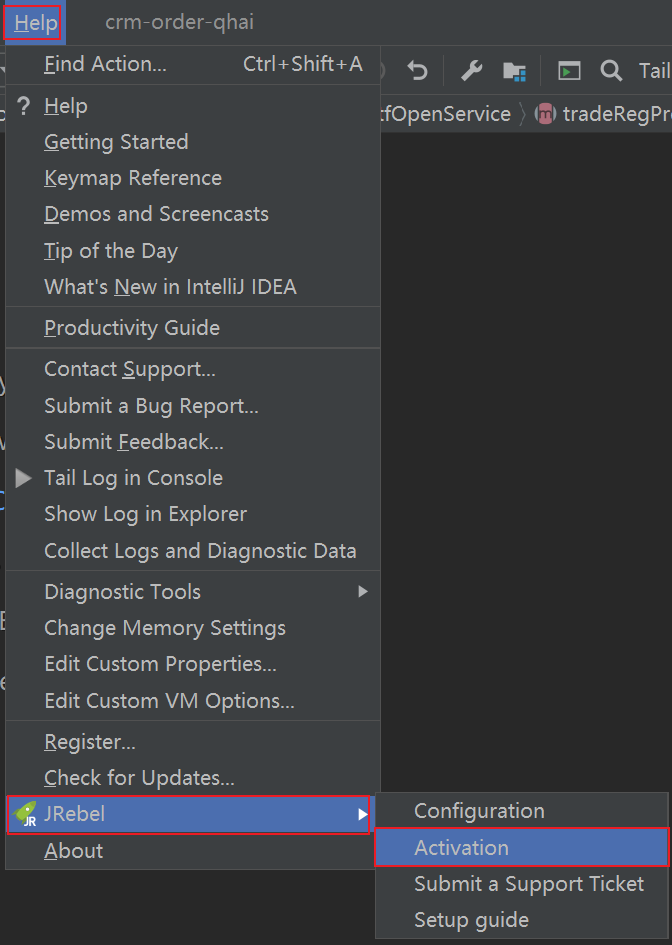
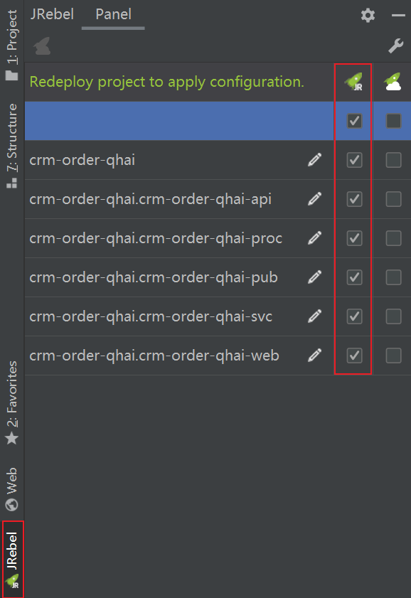
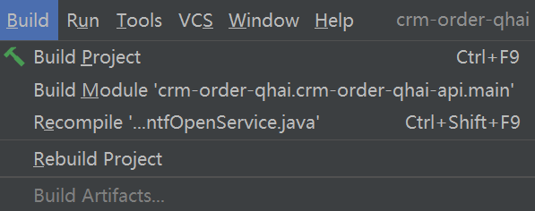
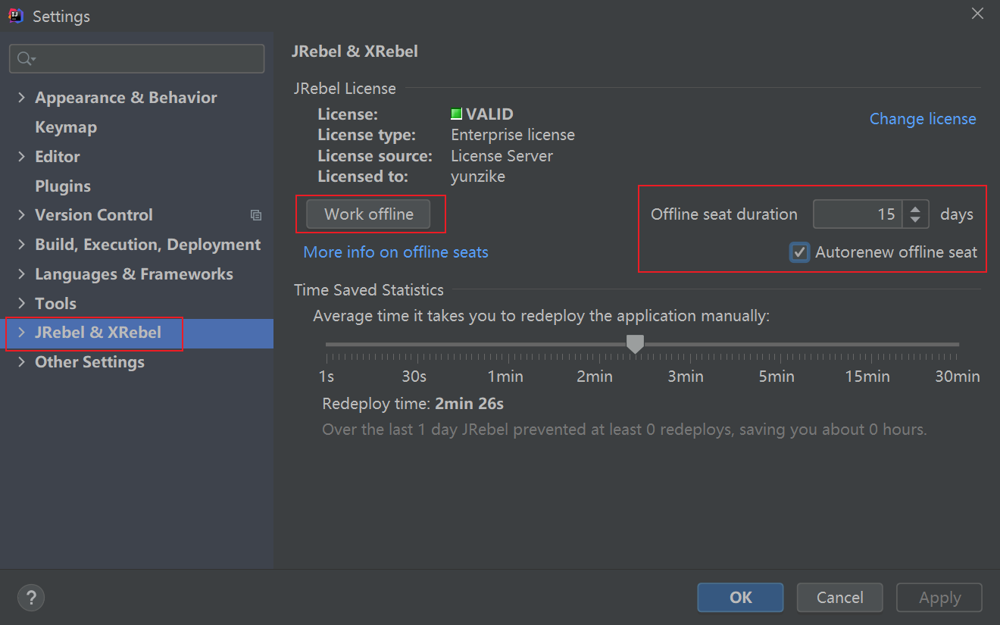
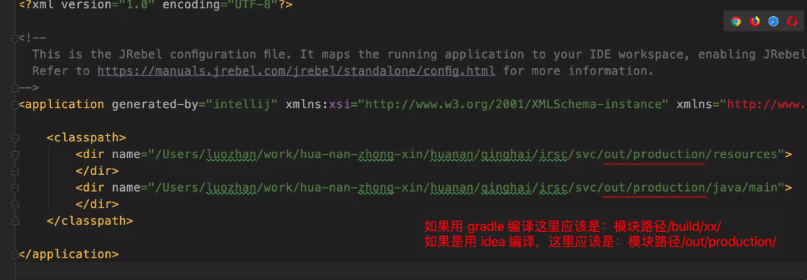

### 前言

一个java web项目，在写的过程中我们需要不断调试，如果没有热部署，则我们每修改一次项目要重启一次，验证问题有没有得到解决。如果项目很小，启动只要几秒或十几秒，可能感觉影响不是很大；但当项目变大了，重启一次需要几十秒，几分钟，甚至十几分钟，每次修改后都需要重启无疑会严重影响我们的工作效率。

正常情况下，我们使用IDEA（或Eclipse等IDE)+tomcat部署web项目时，如果只是方法内部作修改或只是修改web页面，按Ctrl+shift+F9（Eclipse按Ctrl+S即可)重新编译，无须重新启动，即可使修改的代码生效，这对我们的开发调试有了很大的帮助。但当我们在java文件中增加方法，增加变量，修改配置文件等大部分操作时，都需要重启服务器，而Jrebel使绝大部分操作都不需要重启，只要重新编译即可将更新部署到服务器上，大大节省了我们工作花在重启服务器上的时间。

### 安装与激活


#### 激活



```
https://jrebel.qekang.com/3fc1c149-026f-4704-80c4-2b75a14d7b1a
```


### 配置与使用

1、在左下角的窗口边栏中找到JRebel，点击进入设置面板，将每个模块都开启 Jrebel。只有开启了开关的模块才会被 jrebel 监听。



2、启动项目时不再用原来的 Run 和 Debug ，改用 JRebel 的按钮启动，在原来的图标右边，火箭带虫子的图案就是 Debug


3、修改代码后，任何编译（编译项目、编译模块、重编译当前类）都会自动刷新 class，无需重启项目。



上图三种编译的区别：

- Build Project - 编译整个工程，增量编译，如果想强制重新编译选择最下方的 Rebuild Project
- Build Module - 编译焦点所在文件的模块，编译模块时只会编译本模块以及模块依赖的其他模块，如编译 svc 模块时会编译 api 模块但不会编译web 模块，增量编译
- Recompile ‘xx.java’ - 重编译当前类文件，只对当前类进行重新编译

开发过程中最常用的应该是Build Module，建议改快捷键为 ctrl+s（原来的保存快捷键并没有什么用，idea 是自动保存的），这样改完代码后 ctrl+s 一下就能触发编译，同时 jrebel 会自动热更新变动的代码（就像曾经的 Eclipse 自动编译的体验）

### 问题

- WEB 项目启动 Jrebel 不生效

  WEB 默认采用了缓存，需要在WebApplication 的 jvm 启动参数里配置禁用缓存

  ```
  -Dorg.apache.tapestry.disable-caching=true
  ```

- 断网 Jrebel 就无法工作

  可以将 Jrebel 设置成离线模式：

  

- Jrebel 热加载不生效

  检查 Jrebel配置中是否将每个模块都开启了开关（上一章中有介绍），然后再检查各个模块下的 src/main/resources/rebel.xml 文件中的监听路径是否正确，很多同学由 gradle 切换到 idea 编译后各模块下的 rebel.xml 文件配置没有改，还是监听 gradle 的编译输出目录，导致 jrebel 失效

  

