## 一、IDEA的安装与基本配置

#### 1、JDK环境配置

Configure->Structure for new Project->Project Settings->Project->Project SDK 
选择JDK本地安装目录并设置

#### 2、配置Tomcat环境

菜单按钮中方框：Edit Configuraion->添加->Tomcat Server ->local 
1.设置服务器name:server01 
2.Server->Application server->Configure    选择本地Tomcat路径 
3.Open Browser->After launch   设置运行后启动浏览器 
4.Open Browser->url 设置部署入口的ur 
5.On 'update' action:修改为Redeploy,On frame deactivation:修改为Update classes and resources  
6.Http port  配置端口
7.Deployment 设置服务器运行的项目

#### 3、配置maven

1.下载Maven解压并修改仓库配置 
2.设置直接搜索Maven 
3.修改Maven home directory为本地Maven路径 
4.修改User settings file为settings.xml并勾选后面的override 
5.Local repository为配置的本地仓库并勾选后面的override 

#### 4、git的使用

设置中配置本地安装的git
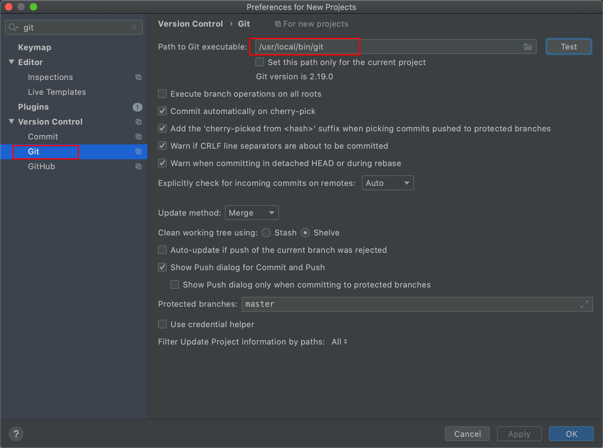

## 二、项目

#### 1、创建项目

- 创建Java SE项目

  1.启动页点击Create new project 
  2.左侧选择Java 
  3.选择JDK，默认为配置的JDK环境 
  4.点击next再点击next，然后设置项目名，项目路径，完成

- 创建Java EE项目

  1.启动页点击Create new project 
  2.左侧选择Java 
  3.勾选Java EE->Web Application 
  4.设置Serverlet版本：点击Java   EE，最下方选择Serverlet版本对应的Java EE版本，再点击Web Applic就能看到选择的Serverlet版本了 
  5.点击next，指定项目名字和路径，完成  

#### 2、导入项目

- 导入eclipse项目

  

## 三、设置

#### 1、编码界面设置
打开菜单按钮（默认关闭） 
View->Toolbar(菜单按钮)和Tool Window Bars(窗口左右菜单项)

#### 2、设置启动显示启动页而不是直接打开项目
Configure->Settings->Appearance&Behaivor->System settings 
去掉Reopen last project on startup的勾

#### 3、关闭自动保存和标志修改文件为星号

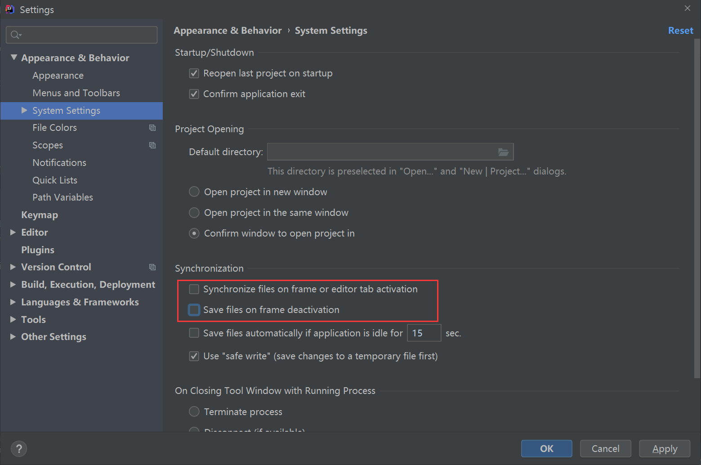

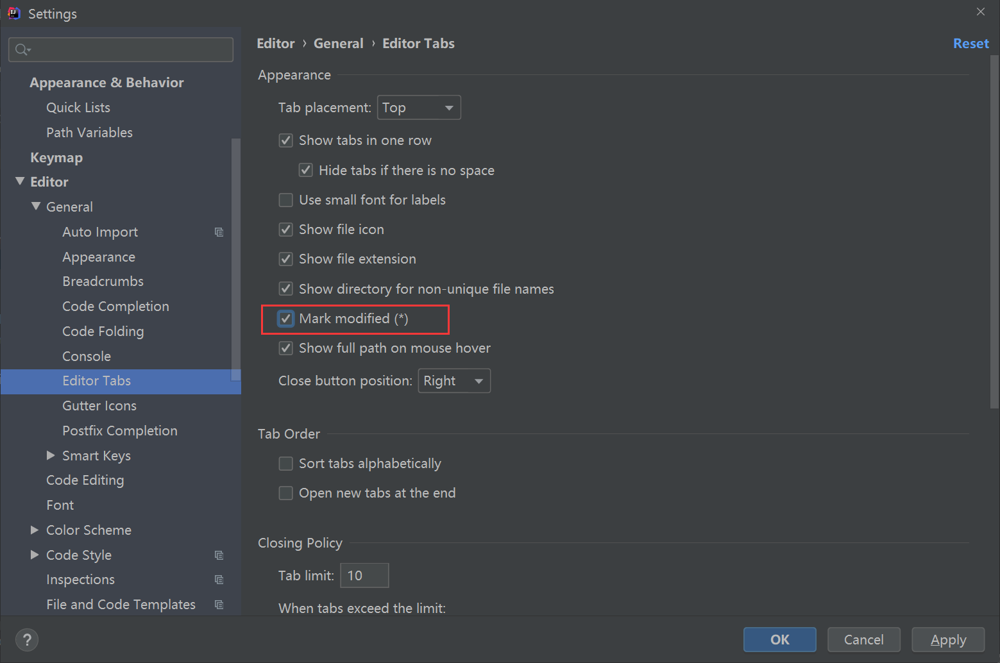

#### 4、IDEA中的.iml和.idea文件
.iml文件 
iml文件是IntelliJ   IDEA自动创建的模块文件，用于Java应用开发，存储一些模块开发相关的信息，比如一个Java组件，插件组件，Maven组件等等，还可能存储一些模块路径信息，依赖信息以及别的一些设置。  

.idea文件夹 
idea对module配置信息之意，information of module

**隐藏** 
这两个文件我们平常几乎不使用，在创建父子工程或者聚合工程时反而会对我们操作产生干扰，所以，一般情况下，我们都将其隐藏掉，步骤如下： 
Editor——>File Types——>Ignore files and foloders中输入*.iml和.idea,以 ; 结尾

#### 5、配置JVM参数
Help->Editor Custom VM Options 
-Xms128m 
-Xmx750m 
-XX:ReservedCodeCacheSize=240m 
修改为： 
-Xms1024m 
-Xmx2048m 
-XX:ReservedCodeCacheSize=500m

#### 6、添加第三方依赖
1.webINF目录下新建lib目录，并将依赖jar包复制进去 
2.点击菜单按钮Project Structure 
3.Project Settings->Libraries 
点击加号，Java->选择刚才创建的lib文件夹->OK->OK->Apply 
4.Project Settings->Modules->
Dependencies->勾选刚才添加的lib仓库->Apply  


#### 7、其他设置
全局设置： 
启动界面Configure->Settings 
编码界面File->Other settings->Settings for new Projects 
项目设置：
编码界面File->Settings

修改主题：Appearance&Behaivor->Appearance->Theme 
代码字体：Editor->Font 
控制台字体：Editor->Color Scheme->Console Font 
控制台颜色：Editor->Color Scheme->Console Color  

编码方式：Editor->File Encordings 
Project Encoding---UTF-8 
Properties Files---UTF-8 并勾上后面的勾

显示行号：
Editor->General->Appearance->Show line numbers 
方法间显示分割线：Editor->General->Appearance->Show method separators 
格式化代码空行设置：
Editor->Code Style->Java->Blank Lines
最上面三个改为1，格式化代码后多个空行合并成一个空行  

**代码提示（补全）：**
Editor->General->Code Completion->Match case
修改为All letters？ 
显示方法参数：
Editor->General->Code Completion->Parameter Info

**自动导包：**
Editor->General->Auto Import 
Java->Ask改为All并勾选Add unambig...和Optimize imports...

文档提示（鼠标移到类上或方法上）： 
Editor->General->勾上Show quick documentation on mouse move 

去除SQL黄色背景：

去掉SQL中No data sources configured（没有配置数据源） 选项 和 SQL dialect detection（SQL方言检测）

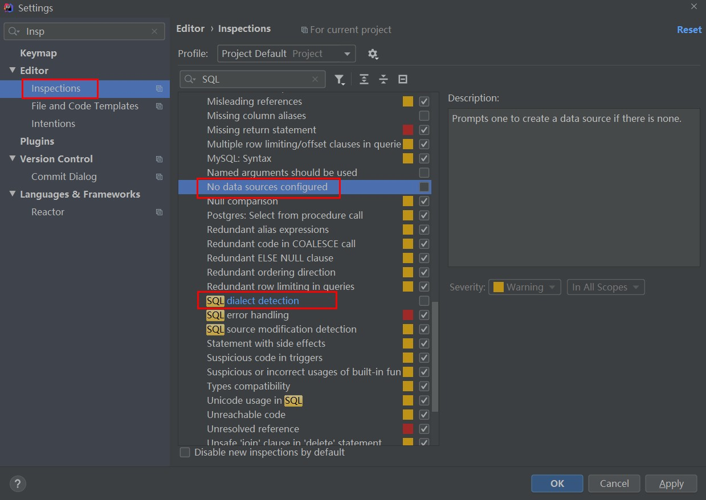

再去掉灰色背景色

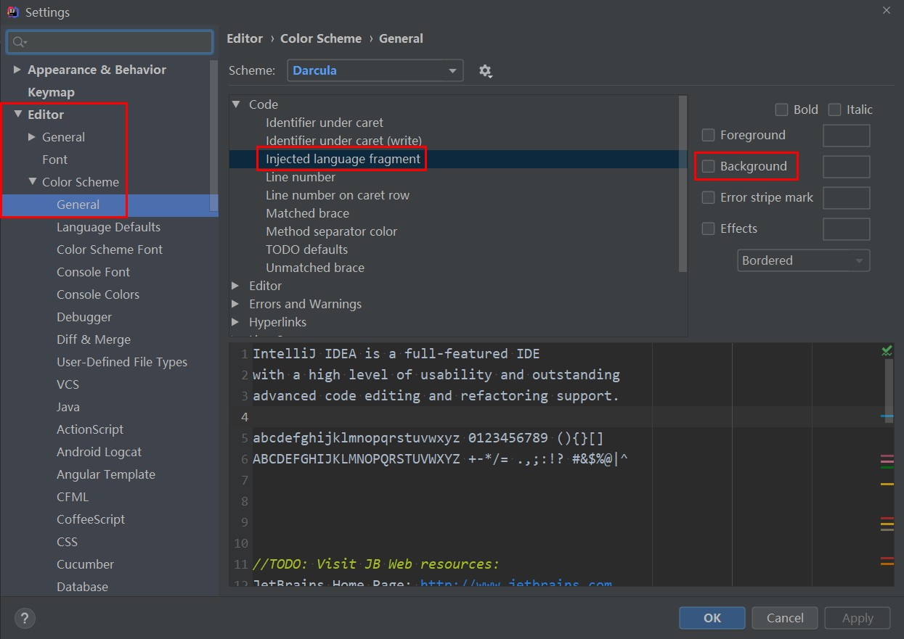

## 四、快捷键

#### 1、基本快捷键

IDEA不需要Ctrl+S保存，每做一步操作软件会自动保存（可设置成手动保存） 
psvm：main函数 
sout：打印 
shift+f10：运行 
ctrl+f2：停止  

ctrl+shift+enter 语句补全(定义方法，for循环，fori) 
ctrl+shift+space 智能补全(如将之前定义的方法的返回值赋给定义的变量) 
alt+enter：代码修复 
shift+enter: 跳到新的一行 
ctrl+y：删除当前行（PS 使用剪切更快捷）
ctrl+D：复制并粘贴当前行（或选中内容）
ctrl+alt+L：格式化代码 
alt+insert: 插入构造方法、get\set方法等 
ctrl+alt+t: 在选中代码块外面包上其他东西如if、trycatch等 
ctrl+shift+v：剪切板
ctrl+shift+u：大小写

#### 2、重构

shift+F6： 更改类名或成员变量 
ctrl+alt+m： 方法抽取 
ctrl+r：替换本文件文本 
ctrl+shift+r：全局替换文本 
alt+j：选中某个文本后，再选中下一个相同文本，可以同时修改  

#### 3、选择与跳转

ctrl+w:选择代码 
ctrl+shift+w:释放代码 
ctrl+left/right: 移动到单词前面/后面 
ctrl+shift+left/right：选择单词 
ctrl+[/]: 移动到代码块前面/后面 
ctrl+shift+[/]：选择代码块

alt+up/down:在不同方法之间跳跃 
alt+shift+up/down：移动当前行 
ctrl+shift+>:代码折叠 
ctrl+alt+鼠标点击：跳到具体实现方法 
ctrl+鼠标点击：跳到调用方法
ctrl+alt+左方向箭头：back跳到上一个查看位置（需要关闭显卡旋转屏幕快捷键） 
ctrl+alt+右方向箭头：forward前往下一个查看位置（需要关闭显卡旋转屏幕快捷键） 
shift+鼠标滚轮(项目结构视图中可用ctrl+left|right)：移动滚动条  

#### 4、视图操作

shift+esc：关闭当前视图 
alt+home：显示导航栏
alt+1: 显示项目结构 
alt+4: 显示控制台 
ctrl+E: 显示最近文件  

#### 5、查找 

ctrl+F:当前文件文本搜索 
ctrl+shift+F:全局文本搜索  

ctrl+N:按类名搜索 
ctrl+shift+N:按文件名搜索 
shift+shift：万能搜索（搜索类、资源、配置项、方法、搜索路径）  

alt+7：当前文件结构 
ctrl+F12： 当前类的所有方法 
alt+F7: 查找类或方法在哪里被使用  

Ctrl+Alt+B： 查看接口或者抽象方法的实现（必须先将光标定位到接口或抽象方法行） 
ctrl+h： 当前类的继承关系（只有当前类的继承，不包含层级关系上的接口） 
ctrl+alt+U: 查看UML图（包含该类或接口以上层级的类和接口，其中蓝色实线箭头表示继承类，绿色实线箭头表示继承接口，绿色虚线箭头是实现接口）   

#### 6、代码提交

ctrl+t：poll 
ctrl+k：commit 
ctrl+shift+k: push  

#### 7、列编辑

mac 下，
光标选中连续行相同位置：opt + 鼠标左键拖动
光标选中多个任意位置：shift + opt + 鼠标左键单击
选中相同内容出现的多个位置：选择内容后，cmd + F 查询，然后ctrl + G 光标选择下一个位置 

alt + 鼠标左键拖动或者shift + 上下方向箭：光标选中连续行相同位置
shift + alt + 鼠标左键单击选择：光标选中多个任意位置

选中相同内容出现的所有行：
选择内容后，ctrl+F 查询，然后ctrl + shift + alt + J 光标选中所有查询结果

## 五、Debug

竖排按钮： 
ctrl+F5：重启Debug 
Resume Program (F9)：下一个断点  

Ctrl+F2：停止Debug 
View BreakPoints(ctrl+shift+F8)：查看所有断点 
Mute BreakPoints：禁用所有断点  

横排按钮： 
Show Execution Point (Alt + F10)：跳转当前执行行 
Step Over (F8)： 下一行 
Step Into (F7)： 下一行（进入方法内部，除官方类库方法外） 
Force Step Into (Alt+Shift+F7)：下一行（进入任何方法内部） 
Step Out (Shift+F8)：跳出（退出到方法调用处） 
Drop Frame (默认无快捷键)：回退断点
Run to Cursor (Alt+F9)：运行到光标处（不需要事先打断点）
Evaluate Expression (Alt+F8)：计算表达式（可以先选中表达式）  

运行完成：
方式一：连续点击F9执行完最后一个断点
方式二：禁用断点然后点击F9 
变量值查看： 
方式一：光标悬停+ctrl+F1 
方式二：Variables视图或Watches视图 
智能步入： 
smart step into(shift+F7)：当前行有多个方法时，自主选择进入的方法（step into会依次进入）    


## 六、插件

- 添加插件

  启动页Configure->Plugins或者Settings->Plugins

- 常用插件： 

  activate-power-mode: 代码编辑特效 
Rainbow Brackets: 彩虹括号 
  CodeGlance: 代码导航地图 
Free Mybatis plugin: mapper和xml跳转 
  Key promoter：快捷键提示，可以关闭提示，没有快捷键的可以快速设置快捷键 
ECTranslation: 翻译 
  Alibaba Java Coding Guidelines: 阿里代码规约 
CamelCase: 驼峰转化，shift + alt + u
  JRebel for IntelliJ：热部署 收费
Material Theme UI:主题插件，修改图标
  RestfulToolkit:快速定位接口方法
Mybatis Log Plugin:输出可执行的SQL语句
  RestfulToolkit：快速定位接口
Lombok：省掉手动的get/set方法
  Grep Console：日志着色控制台显示
Easy Code：数据库生成JavaBean
  .ignore：生成.gitignore文件
  Git Commit Template：git commit 模板
  GsonFormat：一键根据json文本生成java类
  Jclasslib Bytecode Viewer：查看类的字节码文件
  Leetcode Editor：LeetCode插件
  Nyan progress bar: 进度条美化

## 七、自定义代码模板

#### 1、注释模板

- 类注释

  Editor --> File and Code Templates --> Includes --> File Header

  ```java
  /**
   * 
   * @Description ${NAME} <br>
   * @author xiongxiaoqi <br>
   * @date ${DATE} ${TIME} <br>
   * version: 1.0 <br>
   */
  ```

- 方法注释  

  ```java
  //方法注释
  ```

#### 2、Live Templates（代码模板）

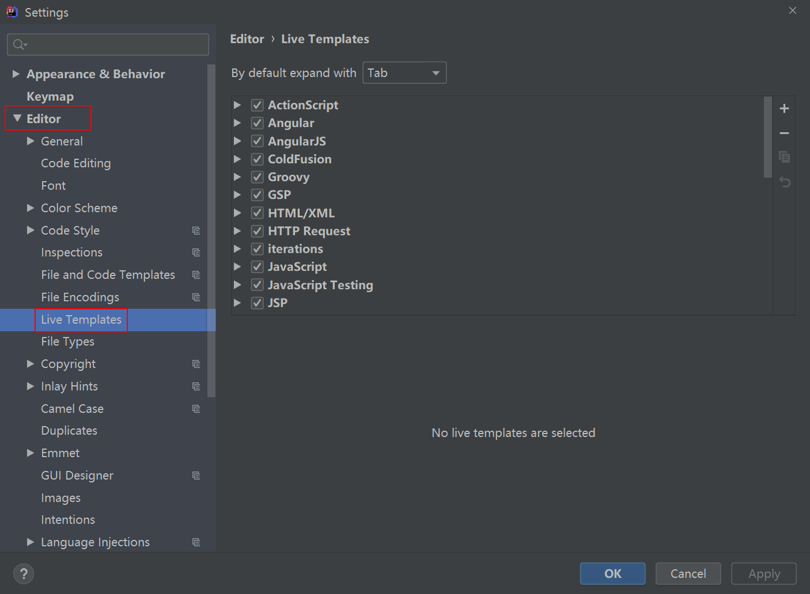

或者在代码中使用快捷键 ctrl + j ，然后点击右下角的灯泡图标会出现Edit live templates settings，点击即可进入设置Live Templates。

然后点击右上角的加号选择Template Group新建自己的代码模板分组（也可以直接在原有分组中加，但最好新建分组避免混乱原有设置）custom，选中自己新建的分组，再点击加号选择Live Template即可添加代码模板。

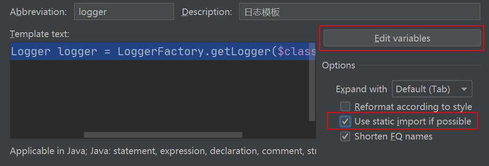

其中，Abbreviation（缩写）：即为代码模板缩写，触发生成代码模板内容的关键字。Description为模板描述。Template text模板代码内容，如下方的日志代码模板，其中可以使用$变量名$来定义变量，然后点击Edit Variables设置该变量对应的值，如所在类名、方法名、方法参数列表等。

```java
private static final Logger logger = LoggerFactory.getLogger($className$.class);
```

左下方如果存在警告：No applicable  contexts. 则需要点击define设置代码模板使用的上下文，即使用的代码类型范围，如Java。另外，还可以勾选Use static import if possible开启静态导入。

常见的设置还有单元测试方法模板如下图：

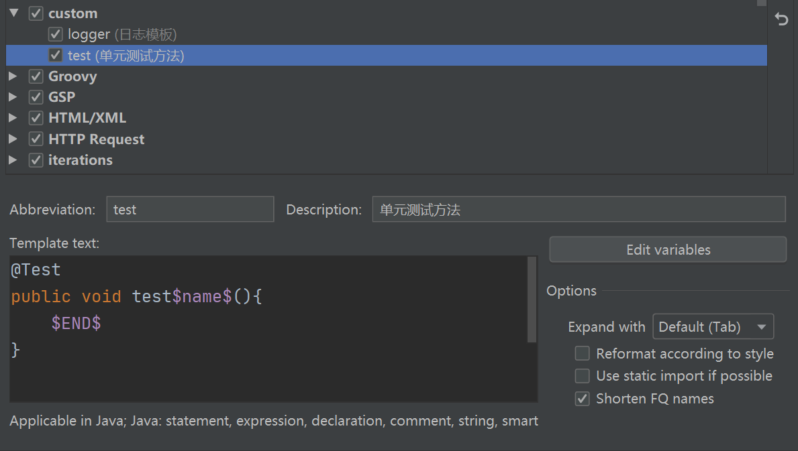

#### 3、File Templates（文件模板）

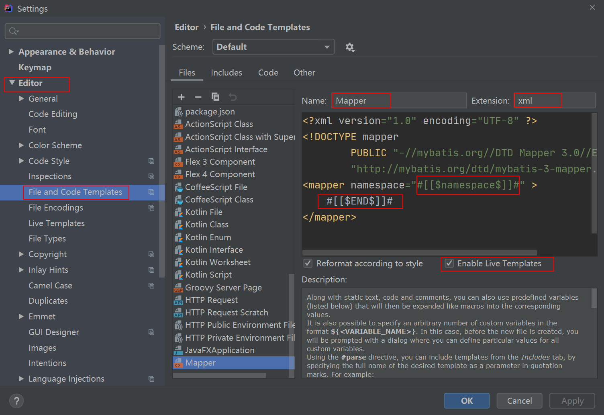

或者在项目结构的任意目录上右键单击，选择new，然后选择Edit File Templates，即可进入设置。

如上图中添加Mapper.xml的模板，文件名为Mapper，后缀为xml，填入模板内容，其中新建文件后光标符所在位置为：#[[$namespace$]]#，#[[$END$]]#为最后停留的光标位置。另外需要勾上Enable Live Templates。

使用时直接在目录或包上右键单击，选择new，再选择文件模板的名称即可新建该文件。

## 八、后缀补全（Postfix Complation）

#### 1、变量创建

| 代码格式    | 说明                                                         |
| ----------- | ------------------------------------------------------------ |
| xxx.var     | 创建局部变量，如：new Person.var再回车相当于输入Person person = new Person(); |
| xxx.filed   | 创建全局变量                                                 |
| 类名.new    | 相当于new 类名()                                             |
| xxx.cast    | 类型强转，如：new Object().cast 再回车，填入要强转的类型Person，然后回车输入.var 再回车得到Person person = (Person) new Object(); |
| xxx.castvar | 类型强转+创建局部变量，如：new Object().castvar再回车输入要强转的类型Person，相当于输入Person person = (Person) new Object(); |

#### 2、类型判断

| 代码格式               | 说明       |
| ---------------------- | ---------- |
| xxx.null               | 判空       |
| xxx.notnull 或 xxx.nn  | 判非空     |
| 布尔类型或表达式.if    | if 判断    |
| 布尔类型或表达式.while | while 判断 |
| xxx.not                | 取反       |

#### 3、输出与返回

| 代码格式   | 说明    |
| ---------- | ------- |
| xxx.sout   | 输出xxx |
| xxx.return | 返回xxx |

#### 4、循环

| 代码格式 | 说明             |
| -------- | ---------------- |
| xxx.fori | 从小到大索引遍历 |
| xxx.forr | 从大到小索引遍历 |
| xxx.for  | 增强for循环      |

#### 5、异常捕获

| 代码格式 | 说明                                    |
| -------- | --------------------------------------- |
| xxx.try  | 捕获异常，如调用xxx方法，但需要捕获异常 |

#### 6、自定义Postfix Complation

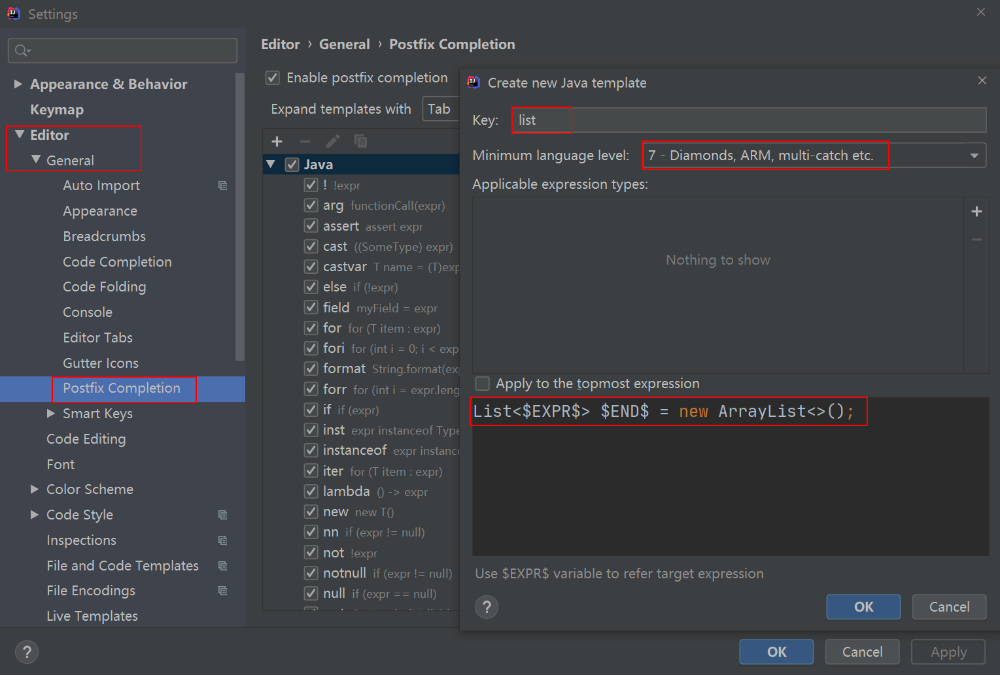

如上图，关键字为list，即使用xxx.list回车创建xxx类型的List集合，其中$EXPR$为.list前的表达式，$END$为光标最后停留的位置。

## 九、Maven依赖自动提示

#### 1、自动提示

windows下：ctrl+alt+空格
mac下：ctrl+长按空格

#### 2、快速搜索

alt+insert，然后选择dependcy

## 十、Inject Language

#### 1、构造JSON字符串

输入如下代码，将光标停留在字符串的双引号内

```java
String json = "";
```

然后按alt + 回车，选择Inject Language or reference。再选择json后回车，即可将该字符串标记成一个JSON字符串，再按alt + 回车可以添加注释，再按alt + 回车，选择Edit JSON Fragment则会打开JSOM编辑视图，可以再视图中直接书写原JSON格式的代码。注意：选择时可以直接输入字母快速选中要选的选项。

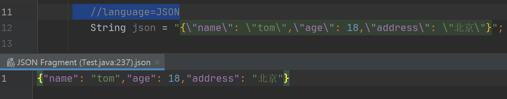

按alt + 回车，选择Uninject Language or reference，则可以将该字符串的JSON标记取消。

#### 2、构造HTML 字符串

构造HTML字符串的操作同上，只是将选择json的操作改成选择html。


## 十一、Git相关操作


#### 1、分支管理

https://www.cnblogs.com/java688/p/13373269.html


