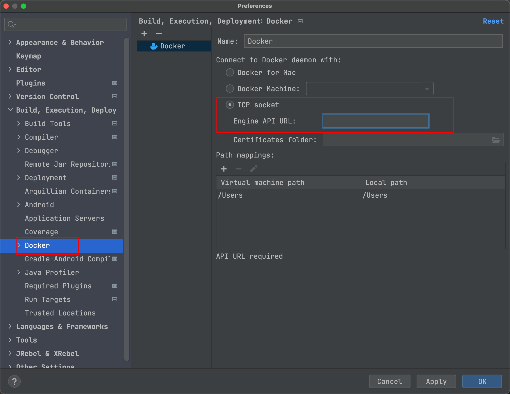
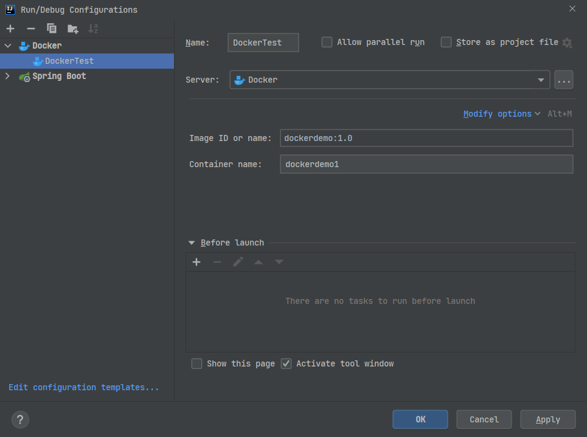
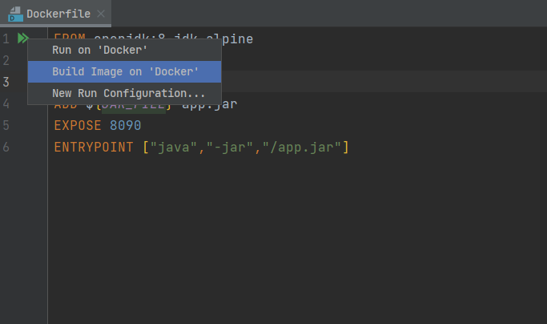
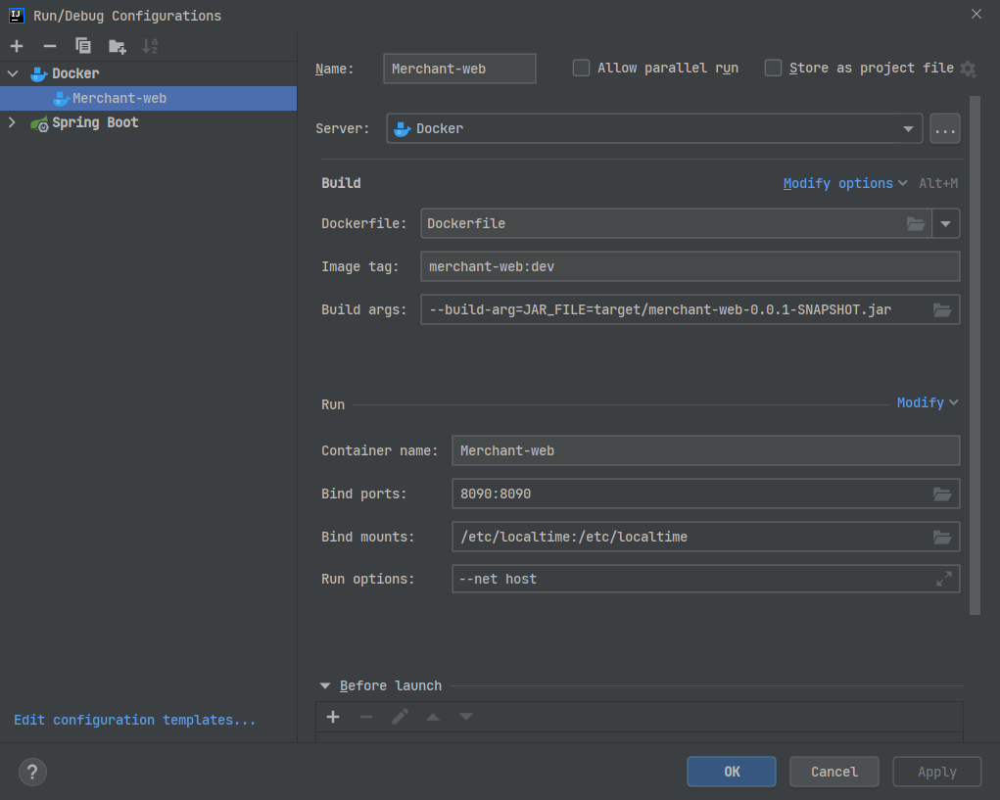

## 1、Docker 开启远程访问

```bash
[root@izwz9eftauv7x69f5jvi96z docker]# vim /usr/lib/systemd/system/docker.service
#修改ExecStart这行
ExecStart=/usr/bin/dockerd  -H tcp://0.0.0.0:2375  -H unix:///var/run/docker.sock
#重新加载配置文件
[root@izwz9eftauv7x69f5jvi96z docker]# systemctl daemon-reload    
#重启服务
[root@izwz9eftauv7x69f5jvi96z docker]# systemctl restart docker.service 
#查看端口是否开启
[root@izwz9eftauv7x69f5jvi96z docker]# netstat -nlpt
#直接curl看是否生效
[root@izwz9eftauv7x69f5jvi96z docker]# curl http://127.0.0.1:2375/info
```

## 2、IDEA 安装 Docker 插件


## 3、启用 Docker



## 4、SpringBoot 项目

- pom.xml 添加插件

  ```xml
  <build>
      <plugins>
          <plugin>
              <groupId>org.springframework.boot</groupId>
              <artifactId>spring-boot-maven-plugin</artifactId>
          </plugin>
          <plugin>
              <groupId>com.spotify</groupId>
              <artifactId>docker-maven-plugin</artifactId>
              <version>1.0.0</version>
              <configuration>
                  <imageName>${docker.image.prefix}/${project.artifactId</imageName>
                  <dockerDirectory></dockerDirectory>
                  <resources>
                      <resource>
                          <targetPath>/</targetPath>
                          <directory>${project.build.directory}</directory>
                          <include>${project.build.finalName}.jar</include>
                      </resource>
                  </resources>
              </configuration>
          </plugin>
      </plugins>
  </build>
  ```

- Dockerfile 文件：在工程根目录下新建Dockerfile文件

  ```bash
  #指定基础镜像，在其上进行定制
  FROM java:8
  
  #维护者信息
  MAINTAINER wuweixiang <wuweixiang.alex@gmail.com>
  
  #这里的 /tmp 目录就会在运行时自动挂载为匿名卷，任何向 /tmp 中写入的信息都不会记录进容器存储层
  VOLUME /tmp
  
  #复制上下文目录下的target/demo-1.0.0.jar 到容器里
  COPY target/demo-1.0.0.jar demo-1.0.0.jar
  
  #bash方式执行，使demo-1.0.0.jar可访问
  #RUN新建立一层，在其上执行这些命令，执行结束后， commit 这一层的修改，构成新的镜像。
  RUN bash -c "touch /demo-1.0.0.jar"
  
  #声明运行时容器提供服务端口，这只是一个声明，在运行时并不会因为这个声明应用就会开启这个端口的服务
  EXPOSE 8080
  
  #指定容器启动程序及参数   <ENTRYPOINT> "<CMD>"
  ENTRYPOINT ["java","-jar","demo-1.0.0.jar"]
  ```

- 创建docker

  

- sfas 

  



