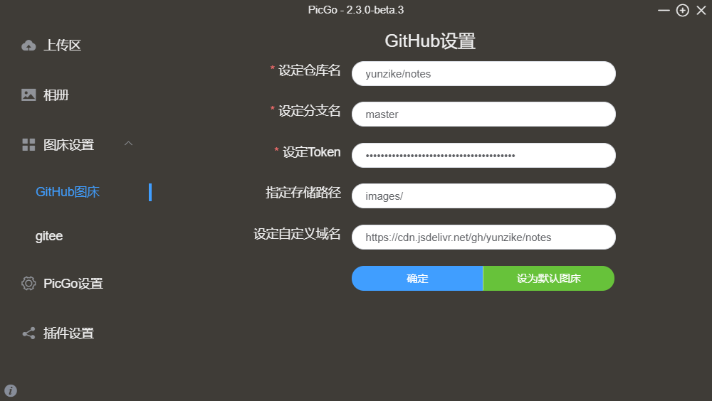

## 一、图床搭建

### 1、使用 `github` 搭建图床

https://yunzike.github.io/notes/images/

#### 使用jsdelivr进行CSN加速

https://cdn.jsdelivr.net/gh/yunzike/notes/images/

- 获取 token


d4ca55380cbee3412870555f955dff91ac40e621



### 2、使用 `gitee` 搭建图床

> 优势：访问速度快
>
> 缺点：图片大小超过 1M 时无法解析显示，需要上传之前对图片进行压缩


- 输入一个仓库名称

- 其次将仓库设为公开

- 勾选使用Readme文件初始化仓库，自动为仓库建立master分支

- 获取码云`token`

  进入设置中的私人令牌点击`生成新令牌`，把 **projects** 这一项勾上，其他的不用勾，然后点击`提交`

  验证密码后即生成`token 串`

  ```
  258430c6039e753724115c85d12c9755
  ```

## 二、图片上传

### 1、Typora 上传图片

- 自动上传图片


- 上传本地所有图片

  

### 2、使用 PicGo

- 安装 PicGo 软件，支持macOS,Windows,Linux

- 安装 `gitee-uploader 1.1.2` 插件

  

- 配置 `gitee`图床

  

- 上传前压缩图片

  下载插件

### 3、使用 ipic


### 4、使用 upic


### 5、Typora 使用命令自定义上传图片

#### 首先打开设置，填入你的自定义命令的路径


#### 自定义命令的实现

Typora 只管给你图片路径和获取图片 URL，至于中间自定义命令如何处理图片是不管的。

下面讲讲自定义命令的实现思路：

1. 获取图片路径
2. 判断 git 本地仓库是否存在该图片，若存在则跳到第五步
3. 将图片复制到 git 本地仓库
4. 调用外部程序 git，完成 git 的 add 、commit、push
5. 将 git 远程仓库文件 URL 的固定前缀与图片名拼接生成图片 URL
6. 输出图片 URL

go 写了一个小工具，具体实现很简单，有需要借鉴的自取吧

```go
// 图片URL的前缀
var prePicURL = ""

// git 本地仓库路径
var picPath = ""

func main() {
	flag.Parse()
	file := flag.Args()

	if len(file) == 0 {
		os.Exit(1)
	}
	picURLs := make([]string, len(file))

	for _, v := range file {
		if !isFileExist(v) {
			if cpFile(v) {
				upload(v)
				// filepath.Base(v) 获取文件名
				picURLs = append(picURLs, prePicURL+filepath.Base(v))
			}
		} else {
			picURLs = append(picURLs, prePicURL+filepath.Base(v))
		}
	}

	fmt.Println("Upload Success:")
	for _, v := range picURLs {
		fmt.Println(v)
	}

}

func isFileExist(fileName string) bool {
    //os.Stat获取文件信息
	_, err := os.Stat(picPath + filepath.Base(fileName)) 
	if err != nil {
		if os.IsExist(err) {
			return true
		}
		return false
	}
	return true

}

func cpFile(fileName string) bool {

	srcFile, err := os.Open(fileName)
	if err != nil {
		fmt.Println(err)
		return false
	}

	defer srcFile.Close()
	reader := bufio.NewReader(srcFile)

	destFile, err := os.OpenFile(picPath+filepath.Base(fileName), os.O_WRONLY|os.O_CREATE, 0777)
	if err != nil {
		fmt.Println(err)

		return false
	}
	writer := bufio.NewWriter(destFile)
	defer destFile.Close()

	_, _ = io.Copy(writer, reader)

	return true
}

func upload(fileName string) {

	cmd1 := exec.Command("git", "add", ".")
	cmd2 := exec.Command("git", "commit", "-m", filepath.Base(fileName))
	cmd3 := exec.Command("git", "push")

	cmd1.Dir = picPath
	cmd2.Dir = picPath
	cmd3.Dir = picPath

	_ = cmd1.Run()
	_ = cmd2.Run()
	_ = cmd3.Run()

}
```


