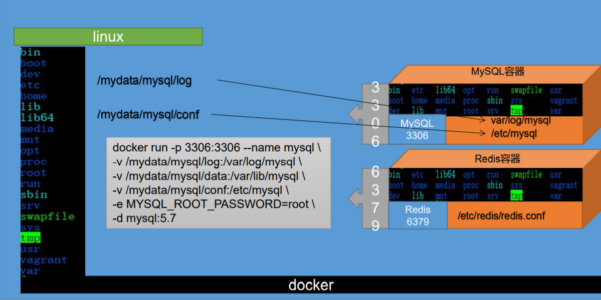
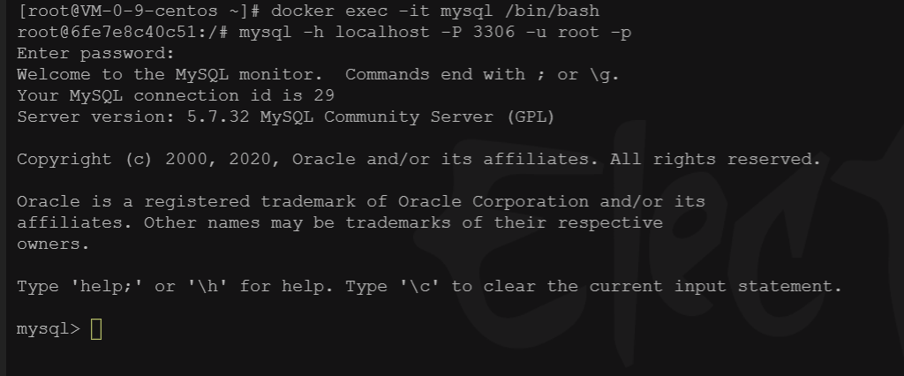

## 1、概述

> 虚拟化容器技术。Docker基于镜像，可以秒级启动各种容器。每一种容器都是一个完整的运行环境，容器之间互相隔离。

### 1.1 相关链接

- docker官网：http://www.docker.com
- docker中文网站：https://www.docker-cn.com/
- Docker Hub官网: https://hub.docker.com/

### 1.2、Docker的基本组成

- 镜像（image）

  Docker 镜像（Image）就是一个只读的模板。镜像可以用来创建 Docker 容器，一个镜像可以创建很多容器。

- 容器（container）

  Docker 利用容器（Container）独立运行的一个或一组应用。容器是用镜像创建的运行实例。它可以被启动、开始、停止、删除。每个容器都是相互隔离的、保证安全的平台。可以把容器看做是一个简易版的 Linux 环境（包括root用户权限、进程空间、用户空间和网络空间等）和运行在其中的应用程序。容器的定义和镜像几乎一模一样，也是一堆层的统一视角，唯一区别在于容器的最上面那一层是可读可写的。

- 仓库（repository）

  仓库（Repository）是集中存放镜像文件的场所。
  仓库(Repository)和仓库注册服务器（Registry）是有区别的。仓库注册服务器上往往存放着多个仓库，每个仓库中又包含了多个镜像，每个镜像有不同的标签（tag）。

  仓库分为公开仓库（Public）和私有仓库（Private）两种形式。
  最大的公开仓库是 Docker Hub(https://hub.docker.com/)，
  存放了数量庞大的镜像供用户下载。国内的公开仓库包括阿里云 、网易云 等

## 2、Docker安装

> Docker安装文档：https://docs.docker.com/engine/install/centos/

### 2.1 卸载旧版本

```bash
$ sudo yum remove docker \
                  docker-client \
                  docker-client-latest \
                  docker-common \
                  docker-latest \
                  docker-latest-logrotate \
                  docker-logrotate \
                  docker-engine
```

### 2.2 安装docker依赖包和设置docker安装地址

```bash
$ sudo yum install -y yum-utils

$ sudo yum-config-manager --add-repo https://download.docker.com/linux/centos/docker-ce.repo
```

【报错】Could not fetch/save url https://download.docker.com/linux/centos/docker-ce.repo to file /etc/yum.repos.d/docker-ce.repo: [Errno 12] Timeout on https://download.docker.com/linux/centos/docker-ce.repo: (28, 'Operation timed out after 30005 milliseconds with 0 out of 0 bytes received')

只需添加 `timeout=120`至 `/etc/yum.conf` :

```bash
cachedir=/var/cache/yum/$basearch/$releasever
keepcache=0
debuglevel=2
logfile=/var/log/yum.log
exactarch=1
obsoletes=1
gpgcheck=1
plugins=1
installonly_limit=5
bugtracker_url=http://bugs.centos.org/set_project.php?project_id=23&ref=http://bugs.centos.org/bug_report_page.php?category=yum
distroverpkg=centos-release

#add timeout here
timeout=120
```


### 2.3 安装docker

```bash
$ sudo yum install docker-ce docker-ce-cli containerd.io
```

### 2.4 启动docker

```bash
#启动docker
$ sudo systemctl start docker

#查看docker版本
$ docker -v

#查看当前docker中下载的镜像
$ sudo docker images
```

### 2.5 设置docker开机自启

```bash
$ sudo systemctl enable docker
```

### 2.6 配置docker阿里云镜像加速

登录阿里云官网打开控制台选择容器镜像服务，在镜像加速菜单中找到centos的操作命令并一一执行即可。

```bash
sudo mkdir -p /etc/docker
sudo tee /etc/docker/daemon.json <<-'EOF'
{
  "registry-mirrors": ["https://eww2r3jm.mirror.aliyuncs.com"]
}
EOF
sudo systemctl daemon-reload
sudo systemctl restart docker
```


## 3、使用Docker安装镜像

> Docker官方镜像仓库：docker hub

#### 1、下载镜像文件

访问docker hub官方镜像，并查找所需要安装的镜像，在镜像详情中选择tags可以查看镜像版本

```bash
# 从镜像仓库下载最新版本的mysql镜像
$ docker pull mysql

# 下载指定版本镜像
$ docker pull mysql:5.7
```

#### 2、创建实例并启动

```bash
# 启动一个mysql容器
# 同时进行文件夹挂载(挂载后在主机可以查看容器中的文件，且修改文件内容等同于在容器中修改)和mysql密码配置
$ docker run -p 3306:3306 --name mysql \
-v /mydata/mysql/log:/var/log/mysql \
-v /mydata/mysql/data:/var/lib/mysql \
-v /mydata/mysql/conf:/etc/mysql \
-e MYSQL_ROOT_PASSWORD=yunzike121 \
-d mysql:5.7
```


参数说明：
	-p 3306:3306	：将容器的3306端口映射到主机的3306端口
	--name mysql	：为当前启动的容器起名为mysql
	-v /mydata/mysql/conf:/etc/mysql\	：将mysql容器的配置文件夹挂载到主机
	-v /mydata/mysql/log:/var/log/mysql\	：将日志文件夹挂载到主机
	-v /mydata/mysql/data:/var/lib/mysql\	：将
	-e MYSQL_ROOT_PASSWORD=root	：初始化mysql的root用户的密码为root
	-d mysql:5.7	：docker run 是启动一个容器，而 -d 是指定以后台方式运行，要运行的镜像是mysql:5.7

#### 3、添加MySQL配置

```bash
$ vi /mydata/mysql/conf/my.cnf
```

```bash
# 配置文件内容
# ①默认字符编码为拉丁文需要改成utf8
# ②解决MySQL连接慢的问题

[client]
default-character-set=utf8

[mysql]
default-character-set=utf8

[mysqld]
init_connect='SET collation_connection=utf8_unicode_ci'
init_connect='SET NAMES utf8'
character-set-server=utf8
collation-server=utf8_unicode_ci
skip-character-set-client-handshake
skip-name-resolve
skip-grant-tables
```

注意：解决MysQL 连接慢的问题在配置文件中加入如下，并重启mysql
[mysqld]
skip-name-resolve
解释：
skip-name-resolve：跳过域名解析

如果使用root用户远程连接报错1045
可以添加配置：skip-grant-tables
也有其他方法

#### 4、通过容器的mysql命令行工具连接mysql

```bash
# 进入mysql
$ docker exec -it mysql /bin/bash

# 登录
```



#### 5、设置root远程访问


#### 6、进入容器文件系统


## 4、常用Docker命令

### 1、Docker 服务命令

```bash
# 查看docker版本
docker version

docker info

docker --help

# systemctl 方式
# 守护进程重启
systemctl daemon-reload
# 重启docker服务
systemctl restart docker
# 关闭docker
systemctl stop docker

# service 方式
# 重启docker服务
service docker restart
# 关闭docker
service docker stop
```

### 2、镜像命令

#### 查看镜像

```bash
# 查看镜像
docker images [OPTIONS]
各个选项说明:
REPOSITORY：表示镜像的仓库源
TAG：镜像的标签
IMAGE ID：镜像ID
CREATED：镜像创建时间
SIZE：镜像大小
同一仓库源可以有多个 TAG，代表这个仓库源的不同个版本，我们使用 REPOSITORY:TAG 来定义不同的镜像。
如果你不指定一个镜像的版本标签，例如你只使用 ubuntu，docker 将默认使用 ubuntu:latest 镜像

-a :列出本地所有的镜像（含中间映像层）
-q :只显示镜像ID。
--digests :显示镜像的摘要信息
--no-trunc :显示完整的镜像信息
```

#### 搜索镜像

```bash
# 搜索镜像
docker search [OPTIONS] 镜像名字
--no-trunc : 显示完整的镜像描述
-s : 列出收藏数不小于指定值的镜像。
--automated : 只列出 automated build类型的镜像；
```

#### 下载镜像

```bash
# 下载镜像
docker pull 镜像名字[:TAG]
```

#### 删除镜像

- 删除镜像

  ```bash
  docker rmi -f 镜像ID
  ```

- 删除多个

  ```bash
  # 删除多个
  docker rmi -f 镜像名1:TAG 镜像名2:TAG
  ```

- 删除全部

  ```bash
  # 删除全部
  docker rmi -f $(docker images -qa)
  ```

- 删除玄虚镜像

  ```bash
  docker image prune
  ```

### 3、容器命令

```bash
# 新建并启动容器
docker run [OPTIONS] IMAGE [COMMAND] [ARG...]

--name="容器新名字": 为容器指定一个名称；
-d: 后台运行容器，并返回容器ID，也即启动守护式容器；
-i：以交互模式运行容器，通常与 -t 同时使用；
-t：为容器重新分配一个伪输入终端，通常与 -i 同时使用；
-P: 随机端口映射；
-p: 指定端口映射，有以下四种格式
ip:hostPort:containerPort
ip::containerPort...

启动交互式容器
docker run -it centos /bin/bash

# 列出当前所有正在运行的容器
$ docker ps [OPTIONS]

-a :列出当前所有正在运行的容器+历史上运行过的(已经停止的)
-l :显示最近创建的容器。
-n：显示最近n个创建的容器。
-q :静默模式，只显示容器编号。
--no-trunc :不截断输出。

# 退出容器
exit   容器停止退出
ctrl+P+Q  容器不停止退出

# 启动容器
docker start


# 进入容器内部(每个容器是一个完整的运行环境---Linux环境，相当于一个小型Linux虚拟机)
# -it 以交互模式进入 
# /bin/bash 进入Linux的bash控制台
# 其中容器ID可以不写全，只要没有与之相同的即可，而容器名字需要写全
$ docker exec -it 容器id|容器名字 /bin/bash

# 退出容器
$ exit

# 重启容器
docker restart

# 容器自动启动
sudo docker update redis --restart=always
```

### 4、查看日志

```bash
docker logs -f --tail 200 容器名
```

