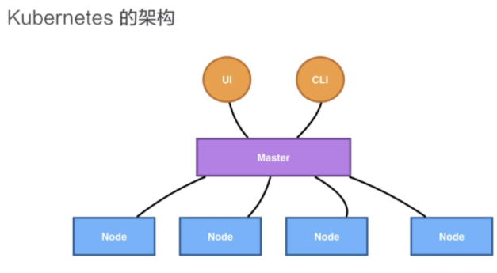
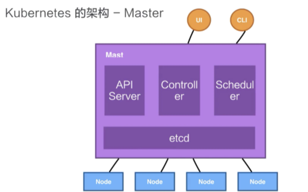
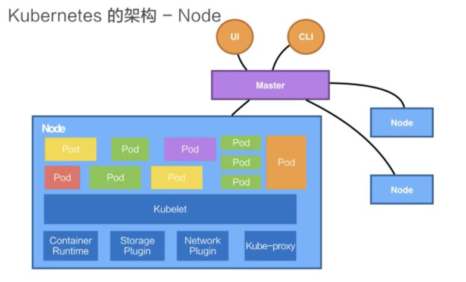
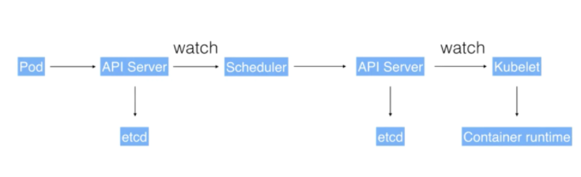

## 1、介绍

- MESOS

  APACHE   分布式资源管理框架    2019-5      witter--》kubernetes

- Docker swarm

  2019-07              阿里云宣布    将 Docker swarm   剔除

- Kubernetes

  Google               10年容器化基础架构 borg                GO语言  Borg 

  特点

  轻量级：消耗资源小

  开源

  弹性伸缩

  负载均衡：IPVS


介绍说明:

前世今生 KUbernetes框架 KUbernetes关键字含义

基础概念:

仕么是Pod控制器类型K8s网絡通讯模式

Kubernetes:

构建K8s集群

资源清单:

资源掌握资源淸单的语法編写Pod掌握Pod的生命周期**

Pod控制器:

掌握各种控制器的特点以及使用定义方式

服务发现:

掌握svc原理及其构建方式


## 2、Kubernetes 的架构

### 2.1 总体架构



Kubernetes 架构是一个比较典型的二层架构和 server-client 架构。Master 作为中央的管控节点，会去与 Node 进行一个连接。

所有 UI 的、clients、这些 user 侧的组件，只会和 Master 进行连接，把希望的状态或者想执行的命令下发给 Master，Master 会把这些命令或者状态下发给相应的节点，进行最终的执行。

### 2.2 Master



Kubernetes 的 Master 包含四个主要的组件：API Server、Controller、Scheduler 以及 etcd。

- **API Server**：顾名思义是用来处理 API 操作的，Kubernetes 中所有的组件都会和 API Server 进行连接，组件与组件之间一般不进行独立的连接，都依赖于 API Server 进行消息的传送；
- **Controller**：是控制器，它用来完成对集群状态的一些管理。比如自动对容器进行修复、自动进行水平扩张，都是由 Kubernetes 中的 Controller 来进行完成的；
- **Scheduler**：是调度器，“调度器”顾名思义就是完成调度的操作，把一个用户提交的 Container，依据它对 CPU、对 memory 请求大小，找一台合适的节点，进行放置；
- **etcd**：是一个分布式的一个存储系统，API Server 中所需要的这些元信息都被放置在 etcd 中，etcd 本身是一个高可用系统，通过 etcd 保证整个 Kubernetes 的 Master 组件的高可用性。

 API Server，它本身在部署结构上是一个可以水平扩展的一个部署组件；Controller 是一个可以进行热备的一个部署组件，它只有一个 active，它的调度器也是相应的，虽然只有一个 active，但是可以进行热备。

### 2.3  Node



Kubernetes 的 Node 是真正运行业务负载的，每个业务负载会以 **Pod** 的形式运行，一个 Pod 中运行的一个或者多个容器。

真正去运行这些 Pod 的组件的是叫做 **kubelet**，也就是 Node 上最为关键的组件，它通过 API Server 接收到所需要 Pod 运行的状态，然后提交到 **Container Runtime** 组件中。

在 OS 上创建容器所需要的运行环境，并最终把容器或者 Pod 运行起来，也需要对存储和网络进行管理。Kubernates 使用 **Storage Plugin** 和 **Network Plugin** 来完成操作，用户自己或者云厂商都可能会这两个组件自己的实现。

在 Kubernetes 自己的环境中，也会有 Kubernetes 的 Network，它是为了提供 Service network 来进行搭网组网的。真正完成 service 组网的组件的是 **Kube-proxy**，它是利用了 `iptable` 的能力来进行组建 Kubernetes 的 Network，就是 cluster network 。

### 2.4 调度实例



用户可以通过 UI 或者 CLI 提交一个 Pod 给 Kubernetes 进行部署，这个 Pod 请求首先会通过 CLI 或者 UI 提交给 Kubernetes API Server。下一步 API Server 会把这个信息写入到它的存储系统 etcd ，之后 Scheduler 会通过 API Server 的 watch 或者叫做 notification 机制得到这个信息：有一个 Pod 需要被调度。
这个时候 Scheduler 会根据它的内存状态进行一次调度决策，在完成这次调度之后，它会向 API Server report 说：“OK！这个 Pod 需要被调度到某一个节点上。”
这个时候 API Server 接收到这次操作之后，会把这次的结果再次写到 etcd 中，然后 API Server 会通知相应的节点进行这次 Pod 真正的执行启动。相应节点的 kubelet 会得到这个通知，kubelet 就会去调 Container runtime 来真正去启动配置这个容器和这个容器的运行环境，去调度 Storage Plugin 来去配置存储，network Plugin 去配置网络。


## 3、相关概念

### 3.1 Pod

> pod
> 英 [pɒd]   美 [pɑːd] 
> 豆荚
>
> 豆荚很形象的说明了 Pod 的概念，一个外壳中包含着多粒豆子，共享着同一个环境。

- Kubernetes 的一个最小调度以及资源单元；
- 由一个或多个容器组成；
- 定义容器的运行方式（Command、环境变量等）
- 提供给容器共享的运行环境（网络、进程空间）

### 3.2 Volume

Volume 就是卷的概念，它是用来管理 Kubernetes 存储的，是用来声明在 Pod 中的容器可以访问文件目录的，一个卷可以被挂载在 Pod 中一个或者多个容器的指定路径下面。

- 声明在 Pod 中的容器可访问的文件目录
- 可以被挂在在 Pod 中的一个（或者多个）容器的指定目录下
- 支持多种后端存储的抽象：本地存储、分布式存储、云存储 ……

### 3.3 Deployment

Deployment 单词的意思是：部署。Deployment 是在 Pod 这个抽象上更为上层的一个抽象，它可以定义一组 Pod 的副本数目、以及这个 Pod 的版本。一般大家用 Deployment 这个抽象来做应用的真正的管理，而 Pod 是组成 Deployment 最小的单元。

- 定义一组 Pod 的副本数目、版本等

- 通过控制器（Controller）维持 Pod 的数目

  自动恢复失败的 Pod

- 通过控制器以指定的策略控制版本

  滚动升级、重新生成、回滚等

### 3.4 Service

- 提供了一个或者多个 Pod 实例的稳定访问地址

- 支持多种访问方式实现

  Cluster IP

  NodePort

  LoadBalancer

### 3.5 Namespace

Namespace 是用来做一个集群内部的逻辑隔离的，它包括鉴权、资源管理等。Kubernetes 的每个资源，比如Pod、Deployment、Service 都属于一个 Namespace，同一个 Namespace 中的资源需要命名的唯一性，不同的 Namespace 中的资源可以重名。

- 一个集权内部的逻辑隔离机制（鉴权、资源额度）
- 每个资源都属于一个 Namespace
- 同一个 Namespace 中的资源命名唯一，不同 Namespace 中的资源可以重名


### 3.8 Kubernetes 集群

Kubernetes 将底层的计算资源连接在一起，对外体现为一个高可用的计算机集群。Kubernetes 将资源高度抽象化，允许将容器化的应用程序部署到集群中。为了使用这种新的部署模型，需要将应用程序和使用环境一起打包成容器。与过去的部署模型相比，容器化的应用程序更加灵活和可用，在新的部署模型中，应用程序被直接安装到特定的机器上，Kubernetes 能够以更高效的方式在集群中实现容器的分发和调度运行。

Kubernetes集群包括两种类型资源：

- [Master节点](http://docs.kubernetes.org.cn/306.html)：协调控制整个集群。
- [Nodes节点](http://docs.kubernetes.org.cn/304.html)：运行应用的工作节点。


自主式 Pod & 控制器管理的 Pod

pause


Replication Controller用来确保容器应用的副本数始终保持在用户定义的副本数,即如果

有容器异常退出,会自动创建新的Pod来替代;而如果异常多出来的容器也会自动回收

在新版本的 Kubernetes中建议使用 ReplicaSe来取代 Replication Controlle

Replicase跟 Replication Controller没有本质的不同,只是名字不一样,并且

ReplicaSe支持集合式的 selector

虽然 ReplicaSe可以独立使用,但一般还是建议使用 Deployment来自动管理

ReplicaSe,这样就无需担心跟其他机制的不兼容问題(比如 ReplicaSe不支持

rolling-update但 Deployment支持)


## 4、组件

APISERVER:所有服务访问统一入口

CrontrollerManager:维持副本期望数目

Scheduler;:负责介绍任务,选择合适的节点进行分配任务

ETCD:键值对数据库储存K8s集群所有重要信息(持久化)

Kubelet:直接跟容器引擎交互实现容器的生命周期管理

Kube- proxY:负责写入规则至 IPTABLES、IPVs实现服务映射访问的

COREDNS:可以为集群中的svC创建一个域名IP的对应关系解析

DASHBOARD:给K8S集群提供一个B/S结构访间体系

INGRESS CONTROLLER:官方只能实现四层代理, INGRESS可以实现七层代理

FEDERATION:提供一个可以跨集群中心多K8S统一管理功能

PROMETHEUS:提供K8s集群的监控能力

ELK:提供K8s集群日志统一分析介入平台


## 4、常用命令

```bash
kubectl get pods --all-namespaces | grep xtgl

kubectl delete pod basic-api-gateway-sv-deploy-6d94cc8998-7vkxt --grace-period=0 --force 


kubectl logs -f --tail=100 ih-auth-cbff885dc-64b7t
```


## 4、相关资料

概念总结：https://mp.weixin.qq.com/s/b2_4p644P5DYDzPk-3tMlA
