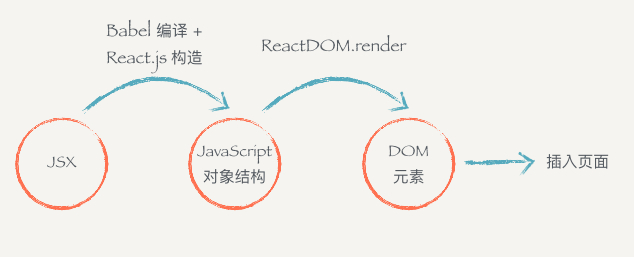

#### 如何用js对象表现一个DOM元素的结构？
````
<div class='box' id='content'>
  <div class='title'>Hello</div>
  <button>Click</button>
</div>
````
观察发现，每个DOM元素包含的信息其实只有三个：标签名、属性、子元素。  
其实上面这个 HTML 所有的信息我们都可以用合法的 JavaScript 对象来表示：
````
{
  tag: 'div',
  attrs: { className: 'box', id: 'content'},
  children: [
    {
      tag: 'div',
      arrts: { className: 'title' },
      children: ['Hello']
    },
    {
      tag: 'button',
      attrs: null,
      children: ['Click']
    }
  ]
}
````
但是用 JavaScript 写起来太长了，结构看起来又不清晰，用 HTML 的方式写起来就方便很多了。  
于是 React.js 就把 JavaScript 的语法扩展了一下，让 JavaScript 语言能够支持这种直接在 JavaScript 代码里面编写类似 HTML 标签结构的语法，这样写起来就方便很多了。编译的过程会把类似 HTML 的 JSX 结构转换成 JavaScript 的对象结构。

因此，**所谓的 JSX 其实就是 JavaScript 对象。**


#### JSX编译过程
以下return的JSX代码
````
import React, { Component } from 'react'
import ReactDOM from 'react-dom'
import './index.css'

class Header extends Component {
  render () {
    return (
      <div>
        <h1 className='title'>React 小书</h1>
      </div>
    )
  }
}

ReactDOM.render(
  <Header />,
  document.getElementById('root')
)
````
经过编译以后会变成：
````
import React, { Component } from 'react'
import ReactDOM from 'react-dom'
import './index.css'

class Header extends Component {
  render () {
    return (
     React.createElement(
        "div",
        null,
        React.createElement(
          "h1",
          { className: 'title' },
          "React 小书"
        )
      )
    )
  }
}

ReactDOM.render(
  React.createElement(Header, null), 
  document.getElementById('root')
);
````
React.createElement 会构建一个 JavaScript 对象来描述 HTML 结构的信息，包括标签名、属性、还有子元素等。这样的代码就是合法的 JavaScript 代码了。  
有了这个表示 HTML 结构和信息的对象以后，就可以拿去构造真正的 DOM 元素，然后把这个 DOM 元素塞到页面上。这也是我们最后一段代码中 ReactDOM.render 所干的事情。

**JSX编译过程**

为什么不直接从 JSX 直接渲染构造 DOM 结构，而是要经过中间这么一层呢？ 

第一个原因是  
当我们拿到一个表示 UI 的结构和信息的对象以后，不一定会把元素渲染到浏览器的普通页面上，我们有可能把这个结构渲染到 canvas 上，或者是手机 App 上。所以这也是为什么会要把 react-dom 单独抽离出来的原因，可以想象有一个叫 react-canvas 可以帮我们把 UI 渲染到 canvas 上，或者是有一个叫 react-app 可以帮我们把它转换成原生的 App（实际上这玩意叫 ReactNative）。

第二个原因是  
有了这样一个对象。当数据变化，需要更新组件的时候，就可以用比较快的算法操作这个 JavaScript 对象，而不用直接操作页面上的 DOM，这样可以尽量少的减少浏览器重排，极大地优化性能。这个在以后的章节中我们会提到。


#### 表达式插入
**在 JSX 当中你可以插入JavaScript的表达式，表达式返回的结果会相应地渲染到页面上，表达式用 {} 包裹。**  
{} 内可以放任何 JavaScript 的代码，包括变量、表达式计算、函数执行等等，render会把这些代码返回的内容如实地渲染到页面上，非常的灵活。表达式插入不仅仅可以用在标签内部，也可以用在标签的属性上。

#### JSX 元素变量
JSX 元素本质上就是 JavaScript 对象。  
因此JSX 元素可以像 JavaScript对象那样自由地赋值给变量，或者作为函数参数传递、或者作为函数的返回值。  
````
const goodWord = <strong> is good</strong>
const badWord = <span> is not good</span>
````

