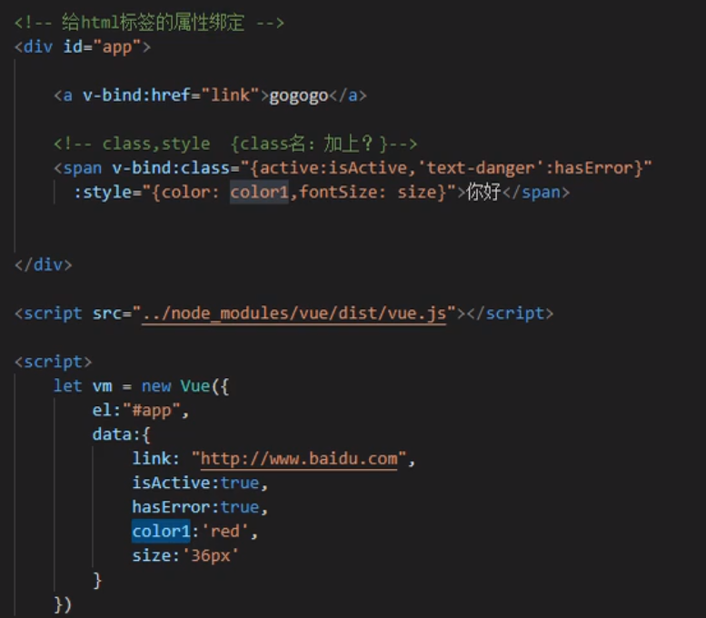

## 一、引入Vue.js

- 在HTML中

  ```html
  <script src="https://cdn.jsdelivr.net/npm/vue/dist/vue.js"></script>
  ```

- 构建Vue项目


## 二、模板语法

```html
<body>
    <div id="app">
        {{message}}
        <button v-on:click="test">点击</button>
    </div>
    <script>
        var vm = new Vue({
            el:"#app",
            data:{
                message:"hello Vue!"
            },
            methods:{
                test:function() {
                    alert("你好");
                }
            }
        })
    </script>
</body>
```

- Vue实例

  el：挂载点，指定Vue实例的作用对象，不能用在html和body上，一般使用id选择器。

  data：Vue数据

  methods：方法

- 数据绑定

  {{ Vue数据名或js表达式 }}

## 三、Vue指令

#### 1、插值表达式

- 格式：
  {{ 表达式 }}

- 说明：

  只能用于标签体中，而不能用在属性里面。
  该表达式支持js语法，可以调用is内置函数（必须有返回值）
  表达式必须有返回结果。例如1+1，没有结果的表达式不允许使用，如：leta=1+1；
  可以直接获取Vue实例中定义的数据或函数。

- 插值闪烁

  使用{{}}方式在网速较慢时会出现问题。在数据未加载完成时，页面会显示出原始的{{}}，加载完毕后才显示正确数据，我们称为插值闪烁。

#### 2、v-text和v-html


#### 3、v-bind

```html
<!-- 接收参数，用于绑定属性，可以简写为：-->
<a v-bind:href="url">url为Vue中的数据</a>
<a :href="url">url为Vue中的数据</a>

```




#### v-model：双向绑定数据

```html
<!-- 表单项值的改变会同步改变被绑定的Vue的数据 -->
<input id="username" type="text" v-model="username"/>
<script>
	var vm = new Vue({
        el:"#username",
        data:{
         username:"默认值"   
        }
    })
</script>
```

#### 2、v-on：接收方法，用于绑定事件，可以简写为@

```html
<div id="app">
	<a v-on:click="doIt">点击</a>
	<a @click="doIt">点击</a>
</div>

<script>
    var vm = new Vue({
        el:"app",
        data:{
            
        },
        methods:{
            doIt: function (){
                alert("绑定点击事件");
            }
        }
    })
</script>
```

#### 3、v-once：数据绑定仅生效一次

```html
<span v-once>这个将不会改变: {{ msg }}</span>
```

#### 4、将数据渲染成原始html

```html
<span v-html="rawHtml"></span>
```

#### 5、v-show：根据表达式的真假来显示元素，底层修改的是display属性

```html
<p v-show="seen">seen的值为true时显示</p>
```

#### 6、v-if：根据表达式值的真假来插入/移除指定元素，因为操作了DOM，性能消耗比较大，因此一般使用v-show。

```html
<p v-if="seen">seen的值为true时显示</p>
```

#### 8、v-on：接收方法，用于绑定事件，可以简写为@

```html

```

#### 9、v-for：遍历数组、对象

```html
<ul id="example-1">
  <!-- 需要使用数组下标时：(item,index) in items -->
  <li v-for="item in items">
    {{ item.message }}
  </li>
</ul>

<script>
    var example1 = new Vue({
      el: '#example-1', 
      data: {
        items: [
          { message: 'Foo' },
          { message: 'Bar' }
        ]
      }
    })
</script>
```


