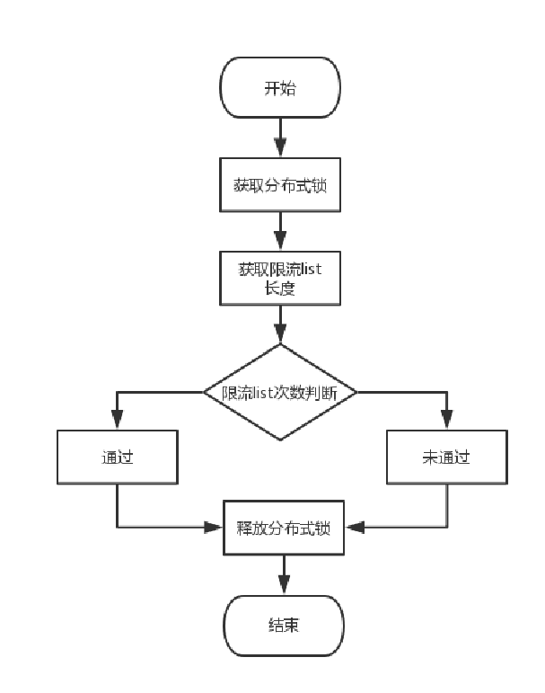

https://mp.weixin.qq.com/s/HNd0Sr3mgiWVGSZA06hJEQ

## 1、分布式锁

某商品库存剩10，用户A想买6个，用户B想买5个。
理想状态下，用户A先买走了6了，库存减少6个还剩4个，此时用户B应该无法购买5个，给出数量不足的提示。
真实情况下，用户A和B同时获取到商品剩10个，A买走6个，在A更新库存之前，B又买走了5个，此时B更新库存，商品还剩5个。

## 2、秒杀

## 3、限流、防刷

问题：
电商系统，免费抽奖，1分钱秒杀等网站，黑客常用的手段，大概分为以下几种： 
1.通过抓包工具，抓取网站请求url，分析参数，编写脚本，模拟正常请求，自动批量发送请求
2.对于做了单ip限制、单用户id请求频次限制的网站。抓取一批肉机，或者通过动态代理IP工具，伪造不同的ip请求，绕过网站的限制。
3.获得虚拟僵尸账户，通过一批用户，然后动态ip，跑脚本程序，来攻击网站。
4.僵尸账户养户，通过脚本程序。批量发送请求攻击网站。

解决方案：
1、配置阀值，进行计数，判断是否达到
2、建设风控系统

