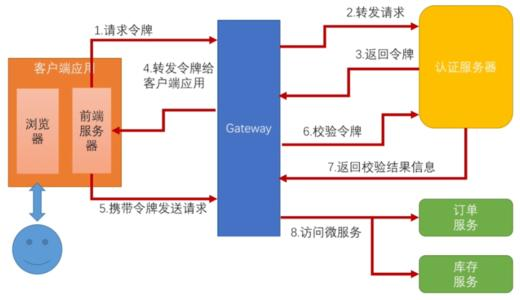

## 1、介绍

### 单点登录

### 单点登出

## 2、方案

### 顶级域名 + cookie

### 认证中心

## 3、域名

## 4、认证中心

### CAS

具体流程如下：

1. 用户访问 A 系统，A 系统是需要登录的，但用户现在没有登录。跳转到 SSO 登录系统
2.  SSO系统也没有登录，弹出用户登录页。用户填写用户名、密码，SSO系统进行认证后，将登录状态写入SSO的session，浏览器（Browser）中写入 SSO 域下的 Cookie。
3. SSO系统登录完成后会生成一个ST（Service Ticket），然后跳转到 A 系统，同时将ST作为参数传递给 A 系统。
4. A 系统拿到 ST 后，从后台向 SSO 发送请求，验证 ST 是否有效。
5. SSO系统返回验证结果，验证通过后，A 系统将登录状态写入 session 并设置 A 域下的 Cookie。
6. 至此，跨域单点登录就完成了。以后我们再访问 A 系统时，app就是登录的。接下来，我们再看看访问app2系统时的流程。

用户访问app2系统，app2系统没有登录，跳转到SSO。
由于SSO已经登录了，不需要重新登录认证。
SSO生成ST，浏览器跳转到app2系统，并将ST作为参数传递给app2。
app2拿到ST，后台访问SSO，验证ST是否有效。
SSO系统返回验证结果
验证成功后，app2将登录状态写入session，并在app2域下写入Cookie。
这样，app2系统不需要走登录流程，就已经是登录了。SSO，app和app2在不同的域，它们之间的session不共享也是没问题的。

### OAuth 2.0

OAuth 2.0 是目前最流行的授权机制，主要用来颁发令牌（token），用来授权第三方应用，获取用户数据。

#### 四种授权模式

- 授权码（authorization-code）

  第三方应用先申请一个授权码，然后再用该码获取令牌。

- 隐藏式（implicit）

  有些 Web 应用是纯前端应用，没有后端。这时就不能用上面的方式了，必须将令牌储存在前端。**RFC 6749 就规定了第二种方式，允许直接向前端颁发令牌。这种方式没有授权码这个中间步骤，所以称为（授权码）"隐藏式"（implicit）。**

- 密码式（password）

  **如果你高度信任某个应用，RFC 6749 也允许用户把用户名和密码，直接告诉该应用。该应用就使用你的密码，申请令牌，这种方式称为"密码式"（password）。**

- 客户端凭证（client credentials）

  **最后一种方式是凭证式（client credentials），适用于没有前端的命令行应用，即在命令行下请求令牌。**

  

#### 认证流程

https://ydtest.gooeto.com/#/channelCenter/channelManagement

## 5、安全问题

### CSRF

### xxl-sso