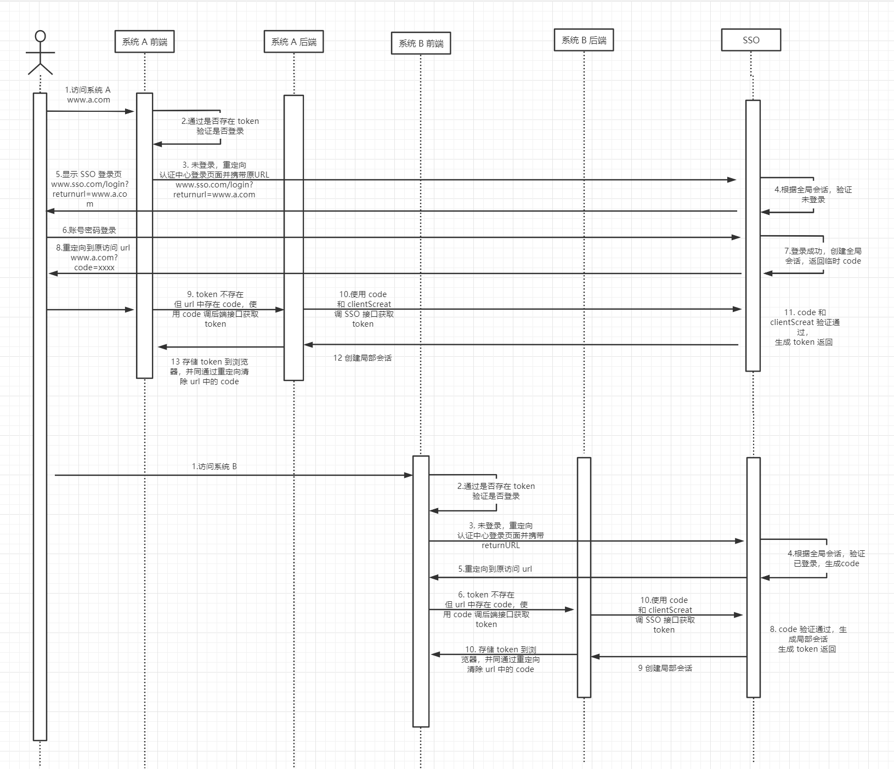
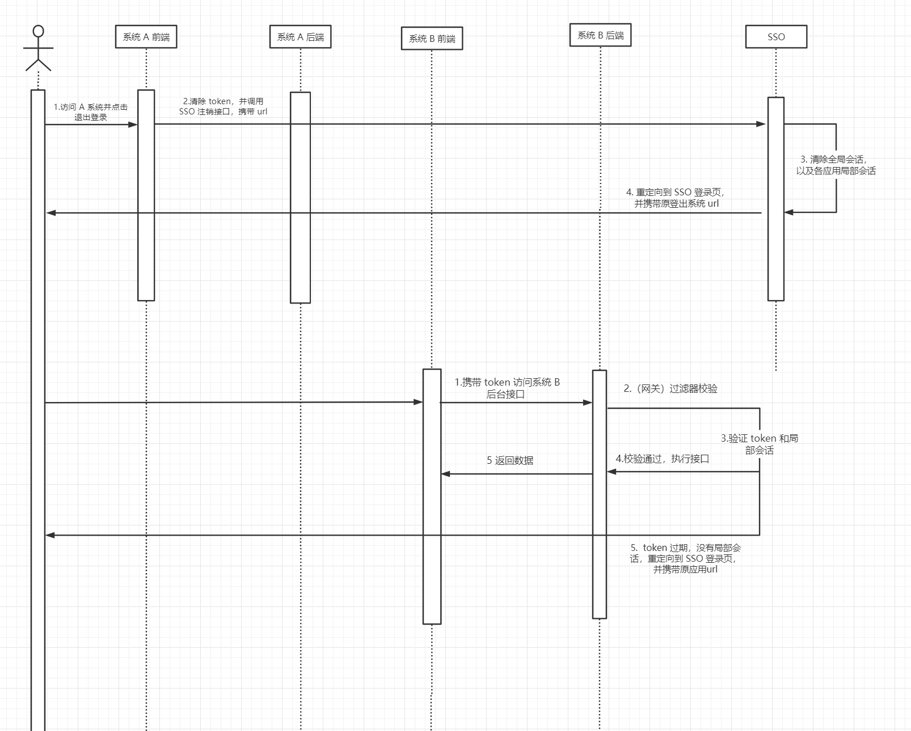
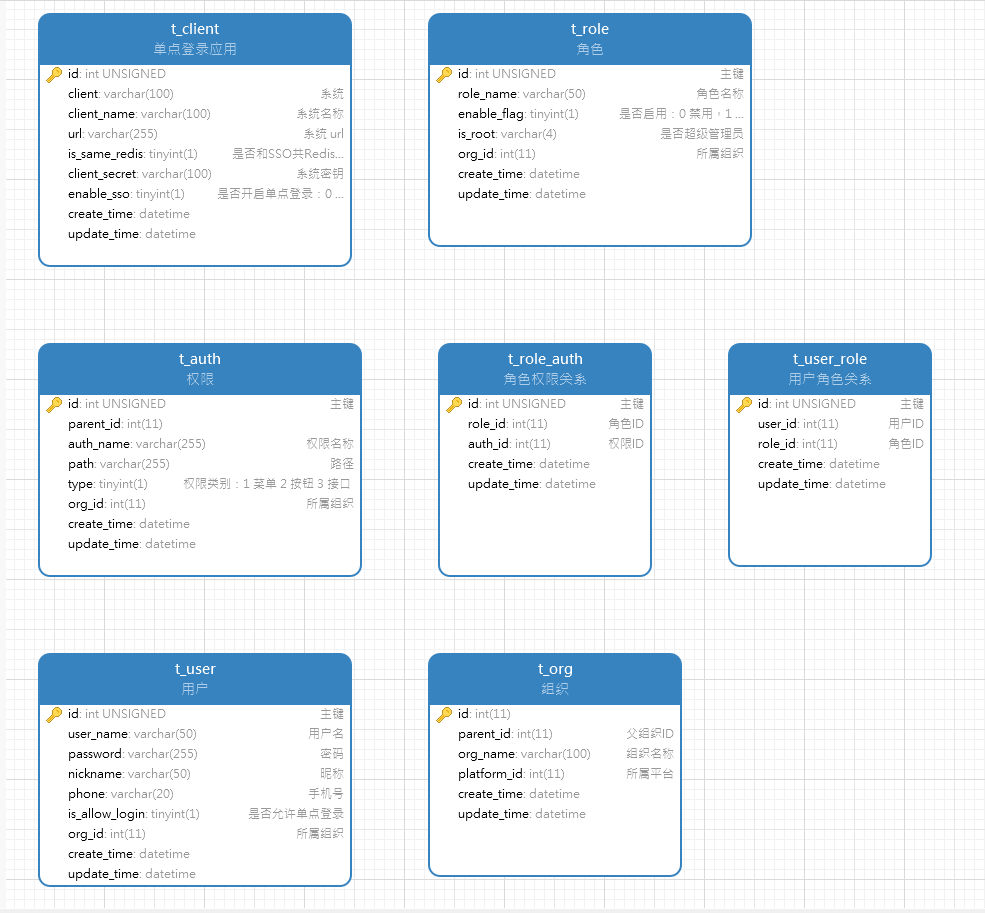
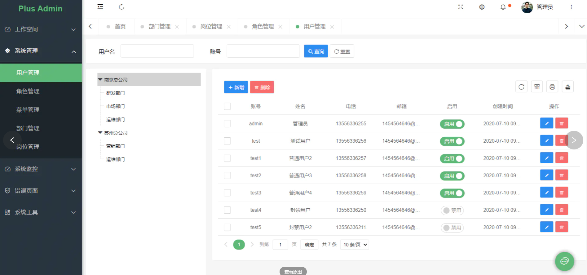

## 1、统一认证平台（SSO）

### 1.1 单点登录




### 1.2 单点注销




### 1.3 其他说明

#### clientSecret（应用秘钥）

1. 各应用生成 Token 的秘钥，每个应用后台配置一个自己的，SSO 中配置所有接入应用的（存在数据库 t_client 中）。
2. 临时 code 使用 SSO 秘钥生成，校验时只能使用 SSO 解析校验
3. 各应用的正式 Token，由 SSO 使用对应应用的秘钥生成并颁发，但验证时由各自应用使用自己秘钥解析验证。

#### 全局会话和局部会话

- **全局会话（全局登录状态）**

  1. 认证服务器 www.sso.com 的 cookie 中保存数据

      sso_cookie：sso_uuid

  2. SSO 的 session（或 Redis）中保存数据

     sso_uuid：userid

  3. 每次重定向到登录页时都会携带 cookie 到 SSO 后端，只需要把从 cookie 中取值为作为 key ，从 SSO 的 session（或 Redis）中取值，存在对应值则为已经全局登录，不存在则没有登录。

- **局部会话（各应用登录状态）**

  方式一：各应用 session 中保存数据（注意 session 过期时间）

  `clientSecret`：sso_uuid

  单点登出（sso_uuid）：调用 SSO 注销接口，首先清除 SSO 退出全局登录，需要各应用提供清除局部会话的接口，并依次调用该接口，并传入参数 sso_uuid 清除对应局部会话，重定向到 SSO 登录页

  方式二：全局 redis 中保存数据

  `clientSecret + sso_uuid`：true

  sso_uuid 对应登录的单点退出时，首先清除 SSO 退出全局登录，然后依次清除 redis 中所有局部会话数据。

  方式三：混用

  和 SSO 同 redis 环境的使用 redis 存储，不用提供局部会话清除的接口，

  而不同的单独使用 session，并在 t_client 中用字段标注出来，

  从而分别使用不同的单点退出方式和局部会话状态验证方式。

- **正常带 token 请求后端接口判断局部登录状态**

  由于单点退出时是清除的后端的各局部会话状态，而没办法清除所有登录过的应用在前端的 lolcalStorage 中存储的 token ，前端会认为仍然处于登录状态。

  因此，在各后端的过滤器（或者网关统一的过滤器）除了校验 token，还需要每次来校验是否已经被单点退出了。

  对应上面两种局部会话保存方式分别为：

  方式一：判断 session 中是否是否存在 clientSecret ，不存在则已被单点退出。

  方式二：判断 全局 redis 中是否存在 clientSecret + sso_uuid，不存在则已被单点退出。注意：由于应用后端只存了 clientSecret，没法存 sso_uuid，因此需要在 SSO 给各应用颁发 token 时，提前将 sso_uuid 的值放进去，判断时先解析 token 取出 sso_uuid 的值，再拼接 clientSecret 判断。

  

#### returnURL

前后端可以对 returnUrl 进行编解码传输

urlencode

#### 服务后端  token  校验

方式1：提供统一过滤器

方式2：统一网关过滤器

#### token 过期

颁发 token 时同时颁发一个 refreshToken

后端校验 token 过期后，后端使用 refreshToken 调用 SSO 获取新的 token 和 refreshToken


#### https

使用 https 协议更安全

#### 登录认证

可以使用 spring security


### 1.4 接入流程

#### 前端

使用统一的 `login.js` ，提供 `tryGetToken()` 和 `loginOut()` 、`refeshToken()`方法

可以考虑发布成 npm 依赖包引入。

```js
// 主要代码

// 获取 token
tryGetToken()


// 退出登录
loginOut()


// 刷新 token, 请求后端接口 token 过期时调用
refeshToken()


created() {
    // 通过cookie判断用户是否登录
    // var userInfo = this.getCookie("user");
    // if (!!userInfo) {
    //     this.userInfo = JSON.parse(userInfo);
    //     this.userIsLogin = true;
    // }
    // 判断用户是否登录
    var userIsLogin = this.userIsLogin;
    if (!userIsLogin) {
        // 如果没有登录，判断是否有临时票据tmpTicket
        var tmpTicket = this.getUrlParam("tmpTicket");
        console.log("tmpTicket" + tmpTicket);
        if (tmpTicket != null && tmpTicket !== "" && tmpTicket !== undefined) {
            // 如果有临时票据，就携带临时票据向CAS发起请求，验证获取用户会话信息
            axios.defaults.withCredentials = true;
            axios.post('http://www.cas.com:9000/verifyTmpTicket?tmpTicket=' + tmpTicket)
                .then(res => {
                if (res.data.code === 200) {
                    var userInfo = res.data.data;
                    this.userInfo = userInfo;
                    this.userIsLogin = true;
                    this.setCookie("user", JSON.stringify(userInfo));

                    /*
                                    由于http://www.app1.com/?tmpTicket=a75b6e628b894d4393d2257196408627 中的
                                    tmpTicket临时门票只能使用一次，因此重定向过来的请求解析完后需要把tmpTicket参数去掉，
                                    只留下http://www.app1.com即可，并且不能刷新页面
                                 */

                    // 不刷新页面修改URL
                    var url = window.location.href;
                    var valiable = url.split("?")[0];
                    window.history.pushState({}, 0, valiable);
                } else {
                    alert(res.data.msg);
                }
            });
        } else {
            // 如果没有临时票据，说明用户没有登录过，那么就跳转到CAS做登录认证
            window.location.href = "http://www.cas.com:9000/login?returnUrl=http://www.app1.com"
        }

    }

},
        
    
logout() {
    var userId = this.userInfo.id;
    axios.defaults.withCredentials = true;
    axios.post('http://www.cas.com:9000/logout?userId=' + userId)
        .then(res => {
            if (res.data.code === 200) {
                var userInfo = res.data.data;
                this.userInfo = {};
                this.userIsLogin = false;
                this.clearCookie("user");
                alert("退出")
            } else {
                alert(res.data.msg);
            }
        })
},
            
// 从url中获取参数对应的值
getUrlParam(key) {
    var query = window.location.search.substring(1);
    var vars = query.split("&");
    for (var i = 0; i < vars.length; i++) {
        var pair = vars[i].split("=");
        if (pair[0] === key) {
            return pair[1];
        }
    }
    return "";
},

// 设置cookie
setCookie(name, value, seconds) {
    // second为0表示永不过期
    seconds = seconds || 0;
    var expires = "";
    // 设置cookie生存时间
    if (seconds !== 0) {
        var date = new Date();
        date.setTime(date.getTime() + (seconds * 1000));
        expires = "; expires=" + date.toGMTString();
    }
    // 转码并赋值
    document.cookie = name + "=" + escape(value) + expires + "; path=/";
},

// 获取cookie
getCookie(name) {
    var nameEQ = name + '='
    // 把cookie分割成组
    var ca = document.cookie.split(';')
    for (var i = 0; i < ca.length; i++) {
        // 取得字符串
        var c = ca[i]
        // 判断一下字符串有没有前导空格
        while (c.charAt(0) == ' ') {
            // 有的话，从第二位开始取
            c = c.substring(1, c.length)
        }
        // 如果含有我们要的name
        if (c.indexOf(nameEQ) == 0) {
            // 解码并截取我们要值
            return unescape(c.substring(nameEQ.length, c.length))
        }
    }
    return false
},

// 清除cookie
clearCookie(name) {
    setCookie(name, "", -1);
}
```


#### 后台

SSO 在数据库 `t_client` 中存入接入单点登录的系统的信息（包括 clientSecret），同时各系统后台配置各自的 `clientSecret`

SSO 提供接口，各系统同步用户账号密码等到 SSO 数据库

SSO 提供过滤器，各系统引入配置，或者网关引入统一配置


## 2、权限平台

### 2.1 数据库设计



#### 说明

- t_client

  各单点登录应用信息

- t_org

  组织层级

- t_user

  说明：提供接口给各系统同步用户过来

  按来源三种用户：

  sys 用户：admin 、 ydadmin 。。。。 可以配置权限角色，允许单点登录

  OA用户：18312345678 。。。。允许单点登录 

  应用用户：医生、药师等不支持单点登录、不支持登录权限平台

  
  
  按权限：
  
  可以单点登录所有管理后端的用户，或者只能登录某个管理后端的用户。
  
  不能登录
  
  

### 2.2 页面



页面基本形式：树 + 表


### 2.3 接口级权限控制

将接口 url 权限配置在在 t_auth 表中。

提供一个 urlAuth.jar 的依赖，其中包含接口权限拦截器，以及一个免校验权限的注解。

各应用引入依赖，并添加配置使之生效，在需要放开权限的接口上可添加注解。


