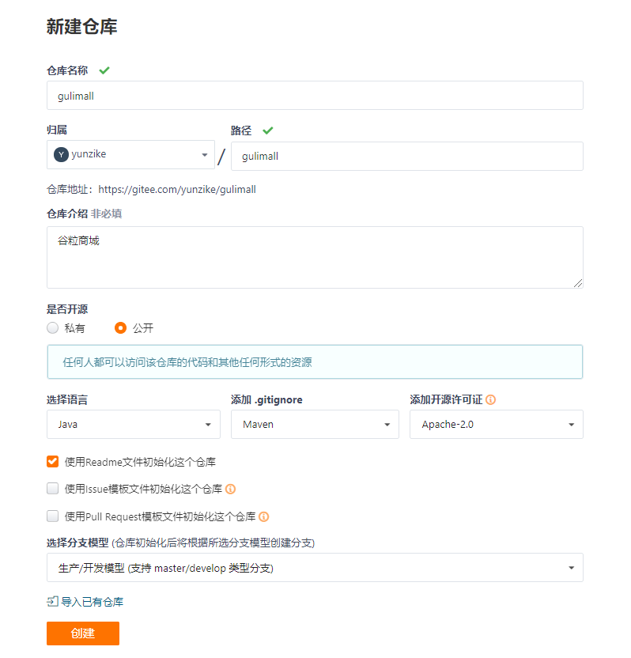
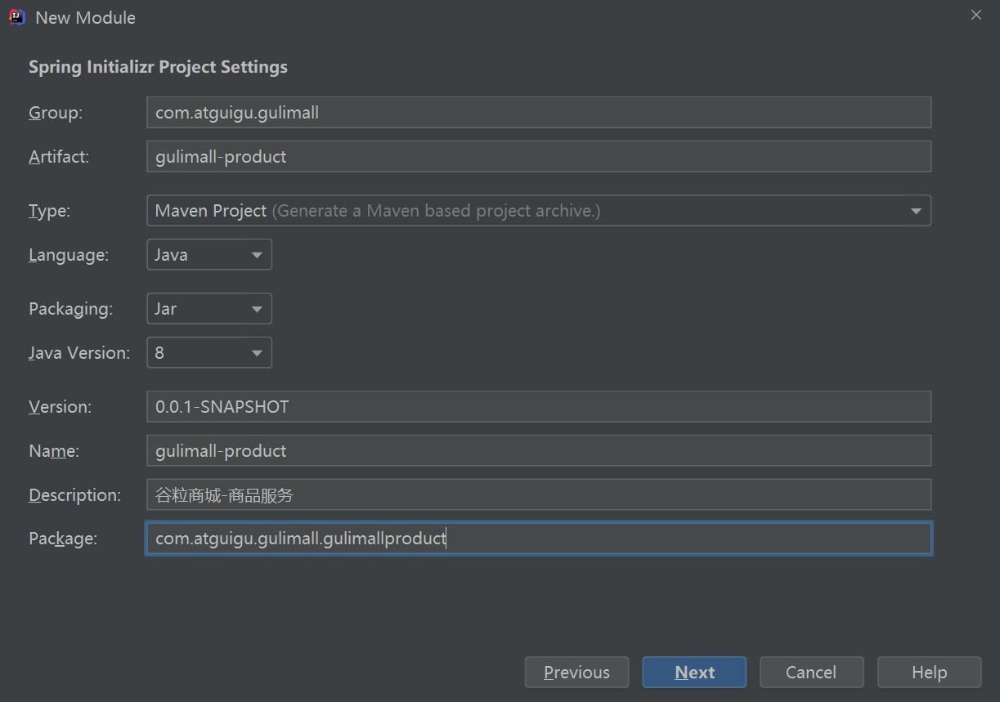
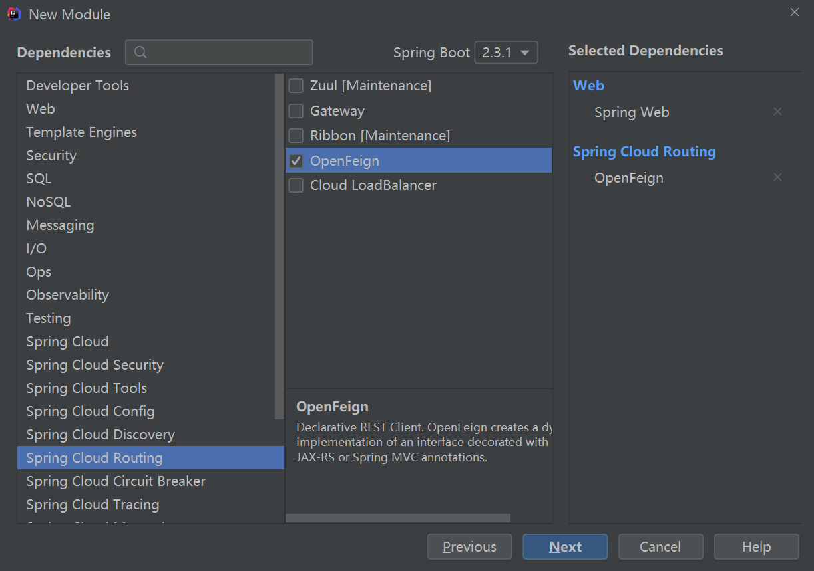
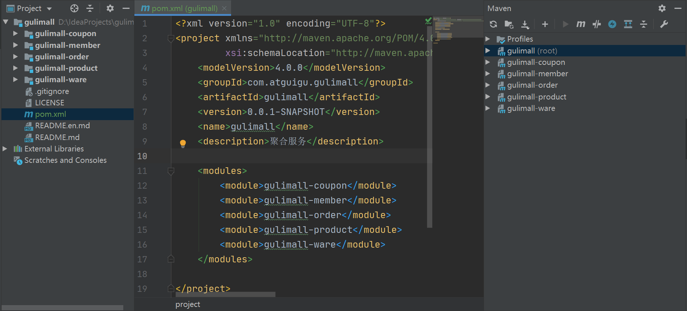
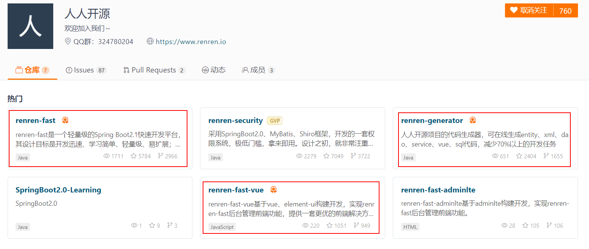
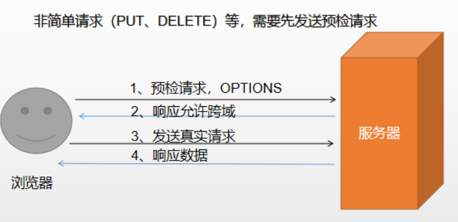
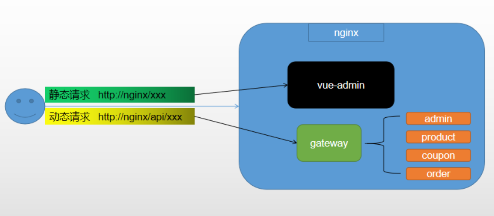
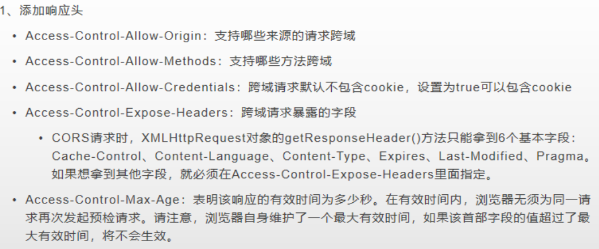

## 一、项目简介


注册中心、配置中心：Nacos

远程调用：Feign

网关：SpringCloud Gateway

阿里巴巴的Sentinel：熔断降级

OAuth2.0 认证中心：登录，权限控制：Spring Security

链路追踪：Sleuth、Zipkin

Redis集群、MySQL的主从分片、RabbitMQ、ES（ElasticSearch）的全文检索


布署一个K8S集群


## 二、分布式概念

#### 1、微服务

微服务架构风格，就像是把一个单独的应用程序开发为一套小服务，每个小服务运行在自己的进程中，并使用轻量级机制通信，通常是HTTP APl。这些服务围绕业务能力来构建，并通过完全自动化部署机制来独立部署。这些服务使用不同的编程语言书写，以及不同数据存储技术，共促持最低限度的集中式管理。
简而言之，拒绝大型单体应用，基于业务边界进行服务微化拆分，各个服务独立部署运行。

#### 2、集群&分布式&节点

- 集群

  只要是一堆机器，就可以叫集群，他们是不是一起协作着干活，这个谁也不知道；

- 分布式

  《分布式系统原理与范型》定义：
  “分布式系统是若干独立计算机的集合，这些计算机对于用户来说就像单个相关系统”
  分布式系统（distributed system）是建立在网络之上的软件系统。

- 节点

  集群中的一个服务器。

集群是个物理形态，分布式是个工作方式。分布式是指将不同的业务分布在不同的地方，集群指的是将几台服务器集中在一起，实现同一业务。

例如：京东是一个分布式系统，众多业务运行在不同的机器，所有业务构成一个大型的业务集群。每一个小的业务，比如用户系统，访问压力大的时候一台服务器是不够的。我们就应该将用户系统部署到多个服务器，也就是每一个业务系统也可以做集群化；

分布式中的每一个节点都可以做集群。而集群并不一定就是分布式的。

#### 3、远程调用

在分布式系统中，各个服务可能处于不同主机，但是服务之间不可避免的需要互相调用，我们称为远程调用。

SpringCloud中使用HTTP + JSON的方式完成远程调用


#### 4、负载均衡

某个服务在多台服务器中都存在，调用任意一台都可以调用这个服务完成功能时，为了使每个服务器都不要太忙或者太闲，可以负载均衡的调用每一个服务器。

常见的负载均衡算法：

轮询：依次调用

最小连接：优先选择连接数最少的服务器，也就是压力最小的后端服务器。在会话比较长的情况下可以考虑采用这种方式。

散列：根据请求源的IP的散列（hash）来选择要转发的服务器。这种方式可以在一定程度上保证特定用户能连接到相同的服务器。

#### 5、服务注册/发现&注册中心

服务注册：服务上线时注册到注册中心，则注册中心可以知道每个服务在那个服务器上是可用的，或者是下线的。

发现：服务间的调用时，通过注册中心，去发现要调用的服务在哪台机器上是注册的，从而避免调用已经下线的服务。

#### 6、配置中心

每一个服务最终都有大量的配置，并且每个服务都可能部署在多台机器上。我们经常需要变更配置，我们可以让每个服务在配置中心获取自己的配置。
**配置中心用来集中管理微服务的配置信息。**

#### 7、服务熔断&服务降级

- **雪崩效应**

  在微服务架构中，微服务之间通过网络进行通信，存在相互依赖，当其中一个服务不可用时，有可能会造成**雪崩效应**。比如：下单时，订单服务调用商品服务，商品服务调用库存服务查询是否有库存，此时如果库存服务出现故障导致响应慢，商品服务就得等待，也就是说库存服务的不可用就会导致商品服务的阻塞，在商品服务的等待期间，订单服务也会阻塞。最终一个服务的不可用就会导致整个服务调用链一直阻塞。如果是高并发的请求，多个请求都阻塞了导致请求挤压，最终会导致整个服务器的资源耗尽。要防止这样的情况，必须要有容错机制来保护服务。

- **服务熔断**

  设置服务的超时，当被调用的服务经常失败到达某个阈值，我们可以开启断路保护机制，后来的请求不再去调用这个服务。本地直接返回默认的数据

- **服务降级**：

  在运维期间，当系统处于高峰期，系统资源紧张，我们可以让非核心业务降级运行。降级：某些服务不处理，或者简单处理【抛异常、返回NULL、调用Mock数据、调用Fallback处理逻辑】。

#### 8、API网关

在微服务架构中，API Gateway作为整体架构的重要组件，它**抽象了微服务中都需要的公共功能**，同时提供了**客户端负载均衡**，**服务自动熔断**，**灰度发布**，**统一认证**，**限流流控**，**日志统计**等丰富的功能，帮助我们解决很多API管理难题。


## 三、环境搭建

#### 1、安装Linux虚拟机

- 下载安装Virtual Box

  官网下载VirtualBox https://www.virtualbox.org/
  安装前要开启CPU虚拟化，即在BIOS的设置里要把Intel Virtualization Technolgy设置为Enabled

- 使用Vagrant在Virtual Box中安装CenterOS

  ①下载&安装Vagrant

  https://www.vagrantup.com/downloads.html Vagrant 下载
  https://app.vagrantup.com/boxes/search Vagrant 官方镜像仓库

  ②安装centos

  打开window cmd窗口，运行 Vagrant init centos/7，即可初始化一个centos7系统，运行vagrant up即可启动虚拟机。
  系统root用户的密码是vagrant

  ③vagrant其他常用命令

  vagrant ssh：自动使用vagrant用户连接虚拟机。
  vagrant reload：重启虚拟机
  vagrant upload source[destination][namelid]：上传文件
  https://www.vagrantup.com/docs/cli/init.html Vagrant 命令行文档

  ④修改虚拟机的IP地址

  默认虚拟机的ip地址不是固定ip，访问虚拟机的MySQL等软件需要在Virtual Box中设置端口转发，开发不方便。
  可以通过修改Vagrantfile文件来修改虚拟机的IP地址

  ```bash
  # Vagrantfile 文件位于用户的根目录下
  # 其中ip地址，必须和主机 VirtualBox Host-Only Network 的IP地址（如：192.168.56.1）的前三个部分保持相同
  config.vm.network "private_network", ip: "192.168.56.10"
  ```

#### 2、安装Docker

#### 3、docker安装mysql

#### 4、docker安装redis

- 下载redis镜像

  ```bash
  docker pull redis
  ```

- 创建实例并启动

  ```bash
  # 先创建要挂载的文件，不然直接挂载时会当作目录而不是文件
  mkdir -p /mydata/redis/conf
  touch /mydata/redis/conf/redis.conf
  
  # 创建实例并启动
  docker run -p 6379:6379 --name redis -v /mydata/redis/data:/data \
  -v /mydata/redis/conf/redis.conf:/etc/redis/redis.conf \
  -d redis redis-server /etc/redis/redis.conf
  ```

  redis自描述文件：
  https://raw.githubusercontent.com/antirez/redis/4.0/redis.conf

- 使用redis镜像执行redis-cli命令连接

  ```bash
  docker exec -it redis redis-cli
  ```

- redis开启持久化

  ```bash
  # 在redis 的配置文件中添加以下配置
  appendonly yes
  ```

- redis可视化软件

  Redis Desktop Manager

#### 5、创建项目微服务

- 在gitee（码云）上新建仓库初始化一个空的项目

  

- 使用IDEA拉下来，并在其中创建各个微服务项目模块

  

  

  ```bash
  # 商品服务、仓储服务、订单服务、优惠券服务、用户服务
  
  # 共同：
  1）web、openfeign
  2）每一个服务，包名com.atguigu.gulimall.xxx（product/order/ware/coupon/member）
  3）模块名：gulimall-coupon
  # 商品服务
  gulimall-product
  
  
  ```

- 使用gulimall的大项目聚合所有的微服务模块

  

- 设置.gitignore文件
- 提交初始化项目

#### 6、数据库初始化

- 安装powerdesigner
- 连接mysq，创建数据库，并执行脚本

#### 7、搭建后台管理服务

- 人人开源

  

- 后台管理系统

  后端：renren-fast

  

  前端：renren-fast-vue

  安装node.js、npm、cnpm；安装依赖：npm install；运行：npm run dev；

  ```bash
  16集 npm install报错解决：
  先把node_modules全部删除，然后再
  npm install chromedriver --chromedriver_cdnurl=http://cdn.npm.taobao.org/dist/chromedriver
  最后npm install。
  
  如果node-sass报错
  npm install node-sass@4.9.4 --ignore-scripts
  
  
  npm i node-sass --sass_binary_site=https://npm.taobao.org/mirrors/node-sass/
  ```

#### 8、逆向工程搭建

  renren-generator：生成后端代码


#### 9、整合mybatis-plus

```bash
* 1、整合mybatis-plus
 *    1)导入依赖
 *      <dependency>
 *          <groupId>com.baomidou</groupId>
 *          <artifactId>mybatis-plus-boot-starter</artifactId>
 *          <version>3.3.2</version>
 *      </dependency>
 *    2)配置
 *      配置数据源：
 *          导入数据库的驱动，
 *          在application.yml里面配置数据源相关信息
 *      配置MyBatis-Plus
 *          在SpringBoot启动类中使用@MapperScan("com.atguigu.gulimall.product.dao")配置要扫描的mapper接口
 *          在application.yml中告诉MyBatis-Plus,sql映射文件的位置
 *
 */
```

```yml
spring:
  datasource:
    username: root
    password: root
    url: jdbc:mysql://192.168.56.10:3306/gulimall_pms
    driver-class-name: com.mysql.cj.jdbc.Driver

mybatis-plus:
  # sql映射文件的位置
  mapper-locations: classpath:/mapper/**/*.xml
  # 主键自增
  global-config:
    db-config:
      id-type: auto
```

#### 10、测试

  


## 四、SpringCloud Alibaba

#### 1、简介

- **Spring Cloud Alibaba**

  https://github.com/alibaba/spring-cloud-alibaba

  Spring Cloud Alibaba致力于提供微服务开发的一站式解决方案。此项目包含开发分布式应用微服务的必需组件，方便开发者通过Spring Cloud编程模型轻松使用这些组件来开发分布式应用服务。

  依托Spring Cloud Alibaba，您只需要添加一些注解和少量配置，就可以将Spring Cloud 应用接入阿里微服务解决方案，通过阿里中间件来迅速搭建分布式应用系统。

- **SpringCloud 的几大痛点**

  SpringCloud部分组件停止维护（eureka停止维护）和更新，给开发带来不便；

  SpringCloud部分环境搭建复杂，没有完善的可视化界面，我们需要大量的二次开发和定制

  Springcloud配置复杂，难以上手，部分配置差别难以区分和合理应用

- **SpringCloud Alibaba的优势**

  阿里使用过的组件经历了考验，性能强悍，设计合理，现在开源出来大家用

  成套的产品搭配完善的可视化界面给开发运维带来极大的便利

  搭建简单，学习曲线低。

- **结合SpringCloud Alibaba我们最终的技术搭配方案**

  SpringCloud Alibaba - Nacos：注册中心（服务发现/注册），Springcloud官方使用spring-cloud-netflix中的Eureka

  SpringCloud Alibaba - Nacos：配置中心（动态配置管理），Springcloud官方使用SpringCloud Config

  SpringCloud - Ribbon：负载均衡

  SpringCloud - Feign：声明式HTTP客户端（调用远程服务）

  SpringCloud Alibaba - Sentinel：服务容错（限流、降级、熔断），Springcloud官方使用spring-cloud-netflix中的Hystrix

  SpringCloud - Gateway：API 网关（webflux编程模式），原来Springcloud官方使用spring-cloud-netflix中的Zuul

  SpringCloud - Sleuth：调用链监控

  SpringCloud Alibaba-Seata：原Fescar，即分布式事务解决方案

- **版本选择**

  

#### 2、SpringCloud Alibaba-Nacos作为注册中心

Nacos是阿里巴巴开源的一个更易于构建云原生应用的动态服务发现、配置管理和服务管理平台。他是使用java编写。需要依赖java环境
Nacos文档地址：https://nacos.io/zh-cn/docs/quick-start.html|

- 下载 nacos-server 

  https://github.com/alibaba/nacos/releases

- 启动nacos-server

  双击bin中的startup.cmd文件
  访问http:/localhost：8848/nacos/
  使用默认的nacos/nacos进行登录

- 将微服务注册到nacos中

  引入 Nacos Discovery Starter

  ```xml
  <dependency>
       <groupId>com.alibaba.cloud</groupId>
       <artifactId>spring-cloud-starter-alibaba-nacos-discovery</artifactId>
  </dependency>
  ```

  在应用的 /src/main/resources/application.properties 配置文件中配置 Nacos Server 地址

  ```yml
   cloud:
      nacos:
        discovery:
          server-addr: 127.0.0.1:8848
  ```

  使用 @EnableDiscoveryClient 注解开启服务注册与发现功能

  ```java
  @EnableDiscoveryClient
  @SpringBootApplication
  public class GulimallMemberApplication {
  
      public static void main(String[] args) {
          SpringApplication.run(GulimallMemberApplication.class, args);
      }
  
  }
  ```

  每一个服务都需要配置服务的名字

  ```yml
  application:
      name: gulimall-member
  ```

  

#### 3、Feign声明式远程调用

- 简介

  Feign是一个声明式的HTP客户端，它的目的就是让远程调用更加简单。 Feign提供了HTP请求的模板，**通过编写简单的接口和插入注解**，就可以定义好HTP请求的参数、格式、地址等信息。
  Feign整合了 **Ribbon（负载均衡）和 Hystrix（服务熔断)**，可以让我们不再需要显式地使用这两个组件。
  Spring Cloud Feign在 Netflix Feign的基础上扩展了对 SpringMvc注解的支持，在其实现下，我们只需创建一个接口并用注解的方式来配置它，即可完成对服务提供方的接囗绑定。简化了Spring Cloud Ribbon自行封装服务调用客户端的开发量。

- 使用

  ```
  1、引入依赖
  <dependency>
      <groupId>org.springframework.cloud</groupId>
      <artifactId>spring-cloud-starter-openfeign</artifactId>
  </dependency>
  
  2、在SpringBoot的主类开户Feign功能
  @EnableFeignClients（basePackages ="com.atguigu.gulimall.member.feign"）
  
  3、声明远程接口
  编写一个接口，告诉 SpringCLoud 这个接口需要调用远程服务，声明接口的每一个方法都是调用哪个远程服务的那个请求
  
  @FeignClient("gulimall-coupon")
  public interface CouponFeignService {
  
      @RequestMapping("/coupon/coupon/member/list")
      public R membercoupons();
  
  }
  ```

#### 4、使用Nacos作为配置中心

1）引入依赖

```xml
<!-- nacos配置中心 -->
<dependency>
    <groupId>com.alibaba.cloud</groupId>
    <artifactId>spring-cloud-starter-alibaba-nacos-config</artifactId>
</dependency>
```

2）创建一个 bootstrap.properties 

```xml
spring.application.name=gulimall-coupon

spring.cloud.nacos.config.server-addr=127.0.0.1:8848
```

3）需要给配置中心默认添加一个叫数据集（ Data Id）guLimaLL-coupon.properties，默认规则：应用名.properties

4）给应用名， properties添加任何配置

5）动态获取配置

@RefreshScope：动态获取并刷新配置
@Value（"$配置项的名}"）：获取到配置。
如果配置中心和当前应用的配置文件中都配置了相同的项，优先使用配置中心的配置。

6）细节

**命名空间**：配置隔离；
默认：public（保留空间）；默认新增的所有配置都在 public空间。
1、开发，测试，生产：利用命名空间来做环境隔离。
注意：在 bootstrap, properties；配置上，需要使用哪个命名空间下的配置
spring.cloud.nacos.config.namespace=9de62e44-cd2a-4a82-bf5c-95878bd5e871
2、每一个微服务之间互相隔离配置，每一个微服务都创建自己的命名空间，只加载自己命名空间下的所有配置

**配置集**：所有的配置的集合

**配置集ID**：类似文件名
Data ID：类似文件名

**配置分组**：
默认所有的配置集都属于：DEFAULT GROUP；
1111,618,1212

项目中的使用：每个微服务创建自己的命名空间，使用配置分组区分环境，dev、test、prod

**同时加载多个配置集**
1）、微服务任何配置信息，任何配置文件都可以放在配置中心中
2）、只需要在 bootstrap.properties说明加载配置中心中哪些配置文件即可
3）、 @VaLue, @ConfigurationProperties。
以前 SpringBoot任何方法从配置文件中获取值，都能使用。
配置中心有的优先使用配置中心中的


#### 5、网关

1）创建gulimall-gateway的模块

选择gateway

2）使用网关

```java
// 1 开启网关服务的服务注册与发现


// 2、使用配置中心


// 3、因为pom.xml 引入了common从而引入了MyBatis Plus，需要排除数据源的自动配置
@EnableDiscoveryClient
@SpringBootApplication(exclude = {DataSourceAutoConfiguration.class})
public class GulimallGatewayApplication {

    public static void main(String[] args) {
        SpringApplication.run(GulimallGatewayApplication.class, args);
    }

}

// 4、设置端口为88


//5、参考官方文档配置gateway路由，application.yml
spring:
  cloud:
    gateway:
      routes:
        - id: test_route
          uri:  http://www.baidu.com
          predicates:
            - Query=url,baidu
        - id: qq_route
          uri: http://www.qq.com
          predicates:
            - Query=url,qq
```

## 五、后台管理服务开发

#### 1、商品三级分类

- MyBatis Plus的逻辑删除

  ```java
  /**
   * 是否显示[0-不显示，1显示]
   */
  @TableLogic(value = "1",delval = "0")
  private Integer showStatus;
  ```


#### 2、SPU与SKU


#### 3、跨域（CORS）

- **跨域**：

  指的是浏览器不能执行其他网站的脚本。它是由浏览器的同源策略造成的，是**浏览器对 javascript施加的安全限制**。

- **同源策略**：

  是指协议，域名，端口都要相同，其中有一个不同都会产生跨域。

  | URL                                                         | 说明                           | 是否允许通信                           |
  | ----------------------------------------------------------- | ------------------------------ | -------------------------------------- |
  | http://www.a.com/a.js<br />http://www.a.com/b.js            | 同一域名下                     | 允许                                   |
  | http://www.a.com/lab/a.js<br />http://www.a.com/script/b.js | 同一域名下不同文件夹           | 允许                                   |
  | http://www.a.com:8000/a.js<br />http://www.a.com/b.js       | 同一域名，不同端口             | 不允许                                 |
  | http://www.a.com/a.js<br />https://www.a.com/b.js           | 同一域名，不同协议             | 不允许                                 |
  | http://www.a.com/a.js<br />http://70.32.92.74/b.js          | 域名和域名对应的IP             | 不允许                                 |
  | http://www.a.com/a.js<br />http://script.a.com/b.js         | 主域相同，子域不同             | 不允许                                 |
  | http://www.a.com/a.js<br />http://a.com/b.js                | 同一域名，不同二级域名（同上） | 不允许（cookie这种情况下也不允许访问） |
  | http://www.cnblogs.com/a.js<br />http://www.a.com/b.js      | 不同域名                       | 不允许                                 |

- 跨域流程

  https://developer.mozilla.org/zh-CN/docs/Web/HTTP/Access_control_CORS



- 解决跨域

  方案一：使用nginx部署为同一域

  

  方案二：配置当次请求允许跨域

  **即给预检请求响应允许跨域**

  

  **在网关里配置跨域**

  ```java
  // 在网关中统一配置跨域，并取消其他服务原本的跨域配置
  
  package com.atguigu.gulimall.gateway.config;
  
  import org.springframework.context.annotation.Bean;
  import org.springframework.context.annotation.Configuration;
  import org.springframework.web.cors.CorsConfiguration;
  import org.springframework.web.cors.reactive.CorsWebFilter;
  import org.springframework.web.cors.reactive.UrlBasedCorsConfigurationSource;
  
  //标注这是一个配置类
  @Configuration
  public class GulimallCorsConfiguration {
  
      @Bean
      public CorsWebFilter corsWebFilter(){
          UrlBasedCorsConfigurationSource source = new UrlBasedCorsConfigurationSource();
  
          CorsConfiguration corsConfiguration = new CorsConfiguration();
          //1、配置跨域
          corsConfiguration.addAllowedHeader("*");
          corsConfiguration.addAllowedMethod("*");
          corsConfiguration.addAllowedOrigin("*");
          corsConfiguration.setAllowCredentials(true);
  
          source.registerCorsConfiguration("/**",corsConfiguration);
  
          return new CorsWebFilter(source);
      }
  }
  ```

  

