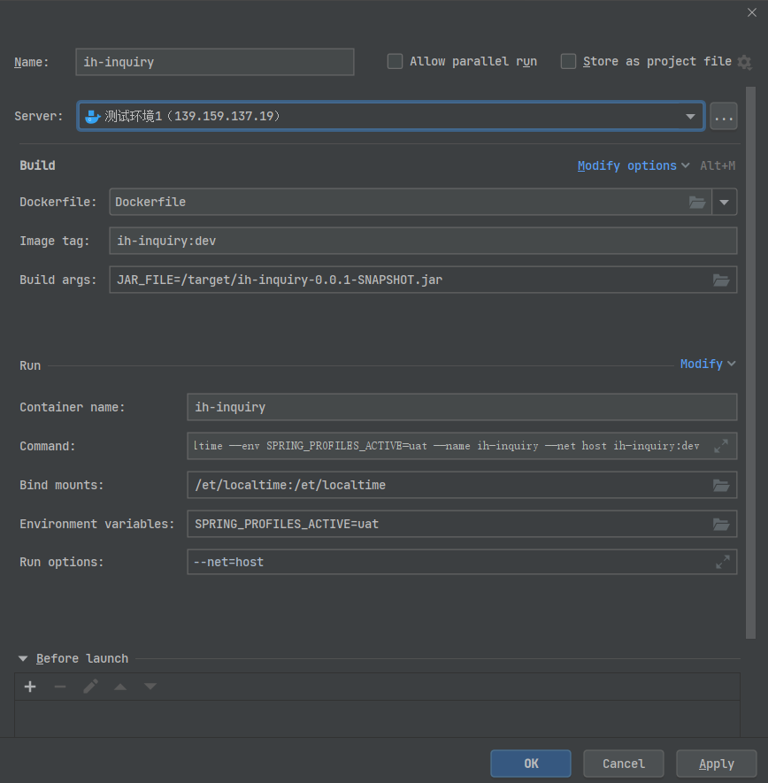
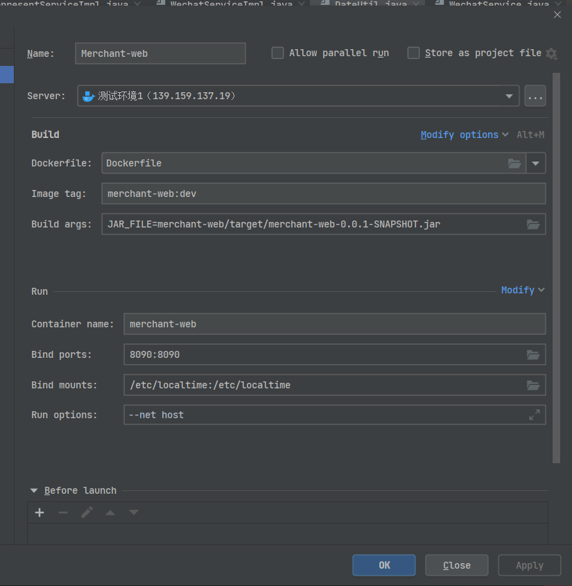

## 数据库：

- 测试环境1

  ```
  81.71.73.163:13306 开发库 mysql5.7
  81.71.73.163:14306 银川开发库 mysql5.6
  
  username: 'root',
  password: 'jusekj'
  ```

- 互联网医院线上

  ```
  vpn:
  user: luoliyan
  password: Red@HV79XJlAKijydh8BF
  
  mysql:
  user: luoliyan
  password: Red@HV79XJlAKijydh8BF
  ```

## 服务器：

- 测试环境1

  ```
  139.159.137.19
  root
  Juse!@#123
  
  docker端口：2375
  ```

- 测试环境2

  ```
  139.159.178.183
  root
  Q1w2e3r4t5
  
  docker端口：2476
  ```

docker配置



```
docker
build
--build-arg
JAR_FILE=/target/ih-inquiry-0.0.1-SNAPSHOT.jar
-t
ih-inquiry:dev
.
&&
docker
run
-v
/et/localtime:/et/localtime
--env
SPRING_PROFILES_ACTIVE=uat
--name
ih-inquiry
--net
host
ih-inquiry:dev
```


