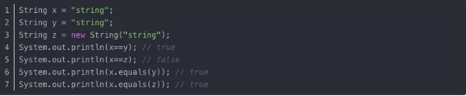
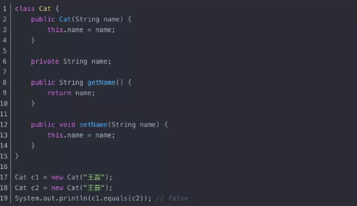
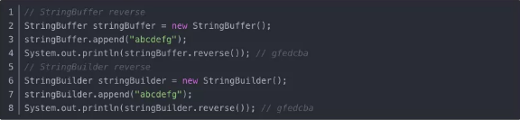

## 一、Java基础

### 语言特性

#### 1、JDK 和 JRE 有什么区别？

JDK：Java Development Kit 的简称，java 开发工具包，提供了 java 的开发环境和运行环境。
JRE：Java Runtime Environment 的简称，java 运行环境，为 java 的运行提供了所需环境。
具体来说 JDK 其实包含了 JRE，同时还包含了编译 java 源码的编译器 javac，还包含了很多 java 程序调试和分析的工具。简单来说：如果你需要运行 java 程序，只需安装 JRE 就可以了，如果你需要编写 java 程序，需要安装 JDK。

具体来说 JDK 其实包含了 JRE，同时还包含了编译 java 源码的编译器 javac，还包含了很多 java 程序调试和分析的工具。简单来说：如果你需要运行 java 程序，只需安装 JRE 就可以了，如果你需要编写 java 程序，需要安装 JDK。

#### 2、平台无关性

#### 3、值传递和引用传递

#### 4、为什么说Java中只有值传递？

### 面向对象

#### 1、什么是面向对象和面向过程？

#### 2、面向对象的三大基本特征是什么？

#### 3、面向对象的五大基本原则

#### 4、什么是多态？

#### 5、方法重载与重写

#### 6、抽象类必须要有抽象方法吗？

不需要，抽象类不一定非要有抽象方法。

#### 7、普通类和抽象类有哪些区别？

- 普通类不能包含抽象方法，抽象类可以包含抽象方法。
- 抽象类不能直接实例化，普通类可以直接实例化

#### 14. 接口和抽象类有什么区别？

- 实现：抽象类的子类使用 extends 来继承；接口必须使用 implements 来实现接口。
- 构造函数：抽象类可以有构造函数；接口不能有。
- main 方法：抽象类可以有 main 方法，并且我们能运行它；接口不能有 main 方法。
- 实现数量：类可以实现很多个接口；但是只能继承一个抽象类。
- 访问修饰符：接口中的方法默认使用 public 修饰；抽象类中的方法可以是任意访问修饰符。

### 数据类型

#### 1、8种基本数据类型

#### 2、整型中byte、short、int、long的取值范围

#### 3、什么是浮点型

#### 4、单精度和双精度？

#### 5、为什么不能用浮点型表示金额？

#### 6、== 和 equals 的区别是什么？

- == 解读
  对于基本类型和引用类型 == 的作用效果是不同的，如下所示：
  基本类型：比较的是值是否相同；
  引用类型：比较的是引用是否相同；
  代码示例：
  
  代码解读：因为 x 和 y 指向的是同一个引用，所以 == 也是 true，而 new String()方法则重写开辟了内存空间，所以 == 结果为 false，而 equals 比较的一直是值，所以结果都为 true。

- equals 解读

- equals 本质上就是 ==，只不过 String 和 Integer 等重写了 equals 方法，把它变成了值比较。看下面的代码就明白了。
  首先来看默认情况下 equals 比较一个有相同值的对象，代码如下：
  

  输出结果出乎我们的意料，竟然是 false？这是怎么回事，看了 equals 源码就知道了，源码如下：
  

  同样的，当我们进入 String 的 equals 方法，找到了答案，代码如下：
  

  原来是 String 重写了 Object 的 equals 方法，把引用比较改成了值比较。

- 总结 ：

  == 对于基本类型来说是值比较，对于引用类型来说是比较的是引用；而 equals 默认情况下是引用比较，只是很多类重新了 equals 方法，比如 String、Integer 等把它变成了值比较，所以一般情况下 equals 比较的是值是否相等

#### 7、 两个对象的 hashCode() 相同，则 equals() 也一定为 true，对吗？

不对，两个对象的 hashCode()相同，equals()不一定 true。

代码解读：很显然“通话”和“重地”的 hashCode() 相同，然而 equals() 则为 false，因为在散列表中，hashCode()相等即两个键值对的哈希值相等，然而哈希值相等，并不一定能得出键值对相等

#### 5. java 中的 Math.round(-1.5) 等于多少？

等于 -1，因为在数轴上取值时，中间值（0.5）向右取整，所以正 0.5 是往上取整，负 0.5 是直接舍弃。

### 自动拆、装箱

### 字符串

#### 1. String 属于基础的数据类型吗？

String 不属于基础类型，基础类型有 8 种：byte、boolean、char、short、int、float、long、double，而 String 属于对象。

#### 7. java 中操作字符串都有哪些类？它们之间有什么区别？

操作字符串的类有：String、StringBuffer、StringBuilder。

String 和 StringBuffer、StringBuilder 的区别在于 String 声明的是不可变的对象，每次操作都会生成新的 String 对象，然后将指针指向新的 String 对象，而 StringBuffer、StringBuilder 可以在原有对象的基础上进行操作，所以在经常改变字符串内容的情况下最好不要使用 String。

StringBuffer 和 StringBuilder 最大的区别在于，StringBuffer 是线程安全的，而 StringBuilder 是非线程安全的，但 StringBuilder 的性能却高于 StringBuffer，所以在单线程环境下推荐使用 StringBuilder，多线程环境下推荐使用 StringBuffer。

#### 8. String str="i"与 String str=new String(“i”)一样吗？

不一样，因为内存的分配方式不一样。String str="i"的方式，java 虚拟机会将其分配到常量池中；而 String str=new String("i") 则会被分到堆内存中。

#### 9. 如何将字符串反转？

使用 StringBuilder 或者 stringBuffer 的 reverse() 方法

#### 10. String 类的常用方法都有那些？

- indexOf()：返回指定字符的索引。
- charAt()：返回指定索引处的字符。
- replace()：字符串替换。
- trim()：去除字符串两端空白。
- split()：分割字符串，返回一个分割后的字符串数组。
- getBytes()：返回字符串的 byte 类型数组。
- length()：返回字符串长度。
- toLowerCase()：将字符串转成小写字母。
- toUpperCase()：将字符串转成大写字符。
- substring()：截取字符串。
- equals()：字符串比较。

### 关键字

#### 1、transient

#### 2、instanceof

#### 3、volatile

#### 4、synchronized

#### 5、final 在 java 中有什么作用？

#### 13. 抽象类能使用 final 修饰吗？

不能，定义抽象类就是让其他类继承的，如果定义为 final 该类就不能被继承，这样彼此就会产生矛盾，所以 final 不能修饰抽象类，如下图所示，编辑器也会提示错误信息：

#### 6、static

#### 7、const

### 集合类

#### 1.java 容器都有哪些？

#### 19.Collection 和 Collections 有什么区别？

#### 20.List、Set、Map 之间的区别是什么？

#### 21.HashMap 和 Hashtable 有什么区别？

#### 22.如何决定使用 HashMap 还是 TreeMap？

#### 23.说一下 HashMap 的实现原理？

#### 24.说一下 HashSet 的实现原理？

#### 25.ArrayList 和 LinkedList 的区别是什么？

#### 26.如何实现数组和 List 之间的转换？

#### 27.ArrayList 和 Vector 的区别是什么？

#### 28.Array 和 ArrayList 有何区别？

#### 29.在 Queue 中 poll()和 remove()有什么区别？

#### 30.哪些集合类是线程安全的？

#### 31.迭代器 Iterator 是什么？

#### 32.Iterator 怎么使用？有什么特点？

#### 33.Iterator 和 ListIterator 有什么区别？

#### 34.怎么确保一个集合不能被修改？

### 枚举

### IO

#### 1、java 中 IO 流分为几种？

按功能来分：输入流（input）、输出流（output）。
按类型来分：字节流和字符流。
字节流和字符流的区别是：字节流按 8 位传输以字节为单位输入输出数据，字符流按 16 位传输以字符为单位输入输出数据。

#### 16. BIO、NIO、AIO 有什么区别？

- BIO：Block IO 同步阻塞式 IO，就是我们平常使用的传统 IO，它的特点是模式简单使用方便，并发处理能力低。
- NIO：New IO 同步非阻塞 IO，是传统 IO 的升级，客户端和服务器端通过 Channel（通道）通讯，实现了多路复用。
- AIO：Asynchronous IO 是 NIO 的升级，也叫 NIO2，实现了异步非堵塞 IO ，异步 IO 的操作基于事件和回调机制。

#### 17. Files的常用方法都有哪些？

- Files.exists()：检测文件路径是否存在。
- Files.createFile()：创建文件。
- Files.createDirectory()：创建文件夹。
- Files.delete()：删除一个文件或目录。
- Files.copy()：复制文件。
- Files.move()：移动文件。
- Files.size()：查看文件个数。
- Files.read()：读取文件。
- Files.write()：写入文件。

### 对象拷贝

#### 1、为什么要使用克隆？

#### 2、如何实现对象克隆？

#### 3、深拷贝和浅拷贝区别是什么？

### 反射

#### 1、什么是反射？

#### 

#### 

### 动态代理

#### 3、动态代理是什么？有哪些应用？

#### 4、怎么实现动态代理？

### 序列化

#### 1、什么是序列化和反序列化？

#### 2、为什么序列化

#### 2、什么是 java 序列化？什么情况下需要序列化？

#### 3、Java如何实现序列化与反序列化

### 注解

### 泛型

### 单元测试

### 正则表达式

### 异常

#### 1、throw 和 throws 的区别？

#### 2、final、finally、finalize 有什么区别？

#### 3、try-catch-finally 中哪个部分可以省略？

#### 4、try-catch-finally 中，如果 catch 中 return 了，finally 还会执行吗？

#### 5、常见的异常类有哪些？

### 时间处理

#### 1、时区、冬令时和夏令时、时间戳、格林威治时间

## 二、并发编程

#### 1、并行和并发有什么区别？

#### 2、线程和进程的区别？

### 3、守护线程是什么？

### 4、创建线程有哪几种方式？

#### 5、说一下 runnable 和 callable 有什么区别？

#### 6、线程有哪些状态？

#### 7、sleep() 和 wait() 有什么区别？

#### 8、notify()和 notifyAll()有什么区别？

#### 9、线程的 run()和 start()有什么区别？

#### 10、创建线程池有哪几种方式？

#### 11、线程池都有哪些状态？

#### 12、线程池中 submit()和 execute()方法有什么区别？

#### 13、在 java 程序中怎么保证多线程的运行安全？

#### 14、多线程锁的升级原理是什么？

#### 15、什么是死锁？

#### 16、怎么防止死锁？

#### 17、ThreadLocal 是什么？有哪些使用场景？

#### 18、说一下 synchronized 底层实现原理？

#### 19、synchronized 和 volatile 的区别是什么？

#### 20、synchronized 和 Lock 有什么区别？

#### 21、synchronized 和 ReentrantLock 区别是什么？

#### 22、说一下 atomic 的原理？

## 三、设计模式

#### 1、 说一下你熟悉的设计模式？

#### 2、简单工厂和抽象工厂有什么区别？

## 四、网络

#### 1、http 响应码 301 和 302 代表的是什么？有什么区别？

#### 2、forward 和 redirect 的区别？

#### 3、 简述 tcp 和 udp的区别？

#### 4、 tcp 为什么要三次握手，两次不行吗？为什么？

#### 5、 说一下 tcp 粘包是怎么产生的？

#### 6、OSI 的七层模型都有哪些？

#### 7、get 和 post 请求有哪些区别？

#### 8、如何实现跨域？

#### 9、说一下 JSONP 实现原理？

### 安全问题

#### 1、如何避免 sql 注入？

#### 2、什么是 XSS 攻击，如何避免？

#### 3、什么是 CSRF 攻击，如何避免？

## 五、框架

#### 

### Servlet、JSP

#### 1、jsp 和 servlet 有什么区别？

#### 2、jsp 有哪些内置对象？作用分别是什么？

#### 3、说一下 jsp 的 4 种作用域？

#### 4、session 和 cookie 有什么区别？

#### 5、说一下 session 的工作原理？

#### 6、如果客户端禁止 cookie 能实现 session 还能用吗？

### Structs2

#### 1、spring mvc 和 struts 的区别是什么？

### Spring

#### \90. 为什么要使用 spring？

#### 2、解释一下什么是 aop？

#### \92. 解释一下什么是 ioc？

#### 4、 spring 有哪些主要模块？

#### \94. spring 常用的注入方式有哪些？

#### 6、spring 中的 bean 是线程安全的吗？

#### 7、spring 支持几种 bean 的作用域？

#### 8、spring 自动装配 bean 有哪些方式？

#### 9、spring 事务实现方式有哪些？

#### 10、说一下 spring 的事务隔离？

#### \103. @Autowired 的作用是什么？

### Spring  MVC

#### 1、说一下 spring mvc 运行流程？

#### 2、spring mvc 有哪些组件？

#### 3、@RequestMapping 的作用是什么？

### MyBatis

#### 1、mybatis 中 #{}和 ${}的区别是什么？

#### 2、mybatis 有几种分页方式？

#### 3、RowBounds 是一次性查询全部结果吗？为什么？

#### 4、mybatis 逻辑分页和物理分页的区别是什么？

#### \129. mybatis 是否支持延迟加载？延迟加载的原理是什么？

#### 6、说一下 mybatis 的一级缓存和二级缓存？

#### 7、mybatis 和 hibernate 的区别有哪些？

#### 8、mybatis 有哪些执行器（Executor）？

#### 9、mybatis 分页插件的实现原理是什么？

#### \134. mybatis 如何编写一个自定义插件？

### Hibernate

#### 1、 为什么要使用 hibernate？

#### 2、 什么是 ORM 框架？

#### \115. hibernate 中如何在控制台查看打印的 sql 语句？

#### 3、hibernate 有几种查询方式？

#### 4、hibernate 实体类可以被定义为 final 吗？

#### 5、在 hibernate 中使用 Integer 和 int 做映射有什么区别？

#### 6、hibernate 是如何工作的？

#### 7、get()和 load()的区别？

#### 8、说一下 hibernate 的缓存机制？

#### 9、hibernate 对象有哪些状态？

#### \123. 在 hibernate 中 getCurrentSession 和 openSession 的区别是什么？

#### 11、hibernate 实体类必须要有无参构造函数吗？为什么？

### Spring Boot

#### \104. 什么是 spring boot？

#### 2、为什么要用 spring boot？

#### 3、spring boot 核心配置文件是什么？

#### \107. spring boot 配置文件有哪几种类型？它们有什么区别？

#### \108. spring boot 有哪些方式可以实现热部署？

#### 6、jpa 和 hibernate 有什么区别？

#### \110. 什么是 spring cloud？

#### \111. spring cloud 断路器的作用是什么？

#### \112. spring cloud 的核心组件有哪些？

### Spring Security

## 六、JVM

#### \194. 说一下 jvm 的主要组成部分？及其作用？

#### \195. 说一下 jvm 运行时数据区？

#### \196. 说一下堆栈的区别？

#### 4、队列和栈是什么？有什么区别？

#### 5、什么是双亲委派模型？

#### \199. 说一下类加载的执行过程？

#### \200. 怎么判断对象是否可以被回收？

#### \201. java 中都有哪些引用类型？

#### \202. 说一下 jvm 有哪些垃圾回收算法？

#### 10、说一下 jvm 有哪些垃圾回收器？

#### \204. 详细介绍一下 CMS 垃圾回收器？

#### 12、新生代垃圾回收器和老生代垃圾回收器都有哪些？有什么区别？

#### \206. 简述分代垃圾回收器是怎么工作的？

#### 14、说一下 jvm 调优的工具？

#### \208. 常用的 jvm 调优的参数都有哪些？

## 七、数据库

###  MySql

#### \164. 数据库的三范式是什么？

#### \165. 一张自增表里面总共有 7 条数据，删除了最后 2 条数据，重启 mysql 数据库，又插入了一条数据，此时 id 是几？

#### 3 如何获取当前数据库版本？

#### \167. 说一下 ACID 是什么？

#### \168. char 和 varchar 的区别是什么？

#### 6、float 和 double 的区别是什么？

#### 7、mysql 的内连接、左连接、右连接有什么区别？

#### \171. mysql 索引是怎么实现的？

#### \172. 怎么验证 mysql 的索引是否满足需求？

#### \173. 说一下数据库的事务隔离？

#### \174. 说一下 mysql 常用的引擎？

#### 说一下 mysql 的行锁和表锁？

#### 4\176. 说一下乐观锁和悲观锁？

#### \177. mysql 问题排查都有哪些手段？

#### \178. 如何做 mysql 的性能优化？

### Redis

#### 1、redis 是什么？都有哪些使用场景？

#### 2、redis 有哪些功能？

#### 3、 redis 和 memecache 有什么区别？

#### 4、 redis 为什么是单线程的？

#### 5、什么是缓存穿透？怎么解决？

#### 6、redis 支持的数据类型有哪些？

#### 7、redis 支持的 java 客户端都有哪些？

#### 8、 jedis 和 redisson 有哪些区别？

#### 9、 怎么保证缓存和数据库数据的一致性？

#### 10、 redis 持久化有几种方式？

#### 11、redis 怎么实现分布式锁？

#### 12、redis 分布式锁有什么缺陷？

#### 13、redis 如何做内存优化？

#### 14、redis 淘汰策略有哪些？

#### 15、redis 常见的性能问题有哪些？该如何解决？

## 八、LINUX

## 九、消息中间件

### RabbitMQ

#### 1、rabbitmq 的使用场景有哪些？

#### 2、 rabbitmq 有哪些重要的角色？

#### 3、rabbitmq 有哪些重要的组件？

#### 4、rabbitmq 中 vhost 的作用是什么？

#### 5、rabbitmq 的消息是怎么发送的？

#### 6、rabbitmq 怎么保证消息的稳定性？

#### 7、rabbitmq 怎么避免消息丢失？

#### 8、要保证消息持久化成功的条件有哪些？

#### 9、rabbitmq 持久化有什么缺点？

#### 10、 rabbitmq 有几种广播类型？

#### 11、rabbitmq 怎么实现延迟消息队列？

#### 12、rabbitmq 集群有什么用？

#### 13、rabbitmq 节点的类型有哪些？

#### 14、rabbitmq 集群搭建需要注意哪些问题？

#### 15、rabbitmq 每个节点是其他节点的完整拷贝吗？为什么？

#### 16、rabbitmq 集群中唯一一个磁盘节点崩溃了会发生什么情况？

#### 17、rabbitmq 对集群节点停止顺序有要求吗？

### Kafka

#### 1、kafka 可以脱离 zookeeper 单独使用吗？为什么？

#### 2、kafka 有几种数据保留的策略？

#### 3、kafka 同时设置了 7 天和 10G 清除数据，到第五天的时候消息达到了 10G，这个时候 kafka 将如何处理？

#### 4、什么情况会导致 kafka 运行变慢？

#### 5、使用 kafka 集群需要注意什么？

###  Zookeeper

#### 1、zookeeper 是什么？

#### 2、zookeeper 都有哪些功能？

#### 3、zookeeper 有几种部署模式？

#### 4、zookeeper 怎么保证主从节点的状态同步？

#### 5、 集群中为什么要有主节点？

#### 6、集群中有 3 台服务器，其中一个节点宕机，这个时候 zookeeper 还可以使用吗？

#### 7、说一下 zookeeper 的通知机制？

