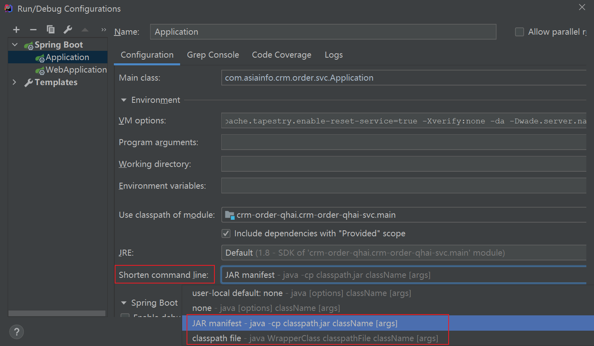

开发指南：
http://git.wadecn.com:18082/bits/bits-quickstart/wiki/_pages
环境介绍：
https://gitee.com/asiainfo-cs-srd/environment-problem
提升开发效率：
https://gitee.com/asiainfo-cs-srd/improve-development-efficiency


项目地址：

http://17.17.18.180:18084/project/south-china/qhai/crm/order.git

http://17.17.18.180:18084/project/south-china/common/crm/order-core.git

http://192.192.1.104:2401/project/south-china/qhai/crm/order.git
http://112.2.6.215:18084/project/south-china/hnan/crm/order.git

### 启动项目报错：

#### Error running 'Application': Command line is too long. Shorten command line for Application or also for Spring Boot default configuration.

##### 解决方法一：.idea/workspace.xml文件中，找到 `<component name="PropertiesComponent">`，添加一行

```xml
<property name="dynamic.classpath" value="true" />
```

##### 解决方法二：



虚拟机参数：

```
-Dorg.apache.tapestry.disable-caching=true
-Dorg.apache.tapestry.enable-reset-service=true
-Xverify:none
-da
-Dwade.server.name=web-127.0.0.1
```

数据库：
jdbc:oracle:thin:@//192.192.2.115:1521/HNZXCRMDEVQHPDB   ---华南中心CRM开发青海	
jdbc:oracle:thin:@//192.192.2.115:1521/HNZXCRMDEVPDB        ---华南中心CRM开发湖南
UOP_BASE/UOP_BASE      用户名密码


