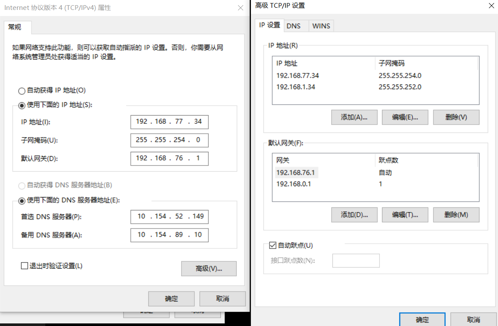

mac网络设置：
https://robot-l.github.io/2020/06/01/%E4%BA%9A%E4%BF%A1/NAT%E5%86%85%E5%A4%96%E7%BD%91%E5%8F%8C%E8%BF%9E/

## Mac内外网双连&端口转发

- 环境 ：parallels desktop + win7（需要软件可以找我）
- 内网网关：192.168.76.1
- 外网网关：192.168.0.1

## 1. MAC网络设置

分别配置好外网、内网两个网络（左下角`+`可以增加配置），其中路由器就是网关地址，注意外网配置顺序在前（如果顺序错了，在下方的“设定服务顺序”可以更改）

