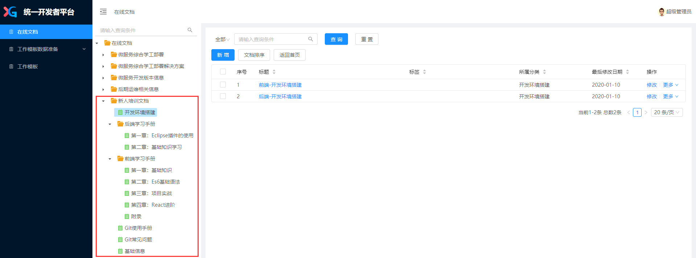

#### 1、配置开发环境

具体请参考**统一开发者平台**上在线文档菜单中**新人培训文档**下的**开发环境搭建**

> 统一开发者平台网址：http://192.168.35.106:6011/
> 帐号：admin
> 密码：123456

```
1、前端-开发环境搭建
2、后端-开发环境搭建
```




#### 2、后端

> 需要具备的技术基础有：Java基础、Spring、MyBatis、SpringBoot等；

在后端开发时可以使用Eclipse插件便捷地生成一些代码，具体请参考**新人培训文档**下**后端学习手册**中的**Eclipse插件的使用**；

```
第1节：Eclipse插件的安装
第2节：根据表生成实体对象等文件
第3节：生成Controller代码
```

SpringBoot中Controller的参数接收请参考**新人培训文档**下**后端学习手册**中的**基础知识学习**；

```
第1节：SpringBoot Controller接收参数的几种常用方式
```

详细的SpringBoot技术请查看<a href="https://docs.spring.io/spring-boot/docs/2.2.2.RELEASE/reference/html/">SpringBoot官方文档</a>、MyBatis具体请参考<a href="https://mybatis.org/mybatis-3/zh/index.html">MyBatis文档</a>

#### 3、前端

> 需要具备的技术基础有：HTML、CSS、**JavaScript（ES6）、React**等；

**ES6**请参考<a href="http://es6.ruanyifeng.com/">ES6 入门教程</a>，需要掌握的基本内容有：

```
1. let 和 const 命令
2. 变量的解构赋值
......
```

**React**的简单使用请参考**新人培训文档**下**前端学习手册**中的**基础知识**

```
第1节：前端开发的演变
第2节：第一个组件
第4节：React State(状态)
第3节：受控组件与非受控组件
第5节：React Props
第6节：React 事件处理
第7节：React 列表 & Keys
```

详细的React技术请查看<a href="https://react.docschina.org/docs/getting-started.html">官方文档</a>或<a href="http://huziketang.mangojuice.top/books/react/lesson1">React.js 小书</a>

#### 4、项目实战

在搭建好了本机开发环境，并基本掌握了以上微服务开发的前后端技术要求后。便可以通过项目实战的方式来学习微服务的开发。

具体请参考**新人培训文档**下**前端学习手册**中的**项目实战**
```
第1节：创建一个模块并添加菜单
第2节：创建一个查询列表
第3节：创建新增表单
第4节：实现修改操作
第5节：实现删除操作
```

5、其他说明

开发中项目版本的管理通过Git的方式，在环境搭建步骤中已经安装了Git，并使用Git检出项目，而对于代码的提交以及其他操作，请参考**新人培训文档**下的**Git使用手册**

```
Git 基本概念说明
```