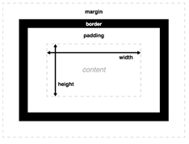

盒子模型是网页布局的基石。由外边距+边框+内边距+内容组成。
盒模型中，width、height、padding、margin，能够使用百分比数值，border不能使用百分比。
（width、padding、margin参考的是直接父亲的width，height参考的是父亲的height）。 



如果一个盒子加上了属性：  
          box-sizing:border-box;  
那么这个盒子就变成了CSS3规定的新盒模型，你设置的width、height就是盒模型中border这一圈的宽度、高度。所以真实的内容宽度，要内减。比如：  
````
div{  
  width:200px;  
  height:200px;  
  padding:10px;  
  box-sizing:border-box;  
}   
````
那么，这个盒子真实占有的宽度，是200*200，它的内容宽度，是180*180。

内外边距不同值写法
对面相等，后者省略；四面相等，只设一个。（上右下左）
以padding为例:
/*只写一个则四面值*/
padding: 20px;
or
padding:20px 20px 20px 20px
/*写两个则为上下值和左右值*/
padding：20px 30px；
padding: 20px 30px 20px 30px;
/*写三个为上值、左右值和下值*/
padding：20px 30px 40px;
padding: 20px 30px 40px 30px;

上下左右居中：
padding： 0 auto；


外边距塌陷  
如果两个盒子上下排列，然后都有外边距，那么他们之间的距离就会以最大的那个来算。
如果两个盒子嵌套，然后你给了里面的小盒子外边边距，他会把大盒子也加上这个外边距

解决办法：  
给大盒子加一个边框，边框是白色  
给大盒子加overflow:hidden;  


