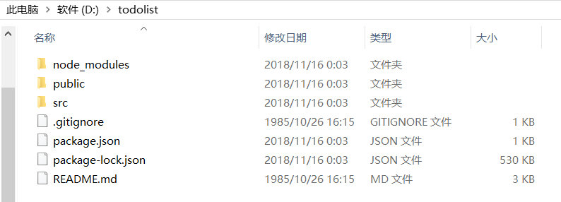
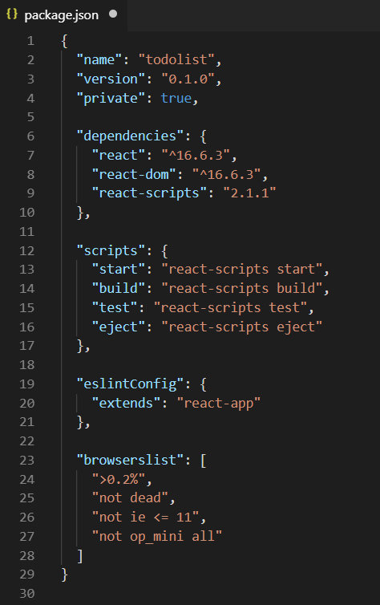
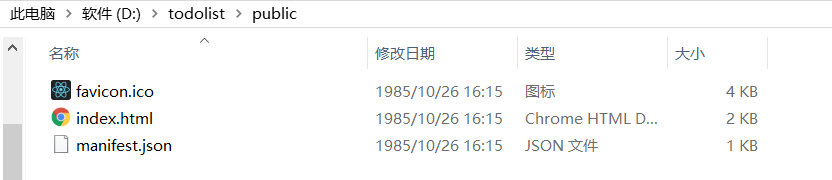
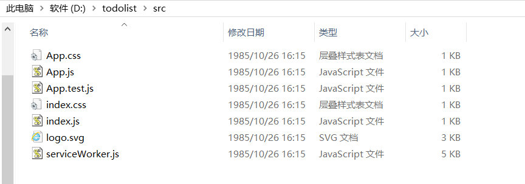

#### 1、package.json 定义项目所需模块及配置信息

#### 2、public文件夹

1)favicon.ico

是浏览器tab上图标，也是这个项目的一个标志，也可以说是代表一个公司的标志。可以替换。

2)index.html

项目的入口文件，引用了第三方类库啊，还可以引入cdn

是项目的总容器，所有的内容存储在这个容器中。这个容器有且只能有一个。
3)manifest.json

允许将站点添加至主屏幕，是 PWA 提供的一项重要功能，当前 manifest.json 的标准仍属于草案阶段，Chrome 和 Firefox 已经实现了这个功能，微软正努力在 Edge 浏览器上实现，Apple 目前仍在考虑中

#### 3、src文件夹

1).index.js

存放的是这个项目的核心内容，也就是我们的主要工作区域。

其中，index.js文件是和index.html进行关联的文件的唯一接口。

能够引用<App />的原因是文档内容的头部，有import App from './App';内容，就是为了将App.js的内容引入到index.js文件中。

2).App.js

该类是继承react提供的component，export default App;是为了将App公开，index.js才能够引用。App.js继承了component的话，必须使用render进行渲染。return的内容是模板，类似于html结构的内容，就是jsx，jsx语法是react的主要语法。在这个文件中，只能用一个div容器，如果在div的同级目录添加别的内容，便会报错。

className="App"，是引用到App.css的样式。注意，页面内容样式是就近原则，首先用App.css的样式，App.css是组件的样式，index.css是全局的样式。

内容渲染的方式有两种，jsx语法(上面默认的内容)和React.createElement的方法。

#### 4、node_modules文件夹

包管理工具下载安装了的包，比如webpack、gulp、grunt这些工具