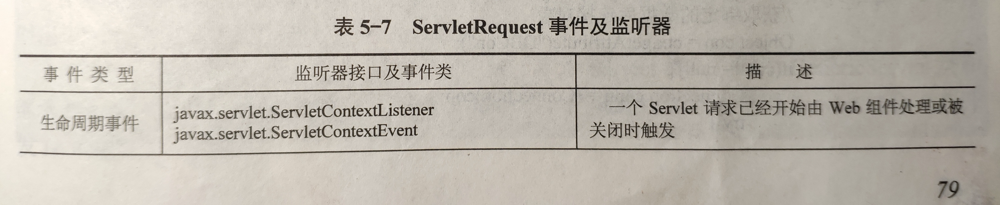
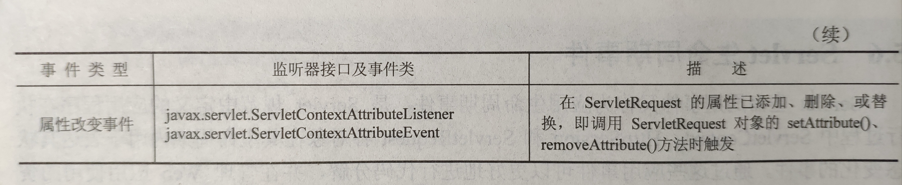

##   一、概述

- 生命周期事件（应用生命周期事件）

  Servlet中应用程序在执行过程中，ServletContext、HttpSession、ServletRequest各对象在其生命周期中状态和属性的改变。

- 监听器

  监听器是对一个或多个Servlet生命周期事件进行监听的类。通过定义监听器，可以监听这些事件的发生，并进行响应，同一事件的多个监听器按照它们部署（注册）的顺序调用。可以更好地进行代码的分解，并在管理Web应用的使用的资源上提高效率。

##  二、监听器

#### 1、ServletContext事件及监听器


#### 2、HTTPSession事件及监听器

#### 

#### 3、ServletRequest事件及监听器





## 三、实现

- 实现监听器接口

  ```java
  /**
   * 监听SevletContext
   * 实现数据库的连接并绑定到上下文和关闭连接
   */
  
  public class DBManagerListener implements ServletContextListener{
  
      public void contextInitialized(ServletContextEvent sce) {
          try {
              String driverName = "com.mysql.jdbc.Driver";
              String url = "jdbc:mysql://120.79.246.19:3306/test?useSSL=false";
              String user = "root";
              String password = "yunzk123";
  
              Class.forName(driverName);
              Connection conn = DriverManager.getConnection(url, user, password);
  
              //获取上下文
              ServletContext context = sce.getServletContext();
              //将连接对象绑定到上下文
              context.setAttribute("DBCon",conn);
              System.out.println("创建数据库连接成功......");
          } catch (Exception e) {
              System.out.println("创建数据库连接失败......");
              e.printStackTrace();
          }
      }
  
      public void contextDestroyed(ServletContextEvent sce) {
          ServletContext context = sce.getServletContext();
  
          Object dbCon = context.getAttribute("DBCon");
          if (dbCon != null) {
              Connection conn = (Connection) dbCon;
              try {
                  if (!conn.isClosed()) {
                      conn.close();
                      System.out.println("关闭数据库连接......");
                  }
              } catch (SQLException e) {
                  e.printStackTrace();
              }
          }
      }
  
  }
  ```

- 监听注册部署

  ```xml
  <listener>
      <listener-class>
      com.yunzike.listener.DBManagerListener
    	</listener-class>
  </listener>
  ```

  


