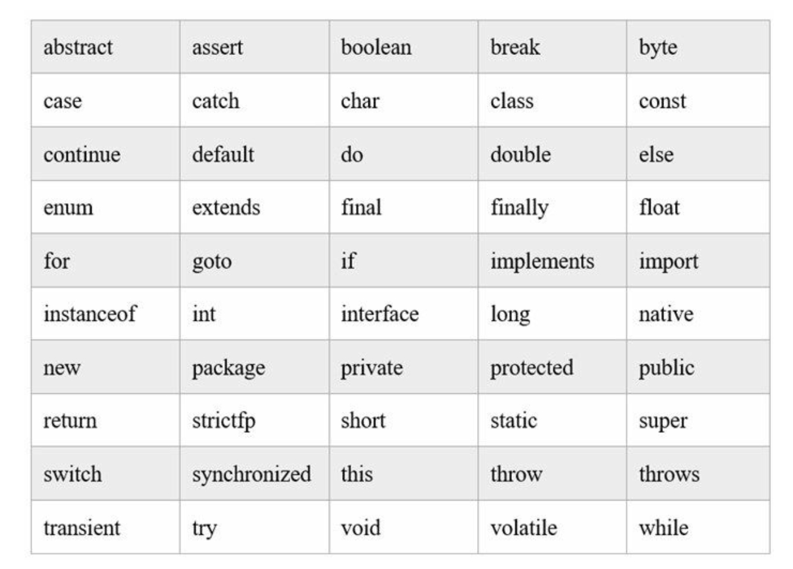
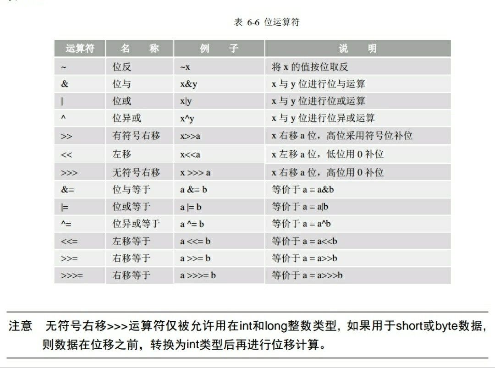
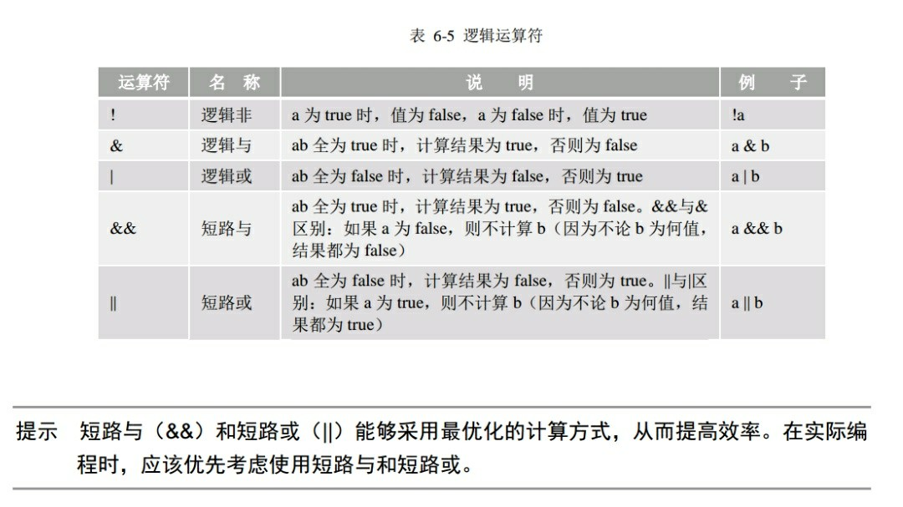

#### 1、关键字与标识符

- 标识符
  
  变量、常量、方法、枚举、类、接口等由程序员指定的名字。
  
  规则：
  
  ①区分大小写；
  
  ②首字符不能是数字，可以是 _  、& 或字母；
  
  ③不能是关键字。

- 关键字
  
  

- 保留字
  
  Java语言中的保留字只有两个，goto 和 const。

#### 2、数据类型

- 数据类型分类

<div>
    <table>
        <tr>
            <td colspan="2">数据类型</td>
            <td>默认初始值</td>
        </tr>
        <tr>
            <td rowspan="4">基本数据类型(8种)</td>
            <td>整型：byte(8位，即1字节，范围-128~127)、short(16位)、int(32位，范围-2^31~2^31-1，约正负21亿多)、long(64位)</td>
            <td>long：0L，其余：0</td>
        </tr>
        <tr>
            <td>浮点型：float(32位)、double(64位)</td>
            <td>float：0.0f，double：0.0d</td>
        </tr>
        <tr>
            <td>字符型：char</td>
            <td>'\u0000'</td>
        </tr>
        <tr>
            <td>布尔型：boolean</td>
            <td>false</td>
        </tr>
        <tr>
            <td rowspan="3">引用数据类型</td>
            <td>类：class</td>
            <td rowspan="3">null</td>
        <tr>
            <td>接口：interface</td>
        </tr>
        <tr>
            <td>数组：[]</td>
        </tr>
        <tr>
            <td>注意</td>
            <td colspan="2">对于常量数值，整数默认：int，小数默认：double。因此，将小数赋值给float变量时，必须要在小数后面加f(F)指定为float类型小数。</td>
        </tr>
    </table>
</div>

- 类型转换
  
  ①自动类型提升
  
  
  
  ②强制类型转换
  
  不能自动类型提示转换类型时，在变量或者常量前加（要强转的数据类型）。
  
  要慎用，容易丢失精度，且一般不具有继承关系的两种对象类型不能强转，会报类型转换异常，为防止这种情况，可以使用 instanceof 关键字事先判断。
  
  **instanceof** 
  
  双目运算符，用来测试一个对象是否为一个类的实例。
  
  语法格式：obj instanceof Class
  
  返回 boolean 值
  
  注意：编译器会检查左边的 obj 能否转换成右边的 class 类型，当可以确定类型时，不能转换会直接报错。规定 obj 为 null 时返回 false。
  
  ```java
  //易错
  double a = 1 / 2;                //0.0，运算结果为0后自动提升为0.0d
  double b = 1.0 / 2;              //0.5，int和double运算前会先提升为double
  double d = (double) 1 / 2;       //0.5，是先将1转为double，再参与运算的。
  
  //整数常量默认为int，但编译时会检测该常量值是否在byte(short类型也一样)类型取值范围内，若是，则会默认强转并赋值，否则报错。
  byte b1 = 4;      //正确
  byte b2 = 128;    //报错  
  
  //byte以及short类型变量进行运算时会先提升为int，无法直接赋值给原byte或short类型，会报错提示可能精度缺失。但使用+=、-=等带等号的运算符时，会默认强转不会报错。
  byte b1 = 3;
  byte b2 = 4;
  byte b3 = b1 + b2;  //报错
  b1 = b1 + 4;        //报错
  b2 += 4;            //正确，相当于b2 = (byte) b2 + 4;
  ```

- 进制和指数表示
  
  ①进制：
  
  二进制数：以 0b 或0B为前缀，注意0是阿拉伯数字。
  八进制数：以0为前缀，注意0是阿拉伯数字。 
  十六进制数：以 0x 或0X为前缀，注意0是阿拉伯数字。
  
  ②指数：
  
  如果采用十进制表示指数，需要使用大写或小写的e表示
  
  幂。例如：3.36e2表示3.36×10^2，1.56e-2表示1.56×10^-2。

#### 3、常量与变量

- 常量
  
  final 数据类型 常量名(一般使用大写字母) = 值；
  
  一般声明于类根部且用 static 修饰 。

- 变量
  
  1、成员(域)变量：声明在类的根部，会默认根据变量类型初始化值，作用域是整个类。静态成员变量存储在堆中的类中，随类的加载而加载，而非静态成员变量存储在堆中的对象中，在对象创建时产生对象释放时消失。   
  2、局部变量：声明在方法或局部代码块中，不会默认初始化，使用前必须显式初始化，作用范围是该代码块。不能被 static 修饰，存储在栈中方法中，方法或局部代码块执行时产生，执行结束消失。  

- static 关键字
  
  用来修饰变量、方法、常量。主要作用在于创建独立于具体对象的域变量或者方法，因此不能修饰局部变量和常量。

#### 4、运算符

- 四则运算符
  
  

- 位运算符
  
  
  
  ```java
  //&  位与运算，可以取低多少位
  如：01111000001001 & 1111 得 低四位1001。
  
  //二进制转16进制：
  每次位与1111取低4位，然后转化，然后>>>4 无符号右移4位再继续。
  ```

- 逻辑运算符
  
  
  
  一个数异或同一个数两次还得原来这个数。
  
  

- 三目(元)运算符
  
  ```java
  excepress ? y : z
  ```

#### 6、输入与输出

- 输入
  
  ```java
  Scanner in = new Scanner(Sysout.in);
  in.nextInt();
  ```

- 输出( System.out )
  
  println：一般的标准输出，并换行。
  
  print：   一般的标准输出，但是不换行。
  
  printf：  格式化输出。
  
  "%"表示进行格式化输出，"%"之后的内容为格式的定义。
  
  %d ：int，%f ：浮点数，double 或float，
  %s 字符串，%c：一个字符，"%.2f"：输出两位小数点；
  %9.2f"：长度为9，向右靠齐，两位小数；
  
  ```java
  int i = 1;
  float j = 2;
  System.out.printf("输出i的值为%d，j的值为%f",i,j);
  ```
  
  
